# A multiwavelength study of GRB 151027A

[ABSTRACT](#abstract)
[1.Introduction](#sect1)
[2.Multiwavelength data](#sect2)
&emsp;[2.1 Gamma-ray and X-ray data](#sect2.1)
&emsp;[2.2 Optical data](#sect2.2)
&emsp;[2.3 Radio data](#sect2.3)
[3.Data analysis and results](#sect3)
&emsp;[3.1 Prompt emission: first and second peaks](#sect3.1)
&emsp;[3.2 Evidence of a thermal component: third peak](#sect3.2)
&emsp;[3.3 X-ray emission in the interval 130–200 s](#sect3.3)
&emsp;[3.4 XMM-Newton late time spectrum](#sect3.4)
&emsp;[3.5 Radio](#sect3.5)
&emsp;[3.6 Afterglow light curve and spectral energy distributions](#sect3.6)
[4.Discussion](#sect4)
&emsp;[4.1 Prompt emission and flare](#sect4.1)
&emsp;[4.2 Modelling the afterglow](#sect4.2)
[5.Conlusions](#sect5)

## ABSTRACT

[Back](#menu)

1.We present a multiwavelength study of GRB 151027A. It has a densely sampled emission in the X-ray and optical band and has been detected in the radio up to 140 days after the prompt.

>There're adequate data in X-band, optical band and radio band. 

2.The multiwavelength light curve from 500 s to 140 days can be modelled through a standard forward shock afterglow,but it requires an additional emission component to reproduce the early X-ray and optical emission.

>A standard forward shock model is consistent with our 500 s ~ 400 days' data, but the early X and optical emission is higher than the model.

3.We present optical observations performed with the Telescopio Nazionale Galileo (TNG) and the Large Binocular Telescope (LBT) 19.6, 33.9, and 92.3 days after the trigger which show a bump with respect to a standard afterglow flux decay and are interpreted as possibly due to the underlying supernova and host galaxy (at a level of ~0.4 $\mu$Jy in R band, $R_{AB} \sim$ 25).

>Optical observations were performed by two telescopes (TNG, LBT) at 3 epoches (19.6d, 33.9d, 92.3d). It shows a bump compared to standard afterglow decay, which is interpreted as due to the underlying SN and host galaxy ($R_{AB} ~$ 25).

4.Radio observations, performed with the Sardinia Radio Telescope (SRT) and Medicina in single-dish mode and with the European Very Long Baseline Interferometer (VLBI) Networkand the Very Long Baseline Array (VLBA), between day 4 and 140 suggest that the burst exploded in an environment characterized by a density profile scaling with the distance from the source (wind profile).

>Radio observations were carried out by 4 telescopes (SRT, Medicana, VLBI, VLBA) between day4 and 140, suggesting that the density profile of the burst environment scales with the distance from the source (wind profile CBM).

5.A remarkable feature of the prompt emission is the presence of a bright flare 100 s after the trigger, lasting∼70 s in the soft X-ray band, which was simultaneously detected from the optical band up to the MeV energy range. 

>A bright flare lasting ~70s was detected in the soft X-ray band 100s after the trigger. This remarkable prompt emission feature was also detected from the optical band up to the MeV range.

6.By combining Swift-BAT/XRT and Fermi-GBM data, the broadband (0.3–1000 keV) time resolved spectral analysis of the flare reveals the coexistence of a non-thermal (power law) and thermal blackbody components.

>The coexistence of the non-thermal (power law) and thermal blackbody components were discovered by the   BAT/XRT & GBM broadband (0.3 - 1000 keV) time resolved spectral analysis of the flare.

7.The blackbody component contributes up to 35% of the luminosity in the 0.3–1000 keV band. 

8.The γ-ray emission observed in Swift-BAT and Fermi-GBM anticipates and lasts less than the soft X-ray emission as observed by Swift-XRT, arguing against a Comptonization origin.

>The γ-ray emission observed in BAT and GBM lasts less than the soft X-ray emission observed by XRT. This argue against a Comptonization origin.

9.The blackbody component could either be produced by an outflow becoming transparent or by the collision of a fast shell with a slow, heavy, and optically thick fireball ejected during the quiescent time interval between the initial and later flares of the burst.

>The blackbody component could either be produced by an outflow becoming transparent or by the collison of a fast shell with a slow, massive, optically thick fireball ejected during the fist 100s quiescent.

## 1.Introduction
[Back](#menu)

GRB 151027A, the 999th burst detected by theSwift satellite, is a long bright event lasting about 130 s which was followed in the X-ray and in the optical and radio bands until five months after the burst.

The event presents unique properties in the prompt emission due to the presence of a bright flare, which has been observed from 0.3 keV to >MeV.

Here we present the time resolved spectral analysis of the entire prompt emission with particular emphasis on the flare,which shows the presence of two independent spectral components: a blackbody and a non-thermal cutoff power law. 

>Time resolved spectral analysis of the prompt emission, particular the flare, is presented, which shows two indepentent components: a blackbody and a non-thermal cutoff power law.

We also present the multiwavelength light curve (obtained by combining public and proprietary optical and radio observations) and model the emission with a standard afterglow forward shock scenario.

>The multiwavelength light curve is modelled with a standard FS scenario.

|Sect|content|
|---|---|
|Sect.2|multiwavelength data collected|
|Sect.3|spectral and temporal analysis of the broadband emission|
|Sect.4|modelling of the prompt and afterglow emission|
|Sect.5|results discussion|

## 2.Multiwavelength data
[Back](#menu)

We present both the data sets collected from the literature and our dedicated observations. The reduction and the analysis of our data is described as well.

>Data sets are from literature and observations. Data reduction and analysis is decribed as well.

### 2.1 Gamma-ray and X-ray data
[Back](#menu)

GRB 151027A was detected at 03:58:24UT by BAT. XRT and UVOT started acuqiring data 87s and 95s post trigger, respectively.

The XRT light curve (limited to the first 200 s since the trigger) is shown in Fig.1 (blue line).

The 15–350 keV energy band BAT light curve has a duration of $T_{90}=130±6$ s with two main emission episodes (the frist composed of two peaks) seperated by a quiescent phase of $\sim 80$ s (see Fig.1 - red line).

The 15–150 keV band peak flux (corresponding to the first peak at 0.2 s) is 6.8 ± 0.6 ph cm$^{-2}$ s$^{-1}$ and the fluence (7.8 ± 0.2) $\times$ 10$^{-6}$ erg cm$^{-2}$

>The 15–150 keV band flux peaked at 0.2s.

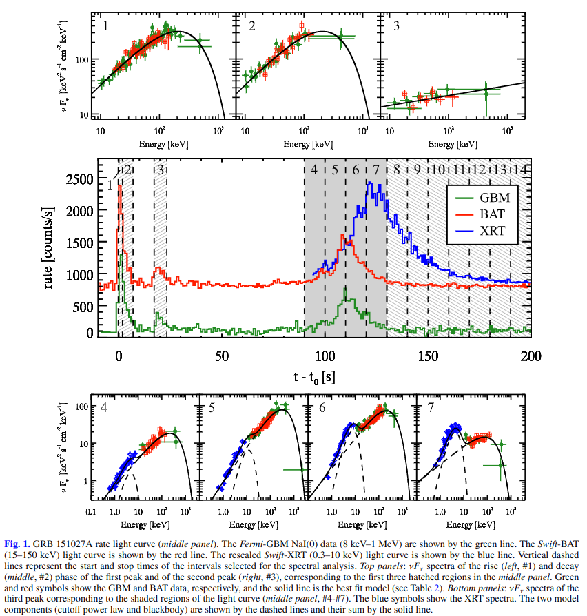

---

The burst was also detected by GBM(8 keV - 1 MeV) and Konus-wind(20 keV - 5 MeV), showing similar temporal properties. The wide energy ranges of GBM and Konus-wind show that the time-averaged spectrum is best fit by a cutoff power-law model with $\Gamma = 1.41 \pm 0.04$ and $E_{peak} = 340 \pm 63$ keV.(GBM – Toelgeet al. 2015). The GRB fluence in the 10 keV – 1 MeV energy range, as measured by the GBM spectrum, is $(1.94 \pm 0.09) \times 10^{-5} erg cm^{-2}$ and the photon peak flux $11.37 \pm 0.34 ph cm^{-2} s^{-1}$.
>Some results from other works.

The redshift $z=0.81$ was measured through the MgII doublet in absorption from the Keck/HIRES spectrum (Perley et al.2015). 
The isotropic equivalent energy of the burst inferred from GBM spectral data analysis in Toelge et al.(2015)  is $E_{\gamma,iso}=3.98 \times 10^{52} erg$.
> $z=0.81$, $E_{\gamma,iso}=3.98 \times 10^{52} erg$

In this paper we have retrieved and analysed the publicly available BAT, XRT, and GBM data and we triggered an approved proposal to perform late time (∼1 day) observations with the XMM-Newton(Jansen et al. 2001) space observatory.

#### 2.1.1 Fermi-GBM data extraction

We selected the GBM–CSPEC data2(1.024 s time resolution) of the brightest detectors: NaI # 0, NaI # 3, and BGO # 0. 

Data filtering, background spectrum extraction, and timeslice selectionwas performed with the software **RMFIT v.4.3.2** using standard procedures.

Channels with energy∈[10, 800] keV and∈[300, 2000] keV were considered for the NaI and BGO, respectively.

GBM spectra and background files were exported to **XSPEC(v12.7.1)** format in order to fit them jointly  with Swift-BAT and XRT data.See details in Sect.3.

#### 2.1.2 Swift-BAT and XRT data extracation

We extracted and reduced the Swift-BAT spectra and  lightcurve with the Swift software included in the HEASoft pack-age (ver.6.17), using standard procedures.

We retrieved the Swift-XRT count rate light curve (Fig. 1 – blue line) and the intrinsic and galactic extinction corrected 0.3–10 keV flux light curve (Fig. 6 – black symbols). 

We used intrinsic $N_{H}=4.4×10^{21}cm^{−2}$ inferred from late time XRT spectra and galactic $N_{H,gal}=3.7×10^{20}cm^{−2}$.

XRT spectra were corrected for pile-up following the procedure in Romano et al. (2006). Windowed Timing mode (WT)counts below 0.5 keV were excluded owing to the abnormal photon redistribution. Count spectra were rebinned requiring a minimum of 20–30 counts per bin.

#### 2.1.3 XMM-Newton observation

XMM-Newtonstarted observing GRB 151027A starting on 2015October 28 at 01:19:34.00  UT (21.3 h after the burst). The observation lasted for 51.5 ks (~ 14.3 h) without  interruption.

Data reduction was performed with **the XMM-Newton Science Analy-sis Software (SAS) version xmmsas_20131209_1901-13.0.0** and the latest  calibration files. Data were first locally  reprocessed with epproc,emproc, andrgsproc. 

The RGS data contained too few photons and were not considered any further. MOS and pn data were searched for high-background intervals, and none were found. EPIC data were grade filtered using pattern 0–12(0–4) for MOS (pn) data, and FLAG==0 and #XMMEA_EM(P) options. The pn and MOS events were extracted from a circular region of 870 pixels centred on source. Background events were extracted from similar regions close to the source and free of sources. MOS and pn data were rebinned to have 20 counts per energy bin. MOS data were summed and fitted within the 0.3–10 keV range, pn data within the 0.2–10 keV range.

### 2.2 Optical data
[Back](#menu)

The earliest optical observations (Wren et al. 2015) started with the RAPTOR network of robotic optical telescopes 24 s after the trigger; a bright optical counterpart (R∼13.7) was found. 
Subsequent optical/near-IR observations were performed by severalground-based telescopes. We have collected all the magnitudes reported in the GCN in R filter of wavelength λ=658 nm (see Table A.1  for  the  calibrated  and  galactic  extinction  corrected,EB−V=0.04, flux light curve)

>The RAPTOR network of robotic optical telescopes first started optical observation. All the R magnitudes reported in GCN were collected.

These are the data we use for the modelling of the GRB emission in Sect. 3.3.

Swift-UVOT observations

Swift-UVOT detected GRB 151027A in all its photometric filters (Balzer et al. 2015). We retrieved UVOT public data from **the UK Swift Science Data Centre** and analysed them with the standard UVOT tools distributed  within **the HEASoft (v6.17)**.

The results of UVOT photometry are shown in Table 3. The intrinsic optical absorption is negligible and has been estimated from the spectral energy distribution presented in Cano (2015)and is giving in Table 3.

---

We have performed late time (>19 days) Target of Opportunity (ToO) observations in the optical with the Italian 3.6-m Telescopio Nazionale Galileo(TNG) and with the 8.4-m Large Binocular Telescope (LBT) that we briefly summarize below.
> TNG and LBT were used to perform late time ToO optical observations.

TNG and LBT observations

We observed the optical afterglow of GRB 151027A with TNG in the R filter, for a total exposure of 44 min on source, starting 19.6 days after the trigger.

Later time observations were also acquired with the 8.4 m Large Binocular Telescope (LBT) in the SDSS-r filter, at 33.9 and 92.3 days after the event. The total exposure times for the LBT observations are 20 and 70 min, respectively.

 A finding chart im-age obtained with the TNG observation is shown in Fig. 2 withthe optical afterglow encircled.

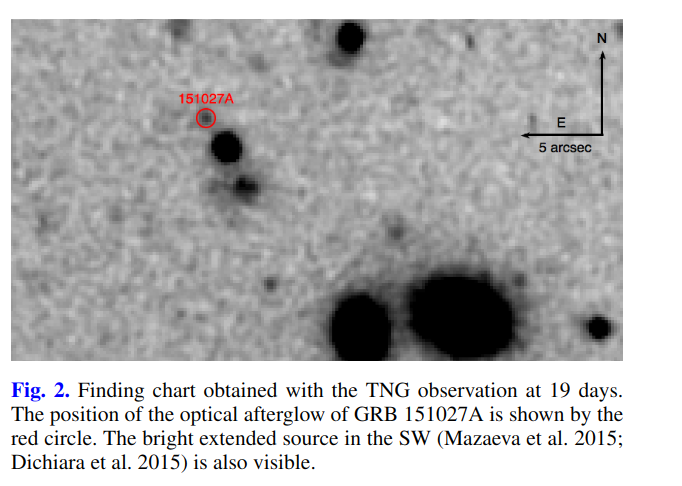

Image reduction, including de-biasing and flat-fielding, wascarried out following standard procedures. Images were  calibrated using a set of USNO-B1 stars in the field. We performed point-spread function (PSF) photometry at the position of the optical afterglow to minimize the possible contribution of the nearby stars.
>PSF photometry was performed. The difference between PSF, 
Aperture, Kron photmetry? 

The calibrated magnitudes were corrected for the Galactic absorption along the line of sight ($E_{B−V}=0.04$;Schlafly & Finkbeiner 2011) and then converted into flux densities following Fukugita et al. (1996). The results of these observations are listed at the end of Table A.1.

### 2.3 Radio data
[Back](#menu)

Radio observations with the Very Large Array (VLA) 0.78 days after the trigger, performed at a mean frequency of 21.8 GHz,revealed a source with flux density of∼1.7 mJy (Laskar et al.2015).
Subsequent Giant Meter Radio Telescope (GMRT) ob-servations (Chandra et al. 2015) reported a detection most likely contaminated by a nearby bright unresolved source (P. Chandra –priv. comm.).
>VLA was triggered for observations at ~ 21.8 GHz 0.78 days after the trigger, revealing a source with flux density of ~ 1.7 mJy.

We triggered an approved proposal with **the Medicina 32 mradio  telescope** and obtained ToO observations with **the European VLBI  Network (EVN)**, **the Very Long Baseline Array (VLBA)**,**and the 64 m Sardinia Radio Telescope (SRT,Bolli et al. 2015; Prandoni et al., in prep.)**. Details of the data acquisition and reduction are given below. Results of the radio observations are listed in Table 1.
>Used radio telescopes:  Medicina 32 m telescope (approved proposal) European VLBI Network(ToO) the Very Long Baseline Array(VLBA)(ToO) 64m Sardina Radio Telescope(SRT) (ToO)

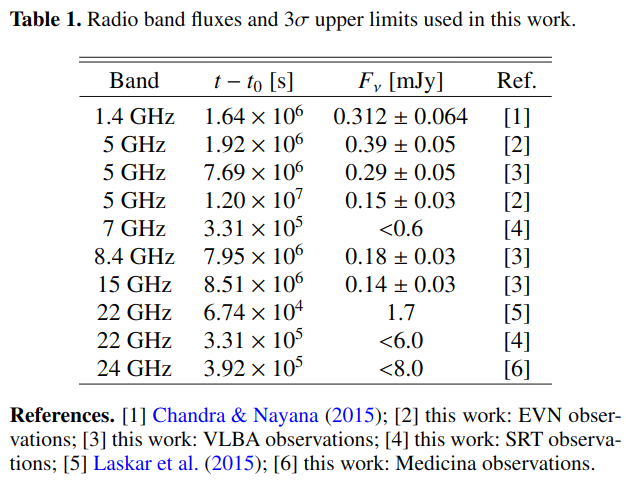

#### 2.3.1 European VLBI (EVN) observations

We observed GRB 151027A with the European VLBI Networkon 2015 November 18 and 2016 March 15. The participating stations were Effelsberg (100 m), Medicina (32 m), Torun (32 m),Yebes (40 m), Westerbork (25 m), Onsala (25 m), and JodrellBank (25 m). The observing frequency was centred at 4.98 GHz,with 8×16 MHz baseband channels, in dual polarization.
>We osberved GRB 151027A with the European VLBI Networkon 2015 November 18 and 2016 March 15. The observing frequency was centred at 4.98 GHz,with 8×16 MHz baseband channels, in dual polarization.

Data were electronically  transferred  to  the  central  correla-tor at JIVE via the so-called e-VLBI technique and processedin real time with the software correlator SFXC (Szomoru 2008;Keimpema et al. 2015). We observed in phase reference mode,alternating 1-min scans on the nearby (d=0.5◦)  calibrator J1806+6141 to 2.5-min scans on the target for a total integration time on target of ∼4.2 h. We also regularly  observed the two check sources J1815+6127 (d=0.7◦) and J1746+6226(d=3.0◦). We carried out a standard calibration in AIPS, determining amplitude coefficients from gain curves and system temperatures recorded during the observation. We removed phase offsets and phase delays and rates using the phase calibratorJ1806+6141. Phase solutions were then transferred to  the target. After applying the calibrations, we produced a dirty image of the sky which immediately showed a point-like source. We then cleaned the image.
>After a bunch of maneuvers, a point-like souce was showed in the processed image.

For the 2015 November observations, we achieve a noise level  of 28μJy*beam$^{−1}$. A model-fit to the image plane with the AIPS task JMFIT yielded the following parameters for the source:  RA 18h 09m 56.6965s±0.0001 s, Dec.+61$\degree$21'13.1210"±0.0002", peak brightness (400±50)μJy *beam$^{−1}$. The component is unresolved, which implies a conservative upper limit  to its size of about 1 milliarcsecond. The image is shown in Fig 3.
>For the 2015 observations, there came following parameters: ra: 18:09:56.6965(0.0001); Dec: +16:21:13.1210(0.0002)  peak brightness: (400±50)$μ$Jy*beam$^{−1}$

For the 2016 March observations, we achieve a noise level of 22μJy beam$^{−1}$, and the image plane model-fit results are RA 18h09m56.6965s±0.0001s, Dec.+61◦21′13.1219′′±0.0004′′,peak brightness (125±15)μJy beam$^{−1}$.
>For the 2016 observations, there came following parameters: ra: 18:09:56.6965(0.0001); Dec: +16:21:13.1219(0.0004)  peak brightness: (125±10)$μ$Jy*beam$^{−1}$

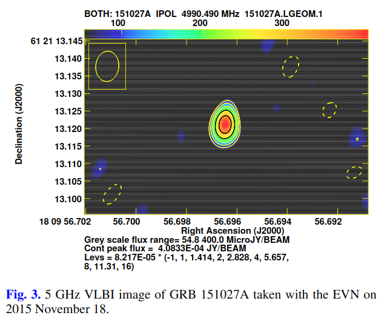

 

#### 2.3.2 Very Long Baseline Array (VLBA) observations

We observed GRB 151027A with the Very Long Baseline Array (VLBA)  2016 Jan. 24, Jan. 30, and Feb. 6. The  observations were carried out at 5, 8, and 15 GHz, with a time partition given in Table A.2. At each frequency, our set-up consisted of 8×32 MHz baseband channels in dual polarization. We used the same calibrator–target scheduling pattern as in the EVN observations, with a duty cycle depending on the observing frequency(see Table A.2). 
>Observation epoches: 2016 Jan. 24, Jan. 30, and Feb. 6. Frequency: 5, 8, and 15 GHz.

We carried out the standard calibration in AIPS,following the latest guidelines for VLBA amplitude calibration.We combined the DBCON data with the data from observationsat the same frequency taken in different runs; no significant variability is expected on timescales shorter than a week. At 5 and 8 GHz, we clearly reveal a compact source at the image phase tracking centre determined from the EVN observations; we also detect the source at 15 GHz, but only if we use natural weightsin the imaging process.
>At 5 and 8 GHz, A compact source was showed at the image phase tracking centre determined from the EVN observations.

#### 2.3.3 Medicina observations

We observed GRB 151027A with the 32 m Medicina radio telescope on 2015 October 31. We observed with the Total Power backend at a central frequency of 24.5 GHz, with a bandwidth of 2 GHz.
>2015.10.31, central frequency of 24.5 GHz with a bandwidth of 2 GHz.

We performed 1043 cross-scans in right ascension and declination, centred on the position reported by Laskar et al.(2015). The total effective on-source time is 27 min. Data werecalibrated with scans on NGC 7027, and sky opacity was determined and compensated for through regular (about one per hour)skydip scans. No significant emission was detected above a 3σ noise level of 8.0 mJy.
>Total on-source time was 27min, no significant emission was detexted above a 3σ noise level of 8.0 mJy.

#### 2.3.4 Sardinia Rdio Telescope (SRT) observations

We observed GRB 151027A with the 64 m Sardinia radio telescope on 2015 October 30–31 between 23:30 UT and 01:30 at22 GHz, and  between 01:30 and 04:30 at 7.2 GHz. The observing strategy was based on cross-scans in azimuth and ele-vation directions, with the following parameters for each band:at 22 GHz we observed with a bandwidth of 2 GHz with a totalof 242 scans for an effective on-source time of 5 min; at 7.2 GHz the bandwidth was 680 MHz with 336 scans and a net on-sourcetime of 14 min. 
>Times: 2015 October 30–31 between 23:30 UT and 01:30; between 01:30 and 04:30 Frequencies: 22GHz(2GHz), 5 min on-source time; 7.2GHz(680MHz), 14 min on--source time.

wing to scheduling constraints, **the observations took place at low elevation, between about 12deg and 19deg**. No significant emission was detected above a 3σ noise level of 6.0 mJy and 0.6 mJy respectively at the two frequencies. These values are dominated by the low elevation at high frequency andby confusion at low frequency.
>Observations took place at low elecation, no siginificant emission was detected above a 3σ noise level of 6.0 mJy and 0.6 mJy respectively.

## 3. Data analysis and results

### 3.1 Prompt emission: first and second peaks
[Back](#menu)

During the first two peaks of the light curve, corresponding to the time interval ~0-24s, we extracted three spectra: #1 and #2 corresponding respectively to the rise and decay phase of the first peak and #3 for the entire duration of the second (dimmer) peak (referring to the labelled regions in the middle panel of Fig. 1).

We jointly fit the Fermi-GBM (NaI and BGO) and the Swift-BAT spectra with a cutoff power law model (CPL) with a free normalization constant between Fermi and Swift. Start and stop times and the best fit parameters (with 68% confidence errors)and the $\chi ^2$(d.o.f.) are given in Table 2.
> The GBM+BAT spectrum of stage #1 and #2 were fitted by CPL model.

Spectrum #3 can be fitted only with a simple power law model (i.e. the $E_{peak}$ of the cutoff power law model is unconstrained).
>  Spectrum #3 can only be fitted by SPL model due to the unconstrained $E_{peak}$.

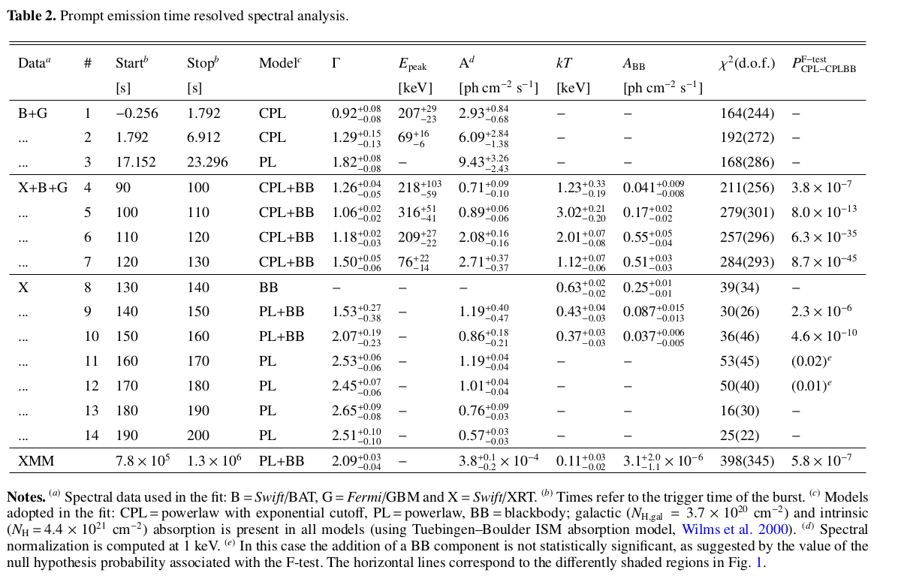

### 3.2 Evidence of a thermal component: third peak
[Back](#menu)

The third peak of the light curve was observed by BAT and GBM above 10 keV and simultaneously by XRT in the 0.5–10 keV energy range. The light curves (see middle panel of Fig. 1) show that the XRT peak is delayed with respect to that observed by BAT and GBM. We selected four time intervals (from 90 s to 130 s after the trigger) where the data from three instruments overlap, and jointly fitted the spectra. This allows us to perform a **time resolved spectral analysis** over a wide energy range, namely from 0.5 keV to a few MeV.
>Frome the light curve from BAT, XRT and GBM, a time resolved spectral analysis was performed over a wide energy range(0.5keV to a few MeV)

We fit the spectra with a CPL model. Since the data extend down to 0.5 keV, it is necessary to take into account the galactic and intrinsic absorption. The Tuebingen–Boulder ISM absorption model (Wilms et al. 2000) encoded in the $tbabs$ and $ztbabs$ models of XSPEC (Arnaud 1996) is used. 
> The third peak spactrua was fitted with a CPL model. The galactic and intrinsic absorption need to be considered for the data extended down to 0.5 keV.

We assume the galactic absorption $N_{H,gal} = 3.7 × 10^{20} cm^{−2}$ and keep it fixed, and we also allow for an intrinsic (at z = 0.81) absorption. Also in this case we allow a free normalization constant between the Swift-BAT spectrum and the Fermi-GBM (NaI+BGO) spectra. In all the fits we find that this constant is within a factor of 2 and is consistent with 1.0.
>Assume a fixed galactic absorption $N_{H,gal} = 3.7 × 10^{20} cm^{−2}$. What is the free normalization constant between the BAT and GBM spectrum?

If the intrinsic $N_H$ is treated as a free parameter, we find that it varies dramatically (by more than one order of magnitude) describing a peak over a 30-s timescale coincident with the flare. We interpret this non-physical feature as being indicative of the possible presence of an additional component during the flare. We therefore fixed the intrinsic $N_H = 0.44 × 10^{22} cm^{−2}$ which is the value found by fitting the XRT spectra at very late times (i.e.>5 days).
> 1.About the variable $N_H$, here is what I guess: The intrinsic $N_H$ should be a constant during the burst, but something during the flare fluctuated the value of $N_H$. But if it was the case, then why did it say that it's a non-physical feature? What on earth is the intrinsic $N_H$? 2.Intrinsic $N_H=0.44 × 10^{22} cm^{−2}$ was fixed by fitting the late times (>5 days) XRT spectra.

By visual inspection of the fitted spectra and their residuals we noticed systematic deviation from the model in the XRT 0.5–10 keV energy range, making the CPL fit unacceptable. We therefore tried to model this excess by adding the simplest two-parameter thermal blackbody (BB) component. We refitted the data and compared the new fit (i.e. absorbed cutoff power law plus blackbody – CPL+BB) with the old one (i.e. absorbed CPL) through an F-test. We find that in all of the four spectra describing the third emission episode of GRB 151027A there is statistically significant evidence for the presence of a thermal blackbody component. The probability of the F-test (representing the probability that the fit is not significantly improved by the additional BB component) is given in Table 2, along with the spectral parameters of the CPL+BB fit. The four spectra are shown in the bottom panels of Fig. 1.
>Spectral #4 - #7 all required CPL + BB(simplest two- parameter thermal blackbody) to be well fitted. The smaller the value of the F-test is, the more likely that a BB component is indicated.

The addition of the BB component to the CPL is the minimal assumption that can produce a curvature of the spectrum which adapts to the data points. However, we also verified whether the systematic deviation of the data from a simple CPL could also be accommodated by a second CPL. In order to have a similar number of free parameters of the BB, in this case we fixed the second CPL low energy photon index to the value predicted for single electron synchrotron emission, i.e. 2/3. In spectra #3 and #4, when the peaked component is less dominant, the fits performed using CPL+CPL or CPL+BB are statistically equivalent. Afterwards, when the component at low energies represents a considerable fraction of the total flux, the CPL+BB model is statistically preferable.
> CPL + CPL model is also verified for the spectrum, but CPL + BB model is statistically peeferable, as tested from the later spectrum (#4 - #7).

### 3.3 X-ray emission in the interval 130–200 s
[Back](#menu)

After 130 s, the GBM and BAT data cannot be used for the spectral analysis. We analyse seven XRT spectra (corresponding to regions 8–14 in the middle panel of Fig. 1) in the time interval 130–200 s and fit with an absorbed power law (PL) or an absorbed power law plus a blackbody component (PL+BB). Given the limited energy range 0.5–10 keV we cannot determine the peak of a possible cutoff power law model. For each spectrum the statistical significance of the addition of the thermal component has been estimated through the F-test. For spectrum #8 the best fit is obtained with a pure BB model since the addition of a power law component does not constrain the power law fit parameters. In the following spectra the best fit model is PL+BB, in which the thermal component remains statistically significant up to 160 s. After that, the spectrum is best fitted by a single PL component.
>For the XRT spectrum during #8 - #14, the combinations of PL and BB component were tested. Spectra #8(130 - 140s): pure BB component. Spectrum #9 - #10(140 - 160s): PL + BB model. Spectrum #11 - #14(160 -  200s): single PL component. 

The evolution of the spectral parameters is shown in Table 2 and Fig. 4.

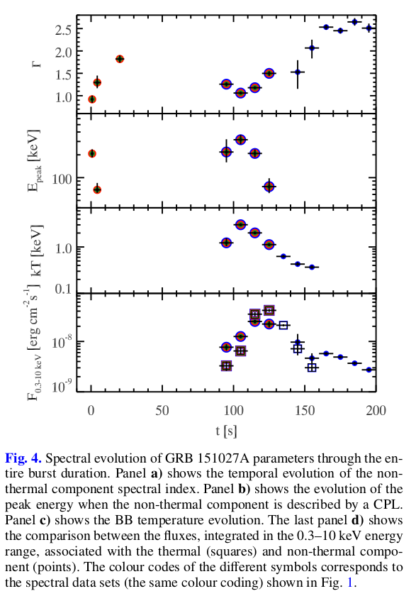

The results of the BAT-GBM-XRT spectral fits were compared with the optical R band detection at 126 s (Pozanenko et al.2015). The optical detection is compatible with the low energy extrapolation of the model (Fig. 5). This result suggests that the early optical emission could be produced by the same mechanism responsible for the high energy emission and therefore it should not be interpreted as standard afterglow.
>The optical detection is compatible with the low energy extrapolation of the model, which means that the early optical emission could have the same origin with the high energy emission. This indicated that it shouldn't interpreted as standard afterglow. 
Does it means that the origin of optical and high energy emission are different in the standard afterglow theory?

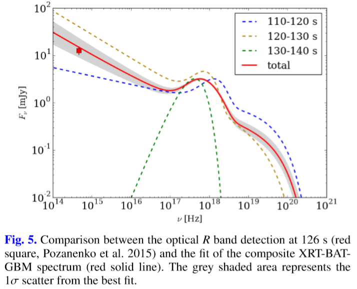

### 3.4 XMM-Newton late time spectrum
[Back](#menu)

The XMM-Newton late time spectral analysis was intended to obtain a more accurate estimate of intrinsic $N_H$. We initially performed the fit using a PL model with free intrinsic absorption. From the residual, we noticed that a peaked component should be added to improve the fit. For this reason we refit the spectrum using a PL+BB model with free absorption. The XMM-Newton spectrum showed a still statistical significant thermal component that contributes to only ∼8% of the 0.3–10 keV flux. The BB temperature was lower than the one obtained from XRT spectrum # 10 (the last time interval where BB was detected). All the fit parameters are listed in Table 2.1.
>PL+BB model fitted well the XMM-Newton late time spectral data(~ $10^6 s$).  The thermal component contributes to only ∼8% of the 0.3–10 keV flux, the BB temperature was lower than that obtained from XRT spectrum #10.

The best fit $N_H$ parameter obtained in the PL+BB model is fully compatible with the value obtained by the late time XRT spectrum.
>Nice! $N_H$ obtained from XMM-Newton spectrum is consistent with late XRT spectrum.($(0.42\pm0.05)\times 10^{22} VS 0.44 × 10^{22} cm^{−2}$) 

The 0.3–10 keV flux corrected by intrinsic and galactic absorption is compatible with the flux measured by XRT at that time and it is shown by the light blue diamond in Fig. 6.
>The absorption corrected 0.3-10 keV flux is compatible with the flux measured by XRT at the correponding time. 

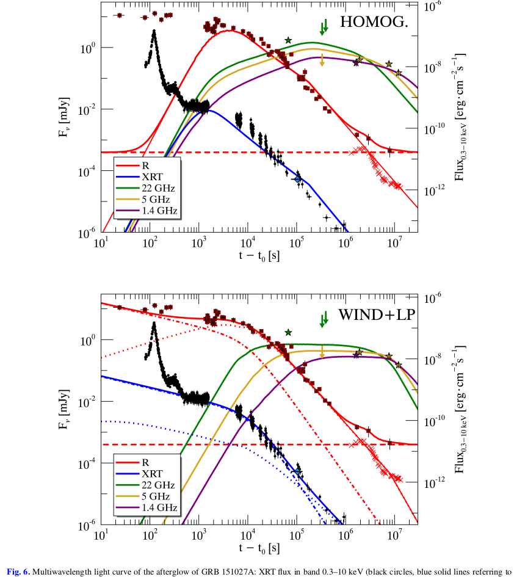
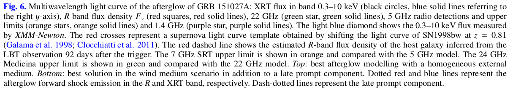

### 3.5 Radio
[Back](#menu)

As an example of the VLBI data quality, we show in Fig. 3 the EVN image at 5 GHz obtained on 2015 Nov. 18. We give in Table A.3 the basic parameters (noise $σ_ν$ , peak surface brightness $B_ν$ , peak-to-noise ratio, and image resolution) of this and the other images; in Col. 7 we list the total flux density $S_ν$ obtained from a visibility model-fitting carried out in **Difmap**. Estimating the accuracy of the amplitude scale for VLBI data is traditionally a difficult task. From an inspection of the data quality and of the calibrator images, and taking into account the local noise,we conservatively estimate it to be within 20%.
>The basic parameters are listed in Table A.3 The accuracy of the amplitude of the local noise is conservatively estimated to be within 20%.

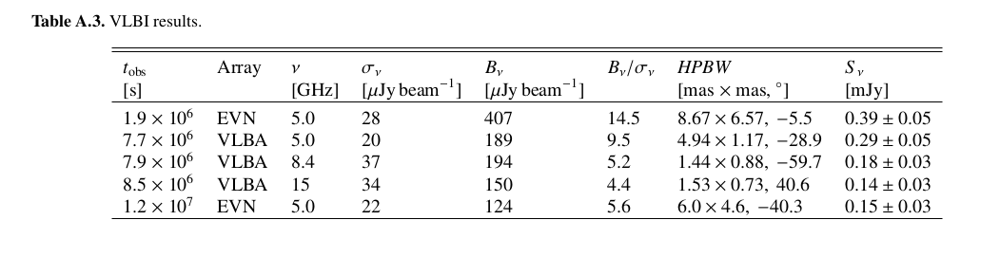

From the comparison of the EVN and the VLBA 5 GHz data, we find that the source flux density decreased by nearly 50% from day 22 to day 89, and by a further ∼50% between day 89 and 140. Moreover, from the comparison of the nearly simultaneous VLBA multi-λ data,we determine that the emission region is optically thin, with a spectral index of about β = 0.7–0.9, assuming $F_ν ∼ ν^{−β}$(see fourth panel of Fig. 7).
>From EVN and VLBA 5 GHz data, the source flux density decreased by ~50% from 22d to 89d, and a furthur ~50% from 89d to 140d. From the nealy simultaneous VLBA multi-λ data( see [Sect2.3.2](#sect2.3) ), an optically thin emission region is determined, and a spectral index β = 0.7–0.9 is attained.

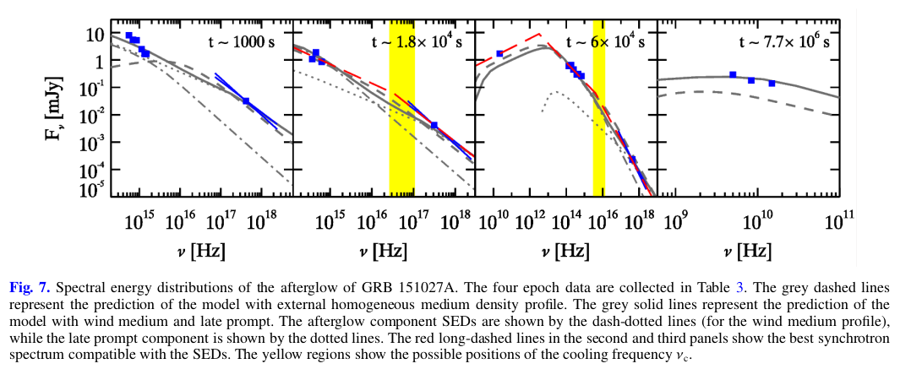
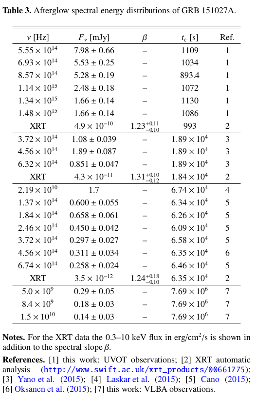

The position of the source is consistent among the various experiments to within about 1 milliarcsecond. The mean coordinates are RA 18h 09m 56.6964s, Dec. +61$\degree$21$\min$13.1210$\sec$. A more accurate astrometric calibration is beyond the scope of the present paper.
> The mean coordinates are RA 18:09:56.6964, Dec +61:21:13.1210

### 3.6 Afterglow light curve and spectral energy distributions
[Back](#menu)

The XRT 0.3–10 keV unabsorbed flux, the R band observations (see Table A.1) and the radio detections and upper limits (see Table 1) were used to build the multiwavelength light curve of the afterglow of GRB 151027A shown in Fig. 6.
>Multiwavelength light curve of the afterglow of GRB 151027A is built.

We built four spectral energy distributions at different times (1000 s, 1.8 × 10 4 s, 6 × 10 4 s, 7.7 × 10 6 s) combining the data collected from GCNs, UVOT, and XRT observations and also radio VLBA observations. The unabsorbed fluxes are included in Table 3 and the four SEDs are shown in Fig. 7.
>Four spectral energy distributions at different times (1000 s, 1.8 × $10^4$ s, 6 × $10^4$ s, 7.7 × $10^6$ s) are built from GCNs, UVOT, and XRT observations and also radio VLBA observations.

## 4.Discussion
[Back](#menu)

### 4.1 Prompt emission and flare (long)
[Back](#menu)

The prompt light curve of GRB 151027A shows three isolated emission peaks. The first two peaks have a standard behaviour with non-thermal spectra both characterized by a hard to soft evolution.
>The first two peaks have a non-thermal spectra both characterized by a hard to soft revolution.

The third peak shows a statistically significant BB component at low energies superimposed on a cutoff power law. Evidence of a thermal emission have also been found in other GRB spectra. Typically it has been detected in the early phases of the prompt emission (Ghirlanda et al. 2003) or it can be present throughout the entire burst duration (Ryde 2004; Bosnjak et al. 2006; Ghirlanda et al. 2013) and it has been detected in X-ray flares (Peng et al. 2014). Furthermore, Starling et al. (2012) and Sparre & Starling (2012) have presented systematic research of thermal signatures in X-ray emission. 
According to the classification of Ghirlanda et al. (2013), GRB 151027A belongs to Class III of the thermal bursts because the thermal and non-thermal components coexist. Figure 8 shows the simultaneous evolution of the 0.3–1000 keV and 0.3–10 keV luminosity of the two components.
>The third peak showed a significant BB component at low energies coexisting with non-thermal component, which made this GRB "the class III thermal busrt" according to Ghirlanda(2013).

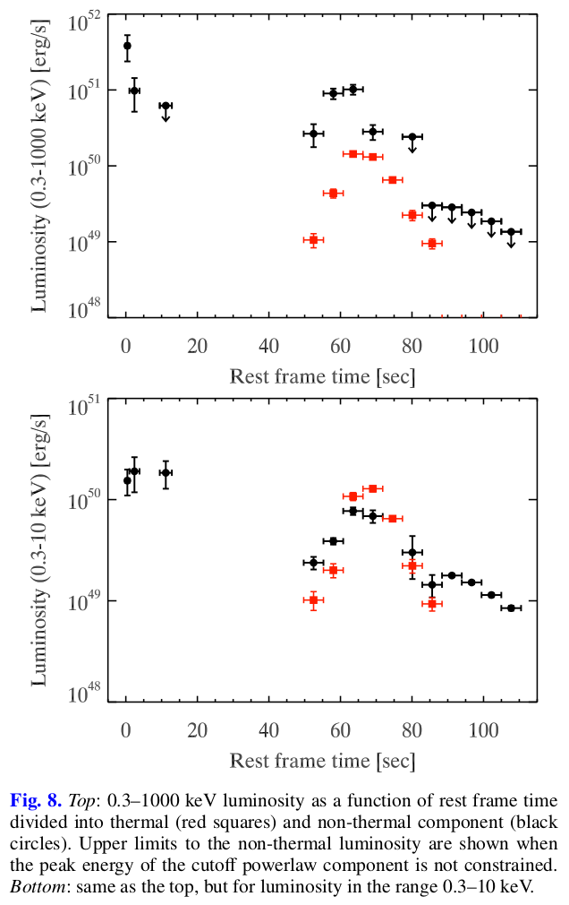

The X-ray flare of GRB 151027A has a very luminous thermal component (∼$10^{50}$ erg/s near the peak) characterized by a low temperature ($kT_{BB}$ ∼ 1 keV, a factor of ∼10 lower than the typical temperature observed in GRB prompt emission, e.g.Ryde 2004). Furthermore, the thermal luminosity peaks later than the non-thermal component and, at its maximum, it contributes to most of the total luminosity in the 0.3–10 keV and to 35% of the 0.3–1000 keV luminosity. In addition, the thermal component is still detected in the XMM-Newton late time spectrum with a luminosity ∼$5 × 10^{44} erg/s , corresponding to ∼8% of the 0.3–10 keV emission. In the following, we discuss the possible origin of this blackbody emission.
>1.The X-ray flare has a very luminous thermal component (~ $10^{50}$ erg/s) but a rather low temperature ($kT_{BB}$ ∼ 1 keV, a factor of ∼10 lower than the typical temperature observed in GRB prompt emission). 2.The thermal luminosity peaks later than the non-thermal component. 3.The thermal component contributed to most of the total flux in 0.3-10 keV and to 35% in 0.3-1000keV. 4. The thermal component was still detected by XMM-Newton at late time ($10^6$ s) spectrum with a luminousity ∼$5 × 10^{44}$ erg/s, corresponding to ∼8% of the 0.3–10 keV emission. But what about the intermediate stage? Maybe the non-thermal grew up and covered the BB component? Maybe the BB origin was activated again after a quiescent?

The hypothesis that the observed blackbody emission is due to a Ib/c SN shock breakout has to be excluded. In fact, the typical X-ray luminosity of such emission is ∼$10^{45}$ erg/s (see e.g. Matzner & McKee 1999; Campana et al. 2006; Ghisellini et al. 2007c), which is much lower than the BB luminosity (∼10 50 erg s −1 ) observed at the peak of the flare in GRB 151027A.
>Our BB component is not likely to stem from a Ib/c SN shock breakout, because the typical  X-ray luminosity of such emission is of ∼$10^{45}$ erg/s, much lower than the peak of the flare in our GRB.

Piro et al. (2014) proposed a model based on the emission of a hot plasma cocoon (based on Pe’er et al. 2006) to explain the long-lasting thermal emission observed in the ultra-long GRB 130925A. Starling et al. (2012) also used the cocoon expansion to explain the presence of thermal emission in X-ray spectra of GRB associated with a SN explosion. Even this model cannot be applied to our case because the peak luminosity reached by the thermal component during the flare is larger than the expected value (which is of the order of $10^{47}$ erg/s or greater).
>The emission of a hot plasma cocoon also  cannnot explain our case because the expected luminosity of  this emission is ~$10^{47}$ erg/s, which is again lower than our case.

---

Thermal emission is naturally predicted within the standard fireball scenario, when the relativistically expanding fireball releases the internal photons at the transparency radius (e.g. Goodman 1986; Paczynski 1986; Daigne & Mochkovitch 2002).
>When the expanding fireball releases the internal photons at the transparency radius, a thermal emission is produced. Is there a specific radius for an fireball, when the fireball expands beyond this radius, it becomes transparent?

Owing to the initial huge opacity of the fireball (optical depth $τ >> 1$), photons can reach the thermodynamic equilibrium and are characterized by a BB spectrum.

Using the observables associated with the BB spectrum, i.e.the temperature kT BB and the flux F BB , we can estimate the fundamental parameters of the fireball (see Ghirlanda et al. 2013). We can first obtain the ratio between the radius of the fireball and its bulk Lorentz factor $R_T/Γ_T$ when it becomes transparent:
$$
\frac{R_T}{\Gamma_T} = 2.406 \frac{d_L (z)}{(1+z)^2} (\frac{F_{BB}}{\sigma T_{BB}^4})^{1/2} cm
\tag{1}
$$

The evolution of this ratio during the third emission peak is shown in Fig. 9.

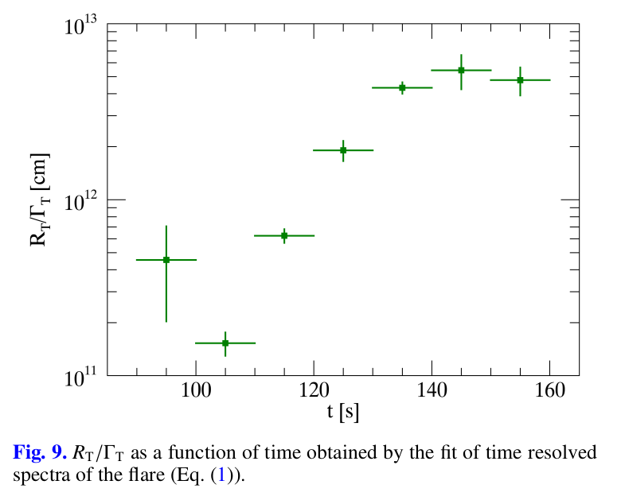

In order to test this hypothesis further, we need to make an assumption about when transparency occurs:
- (i)It might happen during the acceleration phase when, owing to the high internal pressure, the fireball is still accelerating, converting its internal energy to bulk motion energy. In this case, it is possible to estimate the distance from the central engine $R_0$ , where the fireball is created, assuming an initial bulk Lorentz factor $Γ_i = 1$. We obtain $R_0 ∼ 10^{11−12}$ cm.
>If the transparency occurs in accelerating phase, the $R_0$(I guess this is the initial radius of the fireball) is estimated to be $R_0 ∼ 10^{11−12}$ cm

- (ii)It might happen during the coasting phase. The internal pressure is no longer sufficient to accelerate the fireball that proceeds with constant bulk Lorentz factor. In this case combining Eq. (1) with the relations shown in Daigne & Mochkovitch (2002) we can obtain $R_T$ , $Γ_T$ , and $R_0$. Differently from the previous case, these values are not unequivocally determined because they depend on the blackbody radiative efficiency $η_{BB}$ . As in Ghirlanda et al. (2013) we use a radiative efficiency related to the thermal component of about $η_{BB} ∼ 10^{−2}$ , since the blackbody flux varies from ∼5% up to ∼50% of the non-thermal flux. Then, we find $R_T = 10^{13−14}$ cm, $Γ_T ∼ 60$, and $R_0 ∼ 10^{9−10}$ cm (Fig. 10).
>If the transparency occurs during the coasting phase, according to previous work and assuming a thermal component radiative efficiency of about $η_{BB} ∼ 10^{−2}$, we find $R_T = 10^{13−14}$ cm, $Γ_T ∼ 60$, and $R_0 ∼ 10^{9−10}$ cm. We can see that the $R_0$ varies over time, which indicates that this $R_0$ may not be a characteritic quantity.

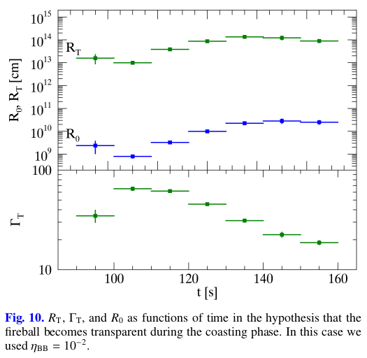

In both cases the value of $R_0$ is much higher than expected. Assuming that the progenitor of long GRBs is a newly born compact object (a black hole or a magnetar) produced by the core collapse of a Wolf–Rayet star (Usov 1992; Duncan & Thompson 1992; Woosley 1993; MacFayden & Woosley 1999), we can suppose that the fireball should be formed near the central object, at a few gravitational radii. For a compact object of 5–10 M , the gravitational radius is ∼ $10^6$ cm, so we expect that $R_0$ ∼ $10^7$ cm, a value much smaller than the obtained one.
>For a core collapse scenario, the fireball should be formed near the central object, at a few gravitational radii($r=2GM/c^2$). Supposing a compact object of 5–10 $M_{sun}$, $R_0$ ∼ $10^7$ cm, much smaller than the above two case.

In case (ii), the value we should use for $η_{BB}$ in order to get $R_0 ∼ 10^7$ is $∼10^{−4}$ . Such a low radiative efficiency would imply an enormous burst of kinetic energy. Therefore, we expect a very energetic afterglow that is in contrast with what we observe.
>In case (ii), $η_{BB}$ should be $∼10^{−4}$ in order to get $R_0 ∼ 10^7$, which implies an enormous burst of kinetic energy and therefore a very energetic afterglow. But that is not consistent with observations, which means the core collapse scenario ($R_0$ ∼ $10^7$ cm) is not the case.

Another possible explanation of the significant thermal emission of GRB 151027A is given by the “reborn fireball” model (Ghisellini et al. 2007a). In this scenario the thermal emission is produced by plasma heated in the collision between the relativistic ejecta and the surrounding material released by the progenitor star during its final evolution stages.
>Another explanation is given by 'reborn fireball' model, in which the thermal emission is produced by plasma heated by the collision between the relativistic ejecta and the sourrounding material released by the progenitor before.

If the optical depth after collision is large, a re-acceleration to relativistic speed due to the dissipated internal energy can take place. This process allows the creation of a reborn fireball with a larger initial radius $R_0 ∼ 10^{11}$ cm consistent with the large values inferred for GRB 151027A.
>If the optical depth after collison is large, which means the opacity remains high, then the re-acceleration (of the 'initial' fireball?) can take place, allowing the creation of a 'reborn fireball' with a larger 'initial radius' of $R_0 ∼ 10^{11}$ cm, and this is consistent with the inferred value above. Combining the case (ii), we can infer that the idea is that the transparency occurs in the coasting phase of this 'reborn fireball'.

Ghisellini et al. (2007a) assume the target material to be at rest with respect to the central engine. Nevertheless, in our case the relativistic shells that produced the first two prompt emission peaks should have interacted with such material first. For this reason, we must conclude that the optically thick target material was not there when the first prompt photons were emitted.
>But there is also a puzzle in this scenario. The optically thick material must not present when the relativistic shell that produced the first two peaks interacted with the surrounding material. The first peak happened at ~0.2s, so when and where should this optically thick material presents?

A possible way around this is to assume the GRB central engine itself is responsible for the production of the target material. At the beginning, shells that produce the initial part of the prompt emission are ejected. Then a denser and slower shell is ejected, which does not emit radiation since it is optically thick. After a quiescent period a quicker shell is ejected and it reaches the slower one. In this scenario the reborn fireball is actually like an internal shock between a thick, mildly relativistic, massive shell with a quicker shell. The collision dissipates energy with non-negligible efficiency since the relative Lorentz factor can be large. The photons produced cannot escape because of the large opacity and the internal thermal energy can be used to re-accelerate the shell. Beyond the photospheric radius the shell emits the blackbody radiation produced by the reprocessing of the trapped photons and a non-thermal component. The decreasing emission of the flare is then due to the quenching of the radiation of the shell and to the off latitude emission.
> The puzzle can be unravelled by assuming that the optically thich material is ejected by the central engine itself after the shells responding to the first two peaks are ejected.  
> This 'optically thich material' could be a densor, slower and optically thick shell which does not emit radiation and thus comes the ~80s quiscent.  
> During this quiscent, a quicker shell is ejected and reaches and collides with the slower one. In this collision, the photons produced are trapped due to the opacity and the internal thermal energy can re-accelarate the shell, forming a 'reborn fireball'. 
> Beyond the photospheric radius the shell emits the blackbody radiation produced by the reprocessing of the trapped photons and a non-thermal component.

### 4.2 Modelling the afterglow
[Back](#menu)

In this section we propose a model for the afterglow light curve from the XRT 0.3–10 keV flux to the optical R band and to the radio frequencies. As was said before, both the X-ray and optical early time flux (for t obs < ∼ 500 s) is contaminated by the emission of the flare. For this reason, we focus on the observed light curves only for t obs > ∼ 500 s. At this epoch, the X-ray light curve shows the presence of a plateau phase (Nousek et al. 2006), which is usually related to a late time central engine activity (see e.g. Zhang et al. 2006; Dai & Lu 1998; Zhang & Mészáros 2001; Kumar et al. 2008;Corsi & Mészáros 2009; Metzger et al. 2011; Leventis et al.2014; van Eerten 2014; Duffell & MacFayden 2014). However, we first attempt to model the multiwavelength long-lasting emission of GRB 151027A as produced uniquely by the forward shock.
>Model is proposed for the afterglow light curve from X-ray to radio band. Only the light curves later than ~500s are concerned due to the contamination of the flare to the early time afterglow emission. The X-ray light curve shows a plateau phase which is usually related to a late time central engine activity. Set this aside, we first assume that the afterglow emission is produced uniquely by the forward shock.

#### 4.2.1 Model

The modelling of the observed afterglow light curves has been performed with a semi-analytic model that combines the forward shock dynamics developed in Nava et al. (2013) with the computation of the spectrum of the emitted radiation, based on Nappo et al. (2014), already used in Melandri et al. (2015). The model will be presented in more detail in a future paper in preparation. Here we **introduce only the most relevant features**.
>The model is a semi-analytic model combining the forwardshock dynamics with the computation of the spectrum of the emitted radiation.

We assume that the blastwave starts moving at relativistic velocity with an initial bulk Lorentz factor $Γ_0$ , and with an initial kinetic energy $E_{kin,0}$ that is linked to the emitted γ-ray isotropic energy $E_{γ,iso}$ and the efficiency η by
$$
E_{kin,0}=(1-η)E_{\gamma,iso}/\eta
\tag{2}
$$
> Initial kinetic energy $E_{kin,0}$ together with the emitted γ-ray isotropic energy is the totol energy?

Then the fireball decelerates because of the interaction with the external medium and dissipates its energy (see Nava et al. 2013 for an exhaustive treatment). We assume that a fraction $\epsilon_e$ and $\epsilon_B$ of the dissipated energy is distributed to the **leptons and the magnetic field**, respectively. The remaining energy is given to **protons**. The energy is given to electrons with an energy distribution $Q(γ) ∝ γ^{−p}$ . The leptons can cool for synchrotron and synchrotron self-Compton (SSC) emitting a fraction $\epsilon_{rad}$ of their total energy. At each time step we compute the following:
- the synchrotron spectrum in the optically thin and in the self-absorbed regime;
- the Y Comptonization parameter;
- the SSC spectrum;
- the fraction $\epsilon_{rad}$ of injected energy that is actually radiated.
> Where does the kinetic energy go? Leptons (including electron and thus radiations through synchrotron or IC process ...); magnetic field; protons. At each time step (maybe the time intervals of our observations), synchrotron spectrum, SSC spectrum, Y Comptonization parameter, abd the radiated energy fraction are computed.

The resulting spectrum is normalized at each time step to the bolometric luminosity obtained by the dynamical evolution. The fireball is assumed spherical, but it is possible to insert a jet break in the light curves when the beaming cone of width 1/Γ becomes larger than the jet opening angle θ jet , which produces an achromatic steepening of the temporal index α. 

We can describe the propagation of the forward external shock in a circumburst medium (CBM) with a generic density profile n(R). In this work we will test only the two standard cases: homogeneous medium (n(R) = const.) and wind–medium (n(R) ∝ R$^{-2}$ ); the first describes the density profile typical of the interstellar medium and the second describes the stratified density profile that can be produced by the intense stellar winds in the final stages of the Wolf–Rayet star evolution.
> Two standard CBM cases are tested in the forward shock model we used.

#### 4.2.2 Homogeneous CBM scnerio

The best result obtained using this modelling hypothesis is represented in the top panel of Fig. 6. The values used for the parameters in this scenario are given in the first column of Table 4. The solution was obtained using standard values except for the efficiency η, which is about an order of magnitude smaller than typical values (η ∼ 0.2). In addition, a remarkably small value for $\epsilon_B$ is used because, with a small magnetic field, the cooling frequency $\nu_c$ is closer to the value inferred by the modelling of the ∼1.8 × 10$^4$ s SED with a pure synchrotron spectrum (see purple region in panel 2 of Fig. 7).
>In order to obtain the solution, a smaller efficiency $\eta$ than typical values is used, and a small value for $\epsilon_B$ (namely, a smaller magnetic field) is used in order to get the cooling frequency $\nu_c$ closer to the value inferred from the ~1.8 × 10$^4$ s SED synchrotron modelling.

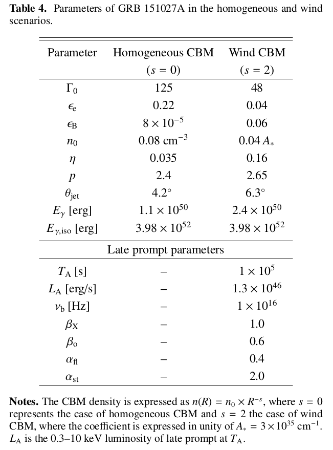

The injection index of the electrons p = 2.4 is consistent with the slope of the optical spectrum $β_o$ measured at t ∼ 6 × 10$^4$ s ($β_o$ = (p − 1)/2 $\simeq$ 0.7−0.9). Nevertheless, with this choice of p, a steepening of the light curve decay (∆α ∼ 1) for t > 2 × 10$^5$ s is necessary to account for the optical and X-ray late time behaviour. We interpret this achromatic steepening as the **jet break** (Rhoads 1997; Sari et al. 1999). Using the standard relations for the jet break time in a homogeneous external medium (Sari et al.1999) we can determine the jet opening angle $θ_jet = 4.2\degree$.
> 1.p =2.4 is consistent with the slope of the ∼ 6 × 10$^4$ s optical spectrum. 2.However, if this is the case, then the presence of a steepening of the light curve decay (∆α ∼ 1) at > 2 × 10$^5$ s deserves a explanation. This is interpreted as due to the jet break, which corresponds to a jet opening angle $θ_jet = 4.2\degree$ (according to the standard relations for the jet break time in a homogeneous CBM)

The collimation corrected γ-ray emission is $E_γ = E_{γ,iso} (1 − cosθ_{jet} ) = 1.1 × 10^{50}$ erg, where we used the isotropic energy obtained by Fermi-CBM integrated spectrum $E_{iso} = 3.98×10^{52}$ erg (cf. Sect. 2.1). This result has been compared with the $E_{peak} − E_γ$ correlation (Ghirlanda et al. 2004, 2007) and the burst is 4σ off the best fitting line. Using the Fermi-CBM rest frame $E_{peak}$ = 615 keV, the jet opening angle that would make the GRB consistent with the $E_{peak} − E_γ$ correlation is $θ_{jet} = 14\degree$ , which should have generated an achromatic break in the light curves at t ∼ 5.8 × $10^6$ s. No break is observed at this epoch.
>1.In order to coincide with the $E_{peak} − E_γ$ correlation, the openning angle $θ_{jet}$ should be $14\degree$ induced from our $E_{γ,iso}$ and $E_{peak}$(where can we get $E_{peak}$ = 615 keV???). 2.This $θ_{jet}$ should have generated an achromatic break at t ∼ 5.8 × $10^6$(the standard relations for the jet break time in a homogeneous CBM above), but it did not appear. 3.This inconsistence seems to have nothing to do with the type of the CBM? Besides, this kind of correlation is not much reliable.

Radio 5 GHz observations provide the main evidence that excludes the homogeneous model. Figure 11 is a zoomed view of Fig. 6 in which the late time 5 GHz model predictions with both homogeneous and wind model are compared with the data. Indeed, the 5 GHz model in the homogeneous case is not compatible with the SRT upper limit at 3.5 × $10^5$ s and with the EVN and VLBA observations. This significant incompatibility, in addition to the lack of strong evidence of an achromatic break at t ∼ 2 × $10^5$ s, leads us to conclude that the homogeneous density profile does not provide a good modelling of the afterglow of GRB 151027A.
>1.Thr radio observations is not consistent with the 5 GHz model of a homogeneous CBM but fit well the wind CBM. 2.Besides, the achromatic break at t ∼ 2 × $10^5$ s also cannot be fully supported by homo-CBM. 3.Thus, the homogeneous density profile can be excluded.

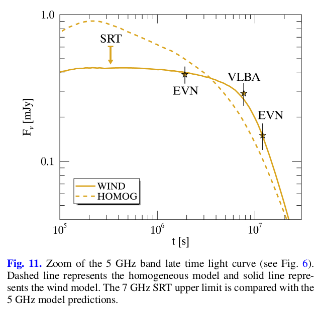

#### 4.2.3 Wind CBM scenario

The best solution obtained in the wind CBM scenario is plotted in the bottom panel of Fig. 6. The corresponding parameters are shown in the second column of Table 4. We adopted standard values for the parameters, except for the density parameter $n_0$ , which is a factor of 25 smaller than the typical value $A_∗ = \dot M_W /(4πm_p v_W ) = 3 × 10^{35} cm^{−1}$ obtained for a mass loss rate $\dot M_W = 10^{-5} M_{sun} yr^{-1}$ and a wind velocity $v_W = 1000 km/s$ ,typical of a Wolf–Rayet star (Chevalier & Li 1999, 2000).
> In the wind CBM, the adopted density parameter $n_0$ is a factor of 25 smaller than the typical value $A_∗$ for a mass loss $\dot M_W = 10^{-5} M_{sun} yr^{-1}$ and a wind velocity $v_W = 1000 km/s$.

The injection index p = 2.65 is compatible with the optical spectral slope of the SED at ∼6 × 10$^4$ s and allows a description of the optical light curve temporal decay, which is better than the value obtained in the homogeneous model.
> 1.Same as the the homogeneous model, ($β_o$ = (p − 1)/2 $\simeq$ 0.7−0.9). 2.But which regime of the ∼6 × 10$^4$ SED is p=2.65 compatible with?

The 22 GHz VLA observation at 0.78 days after the trigger (Laskar et al. 2015) deviates from the model prediction by a factor of ∼2.5. This inconsistency can be explained with the scintillation caused by the circumburst medium (Goodman 1997), which should modulate the early radio flux of GRB afterglows. For example, in the case of GRB 970508 (Frail et al. 1997; Taylor et al. 1997) the early time observed radio flux is strongly modulated up to a factor of ∼4 at 8.46 GHz.
>The inconsistency that the 22GHz ealy observation (0.78d) is higher than the model by a factor of ~2.5, which can be explained as that the scintillation caused by the CBM modulated the early radio flux to a higher level.

The prediction for the X-ray afterglow flux (blue dotted line in the bottom panel of Fig. 6) is much lower than the observed value. Furthermore, the X-ray light curve profile shows some elements such as a plateau and a flare that cannot be explained in the standard forward shock scenario. For these reasons, to model the X-ray emission we need to introduce another component of different origin. 
>The standard FS prediction for the X-ray is much lower than the observations. Besides, the X afterglow LC shows elements like plateau and flare that requires additional origin.

The presence of this extra component is also suggested by the SEDs of the afterglow, especially the ∼1000 s SED obtained with UVOT and XRT (first panel of Fig. 7). 

The X-ray flux is much higher than the extrapolation of the power law component of the UVOT emission and requires another component to be consistent. Instead, the single spectral energy distributions taken at ∼1.8 × 10$^4$ s and ∼6 × 10$^4$ s (panels 2 and 3 in Fig. 7) are compatible with standard synchrotron emission spectrum in slow cooling regime (i.e. the injection frequency is smaller than the cooling frequency, $ν_i < ν_c$ ; e.g. Panaitescu & Kumar 2000) produced by a leptonic population with injection index p ∼ 2.4−2.8. Nevertheless, the cooling break frequency is required to evolve as $ν_c ∝ t^{−1.7}$ . Such evolution is incompatible with the standard scenario in both CBM density profiles and can be accounted for assuming a further component in X-rays evolving differently from the standard forward shock evolution (Blandford & McKee 1976; Granot & Sari 2002) that we generically address as late prompt component (Ghisellini et al. 2007b). This is generated by a **long-lasting central engine activity** that ejects other shells that can move at relativistic velocity, but with less energy and with a smaller Lorentz factor Γ. The physical mechanism that produces these shells relies on the nature of the central engine itself, is beyond the scope of the present work, and will not be discussed further. The modelling used for the late prompt component is taken from Ghisellini et al. (2009), in which
>1.The ~1000s SED shows that the flux of XRT observations is much higher than the extrapolation of the UVOT observations if acounted by the standard FS model (power-law component). 2.But this iniconsistency disappears in the ∼1.8 × 10$^4$ s and ∼6 × 10$^4$ s SEDs within a standard synchrotron emission spectrum of slow cooling regime (Fig. 7 also shows that this synchrotron spectrum can not be explained well by afterglow from single FS model). 3.The required (required by who???) cooling frequenct evolution $ν_c ∝ t^{−1.7}$ is not compatible with both CBM profiles. 4.A late prompt component is added to acount all this inconsistencies, which is generated by a long-lasting central engine activity that ejects other shells that can move at relativistic velocity, but with less energy and with a smaller Lorentz factor Γ.

- the spectral shape is assumed to be constant in time and described by a broken power law:
$$
L_{late}(\nu,t)=L_{\nu_b}
\begin{cases}
(\nu / \nu_b)^{-\beta_o}, &\nu \le \nu_b \\
(\nu / \nu_b)^{-\beta_X}, &\nu \gt \nu_b
\end{cases}
\tag{3}
$$

- the temporal evolution follows a smoothly broken power law profile:
$$
L_{late}(\nu,t)=L_{late}(\nu,T_A)\frac{(t/T_A)^{-\alpha_{fl}}}{1+(t/T_A)^{\alpha_{st}-\alpha_{fl}}};
\tag{4}
$$

- the late prompt emission is present only in the optical and X-ray bands. Between the radio and the optical frequencies and beyond the X-ray frequencies there are exponential cutoffs. The cutoff frequencies are not considered as free parameters of the model.

There are seven parameters needed to describe the late prompt component: $β_X$ , $β_o$ , and $ν_b$ for the spectral behaviour; $α_{fl}$, $α_{st}$ , and $T_A$ for the temporal evolution; and $L_A= \int L_{late}(ν, T_A)dν$ for the normalization over the 0.3–10 keV band. The late prompt parameters adopted for the modelling are shown in Table 4.
> Seven parameters needs to be fitted.

Late time EVN and VLBA 5 GHz radio observations and the SRT 7 GHz upper limit are in remarkable agreement with the solution of the wind density profile. In particular the very flat evolution of the 5 GHz light curve (indicated by the SRT upper limit and the 5 GHz observation between 10$^6$ s and 8 × 10$^6$ s) can be explained with standard afterglow relations only in the case of a wind profile if the frequency of observation is between the self-absorption frequency $ν_a$ and the injection frequency $ν_i$.
>1.Late time EVN and VLBA 5 GHz observations are consistent well with the wind density profile. 2.The flat evolution of the 5 GHz light curve can be explained in the standard afterglow theory with a wind profile if frequency of observation is between the self-absorption frequency $ν_a$ and the injection frequency $ν_i$.(Maybe the electron distribution remains constant because of some reason related to the frequncies's order.???)

The EVN observation of March 15 shows a very steep decrease in the 5 GHz flux that can be explained by the presence of a jet break between the observations of Feb. 6 and Mar. 15. Adopting a value of $t_j = 8 × 10^6$ s, the value of the jet angle can be estimated with standard relations (see e.g. Chevalier & Li 2000). We obtain $θ_j = 6.3\degree$ , corresponding to a collimation corrected energy of $E_γ = 2.4 × 10^50$ erg. The late time jet break is consistent with the low value of the density parameter that is inferred from the modelling. In fact, in a low density environment the fireball takes a longer time to decelerate and thus the bulk Lorentz factor Γ becomes smaller than $θ_{jet}^{-1}$ at later times. In this case, the inferred value for $E_γ$ is fully consistent at 1.4σ with the $E_{peak} − E_γ$ correlation.
>1.The very steep decay of 5GHz flux at March 15th can be explained by a jet break happened between Feb.6 and Mar 15, and this late jet break is also consistent with the low value of the density parameter given by the modelling. 2.Taking the jet break time as $t_j = 8 × 10^6$ s, then the corresponding jet angle is $θ_j = 6.3\degree$, which is again corresponding to a collimation energy $E_γ = 2.4 × 10^{50}$ erg. 3.$E_γ$ is fully consistent at 1.4σ with the $E_{peak} − E_γ$ correlation($E_{peak} \sim$ 615 keV).

The compatibility with the E peak − E γ correlation can be considered as indirect evidence, in addition to the radio late time observations (Fig. 11), that lead us to conclude that the blastwave of GRB 151027A is expanding in a medium shaped by the wind of the stellar progenitor.
> Concluded from above, the medium in which the blastwave is expanding is more likely to be shaped by the wind of the stellar projenitor.

#### 4.2.4 Possible evidence of SN?

Late time optical observations after 19 days show a flattening in the light curve that can be explained by the presence of a supernova and the host galaxy emission. At 33 days **a bump** is identified in the optical light curve and it has been compared with a template of SN emission, namely the light curve of SN1998bw (Galama et al. 1998; Clocchiatti et al. 2011) rescaled at z = 0.81 (red crosses in Fig. 6). In particular, we synthesized the observed-frame R-band light curve of SN1998bw as it would appear if it occurred at that redshift using its rest frame light curves and interpolating over frequency (Cano 2013; Melandri et al. 2014). We then included the SN contribution in the GRB late time light curve without applying any stretch (in flux or time). In Fig. 12 the late time R-band light curve already shown in Fig. 6 is zoomed and compared with the modelling without the supernova contribution. Although the model without the supernova component is not incompatible with the LBT observation at 2.8 × $10^6$ s, the presence of a supernova emission leads to a better agreement with the late time observations. If confirmed, it would be the eighth most distant GRB/SN association ever discovered (see e.g. Hjorth & Bloom 2012; Cano et al. 2016). The last LBT observation at 92 days after the trigger suggests the presence of an additional component that we interpret as the emission of the host galaxy. In this case the estimated flux density of the host galaxy is ∼0.4 μJy in the R optical band **($R_{AB} \sim$ 25)**, similar to the flux density of other GRB host galaxies at the same redshift (e.g. Savaglio et al. 2009; Hjorth et al. 2012; Vergani et al. 2015; Perley et al. 2016). Only further observations (at least as deep as the LBT ones) can give a possible confirmation of this hypothesis.
>1.The flattening and the bump showed after 19 days indicate that there might be a supernova associated with GRB 151027A. 2.Using the light curves of SN1998BW as template, the R-band light curve of SN1998bw as it would be if z = 0.81 is obtained as the SN contribution in the GRB 151027A late time light curve. The presence of a supernova emission leads to a better agreement with the late time observations.  3.The last LBT (~ 92 days) suggests a host galaxy with $R_{AB} \sim 25$, which is silmilar to the flux density of other GRB host galaxies at the same redshift. 4. Only further observations (at least as deep as the LBT ones) can give a possible confirmation of this hypothesis.

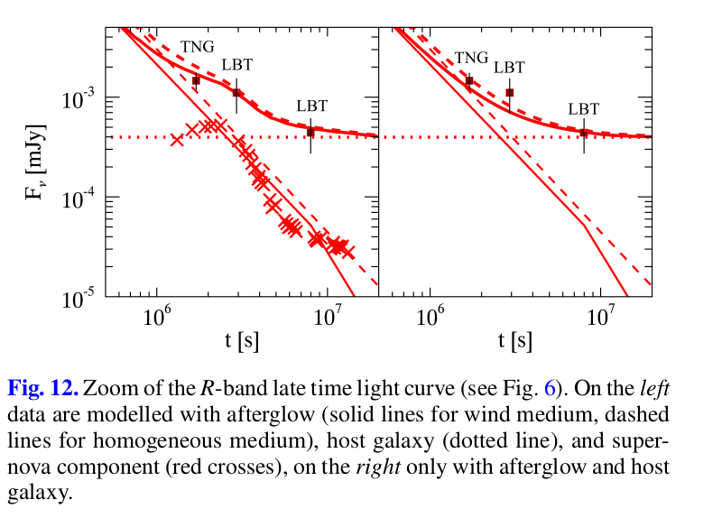

## 5.Conclusions
[Back](#menu)

---

### Flare in prompt emission:

GRB 151027A, is the first GRB with a bright flare starting∼100 s after the GRB trigger and lasting∼70 s, that has been simultaneously observed from the optical band up to the MeV γ-ray energy. 

The time resolved spectral analysis of this flare indicates the presence of a black-body component that provides up to 35% of the total luminosity in the 0.3–1000 keV band.

In this work we discussed the possible origin of this thermal radiation. Since the radius and the luminosity of the blackbody emission were too large to be interpreted as the photospheric emission of a standard fireball model, we explored a reborn fire-ball scenario in which the thermal radiation is produced by the energy dissipation due to the collision of a relativistic shell with a more massive, optically thick, slower one.

---

### Afterglow emission and CBM

Intensive follow up campaigns provided a well-sampled mul-tiwavelength afterglow light curve from X-rays to the radio band.

We interpreted the afterglow emission, where possible, in the standard forward shock scenario. We tested two CBM density profiles: the homogeneous (constant density, typical of the inter-stellar medium) and wind profile (withn $n(R) \propto R^{-2}$, typical of the medium surrounding a massive star in the final stages of its evolution). Since the X-ray light curve showed a plateau that cannot be explained by a standard afterglow behaviour, we needed to add a late prompt component.

Late time radio observations provide direct evidence of the better agreement of the data with the wind density profile model. In this case a jet break is observed, corresponding to a jet angle $θ_{jet}=6.3\degree$.

---

### SN and host galaxy

Late time optical observations highlighted the presence of abump in the light curve that can be interpreted as a supernova signature. The late flattening of the R-band light curve allowed us to estimate the host galaxy flux∼0.4μJy ($R_{AB}∼$25).