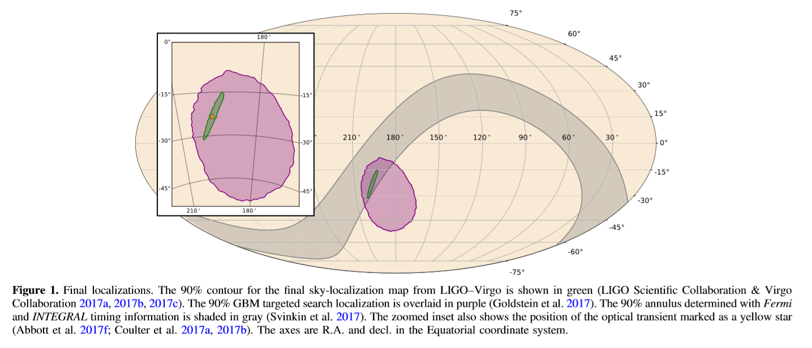
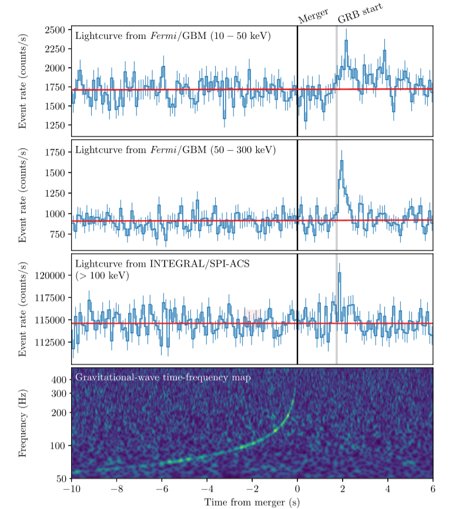
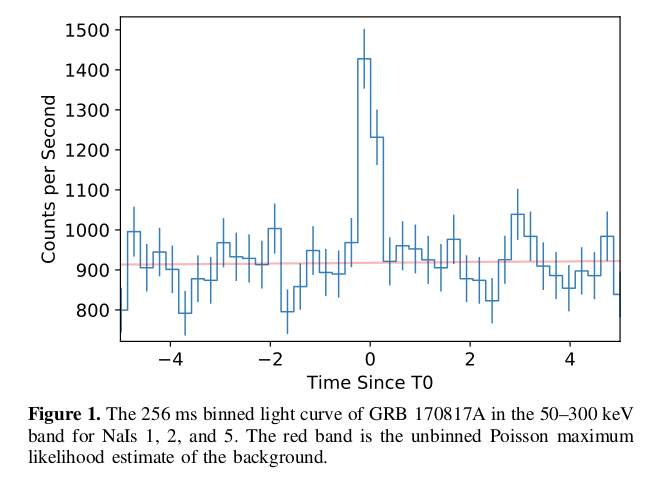
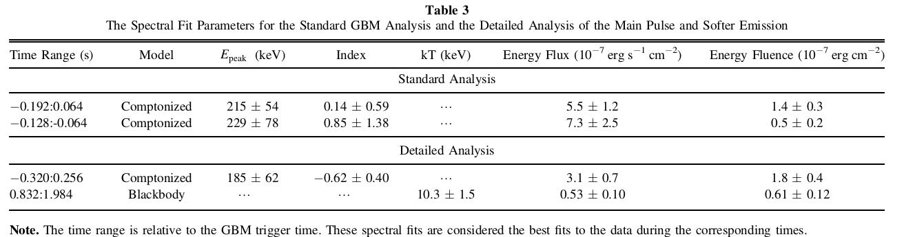
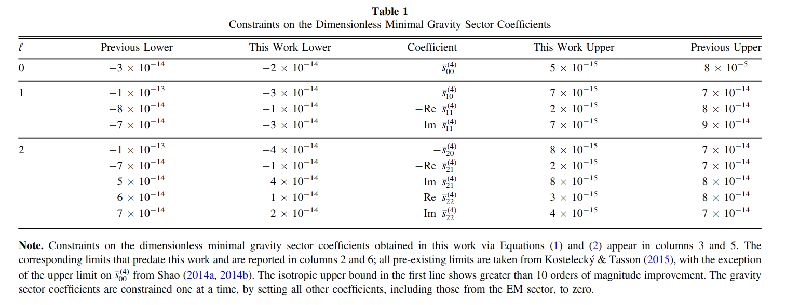
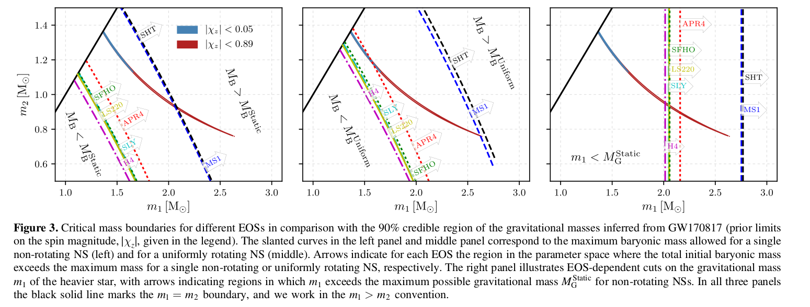
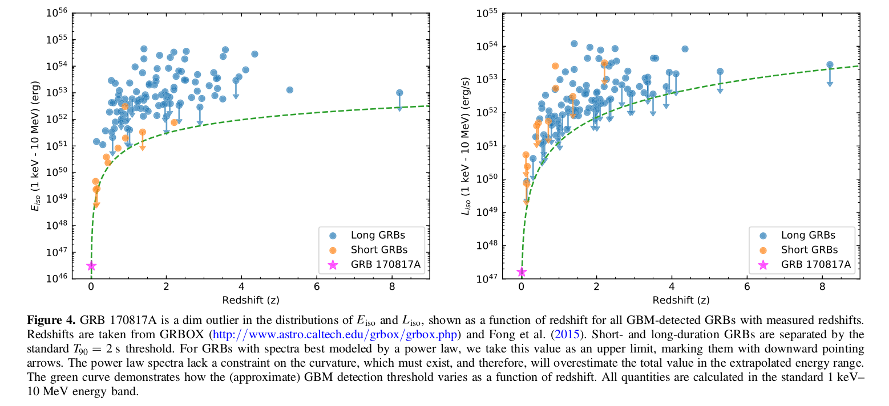
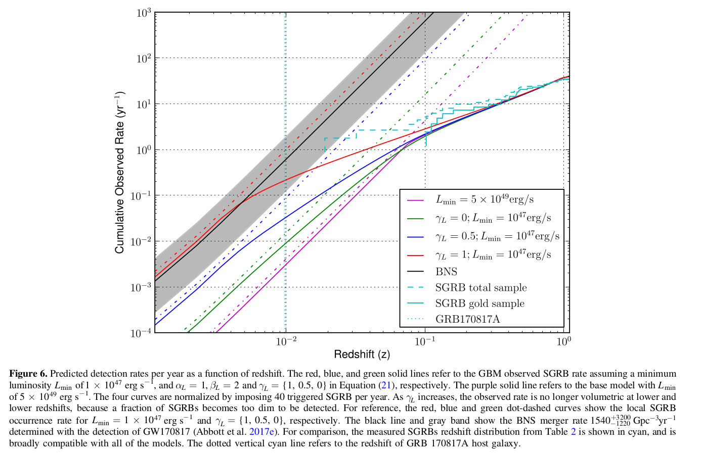

# Brief note of No.12

Conclusions:

- The joint event set a **stringent limits on fundamental physics** and **probed the central engine of SGRBs** in ways that have not been possible with EM data alone.

- Unambiguous association of GW170817 and GRB 170817A

- Explanations for the observed dimness of GRB170817A is proposed.

- Joint detection could be more common than previously predicted.

## What can we learn from the observations of GW170817/GRB 170817A

1. Introduction and Background
2. Observation Results
    - LIGO–Virgo Observation of GW170817
    - Fermi-GBM Observation of GRB 170817A
    - INTEGRAL SPI-ACS Observation of GRB 170817A

3. Unambiguous Association
4. Implications for Fundamental Physics
    - Speed of Gravity
    - Lorentz Invariance Violation Limits
    - Test of the Equivalence Principle

5. Astrophysics Implications
    - GRB physics
    - Neutron Star EOS Constraints

6. Gamma-ray Energetics of GRB 170817A and their Implications
    - Isotropic Luminosity and Energetics of GRB 170817A
    - Implications of the Dimness on the Central Engine
    - Observational Bias Against Low-luminosity GRBs
    - Predicted Detection Rates
    - Limits on Precursor and Extended Emission

## 1.Introduction and Background

- BNS（双中子星）与NS-BH（中子星-黑洞）是LIGO/Virgo主要的搜寻目标，因为这些事件很有可能是同时探测到引力波辐射和电磁辐射信号的共同起源。
- 而双中子星并合事件理论上会引发SGRB，产生瞬时伽玛辐射以及较长时标的余辉辐射。
- 到目前（170817）为止，BNS（或NS-BH）与SGRB之间的关联只有间接的观测证据能够证明，如短暴观测中超新星成分的缺失以及短暴余辉与宿主星系之间的偏离等。而这次的GW与SGRB的联合观测清晰地表明了BNS并合与SGRB之间存在关联。

## 2.Observational Results

详细的观测文章见references文件夹下的 Goldstein2017_GRB170817AObservation_GBM.pdf 与 probability of obtaining test Abott2017_GW170817Observation.pdf 两篇文章。

### 2.1 LIGO–Virgo Observation of GW17081

- 12:41:04 UTC LIGO首次探测到来自双中子星并合的引力波信号
- LIGO-Virgo的联合观测为该引力波信号确定了一个面积为28平方度的90%置信水平的天区范围（GBM给出的90％置信的范围大小约为1100平方度）。
- 该信号在致密星并合的全天搜寻中的错误率为1/80000年。

- 两次offline targeted search（？？？）结果的p值都很低（9.4 x 10e-6; 1.3 x 10e-5）,表明检验高度显著，拒绝原假设的理由充分（原假设是什么？）

- 假设双星质量分别为$m_1$和$m_2$,且$m_1 \geqslant m_2$：
    - 在‘high-spin prior’(dimensionless spins ~ 0.89)？？？条件下给出$m_1 \in (1.36, 2.26) M_{sun}$， $m_2 \in (0.86, 1.36) M_{sun}$ and total mass $2.82_{-0.09}^{+0.47} M_{sun}$
    - 在‘low-spin prior’(dimensionless spins $\leqslant$ 0.05)条件下给出$m_1 \in (1.36, 1.60) M_{sun}$， $m_2 \in (1.17, 1.36) M_{sun}$ and total mass is $2.74_{-0.01}^{+0.04} M_{sun}$
    - 这样的质量范围符合目前已知的双星系统(Ozel & Freire 2016; Tauris et al. 2017).
- GW的观测数据给出源的距离为$40_{-14}^{+8}$ Mpc，对宿主星系（NGC 4993）的距离测量给出$42.9 \pm 3.2$ Mpc，两者是相符的。
- 另外GW数据还限制了倾斜角$\theta_{JN}$(观测视线与系统总角动量的夹角，其大小的限制与距离有关)：cos$\theta_{JN} \leqslant -0.54$. 假设SGRB的喷流方向与总角动量方向相同，则$\theta_{JN}$也可以近似看作伽玛暴的喷流观测角$\zeta$：$\zeta \leqslant 56\degree$。如果考虑宿主星系的距离，则给出$\zeta \leqslant 36\degree or \  28\degree$（取决于不同的哈勃常数）。

### 2.2 Fermi-GBM Observation of GRB 170817A

- GBM的数据显示了两个间隔明显的辐射阶段：
    - 第一个峰持续大约半秒，符合短暴的持续时标
    - 第二个阶段相比更软且持续时间达数秒

- 12:41:06.474598 UTC 是GBM的trigger时间($T^{GBM}_0$)，若以GW信号接收时间作为$T_0$ ($T^{GW}_0$),则相对的伽玛射线辐射的开始时间为(+1.74　$\pm$  0.05)s。

- 主峰可以较好地用一个康普顿辐射模型拟合，而后面的‘尾巴’辐射则可以用黑体谱较好拟合：

- 由于并没有探测到“前兆辐射”（precursor eimssion），Goldstein给出了GRB 170817A的暴发前200s内的前兆辐射的流量上限：(6.8–7.3) × 10e−7 erg/s cm$^2$ (assuming 0.1s duration)and (2.0–2.1) × 10e−7 erg /s cm$^2$ (assuming 1.0 s duration)

### 2.3 INTEGRAL SPI-ACS Observation of GRB 170817A

- $T_0^{ACS} = T_0^{GW} +1.88 s$
- [-0.320s, +0.256s]时间间隔内得到的通量为(1.4 $\pm$ 0.4) x 10$^{-7}$ erg/cm$^2$(75–2000 keV)，与GBM的结果一致。
- 理论上SPI-ACS与GBM的信号到达时间的差异可以用来提高GRB的定为精度

## 3.Unambiguous Association

- 首先从时间上验证GW170817和GRB　170817A之间的相关性，方法是计算在引力波信号发生后的$\Delta t_{SGRB-GW}$时间内，有多大几率探测到一个不相关的短暴？这种情形发生的可能性可用p值来估计：

$$
P_{temporal} = 2\Delta t_{SGRB-GW} R_{GBM-SGRB} = 2 \times (1.74s) \times (351/3324days/0.85)=5.0 \times 10^{-6}
$$

- 其次从空间位置上验证两者之间的相关性，方法也是去估计两个不相关的事件恰好发生在同一片区域的概率，结果得到的p值估计为$P_{spatial} = 0.01$

- 将两者相乘，有$P_{temporal} \times P_{spatial} = (5.0 \times 10^{-6}) \times (0.01) = 5.0 \times 10^{-8}$，证明GW170817与GRB 170817A相互关联的理由是非常充分的。

## 4.Implications for Fundamental physics

第４节主要讨论我们可以利用$t_{delay}=(1.74 \pm 0.05)$ s对基本物理理论作出哪些限制。

### 4.1 Speed of Gravity

- 理论上引力波的传播速度应该与电磁波的传播速度相同，那么利用现在观测到的时间差，我们可以将两者的速度差限制到什么程度？
- 假设引力波与电磁波的传播速度不同，其差值为$\Delta v$，利用$\Delta v/v_{EM} \approx v_{EM} \Delta t/D$，选取适当的$\Delta t$上下限，并较保守地取$D=26$Mpc,可得：

$$
-3 \times 10^{-15} \leqslant \frac{\Delta v}{v_{EM}} \leqslant +7 \times 10^{-16}
$$

### 4.2 Lorentz Invariance Violation Limits

- 在普朗克尺度下，相对论和标准模型预期上应该可以合并为一个统一理论，而洛伦兹违反是这统一理论的一种体现（Alan Kostelecky,2003）。另一方面，洛伦兹违反可用有效场理论（effective field theory）去解释，在这个理论下，引力波和电磁波的速度差异可以用理论中引力部分和光子部分的参数不同表示。在质量维数（mass dimension）d=4下，该差异表示如下

$$
\delta v = - \sum_{lm,l\le2} Y_{lm}(\hat n)(\frac{1}{2}(-1)^{1+l} \overline S_{lm}^{(4)} - c_{(I)lm}^{(4)})
$$

- 表达式中包含球谐函数及相关系数。而现在我们有了速度差的估计范围，就可以反过来限制这些系数，进而限制洛伦兹违反的有关理论。

### 4.3 Test of the Equivalence Principle

- 验证等效原理的一种方法是去考察空间中引力场对经过的电磁辐射和引力波产生影响的方式是否是一样，这样的考察可以利用Shapiro effect来进行。Shapiro delay的简单形式为：

$$
\delta t_S = \frac{1+\gamma}{c^3}\int_{r_e}^{r_0} U(r(l))dl
$$

- 式子表示一个无质量粒子在相同起始点的条件下途经弯曲时空（有引力场）相比途径平直时空（无引力场）所需时间的增加量。$\gamma$在Einstein-Maxwell理论中对于EM和GW都为1，这里假设$\gamma_{EM}$和$\gamma_{GW}$不同，即可利用观测上两者的时间差来限制$\gamma_{EM}$ - $\gamma_{GW}$的大小，从而验证引力波和电磁波受引力场的影响是一样的。取合适的值和合理的假设进行计算后，得到：

$$
-2.6 \times 10^{-7} \le \gamma_{GW} - \gamma_{EM} \le 1.2 \times 10^{-6}
$$

## 5.Astrophysical Implications

第５节主要讨论这次事件对天体物理的理论有何影响，包括对引力波信号和电磁波信号间延迟时间的可能解释和对中子星状态方程的限制。

### 5.1 GRB Physics

- 从观测数据中可以看出，GRB 170817A的主峰就是一个单脉冲信号（single pulse），而没有什么次级结构，我们可以假设这一阶段的辐射是由内激波模型中两层先后喷出的抛射物的碰撞导致的，它们的“出发”时间分别为$t_{GW} = 0$（即引力波同时发出）和$t_{GW} = \Delta t_{engine}$，洛伦兹因子分别为$\gamma_{1}$和$\gamma_{２}$，则可算出碰撞时间，即伽玛射线发出的时间为：

$$
t_{delay} = \frac{\Delta t_{engine}}{1-(\gamma_{1}/\gamma_{2})^2}, \ \ if \gamma_{2}, \gamma_{2} >> 1.
$$

- 在这样的条件下，取延迟时间为1.74s,第一壳层的洛伦兹因子小于100, 经讨论和计算得则可得一个喷流到达半径的上限$R \sim 5 \times 10^{14}$ cm （用文中的公式计算相应的洛伦兹因子约为70）; 再令 $\Delta t_{rise} = \Delta t_{min} \sim 0.125$s，可得辐射区域厚度上限为$\delta R \sim 4 \times 10^{13}$ cm。两者之比约为10%。

- 另外也讨论了外激波模型，以及光球层光学厚度变化导致延迟的可能性，结果也都只能作为估计。

### 5.2 Neutron Star EOS Constraints

- 此次并合事件的并合产物既可能是一个黑洞，也可能是一个新快速旋转并高度磁化的中子星（毫秒磁星）
- 这里考虑了７种具代表性的状态方程（SLy、LS220、SFHo、H4、APR4、SHT、MS1），讨论观测测量的双星质量在不同的并合情况下能够对这些状态方程作出何种限制。
- 对于每一种状态方程，都可计算其各自允许的中子星稳定质量的上限：
    - $M_B^{Static}$：非旋转（静止）的最大重子质量（baryonic mass）
    - $M_G^{Static}$：非旋转（静止）的最大引力质量（gravitational mass）
    - $M_B^{Uniform}$：均匀旋转的最大重子质量
- 如果忽略旋转的影响，则中子星的重子质量（$m_{b1}, m_{b2}$）只取决于自己的引力质量（$m_1, m_2$），那么在($m_1$, $m_2$)的参数空间中，一个固定的系统初始总重子质量就表现为一条曲线。

- 上图分别展现了不同状态方程在参数空间中对初始总重子质量相比$M_B^{Static}$（左）、 $M_B^{Uniform}$（中）具有不同大小关系的区域的划分，以及不同状态方程对应的$M_G^{Static}$（右），以及由GW信号得到的两颗星引力质量的90%置信范围。
- 由于物质喷射，初始双星的质量一定要比并合产物的质量高，因此，若考虑第一种情形（形成黑洞），对于一个准确的EOS，测量到的系统质量应该位于其划定的$M_B$ > $M_B^{Static}$或$M_B^{Uniform}$的区域里才可能形成黑洞。由图可见，MS1和SHT描述的情形不大可能形成一个黑洞，而对于H4, LS220, SFHo和SLy这些状态方程，在两类spin priors下均有$M_B$ > $M_B^{Uniform}$，并合结果要么是形成一个黑洞要么形成一个寿命（由较差旋转和/或吸积决定）不长的残骸。
- 如果要兼容第二中情形（形成中子星），考虑到目前的理论本身存在误差范围（error margin），暂时也无法排除H4, LS220, SFHo和SLy中的哪一个。

## 6.Gamma-ray Energetics of GRB 170817A and their Implications

鉴于GRB 170817A 相对其它红移已知的SGRB来说亮度较低，在第６节讨论了一下内容：

- 是否是GW-GRB联合观测的偏差（expected observational bias）导致观测亮度较低；
- 对于理解伽玛射线发射区域的几何形态有何帮助;
- 对短暴家族的研究有何帮助；
- 联合观测的探测概率的估计；
- 伽玛射线的前兆（precursor）和后延（extended）辐射的限制。

### 6.1 Isotropic Luminousity and Energetics of GRB 170817A

- 在１keV - 10 MeV的能段下，按照标准GBM的光谱分析流程的结果（standard manner for GBM spectral catalog results），我们估计伽玛射线释放的各向同性能量为$E_{iso} = (3.1 + 0.7) \times 10^{46}$ erg，光度峰值为(1.6 $\pm$ 0.6) x 10$^{47}$ erg s$^{−1}$
- 如果对两个阶段的辐射分开做光谱拟合，则第一阶段的能量为$E_{iso,comp} = (4.0 \pm 1.0) \times 10^{46}$ erg，　第二阶段的能量为$E_{iso,BB} = (1.3 \pm 0.3) \times 10^{46}$ erg。
- 下图显示了GBM探测到的红移已知的GRB的能量和光度分布，可看出GRB 170817A是迄今红移最小，亮度最弱的GRB，提供了一个短暴各向同性能量下限的参考。

### 6.2 Implications of the Dimness on the Central Engine

GRB的能量/亮度既受中心引擎状态等内秉因素的影响，也与我们观测的视线与GRB喷流方向间的夹角以及一些几何因素有关。以下讨论四种理论解释为何GRB170817A这么暗：
>
    - 我们观测它的视线与其喷流方向间的夹角大于喷流的半张角（基于标准的“高帽”top-hat模型讨论）；
    - 喷流的结构比简单的“高帽”模型复杂；
    - 观测到的GRB170817A的辐射相对于其他SGRＢ而言可能由不同的机制产生；
    - 仅与内秉光度分布相关，而与系统的几何结构不相关。

---

- 第一种情形，视线不在喷流张角的范围内，在高帽喷模型中，偏轴GRB的观测能量会显著低于正轴观测，两种情况下一些对应的物理量相差一个洛伦兹因子：

$$
\delta_D(\theta) = [\Gamma(1 - \beta cos\theta)^{-1}] \approx / (1+\theta^2\Gamma^2)
$$

$$
\frac{T_{90}(off-axis)}{T_{90}(on-axis)} = \frac{E_p (on - axis)}{E_p (off - axis)} = \frac{\delta_D(0)}{\delta_D(\theta_j - \zeta)} \triangleq b \approx 1 + \Gamma^2(\zeta - \theta_j)^2
$$

>其中若$\zeta$在$\theta$和2$\theta_j$之间，则$E_{\gamma,iso}(off-axis)$大约与$b^{-2}$成正比。

- 这里基于观测数据，取$E_p \approx 200$ keV, $E_{\gamma,iso} = 5.3 \times 10^{46}$ erg，以及 $T_{90} \approx 2$ s。如果在上面$E_{\gamma,iso}$分布中取合适的值作为GRB 170817A的正轴对应量（大两个量级左右），则可给出b的近似取值$b \approx \Gamma^2 (\zeta - \theta_j)^2 \approx 30$, 这可作为对$\Gamma$, $\zeta$和$\theta_j$的限制。

- 如果取$\zeta \approx 30\degree$、 $\Gamma = 300$，则上面对b的估计值给出$\zeta - \theta_j \backsimeq 1 \pm 0.5$ deg，这仅仅对应1%的天区范围($1sr = (\frac{180}{\pi})^2 degrees$,全天约13131平方度)。这意味着我们观测者的视线必须精确地落在这里面（require a fine tuning）。
- 而如果取$\Gamma = 30$，则有$\zeta - \theta_j \backsimeq 10 \pm 4$ deg，这对应10%的天区，相较而言对观测视线的限制要求要宽松一些。
- 综合看，如果洛伦兹因子比较大，就不适合用高帽喷流的模型去解释。

---

- 第二种情形：喷流的结构较为复杂，可能允许观察者在更大范围的观测角内都可观测到辐射。这种结构性喷流由中间的极端相对论的核加上周围的指数衰减（power law decay）的‘翼’组成，‘翼’部分的能量和洛伦兹因子由距离喷流中轴的距离决定。
- 对于GRB170817A这样看上去较弱的暴，可能是因为我们接受到的辐射的来源在整个喷流中就处于比较暗弱的区域，距离明亮的区域比较远。

---

- 第三种情形：有可能我们观测到的辐射与传统短暴的辐射机制不大一样。比较可能的情形是，第一阶段辐射主要来自“高帽”喷流的偏轴观测，而第二阶段的辐射则来自于“茧”结构发出的黑体辐射（相对论喷流冲进周围非相对论介质形成的茧状结构）。
- 值得一提的是，“茧”发出的辐射都相对较弱，如果发生得远一点我们就无法探测到了，这可能说明很多SGRB实际上也有这样的较弱的尾巴而没被探测到。

---

- 第四种情形：也有可能GRB170817A就是在其喷流的正轴上被我们观测到，它暗弱的亮度就是其内秉亮度，这就是说“高帽”喷流的亮度分布横跨6个量级。而就现在对双中子星系统的质量限制来看，这种情况可能不太现实。
- 当然也可能有一些其它的因素导致了如此跨度的亮度分布，比如磁场强度等

---

### 6.3 Observational Bias Against Low-luminosity GRBs

GRB 170817A的亮度比红移已知的短暴的亮度低数个量级的事实实际上提出了这样一个问题：鉴于目前只探测到了这么一例亮度很低且距离很近的SGRB，那它到底是属于一个特例，还是说的确有一类SGRB,它们的亮度和距离与GRB 170817A类似，只是我们没有探测到？还是说的确有内秉亮度较低的SGRB无论在近距离还是远距离都有发生？

这里实际上涉及到两个因素：现有仪器的探测灵敏度问题以及我们对探测到的SGRB的距离（红移）确定问题。

- 首先，在现有的观测条件下，我们只能观测到距离较近的暗SGRB。
- 其次，现有的宿主星系的确认方法可能不是非常准确，导致一部分SGRB的红移确定出错。
    - 如果仅靠对电磁对应体的观测去确定SGRB的红移，比LGRB要困难的多。通常都是去测量短暴的宿主星系的红移来确定SGRB的红移。这需要我们能够确定SGRB余辉与一个宿主星系是关联的，但这也不是很容易，因为有时候探测到的SGRB的位置在其可能的宿主星系之外（可能由于形成致密星的超新星暴发导致SGRB的前身双星系统被‘推离’其宿主星系），所以只能通过估计其周围较近邻星系是宿主星系的概率来确定宿主星系，进而测定红移。
    - 对于一些没有明显近邻的可能宿主星系的SGRB，有可能它们的宿主星系处在一个离它们更远的位置（几个角分），或是其宿主星系实际更远导致无法探测到。如果是前一种情况，即余辉位置和宿主星系之间的距离可以更远，那对于按照以往仅基于角距离判断的做法给一些SGRB确定的宿主星系也许并非其真实的宿主星系。这种情况可能在近距离事件中出现可能性较大。
- 为什么我们没有探测到更多像GRB170817A这样近的SGRB？实际上我们有上百个没有测出红移的GRB，而在这些没有测出红移的SGRB中，可能就有像GRB170817A这样的近邻且次亮的SGRB。其次对于弱SGRB而言，跟踪观测的优先级较低，以至于没有足够数据去计算其距离。
- 如果加强亚阈值探测，或许可以发现更多与GW成协的短暴。

### 6.4 Predicted Detection Rates

这一小节主要运用不同光度函数模型讨论GW-SGRB的联合观测率。

- 假设SGRB的内秉光度分布与距离没有明显的关系，我们首先采用一个简单的分段幂律函数作为SGRB的光度函数(Wanderman & Piran 2015)：

$$
\phi_0(L_{iso}) =
\begin{cases}
(\frac{L_{iso}}{L_b})^{-\alpha_L} &L_{iso}  < L_b \ ,\\
(\frac{L_{iso}}{L_b})^{-\beta_L} &L_{iso}  >L_b \ .
\end{cases}
$$

>其中$L_{iso}$为1keV - 10MeV内的各向同性光度峰值，$L_b$为分段点。另外还有一个重要参数$L_{min}$，即最小截断光度。

- 令$L_b \simeq 2 \times 10^{52}$ erg/s, $L_{min} = 5 \times 10^{49}$ erg/s， $\alpha_L \simeq 1$, $\beta_L \simeq 2$ (Wanderman & Piran 2015)，再取合适的GBM探测阈值以及合适的Band谱作为短暴的光谱模型，得出的GBM的累计探测率如下图中的紫色实线所示

- 考虑到GRB170817A的$L_{iso} = (1.6 \pm 0.6) \times 10^{47}$ erg/s(6.1节), 显著低于其它探测到的SGRB，所以取$L_{min} = 1 \times 10^{47}$ erg/s，这样修改后得出的结果为红率色。
- 红色所示SGRB探测率较接近于黑线表示的BNS并合的发生率，这表示所有的BNS并合都会至少伴随一个亚亮（subluminous）的SGRB，看起来并不是很合理（也不大符合观测）。

- 因此可适当对模型再进行修改，额外引入一段$L_{bb} = 5 \times 10^{49}$ erg/s（Wanderman&Piran工作中的$L_{min}$） 时的幂律：

$$
\phi_0(L_{iso}) =
\begin{cases}
(\frac{L_{iso}}{L_{bb}})^{-\gamma_L} (\frac{L_{bb}}{L_b})^{-\alpha_L} &L_{iso}  < L_{bb} \ ,\\
(\frac{L_{iso}}{L_b})^{-\alpha_L} & L_{bb} < L_{iso} < L_b \ ,\\
(\frac{L_{iso}}{L_b})^{-\beta_L} &L_{iso}  > L_b \ .
\end{cases}
$$

- 分别取$\gamma_L$ = {1, 0.5, 0}（取1即为上面第一次修改的模型，红线），结果分别为红、蓝、绿线代表的探测率。作为对比也分别加入了对应模型下的近邻SGRB的发生率（对应颜色的虚线）。在z=0.005的时候，红线比较急促地偏离了虚线（偏离是由GBM灵敏度的限制所致）；而对于$\gamma_L$取0对应的绿线，这种偏离发生的就比较平滑（暗暴较少）。
- 就给出的结果来看，对于z=0.01以内的SGRB，$\gamma_L$ = {1, 0.5, 0}分别给出的探测概率为1年一个，10年一个，65年一个。

>对比后面附的表２来看，如果考察z=0.03以内的事件探测数量，则$\gamma_L$取0.5和0对应的模型还比较符合实际。

- 另外，对于BNS的探测率， 参考GW170817这次事件，Abbott et al.(2017a)估计如果在预期设计的探测灵敏度下，一年可探测6-120个。而保守估计是1-50个。（O3里大致数了一下，有7个可能是BNS，BH-NS 5个，BBH则约30个）

- 结合SGRB的探测率来看，在预期条件下18-19年的GW-SGRB联合探测率估计为0.3-1.7个/年。

- 未来更多的GW-SGRB的联合观测将帮助我们更好地理解低亮度SGRB,对于仅有GW信号而没有SGRB观测的事件有助于我们对SGRB的喷流张角作出限制，以及加强GW观测时的GRB亚阈值搜寻也有助于增加联合观测的样本数量。

### 6.5 Limits on Precursor and Extended Emission

- 根据Goldstein等(2017)的工作，可以估计在这次短暴中的前兆以及后延辐射的光度上限：
    - 0.1s时标前兆辐射内秉上限为$\sim 2.4 \times 10^{47}$ erg/s；
    - 1.0s时标前兆辐射内秉上限为$\sim 7.0 \times 10^{46}$ erg/s；
    - 10s时标后延辐射内秉上限为$\sim 2.2 \times 10^{46}$ erg/s。

- 有理论(e.g., Hansen & Lyutikov2001; Metzger &Zivancev2016)认为两中子星在并合前，它们磁层间的相互作用有可能是放出近似各向同性的辐射。如果GRB 170817A中没有观测到前兆辐射就显示，至少在并合前200s内没有高强度的磁场。根据Hansen & Lyutikov的理论结合上面的光度上限，可估计GRB 170817A的磁场上限为$8 \times 10^{13}$ G,的确比大部分已知的磁星要低

- Tsang等2012年提出中子星外壳的‘共振破碎’(resonant shattering)也有可能使得双星在并合之前发出辐射，这种辐射可能最大会在正式暴发前的几十秒发生。但共振破碎理论也需要一个足够强的磁场支撑，所以，缺乏一个强磁场在同样也可以用来解释没有观测到GRB　170817A的前兆辐射。

- 关于后延辐射，理论认为这可能是由并合后形成的可长时间存在中子星残骸来驱动的，而GRB170817A没有观测到这样的后延辐射，或许可以显示并合的产物是一个黑洞。
- 有其它理论认为如果并合产物是一个毫秒磁星，也可以用来解释带有后延辐射的短暴，而毫秒磁星可能会导致一些SGRB出现X射线的余辉平台。但对于GRB 170817A，最早的X射线观测是在50ks后开始的，所以顶多这能用那之后的数据对模型作出一些限制。
