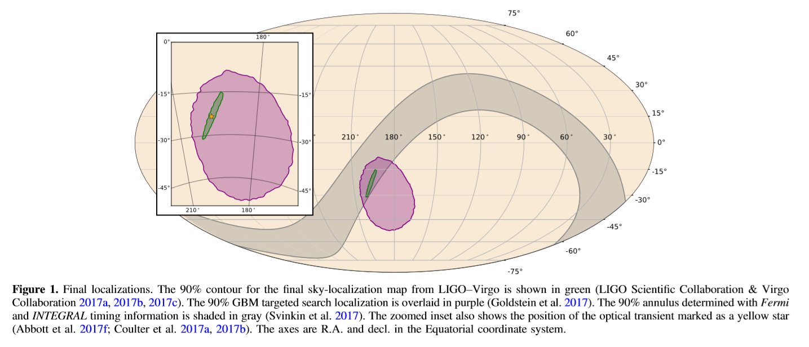
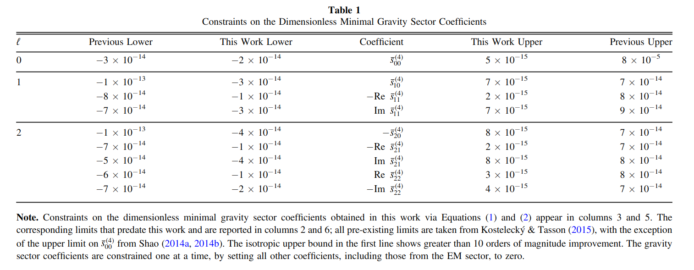
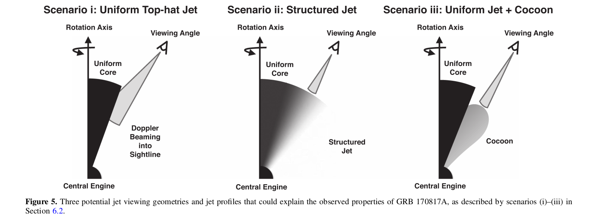

# Gravitational Waves and Gamma-Rays from a Binary Neutron Star Merger: GW170817 and GRB 170817A

Author: LIGO Scientific Collaboration and Virgo Collaboration, Fermi Gamma-ray Burst Monitor, and INTEGRAL

[Abstract](#abstract)
[1.Introduction and Background](#sect1)
[2.Observational Results](#sect2)
&emsp;[2.1 LIGO-VIRGO Observation of GW170817](#sect2.1)
&emsp;[2.2 Fermi-GBM Observation of GRB 170817A](#sect2.2)
&emsp;[2.3 INTEGRAL SPI-ACS Observation of GRB 170817A](#sect2.3)
[3.Unambiguous Assocition](#sect3)
[4.Implications for Fundamental Physics](#sect4)
&emsp;[4.1 Speed of Gravity](#sect4.1)
&emsp;[4.2 Lorentz Invariance Violation Limits](#sect4.2)
&emsp;[4.3 Test of the Equivalence Principle](#sect4.3)
[5.Astrophysics Implications](#sect5)
&emsp;[5.1 GRB physics](#sect5.1)
&emsp;[5.2 Neutron Star EOS Constraints](#sect5.2)
[6. Gamma-ray Energetics of GRB 170817A and their Implications](#sect6)
&emsp;[6.1 Isotropic Luminosity and Energetics of GRB 170817A](#sect6.1)
&emsp;[6.2 Implications of the Dimness on the Central Engine](#sect6.2)
&emsp;[6.3  Observational Bias Against Low-luminosity GRBs](#sect6.3)
&emsp;[6.4 Predicted Detection Rates](#sect6.4)
&emsp;[6.5 Limits on Precursor and Extended Emission](#sect6.5)
[7.Conclusion](#sect7)

## Abstract

On 2017 August 17, the gravitational-wave event GW170817 was observed by the Advanced LIGO and Virgo detectors, and the gamma-ray burst(GRB)GRB 170817A was observed independently by the Fermi Gamma-ray Burst Monitor, and the Anti-Coincidence Shield for the Spectrometer for the International Gamma-Ray Astrophysics Laboratory.

The probability of the near-simultaneous temporal and spatial observation of GRB 170817A and GW170817 occurring by chance is 5.0 x 10e-8. We therefore confirm binary neutron star mergers as a progenitor of short GRBs. The association of GW170817 and GRB 170817A provides new insight into fundamental physics and the origin of short GRBs.

We use the observed time delay of (+1.74 ± 0.05)s between GRB 170817A and GW170817 to:(i) constrain the difference between the speed of gravity and the speed of light to be between -3 x 10e-15 and +7 x 10e-16 times the speed of light,(ii) place new bounds on the violation of Lorentz invariance,(iii) present a new test of the equivalence principle by constraining the Shapiro delay between gravitational and electromagnetic radiation. We also use the time delay to constrain the size and bulk Lorentz factor of the region emitting the gamma-rays.

GRB 170817A is the closest short GRB with a known distance, but is between 2 and 6 orders of magnitude less energetic than other bursts with measured redshift. A new generation of gamma-ray detectors,and subthreshold searches in existing detectors, will be essential to detect similar short bursts at greater distances.

Finally, we predict a joint detection rate for the Fermi Gamma-ray Burst Monitor and the Advanced LIGO and Virgo detectors of 0.1–1.4 per year during the 2018–2019 observing run and 0.3–1.7 per year at design sensitivity.

>1.Detections: GW170817 by LIGO/VIRGO and GRB 170817A by GBM and INTEGRAL/SPI-ACS, independently. 2.GRB 170817A is basically sure to be associated with GW170817, which could verify the neutron star mergers origin of short GRBs. 3.The time delay of GRB 170817A and GW170817 are used to: a) constrain the difference between the spped of gravity and that of light, b) place new bounds on the violation of Lorentz invariance, c) test the equivalence principle somehow using Shapiro delay, d) constrain the size and bulk Lorentz factor of the gamma-rays emitting region. 4. GRB 170817A is less energetic in spite of the close distance. 5.Prediction of joint detection rate for GBM and LIGO/VIRGO.

## 1. Introduction and Background

[Back](#menu)

GW170817 and GRB 170817A mark the discovery of a binary neutron star (BNS) merger detected both as a gravitational wave (GW; LIGO Scientific Collaboration & Virgo Collaboration 2017a) and a short-duration gamma-ray burst (SGRB; Goldstein et al. 2017; Savchenko et al. 2017b). Detecting GW radiation from the coalescence of BNS and neutron star (NS)– black hole (BH) binary systems has been a major goal (Abbott et al. 2017a) of the LIGO (Aasi et al. 2015) and Virgo (Acernese et al. 2015) experiments. This was at least partly motivated by their promise of being the most likely sources of simultaneously detectable GW and electromagnetic (EM) radiation from the same source. This is important as joint detections enable a wealth of science unavailable from either messenger alone (Abbott et al. 2017f). BNS mergers are predicted to yield signatures across the EM spectrum, including SGRBs, which produce prompt emission in gamma-rays and longer-lived afterglows.
>1.BNS and NS-BH are major goals of LIGO/VIRGO for being the most likely sources of simultaneously detectable GW and EM radiation from the same srouce. 2.BNS could yield signatures across the EM spectrum, including SGRBs.

A major astrophysical implication of a joint detection of an SGRB and of GWs from a BNS merger is the confirmation that these binaries are indeed the progenitors of at least some SGRBs. GRBs are classified as short or long depending on the duration of their prompt gamma-ray emission. This cut is based on spectral differences in gamma-rays and the bimodality of the observed distribution of these durations. This empirical division was accompanied by hypotheses that the two classes have different progenitors. Long GRBs have been firmly connected to the collapse of massive stars through the detection of associated Type Ibc core-collapse supernovae. Prior to the results reported here, support for the connection between SGRBs and mergers of BNSs (or NS–BH binaries) came only from indirect observational evidence(Nakar 2007; Berger et al.2013; Tanvir et al.2013; Berger 2014), population synthesis studies (Bloom et al. 1999; Fryer et al. 1999; Belczynski et al.2006), and numerical simulations (e.g., Aloy et al. 2005; Rezzolla et al. 2011; Kiuchi et al. 2015; Baiotti & Rezzolla 2017; Kawamura et al. 2016; Ruiz et al. 2016). The unambiguous joint detection of GW and EM radiation from the same event confirms that BNS mergers are progenitors of (at least some) SGRBs.
>Hitherto, the connection between SGRBs and BNS(or NS-BH) mergers was only supported indirectly by observational evidence and numerical simulations. This joint detection confirmed the connection.

In Section 2 we describe the independent observations of GW170817 by the LIGO–Virgo and of GRB 170817A by the Fermi Gamma-ray Burst Monitor (GBM) and by the SPectrometer on board INTEGRAL Anti-Coincidence Shield (SPIACS). In Section 3 we establish the firm association between GW170817 and GRB 170817A. In Section 4 we explore the constraints on fundamental physics that can be obtained from the time separation between the GW and EM signals. In Section 5 we explore the implications of the joint detection of GW170817 and GRB 170817A on the SGRB engine and the NS equation of state (EOS). In Section 6 we explore the implications of the comparative dimness of GRB 170817A relative to the known SGRB population and revise the expectation rates for joint BNS–SGRB detections in the light of this discovery.

|Sect|content|
|---|---|
|Sect.2|independent observations of GW170817 and GRB 170817A|
|Sect.3|establish the firm association between GW170817 and GRB 170817A|
|Sect.4|constraints on fundamental physics from the time separation|
|Sect.5|implications on the SGRB engine and the NS equation of state (EOS)|
|Sect.6|implications of the comparative dimness of GRB 170817A and the expectation rates for joint BNS–SGRB detections|
|sect.7|conclusion|

## 2. Observational Results

The observations of GW170817 and of GRB 170817A are described in detail in Abbott et al. (2017e), Goldstein et al. (2017), and Savchenko et al. (2017b). Here we summarize the observations relevant to the results presented in this Letter and report the results of two fully coherent searches for GWs from the sky location of GRB 170817A. For convenience, all measurements of time have been converted to their geocentric equivalent.
>In here we just summarize the observations relevant to our results. All the time measurments here have been converted to geocentric equivalent, in order to adapt the GW signal arrival time.

### 2.1 LIGO–Virgo Observation of GW17081

GW170817 is a GW signal from the inspiral of two low-mass compact objects and is the first GW observation consistent with a BNS coalescence. GW170817 was first observed by a low-latency search on 2017 August 17 at 12:41:04 UTC as a single-detector trigger in the LIGO-Hanford detector. The temporal proximity of GRB 170817A was immediately identified by automatic comparison of the Fermi-GBM Gamma-ray Coordinates Network notice to the GW trigger. Rapid offline re-analysis of data from the LIGO/Virgo network confirmed the presence of a significant coincident signal in the LIGO GW detectors with a combined signal-to-noise ratio (S/N) of 32.4. The combination of observations from the LIGO and Virgo detectors allowed a precise sky position localization to an area of 28 deg^2 at 90% probability shown in green in Figure 1. A time-frequency representation of the LIGO data containing GW170817 is shown in the bottom panel of Figure 2. The GPS time of the merger of GW170817 is $T_0^{GW} = 1187008882.430_{-0.002}^{+0.002}s$. At the observed signal strength,the false alarm rate of the all-sky search for compact-object mergers is **less than 1 in 80,000 years**. The offline searches target binaries with (detector frame) total mass 2–500 $M_{sun}$. Signals are required to be coincident in time and mass in the LIGO detectors, but Virgo data are not used in the significance estimates of the all-sky offline search.
>1.Localization from LIGO and VIRGO: area of 28 deg$^2$ at 90% probability 2.False alarm rate: less than 1 in 80,000 years.

We present the results of two offline targeted searches that coherently combine the data from the LIGO and Virgo detectors, and restrict the signal offset time and sky-location using information from the EM observation of GRB 170817A. The onset of gamma-ray emission from a BNS merger progenitor is predicted to be within a few seconds after the merger, given that the central engine is expected to form within a few seconds and that the jet propagation delays are at most of the order of the SGRB duration. The gravitational and EM waves are expected to travel at the same speed. 
>What are the targeted searches used for??? We restict the signal offset time and sky-location using information from the EM observation of GRB 170817A.

The first targeted search assumes that the source is a BNS or NS–BH binary merger and is located at the sky-position observed for the optical counterpart to GW170817 and GRB 170817A and that there is a [-1, +5] s time delay in the arrival of gamma-rays (determined by the GBM trigger time) compared to the binary merger time. At the detection statistic value assigned to GW170817, this search has a p-value of < 9.4 x 10e-6(>4.2$\sigma$), with this significance estimate limited by computational resources used to estimate the noise background. The second coherent search does not assume any particular GW morphology or GRB model and uses the GBM localization of GRB 170817A to constrain the sky location of the source. This search allows for a [-60, +600] s coincidence between the gamma-rays and the GWs in order to include potentially larger delays in collapsar models of long GRBs. At the detection-statistic value observed for GW170817, this search has a p-value of 1.3 x 10e-5(4.2$\sigma$).
>Informations and results of these two targeted searches: 1.the p-value of the first search is of < 9.4 x 10e-6(>4.2$\sigma$), assuming a time delay of [-1, +5] s and a BNS or NS-BH source. 2.the p-value of the second search is of < 1.3 x 10e-5(4.2$\sigma$), assuming no particular source type and allowing a [-60, +600] s time delay.

The 90% credible intervals for the component masses (in the $m_1 \ge m_2$ convention) are $m_1 \in (1.36, 2.26) M_{sun}$ and $m_2 \in (0.86, 1.36) M_{sun}$ , with total mass $2.82_{-0.09}^{+0.47} M_{sun}$, when considering dimensionless spins with magnitudes up to 0.89 (high-spin prior, hereafter). When the dimensionless spin prior is restricted to $\le$0.05  (low-spin prior, hereafter), the measured component masses are $m_1 \in (1.36, 1.60) M_{sun}$ and $m_2 \in (1.17, 1.36) M_{sun}$, and the total mass is $2.74_{-0.01}^{+0.04} M_{sun}$. This result is consistent with the masses of all known BNS systems. From the GW signal, the best measured combination of the masses is the chirp mass $M = (m_1m_2)^{3/5}/(m_1+m_2)^{1/5}$, which in the detector frame is found to be $1.977_{-0.0003}^{+0.0008} M_{sun}$.
>a) With dimentionlss spins up to 0.89, $m_1 \in (1.36, 2.26) M_{sun}$ and $m_2 \in (0.86, 1.36) M_{sun}$ and total mass $2.82_{-0.09}^{+0.47} M_{sun}$. b) With a low dimentionlss spin of less than 0.05, $m_1 \in (1.36, 1.60) M_{sun}$ and $m_2 \in (1.17, 1.36) M_{sun}$ and total mass is $2.74_{-0.01}^{+0.04} M_{sun}$. This result is consistent with the masses of all known BNS systems. dimentionless spin (prior) ???

The detection of GW170817 triggered a campaign of EM follow-up observations which led to the identification of NGC 4993 as the host galaxy of GW170817/GRB 170817A. We evaluate the distance to the host galaxy from the ratio of the Hubble flow velocity of the host $3017 \pm 166 km s^{-1}$ and two current measurements of the Hubble constant. These two distance measures are within a combined range of $42.9 \pm 3.2$ Mpc, which is consistent with the distance of $40_{-14}^{+8}$ Mpc determined with GW data alone and makes GW170817 the closest GW event ever observed.
> From the ratio of the Hubble flow velocity of the host galaxy (identified by the follow-up observations) and the current measurements of the Hubble constant, the distance to the host galaxy is evaluated to be $42.9 \pm 3.2$ Mpc, consistent with the $40_{-14}^{+8}$ Mpc determined with GW data alone.

The GW data constrain the inclination angle $\Theta_{JN}$ between the total angular momentum of the system and the line of sight to be anti-aligned, with cos$\Theta_{JN} \le -0.54$. As the binary system component masses are comparable, the NS spins have little impact on the total angular momentum which is aligned with the orbital angular momentum within a few degrees. For discussions in this Letter we will assume that the orbital and total angular momenta are aligned. The SGRB jet is expected to be perpendicular to the accretion disk of the central engine if powered by neutrino annihilation or aligned with the magnetic pole of the rotating central object, hence we assume the SGRB jet is aligned with the system rotation axis. This yields a jet viewing angle $\zeta = min(\Theta_{JN}, 180\degree - \Theta_{JN}) \le 56\degree$. As the distance measurement is correlated with $\Theta_{JN}$ , the known distance to NGC 4993 further constrains the viewing angle to $\zeta \le 36\degree$ or $\zeta \le 28\degree$ depending on the assumed value of the Hubble constant, with smaller values of the Hubble constant giving smaller misalignment angles.
>1.The inclination angle $\Theta_{JN}$ is constrained as cos$\Theta_{JN} \le -0.54$. 2.It is assumed that the orbital and total angular momenta are aligned since the component masses are comparable. 3.The SGRB jet is assumed to be aligned with the system rotation axis. 4.Thus the jet viewing angle can be constrained with the known distance: $\zeta \le 36\degree$ or $\zeta \le 28\degree$ depending on the Hubble constant.

### 2.2 Fermi-GBM Observation of GRB 170817A

GRB 170817A was autonomously detected in-orbit by the GBM flight software in a process known as “triggering.” Goldstein et al. (2017) showed the signal exceeds 5σ in three (of twelve) GBM NaI detectors. The GBM detection showed two apparently distinct components. The triggering pulse, that lasts about half a second and falls within the usual observer distributions for GBM SGRBs, is shorter and spectrally harder than the subsequent softer, weaker emission that lasts a few seconds. Summed GBM lightcurves from the relevant detectors in two energy ranges, selected to show the two distinct components, are shown in the top two panels in Figure 2. The GBM time-tagged event data is binned to match the SPI-ACS temporal resolution (100 ms) and phase (matching bin edges) to allow for an easier comparison between the gamma-ray instruments.
>The GBM detection showed two apparently distinct components: triggering pulse of half a second followed by a softer emission of a few seconds.

Goldstein et al. quantify the likelihood of GRB 170817A being an SGRB based only on gamma-ray data. This is done by comparing the measured gamma-ray properties of GRB 170817A to the known distributions of short and long GRBs. Both the duration distribution alone and the duration and spectral hardness distributions together show that GRB 170817A is three times more likely to be an SGRB than a long GRB. These analyses are performed in a standard manner, resulting in a longer duration measure than apparent from the hard spike alone because the softer, weaker tail contributes to the calculated duration.
>Goldstein confirmed the likelihood of GRB 170817A as being an SGRBs based on gamma-ray data by considering the known distributions of short and long GRBs.

The final GBM localization of GRB 170817A (including
systematic error) calculated by the GBM targeted search
pipeline is shown in Figure 1. This pipeline performs a
coherent search over all GBM detectors (NaI and BGO) and was originally developed to find gamma-ray signals below the onboard triggering threshold around GW triggers. The 50% and 90% credible regions cover ∼350 deg^2 and ∼1100 deg^2, respectively.
>The final GBM localization of GRB 170817A: ∼350 deg^2 for 50% credible regions and ~1100 deg^2 for 90% credible regions.

Fitting the main pulse in the GBM data with a parameterized function commonly used for GRB pulses indicates a gamma-ray emission onset of 0.310±0.048 s before $T_0^{GBM}$ , where $T_0^{GBM}$ is defined as the time of the GBM trigger . Based on the position of the optical transient, the signal arrives at Fermi 3.176 ms before it arrives at geocenter. With this correction we find that the start of the gamma-ray emission relative to the $T_0^{GW}$ is ( +1.74 $\pm$ 0.05 ) s . In this Letter all derived gamma-ray results use 68% confidence levels.
>The start of the gamma-ray emission relative to the $T_0^{GW}$ is (+1.74 $\pm$ 0.05) s

The spectral analysis using the standard GBM catalog criteria uses data from the 256 ms time interval between $T_0^{GBM}$ - 0.192 s and $T_0^{GBM}$ + 0.064 s . A fit to the “Comptonized” function, a power law with a high-energy exponential cutoff, is preferred over both a simple power-law fit or models with more parameters. The fit produces values of $E_{peak} = (215 ± 54)$ keV, and a poorly constrained power-law index $\alpha$ = 0.14 $\pm$ 0.59 . The average flux for this interval in the 10–1000 keV range is (5.5 $\pm$ 1.2) x 10$^{-7}$ erg / s cm$^2$ with a corresponding fluence of (1.4 $\pm$ 0.3) x 10$^{-7}$ erg / cm$^2$ . The shorter peak interval selection from $T_0^{GBM}$ - 0.128 s to $T_0^{GBM}$ - 0.064 s fit prefers the Comptonized function, yielding consistent parameters $E_{peak} = (229 ± 78)$ keV, $\alpha$ = 0.85 $\pm$ 1.38 , and peak energy flux in the 10–1000 keV of (7.3 $\pm$ 2.5) x 10$^{-7}$ erg / s cm$^2$ . These standard fits are used to compare GRB 170817A to the rest of the SGRBs detected by GBM and to place GRB 170817A in context with the population of SGRBs with known redshift.
> -0.192 s ~ +0.064 s - Comptonization - $E_{peak} = (215 ± 54)$ keV, $\alpha$ = 0.14 $\pm$ 0.59, average flux:(5.5 $\pm$ 1.2) x 10$^{-7}$, fluence: (1.4 $\pm$ 0.3) x 10$^{-7}$  -0.128 s ~  -0.064 s - Comptonization - $E_{peak} = (229 ± 78)$ keV, $\alpha$ = 0.85 $\pm$ 1.38, peak energy flux: (7.3 $\pm$ 2.5) x 10$^{-7}$ These are used to  place GRB 170817A in the SGRBs pulation with known redshift.

More detailed analysis included spectralfits to the twoapparently distinct components. The main emission episode,represented by the peak in Figure2, appears as a typical SGRB best fit by a power law with an exponential cutoff with spectral index $\alpha = -0.62 \pm 0.40$ and $E_{peak}=(185 \pm 62)$ keV over a time interval $T_0^{GBM}$ - 0.320 s to $T_0^{GBM}$ + 0.256 s.The time-averaged flux is (3.1 $\pm$ 0.7) x 10$^{-7}$ erg / s cm$^2$.The tail emission that appears spectrally soft is best fit by a blackbody(BB)spectrum,  with  temperature of $k_{B}T = (10.3 \pm 1.5) keV$  and a time-averaged flux of (0.53 $\pm$ 0.10) x 10$^{-7}$ erg / s cm$^2$,  with  selected  source interval $T_0^{GBM}$ + 0.832 s to $T_0^{GBM}$ + 1.984 s. However, this emission is too weak and near the lower energy detectionbound of GBM to completely rule out a non-thermal spectrum.
>-0.320 ~ +0.256s(main emission) - exponential cutoff PL - $\alpha = -0.62 \pm 0.40$, $E_{peak}=(185 \pm 62)$ keV, average flux: (3.1 $\pm$ 0.7) x 10$^{-7}$  +0.832s ~ +1.984s - BB - $k_{B}T = (10.3 \pm 1.5) keV$,  average flux: (0.53 $\pm$ 0.10) x 10$^{-7}$

The temporal analysis yielded a $T_{90}$,defined as the time interval over which 90%  of  the  burst fluence  between50–300 keV is accumulated, of (2.0 $\pm$ 0.5)s  starting  at $T_0^{GBM}$ -0.192s . The duration extends beyond the main emission pulse due to the soft component. This analysis reports a 64 ms peak photon flux of (3.7 $\pm$ 0.9) photons/s cm$^2$ and occurs from $T_0^{GBM}$ +0.0s to $T_0^{GBM}$ +0.064s. The minimum variability timescale for GRB 170817A is (0.125 $\pm$ 0.064)s.
>$T_{90}$ of (2.0 $\pm$ 0.5)s  starting  at $T_0^{GBM}$ -0.192s.  64 ms peak photon flux of (3.7 $\pm$ 0.9) photons/s cm$^2$ and occurs from +0.0s to +0.064s.

Using the soft spectral template of the GBM targeted search, a Band function with a low energy power law index of −1.9, a high energy index of −3.7, and an Epeak of 70 keV, Goldstein et al.(2017)also set 3σ flux upper limits on precursor impulsive gamma-ray emission. The limits on precursor activity out to -200s are(6.8–7.3) × 10e−7 erg/s cm$^2$ and (2.0–2.1) × 10e−7 erg /s cm$^2$ for signals of 0.1 s and 1.0 s duration, respectively. The tail emission of GRB 170817A is not consistent with the general behavior of SGRBs with extended emission(Kaneko et al.2015). We set limits on possible extended emission over 10 s intervals out to $T_0^{GBM}$ +100s is(6.4–6.6) ×10e−8 erg /s cm$^2$. Additional upper limits for representative normal and harder spectra are provided in Goldstein et al.(2017)and are up to a factor of a few less constraining.
>Upper limits on precursor activity and extended emission???

### 2.3 INTEGRAL SPI-ACS Observation of GRB 170817A

A routine follow-up search for short transients in SPI-ACS identified a single excess at $T_0^{ACS} = T_0^{GW} +1.88 s$ with S/N = 4.6 at the 0.1 s timescale. The correction to the geocentric system assumes the location of the optical transient and results in delay of the signal arrival to INTEGRAL of148.96 ms. In order to compare the intensity of the eventobserved by SPI-ACS to the GBM measurement, we computethe range of fluences compatible with the SPI-ACS data in the [-0.320 s, +0.256s] time interval centered in $T_0^{GBM}$, assuming the GBM best fit spectral model in the same interval. We derive a fluence estimate of $(1.4 \pm 0.4) x 10^{-7}$ erg/cm$^2$.(statisticaluncertainty only)in the 75–2000 keV energy range, consistentwith GBM.
>$T_0^{ACS} = T_0^{GW} +1.88 s$ (+1.74 s as for GBM) The fluence in the [-0.320 s, +0.256s] time interval of INTEGRAL(75–2000 keV) is consistent with that of GBM: (1.4 $\pm$ 0.4) x 10$^{-7}$ erg/cm$^2$ versus (3.1 $\pm$ 0.7) x 10$^{-7}$ erg/s$\cdot$cm$^2$).

The significance of the association between the GBM observation of GRB 170817A and the event observed by SPI-ACS is 4.2σ. While SPI-ACS would not have alone reported this event as a GRB, it would have reported the event while searching around GW170817, with an independent association significance of 3.2σ. SGRBs are routinely jointly detected by GBM and SPI-ACS and the association evidence from time coincidence as well as the consistency between the event fluences and temporal properties observed by the two instruments proves that both GBM and SPI-ACS observed the same event. The difference between the time of arrival of the signal in theSPI-ACS and GBM detectors can be exploited to improve the gamma-ray localization of GRB 170817A, which may be beneficial in future joint detections.
>1.Both GBM and SPI-ACS observed the same event, because of the time coincidence and the consistency between the fluences and temporal propeties. 2.The difference of the signal arrival time for each instrument can be used to improve the GRB localization.

The significant interval of the SPI-ACS lightcurve of GRB 170817A is limited to a single pulse with a duration of100 ms(third panel in Figure1). GBM and SPI-ACS see themain pulse as appearing to have different durations because they are sensitive in different energy ranges.If the GBM data are shown in an energy range higher than the standard 50-300 keV, the main pulse is consistent with the 100 ms interval seen in SPI-ACS. The lightcurve observed by SPI-ACS reveals a short rise time(50 < ms)and a rapid drop(50 < ms).We therefore constrain the pulse duration in the energy range observed by SPI-ACS(∼75–2000 keV) to less than 100 ms.
>The different energy band of the two instruments resulted in the difference appearing duration time. The pulse duration of SPI-ACS is constrained to be less than 100ms (half a second as for the GBM triggering pulse).

## 3. Unambiguous Association

The separation of GRBs into short and long classes was suggested by their duration distributions and reinforced by differences in the prompt gamma-ray emission of the two classes. Tying the short class to a different progenitor from the long class was strengthened by redshift measurements of their hosts. Association of SGRBs with older stellar populations than long GRBs was supported by the types of galaxies that host them; the connection to BNS mergers was strengthened by the offsets of SGRBs afterglows from their host galaxies and by the absence of supernovae following nearby, well-observed SGRBs. We provide conclusive evidence for the BNS-SGRB connection by quantifying the chance temporal and spatial coincidence for GRB 170817A and GW170817 arising from two independent astrophysical events.
>1.The connection between SGRBs and BNS mergers have already been supported by some indirect observational evidences(the offsets of SGRBs afterglows from their host; the absence of supernovae). 2.We provide conclusive evidence by quantifing the likelihood for GW170817 and GRB 170817A of being two independent events under the observational coincidence.

To quantify the temporal agreement, we consider the null hypothesis that SGRB and GW detection events are independent Poisson processes and determine how unlikely it is to observe an unassociated SGRB within $\Delta t_{SGRB-GW} = 1.74 s$ of the GW signal. GWs from a BNS merger have been detected once to date, so the p-value is $P_{temporal} = 2\Delta t_{SGRB-GW} R_{GBM-SGRB}$,where $R_{GBM-SGRB}$ is the GBM SGRB detection rate. Further, we account for the livetime of GBM, which is disabled 15% of the time to preserve detector lifetime in regions of high particle activity during transit through the South Atlantic Anomaly. Therefore,$P_{temporal}$=2 x (1.74s) x (351/3324days/0.85)=5.0 $\times$ 10$^{-6}$, which corresponds to  $\sigma$4.4 significance in Gaussian statistics.
>Temporal agreement for being independent events is $5.0 \times 10^{-6}$ p-value is the probability? why is it calculated that way? Maybe it is the probability that a SGRB detection happens after a GW detection within 1.74s, but how to explain the '2'?

In order to quantify the spatial agreement of the independent GBM and LIGO–Virgo localizations, we define the statistic $S=\sum_{i=1}^{N_{pix}} P_{1i} P_{2i}$, where P1 and P2 are the posterior probabilities from GBM and LIGO–Virgo maps and i is the HEALPix pixel index.S is then compared against a background distribution generated by randomly shifting and rotating GBM posteriors from a representative sample of 164 SGRBs localized by the targeted search. We factor in the estimated localization systematic, and randomly shift and rotate each map 10 times. This background method accounts for the morphology and size distributions of GBM SGRB localizations. We find a p-value $P_{spatial} = 0.01$ that the two independent localizations agree this well by chance.
>Spatial agreement for being independent events is 0.01.

The temporal and spatial p-values are independent quantities,thus the probability that GRB 170817A and GW170817 occurred this close in time and with this level of location agreement by chance is $P_{temporal} \times P_{spatial} = (5.0 \times 10^{-6}) \times (0.01) = 5.0 \times 10^{-8}$, corresponding to a Gaussian-equivalent significance of 5.3$\sigma$. This unambiguous association confirms that BNS mergers are progenitors of(at least some)SGRBs.
>$P_{temporal} \times P_{spatial} = (5.0 \times 10^{-6}) \times (0.01) = 5.0 \times 10^{-8}$ for being independent events comes the unambiguous association of GW170817 and GRB 170817A, confirming the BNS mergers are progenitors of(at least some)SGRBs.

## 4. Implications for Fundamental physics

Little or no arrival delay between photons and GWs over cosmological distances is expected as the intrinsic emission times are similar and the propagation speeds of EM and GWs are thought to be identical. In this Section we discuss the implications on fundamental physics of the temporal offset of (1.74 $\pm$ 0.05) s measured between GW170817 and GRB 170817A.

Standard EM theory minimally coupled to general relativity predicts that GWs and light propagate with identical speeds.The refractive index of vacuum is expected to be unity, and both waves are expected to be affected by background gravitational potentials in the same way. The arrival delay of only a few seconds across a distance greater than one hundred million light years places stringent constraints on deviations from fundamental principles. We use the observed temporal offset, the distance to the source, and the expected emission-time difference to place constraints on the deviation of the speed of gravity from the speed of light, and on violations of Lorentz invariance and the equivalence principle.
>Using the temporal offset, the distance, and the expected eimssion-time difference to constrain the devation of the speed of gravity from $c$, the violations of Lrentz invariance and the equivalence principle.

### 4.1 Speed of Gravity

Assuming a small difference in travel time $\Delta t$ between photons and GWs, and the known travel distance D, the fractional speed difference during the trip can be written $\Delta v/v_{EM} \approx v_{EM} \Delta t/D$, where $\Delta v = v_{GW} - v_{EM}$. This relation is less constraining for small distances, hence we conservatively use here **$D = 26 Mpc$, the lower bound of the 90% credible interva**l on luminosity distance derived from the GW sigma.If we conservatively assume that the peak of the GW signal and the first photons were emitted simultaneously, attributing the entire (1.74 $\pm$ 0.05) s lag to faster travel by the GW signal, this time difference provides an upper bound on $\Delta v$. To obtain alower bound on $\Delta v$, one can assume that the two signals were emitted at times differing by more than 1.74s with the faster EM signal making up some of the difference. As a conservative bound relative to the few second delays discussed in Section2.1, **we assume the SGRB signal was emitted 10 s after the GW signal.** The resulting constraint on the fractionalspeed difference is

$$
-3 \times 10^{-15} \le \frac{\Delta v}{v_{EM}} \le +7 \times 10^{-16}
\tag{1}
$$

The intergalactic medium dispersion has negligible impact on the gamma-ray photon speed, with an expected propagation delay many orders of magnitude smaller than our errors on $v_{GW}$

>Upper limit and lower bound??? of the fractional speed difference are obtained.The intergalactic medium dispersion has negligible impact on the speed difference.

### 4.2 Lorentz Invariance  Violation Limits

Within a comprehensive effective field theory description of Lorentz  violation, the relative group velocity of GWs and EM waves, is controlled by differences in coefficients for Lorentz violation in the gravitational sector and the photon sector at each mass dimension d. We focus here on the non-birefringent, non-dispersive limit at mass dimension d = 4, as it yields by far the most impressive results. In this case, the difference in group velocities for the two sectors takesthe form:

>在普朗克尺度下，相对论和标准模型应该可以合并为一个统一理论，而洛伦兹违反是这一统一理论的一种体现。洛伦兹违反可用有效场理论去解释，在这个理论下，引力波和电磁波的速度差异由理论中引力部分和光子部分的参数不同导致。在质量维数d=4下，该差异表示如下(<http://arxiv.org/abs/hep-th/0312310v2>)

$$
\delta v = - \sum_{lm,l\le2} Y_{lm}(\hat n)(\frac{1}{2}(-1)^{1+l} \overline S_{lm}^{(4)} - c_{(I)lm}^{(4)})
\tag{2}
$$

The result is presented in a spherical harmonic, $Y_{lm}$, basis, $\overline S_{lm}^{(4)}$ and $c_{(I)lm}^{(4)}$ being spherical-basis coefficients for Lorentz violation in the gravitational and EM sectors, respectively. The direction $\hat n$ refers to the sky position.
>可看出速度差异可由球谐函数即相关系数表示，反过来有了速度差异就可以限制这些系数，进而限制洛伦兹违反的有关理论。

For ease of comparison with the many existing sensitivities to the d = 4 gravity-sector coefficients, an analysis in which the coefficients are constrained one at a time is useful, with all other coefficients,including the EM sector ones, set to zero. These results are presented in Table 1 along with the best constraints for each coefficient prior to this work. These results can be compared with the isotropic A, $\alpha_{LV} = 2$ Lorentz violation parametrization used by Abbott et al.(2017c)indispersive GW tests. The $\alpha_{LV} = 2$ limit of this parametrization is equivalent to the isotropic limit of the framework discussed above, with $\overline S_{lm}^{(4)} \rarr \sqrt{4\pi}A$. Constraints on A for $\alpha_{LV} = 2$ can be obtained from the first line of Table 1; these cannot be established within the analysis carried out in Abbott et al.(2017c).
>对引力波分参数的限制结果以及与已有工作的对比。

### 4.3 Test of the Equivalence Principle

Probing whether EM radiation and GWs are affected by background gravitational potentials in the same way is a test of the equivalence principle. One way to achieve this is to use the **Shapiro effect**, which predicts that the propagation time of massless particles in curved spacetime,i.e., through gravitational fields, is slightly increased with respect to the flat spacetime case. We will consider the following simple parametrized form of the Shapiro delay:
> 可以用Shpiro（Shapiro延迟形式如下）关系来测试引力场对经过的电磁辐射和引力波产生的影响是否是一样的。这实际上也是对等效原理的验证。

$$
\delta t_S = \frac{1+\gamma}{c^3}\int_{r_e}^{r_0} U(r(l))dl
\tag{3}
$$

where $r_e$ and $r_0$ denote emission and observation positions, respectively, $U(r)$ is the gravatational potential, and the integral is computed along the wave path. $\gamma$ parametrizes a deviation from the Einstein-Maxwell theory, which minimally couples classical electromagnetism to general relativity. We allow for different values of $\gamma$ for the propagation of EM and GWs ($\gamma_{EM}$ and $\gamma_{GW}$, respectively, with $\gamma_{EM}$ = $\gamma_{GW}= 1$ in the Einstein-Maxwell theory).
>式子表示一个无质粒子在相同起始点的条件下途经弯曲时空（有引力场）相比途径平直时空（无引力场）所需时间的增加量。$\gamma$在Einstein-Maxwell理论中对于EM和GW都为1，这里假设$\gamma_{EM}$和$\gamma_{GW}$不同，即可利用两者的时间差来限制$\gamma_{EM}$ - $\gamma_{GW}$的大小，从而验证GW和EM波受引力场的影响是一样的。

While obtaining the best bound on the difference betweenthe Shapiro time delays requires modeling the potential $U(r)$ along the entire line of sight, we determine a conservative bound on $\gamma_{EM}$ - $\gamma_{GW}$ by considering only the effect of the Milky Way outside a sphere of 100 kpc, and by using a Keplerian potential with a mass of 2.5 x 10$^{11} M_{sun}$. Using the same time bounds as Equation (1) we find

$$
-2.6 \times 10^{-7} \le \gamma_{GW} - \gamma_{EM} \le 1.2 \times 10^{-6}
\tag{4}
$$
>为了简化计算，只近似考虑银河系在距离中心100kpc以外的地方产生的影响，并取质量为2.5 x 10$^{11} M_{sun}$。

The best absolute bound on $\gamma_{EM}$ is $\gamma_{EM} -1 = (2.1 \pm 2.3) \times 10^{-5}$ from the measurement of the Shapiro delay (at radio wavelengths)with the Cassini spacecraft.

## 5. Astrophysical Implications

The joint GW–GRB detection provides us with unprecedented information about the central engine of SGRBs. The elay between the GW and the GRB trigger times allows us toexamine some basic GRB physics. This delay could be intrinsic to the central engine, reflecting the time elapsed from the moment the binary components come into contact to the formation of a remnant BH and the resulting jet. This interpretation includes the case of a relatively long-lived massive NS remnant, which has been suggested to survive from seconds to minutes after merger. The delay could also be due to the propagation time of the relativistic jet, including the time it takes for the jet to break out of the dense gaseous environment produced by non-relativistic merger ejecta and/or the emitting region to become transparent to gamma-rays.
>两种解释GW和EM之间延迟的猜测： 1.中心引擎导致延迟，即引力波发出的时间早于喷流形成的时间。 2.相对论喷流突破包层物质需要时间，以及/或辐射区域变为伽玛射线薄所需的时间。

We first discuss the implications that the time delay between the GW and EM emission has on the physical properties of the emitting region when considering the jet propagation and transparency scenarios. Here we assume that the entire delay is due to the expansion of the emitting region and neglect any intrinsic delays between the moment of binary coalescence and the launching of the resulting jet, thus placing limits on the physical properties of the system. Then we consider the impactof SGRB emission from an NS merger on the EOS of dense matter.
>这里先只考虑第二种解释中的情景，即延迟仅来自于暴周介质的作用而不考虑并合过程的影响，讨论这种情况造成的时间延迟会对辐射区域的物理性质有何反映。 之后考虑双中子星并合产生SGRB对致密物质的状态方程有何影响。

### 5.1 GRB Physics

The main hard peak observed for GRB 170817A lasted roughly half a second. This peak is consistent with a single intrinsic emission episode as it is well described by a single pulse, showing no evidence for significant substructure(spikes). This interpretation is consistent with the SPI-ACS observation of a single peak. The GBM detection of GRB 170817A also shows no evidence for photons with energy > 511 keV,implying that the outflow does not require a high bulk Lorentz factor $\Gamma$ to overcome photon–photon absorption at the source.
>GRB 170817 的主峰可用一个单脉冲（single pulse）描述，显示内部瞬时辐射只有一个阶段而没有显著的次级结构。这与SPI-ACS的观测也相符。（哪10-50kev上观测到的软一点的次峰呢？？？） GBM 没有发现511keV以上的光子，显示喷流不需要很高的体洛伦兹因子去克服源的光子-光子吸收。（???正负电子对湮灭倒是能产生511keV的伽玛光子，也就是说光子光子吸收会长生正负电子对，进而产生511keV光子？和体洛伦兹因子又有什么关系？）

Explanations for the extreme energetics and short timescalesobserved in GRBs invoke a near instantaneous release of alarge amount of energy in a compact volume of space. This is commonly referred to as thefireball model, and it is the framework that we will assume forthe remainder of this section. The fireball model is largely independent of the burst progenitor and focuses on the dynamics of such a system after this sudden release of energy. The resulting pair-plasma is optically thick and quickly expands under its own pressure to produce a highly relativistic outflow that coasts asymptotically with a constant Lorentz factor $\Gamma$. Withinthefireball, kinetic energy is imparted to particles entrained in the outflow, although alternative models exist inwhich the energy outflow occurs mostly as Poynting flux. The observed gamma-ray pulses are attributed to shocks internal to this relativistic outflow,which convert some of their kinetic energy into the observed EM radiation. These shocks could produce the predominantly non-thermal emission observed in mostGRBs, although non-shock heating models have also been proposed. The overall multi-pulse duration of a burst is thought to reflect the time that the inner engine was active (e.g., producing inhomogeneities in the outflow represented as shells traveling with different bulk velocities) and the variability of individual pulses reflects the size of the shells producing the emission. Therefore, the values inferred from the data are independent of the inclination angle from the total angular momentum axis of the system, as long as the viewer is within the opening angle of the jet.
>简单介绍GRB喷流模型。

We can examine the implications of the observed delay between the GW and EM signals in the internal shock scenario if we consider two shells emitted at time $t_{GW} = 0$ and time $t_{GW} = \Delta t_{engine}$. If the Lorentz factor of the second shell,$\gamma_{2}$,is greater than the Lorentz factor of the first shell,$\gamma_{1}$, the shells will collide at time
>假设中心源先后喷发出两个壳层，第一个壳层喷发的同时也是（强度最高的）引力波发出的时候，第二个壳层速度比地一个要快，当二者发生撞击时即释放出大量伽玛射线，由此导致GW与EM辐射的时间延迟为：

$$
t_{delay} = \frac{\Delta t_{engine}}{1-(\gamma_{1}/\gamma_{2})^2}
\tag{5}
$$

which is valid if $\gamma_{2}, \gamma_{2} >> 1$. If the shells have comparable masses, conservation of energy and momentum leads to a merged shell with Lorentz factor $\gamma_m = (\gamma_1\gamma_2)^{1/2}$. The resulting pulse profile is determined by two timescales. The rise time (which we equate to the minimum variability timescale) can be attributed to the light-crossing time of the individual emission regions and is expressed as
>两壳层相撞后融合，速度发生改变，观测自撞击产生的辐射的脉冲时长由两个时标决定：增强时标和衰减时标。增强时标可由光子穿过辐射区域的时间表示：

$$
\Delta t_{rise} \approx \frac{\delta R}{2c\gamma_m^2}
\tag{6}
$$

where $\delta R$ is the thickness of the emitting region. The decay time reflects angular effects, where off-axis emission is delayed and affected by a varying Doppler boost due to the curvature of the relativistic shell. This timescale is essentially the difference in light-travel time between photons emitted along the line of sight and photons emitted at an angle θ along a shell of radius R. This timescale may be expressed as
>衰减时标实际上反映的是观察角度的影响，可表示为：

$$
\Delta t_{decay} = \frac{R(1 - cos\Delta\theta)}{c} \approx \frac{R(\Delta\theta)^2}{2c} \approx \frac{R}{2c\gamma_m^2} > \Delta t_{rise}
\tag{7}
$$

where we assume that the solid angle accessible to the observer is limited by relativistic beaming and thus given by $\theta \sim 1/\gamma$. At the same time, the distance that the first shell has traveled since ejection is $R_1 \approx 2c\gamma_1^2 t_{delay}$, leading to
>同时，第一个壳层已经传播的距离为$R_1 \approx 2c\gamma_1^2 t_{delay}$，代入7式中的R，可得：

$$
\Delta t_{decay} \approx t_{delay}(\gamma_1 / \gamma_2) = \frac{\Delta t_{engine}}{1 - (\gamma_1 / \gamma_2)^2} \frac{\gamma_1}{\gamma_2}
\tag{8}
$$

The conclusion is a linear correlation between the delay in the GW and EM signals and the resulting pulse duration, modulo the ratio of the Lorentz factors of  the two colliding shells.
>结果得到衰减时标（近似为GRB的持续时标）和延迟时间之间具有线性关系，系数为两壳层的洛伦兹因子之比。 增强时标呢？？？相比与衰减时标可以忽略？？？

The relative similarity between the gamma-ray duration T90 and the delay between the GW and the EM emission gives $\Delta t_{decay}/t_{delay} \sim 1$, pointing to an internal shock scenario in which the difference in the Lorentz factors of the colliding shells, $\Delta \gamma$, is much smaller than their typical values, i.e. $\Delta\gamma << \gamma$. This would imply that the jet was launched shortly after the time of the merger and points to a relatively short $\Delta t_{engine}$ time in which the central engine was active. Such a scenario would produce a collision that was  relatively **inefficient** at converting the internal energy of the shocks to radiation, resulting in a significant isotropic equivalent kinetic energy remaining in the merged shell. This would lead to a very significant energy injection into the resulting afterglow, producing latetime “refreshed shocks”, which are typically not observed in the X-ray (and optical) lightcurves of SGRBs.
>由于GRB持续时间和延迟时间基本一致(???主峰不是只有半秒吗)，可得两壳层的洛伦兹因子很接近，而这表明喷流在并合之后很短的时间内就形成了，这将导致壳层碰撞过程中不会有效得将内能转化成辐射，结果大部分转化成动能并注入到余辉中。但这在短暴中并不多见。

Some of these energetics constraints can be alleviated if we exclude the soft thermal emission from the gamma-ray duration estimate. In this case, the prompt non-thermal emission of $\Delta t_{decay} \approx 0.5s $ would be due to internal shocks and the soft thermal emission would be attributed to a separate component. In this case we obtain $\Delta t_{decay} / t_{delay} \approx 0.3$, impling $\gamma_2 \approx 3\gamma_1$. These energetics considerations may suggest that the initial hard pulse and the subsequent thermal emission observed by GBM may indeed be distinct components.
>如果把热辐射的持续时间从gamma-ray持续时间中排除（？？？前提是热辐射和非热辐射不是同时的，怎么保证？还是假设？），则有$\Delta t_{decay} \approx 0.5$ s。这样，$\gamma_2 \approx 3\gamma_1$。可能表明GBM观测到的一开始的主峰和后面的热辐射的确是来自不同的成分。（？？？热成分和非热成分来源不同不是很正常吗，另外这个结果又是怎么表明的？）

Within the context of the internal shock model, if we assume the entire (1.74 $\pm$ 0.05)s delay between the GW and the EM emission is due to jet propagation time and use a Lorentz factor of $\gamma$ < 100 for the first shell, we can estimate an upper limit  to  the  radius  of  the  relativistic  outflow  to  be $R \sim 5 \times 10^{14} cm$ or $\sim 30 au$. The minimum variability time-scale $\Delta t_{rise} = \Delta t_{min} \sim 0.125$s.(Goldstein et al.2017) yields an  upper  limit on the size of the emitting region of $\delta R \sim 4 \times 10^{13} cm$, or $\sim 3 au$. The ratio of the two is independent of the unknown  Lorentz factor and is of order $\delta R / R \sim 10\%$.
>在以上的条件下，若取延迟时间为1.74s,第一壳层的洛伦兹因子小于100, 则可得一个喷流到达半径的上限$R \sim 5 \times 10^{14}$ cm （如果用6式计算的话相应的洛伦兹因子约为70）; 再令 $\Delta t_{rise} = \Delta t_{min} \sim 0.125$s，可得辐射区域厚度上限为$\delta R \sim 4 \times 10^{13}$ cm。两者之比约为10%。

The single-pulsed nature of the gamma-ray emission, as well as  the  observed $\Delta t_{decay}/t_{delay} \sim 1$,  also  leaves  open  the possibility that the GBM signal is entirely of an external shock origin. In this scenario, the relativistic outflow converts its internal energy to radiation due to its interaction with an external medium, such as the interstellar matter.  If we associate the duration of the main pulse with the deceleration time, i.e., the timescale over which the jet is significantly decelerated by interstellar matter of constan tdensity n, in the external shock scenario
>另一种情况，如果GBM观测到的是来自外激波的辐射，那么喷流在暴周介质中的减速时标为

$$
t_{dec} = [3 E_{k,iso} / (4 \pi \gamma^{8} n m_p c^5)]^{1/3} =T_{obs}
\tag{9}
$$

Ek,iso is the kinetic energy of the jet calculated assuming a gamma-ray production efficiency of 20%,$m_p = 1.67 \times 10^{-27}$ kg is the proton mass,c is the speed of light, and Tobs is the approximate duration of the main peak. We can thus estimate the Lorentz factor of the jet in the external shock scenatrio to be
>由此可进一步估算外激波情形中喷流的洛伦兹因子：

$$
\gamma \approx 310 (\frac{E_{k,iso}}{2 \times 10^{47} erg})^{1/8} (\frac{n}{0.1cm^{-3}}^{-1/8})(\frac{T_{obs}}{0.5 s})^{-3/8}
\tag{10}
$$

The deceleration radius represents the upper limit of efficient energy extraction (even for internal shocks)and can be expressed as
>另外也可得到喷流减速半径：

$$
R_{dec} = 2\gamma^2 c T_{obs}\gamma
\tag{11}
$$

Therefore, the deceleration radius and associated Lorentz factoralso serve as upper limits to the radius and Lorentz factor of theemitting region in the internal shock scenario.
>这里得到的减速半径和洛伦兹因子也可作为内激波情景的辐射区域的半径和洛伦兹因子的上限。

...式12 到 式16 的内容
>也讨论了因为火球的光球层对伽玛射线由光学厚转化成光学薄的过程导致的延迟。但光球层主要是产生黑体辐射，而黑体辐射是在主峰之后的，如果说黑体辐射这一波辐射是因为变光学薄而出来的，那之前的辐射是怎么出来的？文章本身也提到：

The  primary  challenge  of  this interpretation is in explaining the nature of the hard non-thermal emission preceding the BB component. If both components are the result of the same expanding fireball, the photospheric emission is expected to occur earlier than or at the same time as the non-thermal emission. This requirement can be reconciled with the GBM data if the thermal component was subdominant and indistinguishable during the initial hard non-thermal pulse.

>可能的解释就是光学薄在主峰就已经发生了，只不过那个时候的黑体成分相比非热成分可以忽略。

除此之外文章还提到了一些机制，如黑体辐射来自于cacoon，或者延迟是因为相对论性喷流突破'sub-relativistic dense ejecta'需要时间导致的，但这个情景下，如果采用典型的抛射物质量，则得到的突破时间爱要短于实际观测到的延迟。而如果降低喷流动能，有可能导致喷流突破失败。

### 5.2 Neutron Star EOS Constraints

对双中子星并合产生的短伽玛暴的观测有助于限制中子星的状态方程。现将基于GW信号的双星质量的测量结果放到两种并合模型下进行比较：1. 并合产生一个带吸积盘的旋转黑洞，以给GRB供能。2. 并合产生快速旋转并高度磁化的中子星（毫秒磁星），同样也伴随吸积盘。

选取了一些代表性的EOS：SLy、LS220、SFHo、H4、APR4、SHT、MS1,分别计算了对于静止中子星保持稳定的最高重子质量$M_B^{Static}$和最高引力质量$M_G^{Static}$。以及对于均匀旋转中子星的最高重子质量$M_B^{Uniform}$。当并合产物的质量大于$M_B^{Static}$就会塌缩成黑洞。

如果忽略旋转对EOS的影响，中子星重子质量只取决与自己的引力质量，固定的双星初始总重子质量在(m1 m2)（m1>m2）参数空间中就是一条曲线。图三分别展现了不同状态方程在参数空间中对初始总重子质量和计算出的$M_B^{Static}$（左）、 $M_B^{Uniform}$（中）具有不同大小关系的区域的划分，以及不同状态方程从$M_G^{Static}$的结果对m1质量的截断（右），以及由GW信号得到的两颗星引力质量的90%置信范围（按体系内中子星自旋的prior limits？？？高低分开显示）。

由于物质喷射，初始双星的质量一定要比并合产物的质量高，因此，考虑第一种情形（形成黑洞），对于一个准确的EOS，由GW信号给出的置信范围理论上应该位于其划定的$M_B$ > $M_B^{Static}$/$M_B^{Uniform}$的区域里**才能形成黑洞**。由图可见，MS1和SHT描述的情形不大可能形成一个黑洞，而对于H4, LS220, SFHo和SLy这些状态方程，在两类spin priors下均有$M_B$ > $M_B^{Uniform}$，并合结果要么是形成一个黑洞要么形成一个寿命（由较差旋转和/或吸积决定）不长的残骸。

考虑到如果要兼容第二种情形（并合形成毫秒磁星），并合残骸的寿命必须足够长才能驱动GRB。但就目前的研究还无法排除H4, LS220,SFHo,以及SLy中的哪一个。

## 6. Gamma-ray Energetics of GRB 170817A and their Implications

Using the measured gamma-ray energy spectrum and the distance to the host galaxy identified by the associated optical transient, we compare the energetics of GRB 170817A to those of other SGRBs at known redshifts. Finding GRB 170817A to be subluminous, we discuss whether this dimness is an expected observational bias for joint GW–GRB detections,what insight it provides regarding the geometry of the gamma-ray emitting region, what we can learn about the population of SGRBs, update our joint detection estimates, and set limits on gamma-ray precursor and extended emission.
>GRB 170817A 相对其它红移已知的SGRB来说，亮度较低。我们讨论了 是否是GW-GRB联合观测的偏差导致亮度较低； 反映了辐射区域怎样的几何形态； 对短暴家族的理解有何帮助； 联合观测的探测概率； 伽玛涉嫌的前哨和后延辐射的限制。

### 6.1 Isotropic Luminousity and Energetics of GRB 170817A

Using the “standard” spectral information from Goldstein et al.(2017) and the distance to the host galaxy NGC 4993 (42.9 $\pm 3.2$)Mpc, we calculate the energetics of GRB 170817A using the standard formalisms(Bloom et al.2001;Schaefer2007). GRBs are believed to be relativistically beamed and their emission collimated (Rhoads1999). Isotropic energetics are upper bounds on the true total energetics assuming the GRB is observed within the beaming angle of the brightest part of the jet.We estimate that the isotropic energy release in gamma-rays $E_{iso} = (3.1 + 0.7) \times 10^{46}$ erg, and the isotropic peak luminos-ity,(1.6 $\pm$ 0.6) x 10$^{47}$ erg s$^{−1}$,in the 1keV–10MeV energy band. These energetics are from the source interval—i.e.,the selected time range the analysis is run over—determined in the standard manner for GBM spectral catalog results, allowing us to compare GRB 170817A to other GRBs throughout thissection. The uncertainties on the inferred isotropic energetics values here include the uncertainty on the distance to the host galaxy. As a cross check, the isotropic luminosity is also estimated using a Bayesian approach proposed by Fan(2017).Assuming a flat prior on isotropic luminosity, we obtain Liso=$1.2_{-0.6}^{+0.7} \times 10^{47}$ erg/s, which is consistent with the standard GBM approach. This Bayesian approach can be used to combine future joint GW-GRB observations to provide a redshift-independent estimate of the GRB luminosity function.
>GBM approach: the isotropic energy release in gamma-rays $E_{iso} = (3.1 + 0.7) \times 10^{46}$ erg, and the isotropic peak luminosity,(1.6 $\pm$ 0.6) x 10$^{47}$ erg s$^{−1}$, in the 1keV–10MeV energy band. ??? isotropic energy < peak luminousity?

The two apparent components of GRB 170817A  are sufficiently different that using an average spectrum to estimate the fluence may produce an inaccurate total luminosity.Therefore, we also estimate Eiso using the “detailed” fits described in Goldstein et al.(2017). Separating the hard peak best fit by a Comptonized function (a power law with an exponential cutoff) and the softer tail best fit by a BB spectrum,we estimate $E_{iso,comp} = (4.0 \pm 1.0) \times 10^{46}$ erg, and $E_{iso,BB} = (1.3 \pm 0.3) \times 10^{46}$ erg, for a total of $E_{iso} = (5.3 \pm 1.0) \times 10^{46}$ erg.
>把先后两个成分分开拟合，第一个成分（主峰）用康普顿散射模型为佳，得到$E_{iso,comp} = (4.0 \pm 1.0) \times 10^{46}$ erg；第二个成分（次峰）用黑体辐射模型为佳，得到$E_{iso,BB} = (1.3 \pm 0.3) \times 10^{46}$ erg。

Compared to the distribution of GBM detected GRBs with measured redshift shown in Figure4,GRB 170817A is 2 orders of magnitude closer and 2 to 6 orders of magnitude less energetic than other SGRBs. In particular, GRB 150101B was previously the weakest SGRB with a firm redshift association(z=0.134;Fong et al.2016), and its energetics(as measured by GBM) $E_{iso} = 2.3 \times 10^{49}$ erg, and $L_{iso} = 7.5 \times 10^{49}$ erg/s are 2-3 orders of magnitude higher. As this was the previous dimmest burst, the minimum luminosity cut of $5 \times 10^{49}$ erg/s used in Wanderman & Piran(2015) to fit a rate and an $L_{iso}$ distribution to existing observations appeared reasonable; however, with GRB 170817A, the lower bound on the isotropic energetics distributions needs to be revised, as discussed in Section 6.4.
>图4显示了GBM探测到的红移已知的GRB的能量和亮度分布，可看出GRB 170817A是迄今位置红移最小，亮度最弱的GRB，提供了一个短暴各向同性能量的下限参考。

### 6.2 Implications of the Dimness on the Central Engine

The broad observed brightness distribution likely arises from a mixture of an intrinsic brightness distribution and geometric effects, which include the inclination angle of the system to Earth, the structure and width of the collimated jet itself, and the relativistic beaming angle $\theta_b$. We  consider several possibilities to explain why GRB 170817A is extremely dim(Figure5):(i)we viewed it from beyond the half-jet opening angle $\theta_j$ for a standard top-hat model, (ii)the structure of the jet is more complicated than a simple top-hat model, (iii)the observed emission for GRB 170817A originates from  a different mechanism than for most SGRBs, or (iv) it is due solely to the intrinsic luminosity distribution and not the geometry of the system.
>GRB的能量/亮度既与中心引擎等固有因素相关，也与我们观测的视线与GRB喷流方向间的夹角以及一些几何因素有关。以下讨论四种理论解释为何GRB170817A这么暗： 1.我们观测它的视线与其喷流方向间的夹角大于喷流张角的一半（基于标准的“高帽”模型讨论）； 2.喷流的结构比简单的“高帽”模型更复杂； 3.观测到的GRB170817A的辐射相对于其他SGRN而言可能有不同的来源； 4.暴发体系或机制固有的亮度分布，与系统的几何结构不相关。

Scenario(i).Uniform top-hat jets(constant emissivity andLorentz factor, $\Gamma$ , within the jet aperture)with a sharp edge have been widely used to explain GRB properties, including jet breaks. The top-hat jet is the simplest possible model for calculating off-axis parameters as it captures the basic physics of the system, but it is unable to account for smooth profiles in the Lorentz factor and the emissivity. Here the observed energetics are significantly lower than they would be if we were within $\theta_j$.
>第一个情形，视线不在喷流张角的范围内。高帽喷流模型普遍用来解释GRB的各种性质，偏轴GRB的观测能量显著低于正轴观测。

In the top-hat scenario, off-axis values of physical quantities can be related to the on-axis values through the angle dependence of the relativistic Doppler factor:
>在高帽模型中，偏轴情形的一些物理量可以通过多普勒因子与对应的正轴情形的量联系起来：

$$
\delta_D(\theta) = [\Gamma(1 - \beta cos\theta)^{-1}] \approx / (1+\theta^2\Gamma^2)
\tag{18}
$$

$$
\frac{T_{90}(off-axis)}{T_{90}(on-axis)} = \frac{E_p (on - axis)}{E_p (off - axis)} = \frac{\delta_D(0)}{\delta_D(\theta_j - \zeta)} \triangleq b \approx 1 + \Gamma^2(\zeta - \theta_j)^2
\tag{19}
$$

whereas $E_{\gamma,iso}(off-axis)$ scales  approximately $b^{-2}$ for a viewing angle $\zeta$ between $\theta_j$ and 2$\theta_j$. The duration in the on-axis scenario may be longer than inferred from the above equation, as the variable gamma-ray flux can be discerned above detector noise for a longer fraction of the total activity compared to emission viewed off-axis.
>$\zeta$是viewing angle。若$\zeta$在$\theta$和2$\theta_j$之间，则$E_{\gamma,iso}(off-axis)$大约与$b^{-2}$成正比。

We use the observed quantities for GRB 170817A,$E_p \approx 200$ keV, $E_{\gamma,iso} = 5.3 \times 10^{46}$ erg, and $T_{90} \approx 2$ s, as values observed off-axis. If we assume that the on-axis values for GRB 170817A are consistent with typical values observed for SGRBs, we obtain $E_p = 6(b/30)$ MeV, $E_{\gamma,iso} = 5 \times 10^{49}(b/30)^2$ erg, and $T_{90} = 7 \times 10^{-2} (b/30)^{-1}$ s. In particular using a fiducial range on $E_{\gamma,iso}(on-axis)$ corresponding to the two orders of magnitude spread shown in Figure4 we obtain $b \approx \Gamma^2 (\zeta - \theta_j)^2 \approx 30$ within a factor 3, which is a constraint on the values of $\Gamma$, $\zeta$ and $\theta_j$.
>对于GRB 170817A， 取$E_p \approx 200$ keV, $E_{\gamma,iso} = 5.3 \times 10^{46}$ erg, and $T_{90} \approx 2$ s， 按式19有：$E_p = 6(b/30)$ MeV, $E_{\gamma,iso} = 5 \times 10^{49}(b/30)^2$ erg, and $T_{90} = 7 \times 10^{-2} (b/30)^{-1}$ s. 若从图4中的分布中给GRB 1708017A的正轴对应物理量取值（？？？），可得$b \approx \Gamma^2 (\zeta - \theta_j)^2 \approx 30$, 这可作为对$\Gamma$, $\zeta$和$\theta_j$的限制。

If we assume a viewing angle of30 $\zeta \approx 30\degree$ and $\Gamma = 300$ the uncertainty on b yields $\zeta - \theta_j \backsimeq 1 \pm 0.5$ deg, a solid angle covering only 1% of a full sphere. Hence this configuration would require a fine tuning of the line of sight.However, if we assume $\Gamma = 30$ then the uncertainty on b yields $\zeta - \theta_j \backsimeq 10 \pm 4$ deg, a solid angle that covers 10% of a full sphere, which is plausible without too much fine tuning. This argument only weakly depends on the particular value $\zeta$, and illustrates that for large $\Gamma$ a top-hat jet scenario is disfavored due to the sharp emission fall-off at the edges.
>如果取$\zeta \approx 30\degree$、 $\Gamma = 300$，则上面对b的估计值给出$\zeta - \theta_j \backsimeq 1 \pm 0.5$ deg，这仅仅对应1%的天区范围($1sr = (\frac{180}{\pi})^2$,全天约13131平方度)。这意味着我们观测者的视线必须精确地落在这里面（fine tuning ???）。而如果取$\Gamma = 30$，则有$\zeta - \theta_j \backsimeq 10 \pm 4$ deg，这对应10%的天区，相较而言对观测视线的限制要求要宽松一些。综合看，如果用高帽模型的情景解释（低能暴发），洛伦兹因子就不大可能很高。

Scenario(ii). A more complex geometry involves astructured jet which provides a wider range of angles from which the observer could still detect emission, and therefore does not require a fine-tuned viewing angle.
>第二种情形：喷流的结构较为复杂，这可能允许观察者在更大范围的偏离角内都可观测到辐射。

Structured jet emission profiles include a uniform ultra-relativistic core surrounded by a power-law decaying wing where the energy and Lorentz factor depend on the distance from the jet axis， a Gaussian with a smooth edge and falloff outside the core, and a two-component jet with an ultra-relativistic narrow core and slightly slower outer jet, among other possibilities.
>结构性喷流图像，例如喷流由中间的极端相对论的核加上周围的指数衰减（a power law decay）的‘翼’组成，‘翼’部分的能量和洛伦兹因子由距离喷流中轴的距离决定；或者具有高斯轮廓（a Gaussian with a smooth edge and falloff outside the core）；或由中间的狭窄高速核加上周围稍慢的外围喷流组成。

Structured jets can naturally explain the broad observed energetics distribution. Because SGRBs involve relativistic velocities, radiation is strongly beamed into angle $\theta_b$. If the observed brightness depends on viewing geometry, i.e., is not uniform across the angle $\theta_j$, then the part of the beam that we observe may be off-axis to the brightest part of the jet but we may still be within $\theta_b$ of some dimmer part of the emitting region, though in this case we would expect the Γ factor to vary as well.
>结构性喷流可以比较自然的解释观测到的较广的能量分布。我们知道由于辐射源具有相对论的速度，其电磁辐射会集中在一个夹角为$\theta_b$的beam内。对于GRB170817A这样看上去较弱的暴，可能是因为我们接受到的辐射所在的那个beam（$\theta_b$）在整个喷流中就处于比较暗弱的区域，距离明亮的区域比较远。

Scenario(iii). Given the closeness of this burst it is possible that the observed emission is due to a different mechanism from other SGRBs, one that is intrinsically dim and thus undetectable  at  usual  SGRB  distances.  We believe  this explanation to be unlikely as the main emission episode of GRB 170817A is a typical SGRB(as measured by theobserved gamma-ray properties). It is possible that the soft tail emission arises from a distinct mechanism. One explanation is “cocoon” emission from the relativistic jet shocking its surrounding non-relativistic material. We showed that “cocoon” emission could explain the thermal tailin Section5.1. A possible full model for GRB 170817A is off-axis emission from a top-hat jet providing the main emission episode,  with “cocoon” emission arising from the jet’s interaction with the surrounding torus that powers the main jet. The softer emission is near the detection limits of GBM and would not be detected to much greater distances, suggesting it may be a common property of SGRBs that is otherwise missed.
>情形3：考虑到这个暴距离我们很近，有可能我们观测到的辐射源自一个与其他SGRB不同的机制，这种机制本身就比较暗以至于在通常短暴的距离上是探测不到的。但由于GRB170817A的主峰有很典型的SGRB的性质，所以这种解释也不足以让人信服。但是有可能该暴的较软的‘尾巴’辐射是‘茧’（外围相对论喷流冲进周围非相对论介质形成的茧状结构）发出的热辐射。结合前面的情形，完全可以认为主峰辐射是由偏轴‘高帽’喷流发出，而后面的弱辐射则由‘茧’发出。值得一提的是这类弱辐射的强度相对较低，如果发生得远一点我们可能就探测不到了。这也说明可能很多SGRB实际上也有这样的较弱的尾巴而没被探测到。

Scenario(iv). If GRB 170817A is viewed within both the collimated jet and the beaming angle, and the emission is constant across the traditional top-hat jet, then GRB 170817A is intrinsically much dimmer by orders of magnitude compared to other observed GRBs. This would mean that top-hat jets have an intrinsic distribution covering 6 orders of magnitude,which is difficult to envision given the limited mass ranges in the merger of two NSs. A broader intrinsic luminosity distribution might be accommodated if we assume that at least some SGRBs arise from the merging of an NS with a BH. It is possible, for example, that the brightest events may arise from NS–BH mergers with optimal mass ratio and spin parameters.Another possibility is that this broad luminosity range could arise from other properties of the system, such as the magnetic field strength of the progenitors or the intrinsic jet-openingangle distribution.
>情形4：也有可能GRB170817A就是在其喷的正轴上被我们观测到，它相对暗弱的亮度只是其内部机制的结果，即‘高帽’喷流的亮度分布横跨6个量级，而这在现有的对双中子星并合模型的质量限制下不大可能实现。有可能现在的亮度分布中那些很亮的事件实际上是NS-BH事件，有或者是系统其它性质如磁场强度或固有喷流张角分布（the intrinsic jet-openingangle distribution）。

### 6.3 Observational Bias Against Low-luminosity GRBs

The fact that GRB 170817A is orders of magnitude dimmer than the population of SGRBs with known redshifts raises the questions: (i) is it unexpectedly dim, and (ii) is there apopulation of SGRBs with comparable luminosities(and distances)that we are not detecting? We explore here whether the gap in luminosity compared to more luminous SGRBs is a result of the instrumental sensitivity for the detection of either the prompt or the afterglow emission of SGRBs, or whether our problem lies in the association of SGRBs to their host galaxies and thus redshift.
>GRB 170817A 的亮度比红移已知的短暴的亮度低数个量级的事实引发了两个问题： 1. 其亮度是否是不正常的，意料之外的个例？ 2. 是否存在一类SGRB，其亮度和距离都与GRB170817A相当只是我们没有探测到？ 这里我们讨论这个亮度差距到底是对瞬时辐射/余辉的探测仪器灵敏度问题的结果，还是说问题出在SGRB与它们的宿主星系，也即红移的确定之间的关联把握不完全？

Burns et al.(2016) examine the observed relationship between redshift and gamma-ray fluence for SGRBs with known redshift and find no strong correlation.（Burns2016_fig3）. SGRBs that appear extremely bright are likely to be nearby because their inferred luminosities would otherwise be unrealistic, but SGRBs near the detection threshold of (current)GRB detectors are as likely to be nearby as far away. The intrinsically dim part of the SGRB luminosity distribution is detectable only at short distances.
>Burns等的研究表明红移与短暴的伽玛射线流量之间没有明显的关联。 另外，那些看起来很亮的短暴更可能发生在近距离上（否则，高红移算出来的亮度会不大现实）;而探测到的接近探测器阈值（即较暗弱）的短暴既有可能是近距离的也有可能是远距离的，尽管在内秉亮度分布中较暗的部分也只有在较近距离才能被探测到。

GRB 170817A is our only clear case of a subluminous SGRB with known distance, so we investigate the maximum distance at which it could have triggered GBM. Assuming the event occurred at the same time and viewing geometry with respect to Fermi, with comparable detector background rates,we find that GRB 170817A could have been ∼30% dimmer before falling below the on-board triggering threshold(Goldsteinet al.2017), corresponding to a maximum detection distance of about 50 Mpc. An approximate measure of the detectability distance given optimal detection conditions(e.g., low back-ground, good geometry)suggests the maximum distance we could have detected this burst is about 80 Mpc—closer than anyother SGRB with a firmly determined redshift.
>GRB 170817A是目前仅有的‘次亮’且红移已知的SGRB，我们可以研究在相同的几何观测条件和背景噪声，它的极限探测距离可以离我们有多远。 结果显示，就实际距离而言，它离阈值亮度还高上30%，对应的极限探测距离为50Mpc。而如果我们有一个好的几何观测条件和低的背景噪声，GRB170817A的极限探测距离大约是80Mpc，仍低于任何红移已知的SGRB。

In addition to limited gamma-ray detector sensitivity,determining the redshift from EM observations alone is moredifficult for SGRBs than for long GRBs. The fraction of SGRBs with detected X-ray afterglows for Swift BAT detected bursts is∼75%(Fong et al.2015), compared to over 90% for long GRBs.It is possible that SGRBs with subluminous prompt gamma-ray emission also have correspondingly weaker X-ray afterglows, and these could account for a large fraction of the quarter of SGRBs without X-ray detections. Even when the X-ray afterglows are detected, they are fainter and thus fade below detectability threshold faster than the afterglows of long GRBs, making direct measurement of the redshift from the afterglow exceedingly rare(Fong et al.2015). For SGRBs, the redshift is instead usually determined from the host galaxy.This requires first that the afterglow be tied to a particular hostgalaxy, which can be difficult because the SGRB progenitors sometimes lie outside their putative hosts, owing to the natal kicks induced by the supernovae that produced the compact objects in the progenitor system(Wong et al.2010). A well-localized(∼few arcseconds)SGRB afterglow is associated with a galaxy within a small angular distance on the sky, using probabilistic arguments about chance alignment, and then the redshift of the host galaxy is measured.
>如果仅靠对电磁对应体的观测去确定SGRB的红移，比LGRB要困难的多。通常都是去测量短暴的宿主星系的红移来确定SGRB的红移。这需要我们能够确定SGRB余辉与一个宿主星系是关联的，但这也不是很容易，因为有时候探测到的SGRB的位置在其可能的宿主星系之外（可能由于形成致密星的超新星暴发导致SGRB的前身双星系统被‘推离’其宿主星系），所以只能通过估计其周围较近邻星系是宿主星系的概率来确定宿主星系，进而测定红移。

AppendixB lists all SGRBs with possible redshifts. Most of the list was compiled by combining three relatively completeand recent literature samples(Fong et al.2015; Lien et al.2016; Siellez et al.2016). Nearly all of these were detected by Swift BAT. It has been suggested that the BAT SGRB distribution is contaminated by the short tail of the long GRB distribution(Bromberg et al.2013). Burns et al.(2016)find that the BAT sample is not significantly more contaminated than the GBM sample and the redshift distribution based on Swift BAT SGRBs is therefore a valid proxy for the redshift distribution of GBM SGRBs in the following discussion.
>附录B列出了所有有红移可能取值的短暴。其中大部分都是Swift BAT探测到的。Burns（2016）等指出BAT短暴样本和GBM短暴样本区别并不大，所以用基于BAT的SGRB探测样本的红移分布也基本适用与GBM样本。

Berger(2010) discuss “hostless” SGRBs, which are well-localized SGRBs that have no obvious associated host galaxy despite deep observational limits. They suggested the hosts could be nearby galaxies at larger angular offset to the afterglow than others farther away, but also put forward the possibility of more distant, undetected hosts. Tunnicliffe et al.(2014)show that hostless SGRBs have an excess of nearby galaxies**within a few arcminutes**, relative to long GRBs or random positions, suggesting that at least some of these hostless SGRBs have nearby hosts. Therefore, the traditional assignment of probability of an SGRB to a host galaxy based solely on angular offset from a well-localized afterglow may exclude real associations with larger offsets, which are more likely to be measured for nearby events.
>对于一些没有明显近邻的可能宿主星系的SGRB，有可能它们的宿主星系处在一个离它们更远的位置（几个角分），或是其宿主星系实际更远导致无法探测到。如果是前一种情况，即余辉位置和宿主星系之间的距离可以更远，那对于按照以往仅基于角距离判断的做法给一些SGRB确定的宿主星系也许并非其真实的宿主星系。这种情况可能在近距离事件中出现可能性较大。

Tunnicliffe et al. (2014) also includes the closest potential host for an SGRB prior to GRB 170817A, with 81 Mpc for GRB 111020A. If real, this association implies an extremely low E iso of ~ 10 46 erg, similar to GRB 170817A. In light of the secure association of GRB 170817A with GW170817, a subenergetic $E_{iso}$ may no longer be a reason to doubt subluminous nearby SGRB host associations, and may suggest a reconsideration of very nearby host galaxies with large projected angular offsets for hostless SGRBs. We include these putative host associations in Table2. Also included are SGRBs with  extended  emission  and  bursts that have durations exceeding the standard T90 cut but are believed to be short based on other evidence such as spectral hardness. Asterisks indicate bursts, where the Swift BAT T90 < 2s, that have localizations of a few  arcseconds or better(as larger localizations increase the chance of false associations due tochance alignment), and for which the angular offset of the afterglow from the host fulfills standard association criteria. For further analysis this restricted sample is our “gold sample,” and the full sample the“total sample.
>GRB 111020A也是一个相对较暗的SGRB,z取0.3的话，对应的$E_{iso}=6.15\times10^{49}$ erg。而Tunnicliffe等（2014）的研究表明其宿主星系可能有不同的选择，其中一个星系距离为81Mpc,z=0.019，尽管该星系距离余辉并不是最近的。如果是真的，则其能量就是$10^{46}$的量级了，与GRB 170817A相当。也就是说缺乏宿主星系的SGRB是有可能与较近的星系关联的，尽管二者之间的距离可能比较大（large projected angular offsets）。

One outstanding question is why we have not detected other SGRBs as close as GRB 170817A. We have established that bursts as dim as GRB 170817A will not be detected by current gamma-ray instruments if they lie much farther away than GRB 170817A. This raises  questions about GRBs with luminosities between GRB170817A and the rest of the GRBs with known luminosities. Some of these are surely being detected, albeit with unassigned redshifts and thus luminosities.While there are only ∼40 SGRBs with possible redshifts,several hundreds have been detected without an assigned redshift. Nearby, subluminous SGRBs surely lie among them.There is a lower priority for following-up weak SGRBs, so if nearby events are systematically detected as weak bursts they may not have the required follow-up observations at lower wavelengths to determine the distance to the burst. It could also be that these weak bursts also have lower brightness at lower wavelengths, making them harder to detect even with follow-up observations. Lastly, we could be detecting these bursts in gamma-rays and X-rays, but failing to properly associate themwith their hosts as discussed above.
>为什么我们没有探测到更多像GRB170817A这样近的SGRB？实际上我们有上百个没有测出红移的GRB，而在这些没有测出红移的SGRB中，可能就有像GRB170817A这样的近邻且次亮的SGRB。其次对于弱SGRB而言，跟踪观测的优先级较低，以至于没有足够数据去计算其距离。

GRB 170817A is unique in that its distance was first measured by GWs, which are currently detectable out to limited distances(roughly 100 Mpc) compared to other SGRBs with known redshifts(see Table2). This is analogous to the first association of long GRBs with supernovae. Long GRBs have redshifts systematically higher than SGRBs. The long burst GRB 980425 (z=0.0085) is the closest GRB to date with a measured distance (and the only GRB of any class closer than GRB 170817A(z=0.0099)), and it was the first long GRB associated with a supernovae. Because supernovae are less luminous than long GRBs, the long GRBs that are associated with supernovae are systematically closer than the average population. Because of the Malmquist bias, a bias toward detecting intrinsically bright objects (Malmquist1922), we only see dim long GRBs when they are nearby. This explains the subluminous nature of GRB980425, and this observational peculiarity has been confirmed by other subluminous long GRB-SN detections, including GRB 031203/SN2003lw, GRB 060218/SN2006aj, and GRB 100316D/SN2010bh, quantified as a population in Howell & Coward(2012). The history of GRB 980425, the other nearby subluminous long GRBs associated with supernova, and the lack of correlation between SGRB gamma-ray fluence and redshift noted by Burns et al.(2016) motivates the further development of subthreshold searches for counterparts to GW events  and for subthreshold SGRBs in general. While GRB 170817A occurred nearby, and its favorable geometry to Fermi resulted in an on-board trigger, we anticipate that these untriggered searches of GBM and other gamma-ray data will uncover future counterparts to this GW-selected SGRB population.

>GRB 170817A是第一个由GW信号来测量距离的GRB，另外这一事件也类似与第一次发现LGRB与SN成协的那一次事件（GRB 980425）:亮度相对当时其它GRB较弱，距离近（z=0.0085，比GRB170817A还低）。因为超新星本身亮度对比LGRB是很低的，所以我们能探测到与SN成协的LGRB一般都比较近。另一方面，那些暗弱的LGRB也只有在比较近的时候我们才会注意到它们。实际上后面发现的亮度同样较弱的LGRB-SN的事件（GRB 031203/SN2003lw, GRB 060218/SN2006aj,以及 GRB 100316D/SN2010bh，红移分别是多少？）也证明了这一点（就是说实际上不管距离有多远，不管是否被探测到，总会有内秉较暗的事件发生???）。这些观测历史以及短暴流量与红移大小缺乏相关性的事实也鼓励我们发展GW对应体以及SGRB的亚阈值(subthreshold)搜寻（如何搜寻???用其它波段仪器搜寻？）。也期望这些非触发性的搜寻（untriggered searches）能够找到更多与GW成协的短暴。

Suggestions of nearby subluminous SGRB populationsexisted prior to this discovery(Tanvir et al.2005; Siellezet al.2016). Tanvir et al.(2005)find a statistically significantcorrelation between a large sample of coarsely localizedSGRBs detected by the Burst And Transient Source Experi-ment(BATSE)and a sample of nearby galaxies. Withoutassociating individual SGRBs with a potential host, theyconclude that∼10% of the SGRB sample could be part of anearby subluminous population. Siellez et al.(2016)infer thepresence of a nearby subluminous SGRB population through astudy of SGRBs with known redshift in the context of BNS andNS–BH population evolution. Theyfind an excess of actualnearby low-luminosity SGRBs using the results from theirsimulations, covering a broad range of assumed lifetimes forthe binary system prior to merger.
>在这次事件之前也有邻近亚亮的SGRB的‘人口’研究。Tanvir等(2005)发现BATSE探测的大量粗糙定位的SGRB与一批邻近星系在统计上有明显的关联，他们认为这些SGRB中约1/10有可能属于邻近亚亮的类别。Siellez等（2016）的研究也支持这样一类临近亚亮的短暴种类的存在。

Giantflares from the highly magnetized NSs known as magnetars can be detected outside our galaxy, with the sole extragalactic example tied to its host coming from SGR 0525-66, in the Large Magellanic Cloud(Evans et al.1980). A giant flare from the galactic magnetar SGR 1806-20 showed agamma-ray spectrum measured by the Konus–Wind instrument that was well-fit by a blackbody with temperature∼175 keV(Hurley et al.2005), harder than a regular magnetar burst. This hard spectrum led to the idea that giant flares from magnetars in nearby galaxies might be a sub-population hiding among the general SGRB population(Hurley et al.2005). Tanvir et al.(2005)found a stronger correlation of BATSE SGRBs withearly-type than late-type galaxies, which is not expected if nearby SGRBs arise from giant magnetar flares in nearby galaxies, but is consistent with a BNS origin. GRB 170817A isclearly associated with a BNS merger, but even without theconnection to GW170817, the spectrum of GRB 170817A inthe GBM data strongly disfavored the BBfit expected for agiant magnetarflare. Another possible signature of a giant magnetar flare is the ringing in its tail at the NS period of a few seconds, which could be detected by GBM or by SPI-ACS for flares outside our galaxy providing it was close enough. A search for periodic or quasi-periodic emission in the GBM datafor GRB 170817A(Goldstein et al.2017) found no periodic modulation, providing another discriminant between SGRBs and nearby extragalactic giant magnetar flares that might bemasquerading as SGRBs.
>虽然有观点(Hurley et al.2005)认为近距离的SGRB也可能源于邻近星系的磁星的‘giant flare’（例如SGR 1806-20就表现出了一个伽玛光谱并可用黑体谱去拟合），但后来的研究包括GRB170817A的事件表明这一情形并不符合现有实际情况，因此发生的概率可能不高。

---
讨论了半天，还是没办法确定到底是不是有这么一类天生距离近且暗弱的短暴存在，解决办法说到底还是提升观测仪器的探测本领。

---

### 6.4 Predicted Detection Rates

The intrinsic specific volumetric SGRB rate is often quoted to be around $10 Gpv^{-3}yr^{-1}$. However, unlike GW signals, SGRBs do not have a clear relationship between the observed distance and brightness. As discussed in the previous section, this can be due to intrinsic variations in SGRB luminosities, as well as structure in the jet. In this Section, we investigate the former scenario  presenting  the  implications  of  GW170817/GRB 170817A for future GW and SGRB observations in terms of a simple standard model for the SGRB luminosity distribution. Similar interpretations for other, perhaps moreelaborate, models are straightforward.
>SGRB的观测距离和其亮度之间并没有明显的联系，可能因为SGRB的内秉光度分布本就如此，也可能是喷流结构不明确导致认知偏差。这里我们在前一种情形的北京下，利用简单的SGRB光度分布标准模型来讨论GW170817/GRB 170817A这一事件对未来的GW，SGRB的观测有何助益。

We model the SGRB luminosity function as a broken power law, with a logarithmic distribution

$$
\phi_0(L_{iso}) =
\begin{cases}
(\frac{L_{iso}}{L_b})^{-\alpha_L} &L_{iso}  < L_b \ ,\\
(\frac{L_{iso}}{L_b})^{-\beta_L} &L_{iso}  >L_b \ .
\end{cases}
\tag{20}
$$

where $L_{iso}$ is the peak isotropic luminosity (in the source frame) between 1 keV and 10 MeV, and $\alpha_L$ and $\beta_L$ give the power law decay below and above the break at $L_b$. Here we follow Wanderman & Piran(2015) in using $L_b \simeq 2 \times 10^{52}$ erg/s, $\alpha_L \simeq 1$,  and $\beta_L \simeq 2$. The other important parameter is theminimum SGRB luminosity, which determines the lower cutoffof the luminosity distribution. This is poorly constrained as only nearby low luminosity SGRBs are observable. In Wanderman & Piran(2015)the minimum luminosity is taken to be $L_{min} = 5 \times 10^{49}$ erg/s, while other studies use values ranging from $1 \times 10^{49}$ to few $\times 10^{50}$ erg/s. We assume a threshold value for detectability in GBM of 2 photons cm$^{−2}$ s$^{−1}$ for the 64 ms peak photon flux in the 50–300 keV band, which is higher than the minimum detectability value to account for the sky-dependent sensitivity of GBM. Furthermore, we model the SGRB spectrum using the Band function with parameters taken from Wanderman & Piran(2015)(namely,$E_{peak} = 800$ keV, $\alpha_{Band} = -0.5$, and $\beta_{Band} = -2.25$). This spectrum is significantly harder than the one observed for GRB 170817A. The cumulative observed rate predicted for GBM by this base model is shown as a function of redshift in Figure6 by the purple solid curve.
>采用简单的分段幂律函数作为光度分布函数，其中$L_{iso}$为1keV - 10MeV内的各向同性光度峰值，$L_b$为分段点。另外还有一重要参数是最小SGRB光度（作为光度分布的截断），但这个参数目前并不能准确确定（因为只有较近的低光度事件才能观测到）。 取$L_b \simeq 2 \times 10^{52}$ erg/s,$L_{min} = 5 \times 10^{49}$ erg/s， $\alpha_L \simeq 1$, $\beta_L \simeq 2$，并假设GBM在50-300keV内64ms的光子流量阈值为2 photons cm$^{−2}$ s$^{−1}$。另外我们使用Band谱作为SGRB光谱的模型，取其参数为$E_{peak} = 800$ keV, $\alpha_{Band} = -0.5$, and $\beta_{Band} = -2.25$。用这个基本模型得到的GBM累计观测率（做为红移的函数）显示为图6的紫色实线。 （？？？用这个光度函数和Band谱是怎么得到作为红移函数的累计观测率的：首先仪器观测到的（光子流量）只是某个波段的流量，Band谱可推算出其它波段的流量。其次，红移加上流量即可确定光度峰值，进而得到该红移下的不同光度事件的观测率。）

As discussed in Section6.1,the inferred $L_{iso}$ is $(1.6 \pm 0.6) \times 10^{47}$ erg/s, which is significantly lower than any previously detected SGRB, and thus is in tension with this model. In particular, we must extend the lower limit of the luminosity downby a factor of at least 500. At present, there is rather little information available about the low luminosity distribution due to the observational biases discussed in Section6.3 and, consequently, there is a significant degeneracy between the minimum SGRB luminosity and the rate(Wanderman & Piran2015).Let us consider the most straightforward extension of the above model and set $L_{min} = 1 \times 10^{47}$ erg/s while maintaining $\alpha_L = 1$.In order to retain the same prediction for high-luminosity SGRBs,this requires a 500-fold increase in the number of SGRBs, with the majority emitting at low luminosity. The cumulative observed rate predicted for GBM by this simple extension is shown as a function of redshift in Figure6 by the red solid curve, and is comparable to the measured BNS merger rate shown in black. This simple extension would imply SGRBs are not beamed and that essentially all BNS mergers are accompanied by at least a subluminous SGRB.
>考虑到GRB170817A的$L_{iso} = (1.6 \pm 0.6) \times 10^{47}$ erg/s(6.1节), 显著低于其它探测到的SGRB，所以应该对模型做一些修改。取$L_{min} = 1 \times 10^{47}$ erg/s， 同时为维持高光度的SGRB的探测率，就要求短暴的数量增加500倍（???）,其中大部分都为低光度。这样的模型预测的GBM累计观测率在图6中用红色实线表示，较接近于黑线表示的BNS并合率。这个结果可能说明SGRB并没有一个束状喷流，且所有BNS并合都会至少伴随一个亚亮的SGRB。（看起来也不是很合理）

Therefore, to reduce this tension and explore other possible extensions, we introduce an additional power law break below $L_{bb} = 5 \times 10^{49}$ erg/s:
>所以可以进一步扩展光度函数：再引进一个低于$L_{bb} = 5 \times 10^{49}$ erg/s（Wanderman&Piran工作中的$L_{min}$） 时的幂律函数：

$$
\phi_0(L_{iso}) =
\begin{cases}
(\frac{L_{iso}}{L_{bb}})^{-\gamma_L} (\frac{L_{bb}}{L_b})^{-\alpha_L} &L_{iso}  < L_{bb} \ ,\\
(\frac{L_{iso}}{L_b})^{-\alpha_L} & L_{bb} < L_{iso} < L_b \ ,\\
(\frac{L_{iso}}{L_b})^{-\beta_L} &L_{iso}  > L_b \ .
\end{cases}
\tag{21}
$$

and consider three values $\gamma_{L}$ = {1, 0.5, 0} for the power law index below this second break. We normalize these three cases to 40 triggered SGRBs per year for GBM, and the $\gamma_{L}$ = 1 case corresponds to the simple extension discussed above.  For reference, Figure6 shows the local SGRB occurrence rate for $L_{min} = 1 \times 10^{47}$ erg/s indicated by the red, blue, and green dotted curves, respectively, and the BNS merger rate $1540_{-1220}^{+3200}$ Gpc^{-3}yr^{-1} determined with the detection of GW170817(grey band, with the mean in black). The $\gamma_L = 1$ case produces the largest number ofsubluminous SGRBs, and leads to a sharp departure at redshift ∼0.005 from volumetric detection to detection limited by the GBM sensitivity.

### 6.5 Limits on Precursor and Extended Emission

At gamma-ray energies, SGRBs are characterized by a prompt emission episode lasting at most ∼2 s. Observational evidence for precursor flares associated with SGRBs and temporally extended emission is so far inconclusive. Given the small distance to the source, the absence of such emission from GRB 170817A provides an important data point and may constrain models that predict it. The flux upper limits set in Section 2.2 correspond to an intrinsic upper limit of $\sim 2.4 \times 10^{47}$ erg/s for precursor emission on the 0.1 s timescale, $\sim 7.0 \times 10^{46}$ erg/s for precursor emission on the 1.0 s timescale, and $\sim 2.2 \times 10^{46}$ erg/s for extended emission on the 10 s timescale.
>有一些观测上的证据表明短暴可能有一个前兆辐射(precursor flare)以及一个后延辐射，但这些还没有定论。而对于GRB 170817A，我们并没有这样的辐射，再考虑到其距离之近，这可能对那些支持前兆/后延辐射的模型做出限制。 根据2.2节给出的流量上限，对应出0.1s时标前兆辐射内秉上限为$\sim 2.4 \times 10^{47}$ erg/s；1.0s时标前兆辐射内秉上限为$\sim 7.0 \times 10^{46}$ erg/s；10s时标后延辐射内秉上限为$\sim 2.2 \times 10^{46}$ erg/s。（???为何不同大小的时标对应的上限不一样?可能这里的时标的意思是指距离暴发时间的时间间隔，如暴发前0.1s,1s和暴发后10s）

Magnetospheric interactions in NS binaries have been proposed as a source of nearly isotropic emission preceding the merger. In the context of such models, the non-detection of precursors associated with GW170817 suggests the absence of strong magnetic fields in the last∼200 s before merger. Hansen & Lyutikov (2001), for instance, predict a luminosity  that depends on the magnetic field $B$ as $L \backsimeq 7.4 \times 10^{45}(B/10^{15}G)^2(a/10^7cm)^{-7}$ erg/s. We can combine this estimate with the least-constraining GBM intrinsic upper limit above and assume a final separation $a = 3 \times 10^6$cm before disruption. The resulting limit is $B < 8 \times 10^13$ G, which is weaker than the magnetic fields of most known magnetars. However,the GBM upper limit still lies within the luminosity range of other similar models.
>有理论(e.g., Hansen & Lyutikov2001; Metzger &Zivancev2016)认为两中子星在并合前，它们磁层间的相互作用有可能是放出近似各向同性的辐射。如果是这样，那么GRB 170817A没有观测到前兆辐射就显示，至少在并合前200s内没有高强度的磁场。 根据Hansen & Lyutikov的公式，$L \backsimeq 7.4 \times 10^{45}(B/10^{15}G)^2(a/10^7cm)^{-7}$ erg/s， 取上面的GBM光度上限以及3x10e6 cm的分隔距离，可得到磁场上限为$8 \times 10_13$ G, 这比大部分已知的磁星要低。当然Metzger & Zivancev的模型的光度范围也包含了GBM的上限。 所以GRB170817A对这些模型有什么限制呢？？？

Resonant shattering of the NS crust has also been proposed as a source of emission prior to merger, with a maximum time delay of tens of seconds and nearly  isotropic angular distribution(Tsang et al.2012). The luminosity of such precursor emission depends on the crust breaking strain $\epsilon_b$ and the emission timescale $\Delta t$ as $L \simeq 7 \times 10^{48} \epsilon_b^2 / \Delta t$ erg, from which we can derive $\epsilon_b^2 \lt\sim 10^{-2} (\Delta t / 1s)$. There might also be a dependence of the luminosity on the details of the NS EOS, although that is yet to be investigated in detail. Similarly to magnetospheric interaction,however, resonant shattering emission ultimately requires asufficiently large magneticfield and a simple explanation forthe absence of a signal is again the lack of intense magneticfields prior to merger. Similarly to magnetospheric interaction,however, resonant shattering emission ultimately requires a sufficiently large magnetic field and a simple explanation forthe absence of a signal is again the lack of intense magneticfields prior to merger.

>Tsang等2012年提出中子星外壳的‘共振破碎’(resonant shattering)也有可能在并合之前发出辐射，这种辐射可能最大会在正式暴发前的几十秒发生（maximum time delay of tens of seconds）。该理论提出这种辐射的光度取决于‘外壳裂解应变系数’(crust breaking strain) $\epsilon_b$以及辐射时标$\Delta t$：$L \simeq 7 \times 10^{48} \epsilon_b^2 / \Delta t$ erg.选取合适的值带入后可得$\epsilon_b^2 \lt\sim 10^{-2} (\Delta t / 1s)$，再取系数为0.1,得到前兆辐射对应时间大于1s，这并不符合观测。而如果要降低该理论得出的前兆辐射时标，就得要求光度再小一点以至于GBM探测不到。中子星物态方程可能对结果也有影响，但这还有待详细研究。另外，与磁层相互作用的理论相似的事，共振破碎理论也需要一个足够强的磁场支撑，所以缺乏一个强的磁场在这个模型下同样也可以用来解释GRB170817A的前兆辐射缺失。

GBM and SPI-ACS observed no temporally extended gamma-ray  emission for GRB 170817A. Such  emission would be a signature of a long-lived NS remnant powering the SGRB and our flux limits may suggest instead that the remnant is a BH. Metzger et al.(2008)invoke a long-lived millisecond magnetar to explain SGRBs with extended gamma-ray emission(Norris & Bonnell2006), and milli-second magnetars have also been suggested as possible causes for the plateaus seen in X-ray afterglows ofMetzger et al.(2008)invoke a long-livedmillisecond magnetar to explain SGRBs with extendedgamma-ray emission(Norris & Bonnell2006), and millisecond magnetars have also been suggested as possible causesfor the plateaus seen in X-ray afterglows of some SGRBs(Rowlinson et al.2013). The earliest X-ray observation was only performed 50 ks after GRB 170817A(Evans et al.2017)and  hence limits are only set after  this time.Future observations may further constrain this scenario, e.g., radio observations on the timescale of a year(Fong et al. 2016).
>关于后延辐射，理论认为这可能是由并合后形成的可长时间存在中子星残骸来驱动的，而GRB170817A没有观测到这样的后延辐射，或许可以显示并合的产物是一个黑洞。有其它理论认为如果并合产物是一个毫秒磁星，也可以用来解释带有后延辐射的短暴，而毫秒磁星可能会导致一些SGRB出现X射线的余辉平台。但对于GRB 170817A，最早的X射线观测是在50ks后开始的，所以顶多这能用那之后的数据对模型作出一些限制。

We encourage the development of quantitative predictions of luminosity as a function of energy, time and physical parameters of the source, as the multiple upcoming joint observations of BNS mergers suggest the possibility of interesting constraints on the pre-merger physics.
>将来更多的BNS的联合观测可以对并合前的物理模型做出更多限制。

## 7. Conclusion

The joint observation of GW170817 and GRB 170817A confirms the association of SGRBs with BNS mergers. With just one joint event, we have set stringent limits on fundamental physics and probed the central engine of SGRBs in ways that have not been possible with EM data alone, demonstrating the importance of multi-messenger astronomy.
>The joint event set a stringent limits on fundamental physics and probed the central engine of SGRBs in ways that have not been possible with EM data alone.

The small time offset and independent localizations, though coarse, allowed an unambiguous association of these two events. Because GRB 170817A occurred nearby, an autonomous trigger on-board GBM alerted follow-up observers to the presence of a counterpart to GW170817. At design sensitivity, however, Advanced LIGO and Virgo could in principle detect GW170817 beyond the distance that any active gamma-ray observatory would trigger on a burst like GRB 170817A. Subthreshold searches for SGRBs can extend the gamma-ray horizon and the detection of GRB 170817A provides motivation for further subthreshold search development.
>GRB 170817A的探测启示我们去发展亚阈值观测，以获取更完备的短暴样本。

A joint detection at greater distance and for an SGRB with more typical energetics would allow tighter constraints on the temporal offset and the derived inferences. Should NS–BH binaries also be SGRB progenitors, only a joint detection between GW and EM can provide decisive evidence.
>More precious and typical joint detection is needed for a tighter constraints and for the verification of the NS–BH binariy origin of SGRBs.

In this Letter we propose several explanations for the observed dimness of GRB 170817A. We suggest joint detections should be more common than previously predicted, and future observations of multiple events should enable a study of the populations of mergers and their associated SGRBs, shedding light on the jet geometry and intrinsic brightness distribution. Furthermore, detections with multiple GW interferometers can provide more stringent constraints on the inclination angles of these systems. The joint detections of SGRBs arising from BNS and NS–BH mergers will constrain the fraction of SGRBs originating from each progenitor class.
>1.Explanations for the observed dimness of GRB170817A is proposed. 2.Joint detection could be more common, which could enable a study of the populations of mergers and their associated SGRBs， shedding light on the jet geometry and intrinsic brightness distribution.

The global network of GW detectors and wide-field gamma-ray instruments, such as Fermi-GBM and INTEGRAL/SPIACS, are critical to the future of multi-messenger astronomy in the GW era.
>Advanced instruments are critical to the multi-messenger astronomy in the GW era.
