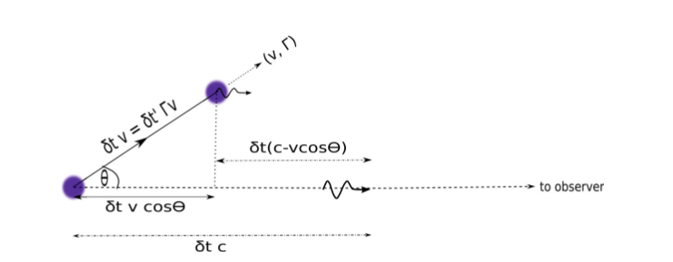
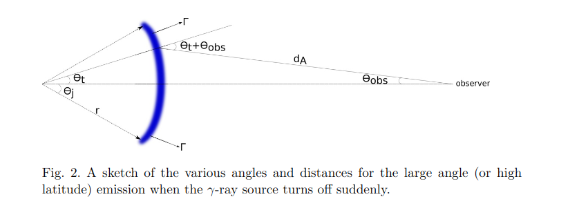
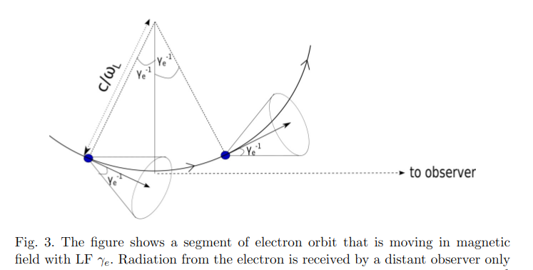
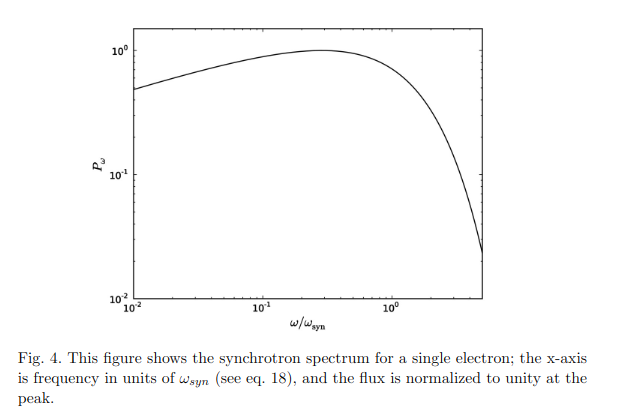
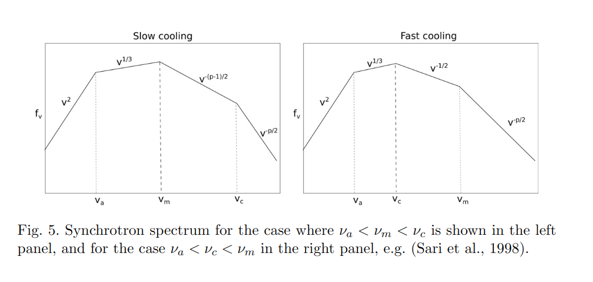
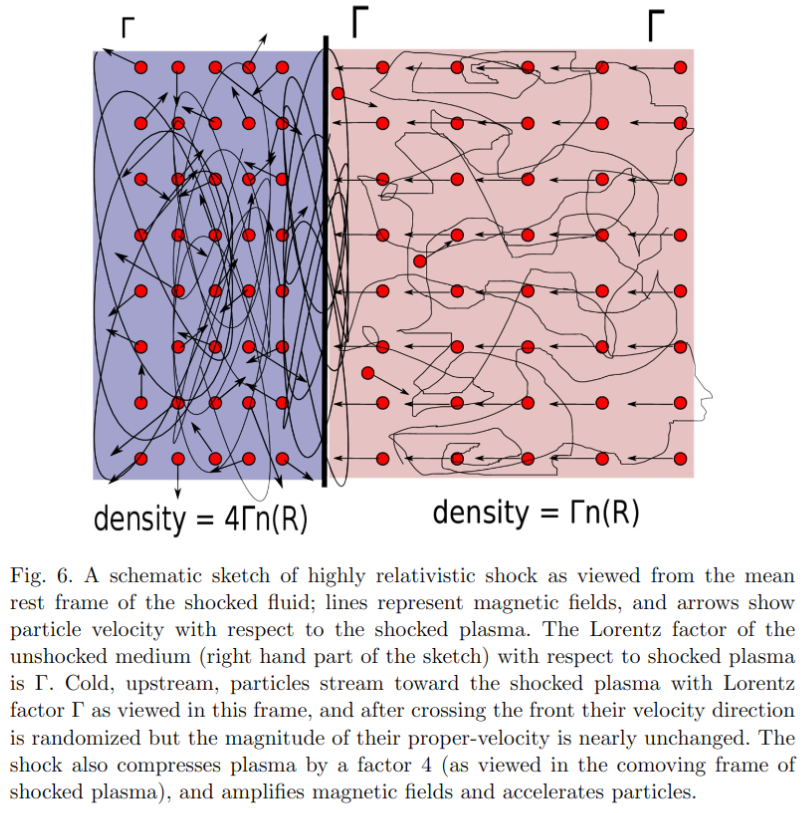

# The Physics of Gamma-Ray Bursts &Relativistic Jets

[1.Introduction](#sect1)
[2.Raiative processes](#sect2)
[3.Afterglow theory](#sect3)

## 1. Introduction

- GRBs are irregular pulses of gamma-ray radiation
- Gamma spectrum: non-thermal (broken power law), peaking at ~10-10e4keV
- Connected to SN and possibly BH formation
- Isotropic radiated energy: 10e48 - 10e55erg
- Afterglow: power-deacy light curve & power-law decay spectrum
- External forward shock (synchrotron radiation) could be the origin of afterglow
- The decay of the light curve steepenning to ~-2.2 at ~1day after, which is called "jet break", is due to the collimated narrow jets.
- The initial opening angle and its kenetic energy can be obtained by modelling the broadband emission (radio to X-ray) of those afterglows' light curves with a jet break
- The opening angle is in the range of ~2-10 degrees.
- thus the true amount of energy released in most long GRBs is reduced by a factor of ~10e2 -10e3, which indicates that their radiated energy is 10e49 ~ 10e52 erg.
- The density of the medium within ~0.1pc of the burst is found to be uniform and is of the order of a few protons, which is different to the decreasing density that decreases as r^-2 due to the wind from the progenitor star, which is expected by the core collapse of the massive star model.
- GRB outflows are hightly relativistic.
- GRBs are typically found to be in star forming regions of their host galaxies, which can partly indicate the association between long GRBs and core collapse SNe.
- A fraction of sGRBs are located in elliptical galaxies, i.e. associated with older stellar population, and they're tend to be less energitic and at a lower redshift. These are consistent with the idea that sGRBs originate from neutron stars mergers which however is not conclusive yet.
- XRT found that for about half of GRBs the X-ray flux decays rapidly after the burst (t^-3), followed by a much slower decay (t^-1/2) than expected in the standard FS model. The former indicates that the prompt radiation and afterglows arises from different machanisms.
- The X-ray flux of some GRBs would sharply increase (flares) minutes to hours after the end of the GRB, suggesting that the central engine of these bursts is active for a longer time than the burst duration.
- The X-ray and optical light curves after 10^4s are however consistent with external forward shock emission. Thus the X-ray data prior to ~10^4s are not well understood.
- Achromatic breaks (associated with finite jet angle) are seen in some burst but not others.
- prompt γ-ray emission: internal shock? external shock model? other mechanisms?
- γ photons: synchrotron process? inverse compton process? other mechanisms?
- relativistic jet: baryonic matter? electron-positron pairs? energy in magnetic fields?

## 2. Radiative processes

- synchrotron process
- inverse-Compton process
- photo-pion proccess
- few basic relativity results

### 2.1 Photon arrival time from a moving source, Doppler shift, Lorentz invari-ance of power etc.

Suppose:

---

$v$ : source moving speed (lab frame)

$\nu'$ : the photon frequency in the observer frame

$\Gamma$ : Lorentz factor

$\theta$ : angle between moving direction and the line of sight

$\delta t'$ : time interval between two emitted photons in the **comoving frame**

---

then we have:

---

$\delta t$ : time interval between two emitted photons in the **lab frame**

$$\delta t=\Gamma \delta t'$$

$\delta t_{obs}$ : time interval of the arrival of these photons at the observer

$$\delta t_{obs}=\delta t' \Gamma(1-vcos\theta/c)=\delta t'D^{-1} = \delta t/(\Gamma D) \tag{1}$$

where $D$ : the Doppler factor

$$D=[\Gamma(1-vcos\theta/c)]^{-1} \tag{2}$$

>I ponder that redshift $z = D^{-1} -1$

For $\theta << 1$ and $\Gamma >>1$, $\delta t_{obs}$ can be approximted as:

$$\delta t_{obs}\approx\frac{\delta t'}{\Gamma}[1+(\theta\Gamma)^{2}/2]=\frac{\delta t}{\Gamma^{2}}[1+(\theta\Gamma)^{2}/2] \tag{3}$$

>1.How's that? Clues: $cos\theta \approx 1 - \theta^2/2$, and $v/c \approx 0$
>2.This approximation indicates that $D^{-1} \approx \Gamma^{-1}$ when $\theta$ is so small that $(\theta \Gamma)^2 \approx 0$

$\nu$ : the photon frequency in the observer frame(**standard Doppler shift formula**)

$$\nu=\frac{\nu'}{\Gamma(1-vcos\theta/c)} \equiv \nu'D \tag{4}$$

---

### 2.1.1 Relativistic beaming of photons

For large $\Gamma$:

$$\theta \approx \theta' / \Gamma$$

which means, photons are focused in the farward direction, the angular size of the photon beam in the lab($\theta$) is smaller than it is in the comoving frame($\theta'$) by a factor ~ $\Gamma$. The solid angle for a conical beam in lab frame is thus smaller than in the comoving frame by a factor ～ $\Gamma^2$.

A mroe precise expression for Lorentz transformation of solid angle is:

$$d\Omega = d\Omega' / D^2$$

Besides, the power readiated by a particle is **Lorentz invariant** when the radiation beam is symmetric under parity transformation in particle rest-frame.

>Power is defined as the frequency integrated total energy radiated per unit timeover 4π steradians.

### 2.1.2 Transformation of specific luminousity and specific intensity

Specific luminousity:

Consider a source that is spherically symmetric and is expanding with Lorentzfactor $\Gamma$, we have:

$$L_\nu = \frac{dE}{d\nu dt_{obs}} = \Gamma \frac{dE'}{d\nu' dt'} = \Gamma L_\nu'$$

where $L_\nu$ is the total energy that flows through a surface enclosing the source per unit time and frequency.

Specific intensity is defined as flux per unit frequency and per unit solidangle carried by photons traveling within a narrow conical beam with its axisperpendicular to surfacedA, i.e.

$$I_\nu \equiv \frac{dE}{d\nu dt_{obs} dA d\Omega}$$

and

$$I_\nu = D^3 I_\nu'$$

#### 2.1.3 Observed lightcurve from a source that is suddenly turned off (???,see Page 16)

Suppose that the intrinsinc spectrum is $I'_{\nu'} = I' \nu'^{-\beta}$, we have:

$$f_\nu (t_{obs}) \propto (1-vcos\theta_t/c)^{2+\beta} \nu^{-\beta} \propto t_{obs}^{-(2+\beta)} \nu^{-\beta}$$

## 2.2 Synchrotron radiation

Consider:

An electron (Lorentz factor $\gamma_e$, speed $v_e$) moves perpendicular to the magnetic field B. The electric field in the electron rest fram is $E=\gamma_e v_e B/c$.

Hence according to Lamor's formula, the power radiated due to electron acceleration in this electric field is:

$$P_{syn} = \frac{2 q^4 E^2}{3 c^3 m_e^2} = \frac{2 q^4 B^2 \gamma_e^2 v_e^2}{3c^5 m_e^2} = \sigma_T B^2 \gamma_e^2 v_e^2/(4\pi c) \tag{15}$$

where $\sigma_T = 8\pi q^4/(3m_e^2 c^4)$ is the Thomson cross section. Again, this power is a Lorentz invariant quantity, so the synchrotron power in the lab frame is the same.

---

The Larmor frequency of the electron (or its angular speed) is

$$
\omega_L = \frac{qB}{\gamma_e m_e c} \tag{16}
$$

Due to relativistic beaming, a distant observer can only receive those photons which are emitted when the electron velocity lies within an angle $\gamma_e^{-1}$ of the observer's line of sight.

Hence the fraction of orbital time during which we can receive photons is $\sim 2\gamma_e^{-1}/ 2\pi$, and therefore the duration of the radiation pulse received by observer $\delta_{obs}$ in each oribit is:

$$
\delta t_{obs} \sim \frac{2}{\gamma_e \omega_L} \frac{1}{2\gamma_e^2} \sim \frac{m_e c}{qB\gamma_e^2} \tag{17}
$$

>Notice the relation between comoving time $\delta t'$ and observer frame time $\delta t_{obs}$ for photon arrival. But why there are three $\gamma_e$ in the denominater? I ponder there should be only two: one from the orbital fraction and one from the transform from comoving time to observer time. The '2' in the denomoinater also confuses me.

The inverse of this time is the characteristic frequency for synchrontron radiation:
$$
\omega_{syn} \sim \frac{qB\gamma_e^2}{m_e c}
\ \ \ \ and \ \ \ \  
\nu_{syn} = \frac{\omega_{syn}}{2\pi} \sim \frac{qB\gamma_e^2}{2\pi m_e c}
\tag{18}
$$

A more precise treatment has an additional factor (3/2)sin$\alpha$; $\alpha$ is the pitch angle between the electron’s velocity and themagnetic field.

>This is to say each electron with a specific $\gamma_e$ has a correponding characteristic frequency $\nu_{syn}$ at which the flux from this electron peaks in its spectrum.

The synchrotron spectrum peaks at $\sim \nu_{syn}$.**The spectrum below the peak scales as $P_{syn}(\nu) \propto \nu^{1/3}$, and it declines exponentially for frequency higher than $\nu_{syn}$**.

Refering to Rybicki and Lightman (1979), the power per unit frequency $P_{syn}(\nu)$ at the peak of the spectrum is
$$
P_{syn}(\nu_{syn}) \sim P_{syn} / \nu_{syn} \sim \frac{\sigma_T B m_e c^2}{2q}
\tag{19}
$$

Given a power-law ditributed of electrons, $dn_e / d\gamma_e \propto \gamma_e^{-p}$, we then can calculate synchrotron spectrum (the flux at given $\nu$) by adding up contributions from those electrons with LF larger than (see 18)
$$
\gamma_\nu \sim (\frac{2\pi \nu m_e c}{qB})^{1/2}
\tag{20}
$$
resulting in
$$
f_\nu = \int_{\gamma_e}^\infty d\gamma_e \frac{dn_e}{d\gamma_e} P_{syn}(\nu) \propto \nu^{-(p-1)/2}
\tag{21}
$$

>I deem the reason that adding up electrons larger than $\gamma_e$ is that this fraction of electrons dominates the flux at $\nu_e$ corresponding to the $\gamma_e$, since the flux from electrons smaller than $\gamma_e$ is already declining rapidly at  $\nu_e$. Besides, eq.21 indicates that the flux also depends on the energy distribution of electrons.

Conclusion:The synchrotron spectrum for a power-law distribution of electrons,$dn_e / d\gamma_e \propto \gamma_e^{-p}$, is $f_\nu \propto \nu^{-(p-1)/2}$.

### 2.2.1 Effect of synchrotron cooling on electron distribution

Consider that after being accelerated at some time, electrons then cool via synchrotron radiation for time duration $t_0$. Electrons with LF $\gtrsim \gamma_c$ (defined below) lose a significant fraction of their energy during this time and their LF drops below $\gamma_c$
$$
\frac{dm_e c^2 \gamma_e}{dt}=-\frac{\sigma_T}{6\pi}B^2 \gamma_e^2 c
\ \ \ \ or \ \ \ \ 
\gamma_c \sim \frac{6\pi m_e c}{\sigma_T B^2 t_0}
\tag{22}
$$

> This is to say, there exists an $\gamma_c$ which is inversly proportional to $B^2$ and $t_0$ (which means that $\gamma_c$ is only related to the environment), and electrons bigger than this $\gamma_c$ would lose most energy due to synchrotron radiation.

Then we have another characteristic synchrotron frequency （cooling frequency） corresponding to this $\gamma_c$(see eq.18):
$$
\nu_c \equiv \frac{3qB\gamma_c^2}{4\pi m_e c} \sim \frac{27\pi q m_e c}{\sigma_T^2 B^3 t_0^2}
\tag{23}
$$

>What can we learn from the above? 1. This cooling frequency is then also depend on the environment. If this frequency can somehow be measured, maybe the properies of the environment can thus be derived. 2. As the LF drops below $\gamma_c$, the 'peak frequency' $\nu_e$ also drops below $\nu_c$.

The effect of the cooling of electrons is that as a result of loss of energy, the electron distribution function for $\gamma_e > \gamma_c$ is modified,leading to that the power-law index of the spectrum would changes at $\nu_c$.

This can be seen from the continuity equation for elctrons in the energy space:
$$
\frac{\partial}{\partial t} \frac{dn_e}{d\gamma_e} + \frac{\partial}{\partial \gamma_e}[\dot{\gamma_e} \frac{dn_e}{d\gamma_e}]=S(\gamma_e)
\tag{24}
$$

where $\dot{\gamma_e} = -\sigma_T B^2 \gamma_e^2 / (6\pi m_e c)$ is the rate of change of $\gamma_e$ due to the synchrotron loss, and $S(\gamma_e)$ is the rate at which electrons with LF $\gamma_e$ are injected into the system.

>Note that $\dot{\gamma_e}$ is due to synchrotron loss (cooling effect), so the solution of this equation is the electron distribution that has been modified due to cooling effect.

This equation has a steady state solution ($\partial / \partial t=0$) for **time independent magnetic field** which is: $dn_e/d\gamma_e \propto \dot{\gamma_e}^{-1} \propto \gamma_e^{-2}$ (i.e. p=2) for $\gamma_c < \gamma_e < \gamma_m$; where $\gamma_m$ is the minimum LF of injected electron so that $S(\gamma_e)=0$ for $\gamma_e < \gamma_m$. The specctrum corresponding to this segment of electron distribution is $f_\nu \propto \nu^{-1/2}$.

For $\gamma_e > \gamma_c > \gamma_m$, the solution of the continuity equation is $dn_e/d\gamma_e \propto \gamma_e^{-p-1}$ in the steady state (for constant B), the corresponding spectrum is $f_\nu \propto \nu^{-p/2}$.

### 2.2.2 Synchrotron self-absorption frequency

There is yet another characteristic frequency, $\nu_a$, which corresponds to the case where absorptions of photons by the inverse-synchrotron process (???) becomes important.

The easiest way to determine $\nu_a$ is by the application of Kirchhoff's law - the emergent specific flux cannot exceed the black body flux corresponding to the appropriate electron electron temperature which is
$$
k_B T \approx max(\gamma_a, min[\gamma_m, \gamma_c])m_e c^2/2.7
\tag{25}
$$

The synchrotron self-absorption frequency ($\nu_a$) is the frequency where the emergent synchrotron flux is equal to the black-body flux (???) :
$$
\frac{2m_e c^2 max(\gamma_a, min[\gamma_m, \gamma_c])\nu_a^2}{2.7c^2}
\approx \frac{\sigma_T B m_e c^2 N_{\gt}}{4\pi q}
\tag{26}
$$

where the left side of this equation is the Plank function in the Ratleign-Jeans limit, and $N_>$ is the column density of electrons with LF larger than max($\gamma_a$, min[$\gamma_m, \gamma_c])$.

The  emergent  synchrotron  spectrum  for  a  distribution  of  electrons  dependson the ordering of these characteristic frequencies. Spectra for two particularorderings are shown below.

### 2.2.3 Maximum energy of synchrotron photons

Charged articles are accelerated as they travel back and forth across a shock front via the fist order Fermi process.

They gain energy by a factor ~ 2 each time they are scattered from one side to the other of a relativistic shock front.

The maximun synchrotron frequency for an eletron in this case turns out to be about 50$\Gamma$ MeV, and for a proton it is a factor $m_p/m_e$ larger. $\Gamma$ is the LF of shocked plasma with respect to the observer.

>How does thit come about? Answer is as follows.

The minimum time required for acceleration of a charged particle of mass m while crossing a shock front is of the order of the Larmor time $t_L' = mc\gamma / (qB')$, where $\gamma$ is LF of the partical in the shock comoving frame, and prime (') refers to quantity measured in the rest frame of the shocked fluid.

>This is to say if the particle wants to have a LF up to $\gamma$, then the minimun time that it will need is $t_L' = mc\gamma / (qB')$

The particle should not lose more than half its energy to synchrotron radiation $t_L'$, otherwise it will ever  get accelerated to LF $\gamma$.

> This means that we could wirte an inequality like:  radiation power x ($t_L'$) < half of the particle energy

This implies that
$$
\frac{4q^4 B^{'2} \gamma^2}{9m^2 c^3} t_L' < \frac{mc^2 \gamma}{2}
$$

use $t_L' = mc\gamma / (qB')$, we get:
$$
\frac{qB' \gamma^2}{2\pi mc} < \frac{9mc^3}{16\pi q^2}
$$

The left side of this equation is the synchrotron frequency of particle with LF of $\gamma$. Thus we can use this inequality to find the maximun synchrotron photon energy for an electron (proton) is ~50 MeV  (100GeV) inn shocked fluid comoving frame under the optimistic Bohm diffusion limit.

Synchrotron photons produced when a particle is passing through a region of muchhigher-than-average magnetic field can have energy larger than the limit de-scribed above, e.g. Kumar et al. (2012).

## 2.3 Inverse-Compton radiation

When a photon of frequency $\nu$ is scattered by an electron of larger energy, the photon gains energy in this process on the average. If the electron LF is  $\sim \gamma_e$, and $h\nu' = h\nu \gamma_e \ll m_e c^2$, then the average frequency of scattered photon is $\nu_s \sim \nu \gamma_e^2$, which is that the frequency, thus the energy, of the incident photon boost by a factor of $\gamma_e^2$.

Consider next an electron moving through a radiation field where the energy density in photons is $u_{\gamma}$ (namely, the energy density of the synchrotron radiation energy). The power in IC-scattered photons, $P_{ic}$,subsequently follows from the boost of energy for each photon by a factor of $\gamma_e^2$ (independent of photon energy far the case where $h\nu \gamma_e \ll m_e c^2$ as is being considered here.):
$$
P_{ic} \sim \sigma_T \int d\nu \frac{u_{\nu}c}{h\nu} h_{\nu} \gamma_e^2 \sim \sigma_T u_{\gamma} \gamma_e^2c
\tag{27}
$$

where $u_{\nu}d\nu$ is energy density in photons of frequency between $\nu$ and $\nu+d\nu$ (namely $u_{\gamma} = \int u_{\nu}d\nu$).

>Eq.27 indicates that $P_{ic}$ depends only on the environment and the electron energy ($P_{ic} \propto u_{\gamma}, \gamma_e^2$) under the reqired condition.

We see from eaqutions (15) and (27) that the ratio of synchrtron and IC powers is $u_B/u_{\gamma}$; where $u_B = B^2 / 8 \pi$ is the energy in the magnetic field.

Next we should introduce a particularly importance situation of IC radiation in the energetic radiative process. Consider the case when electrons first produce seed photons due to synchrotron radiation, and those seed photons are then IC scattered by the same electrons that produce them ealier, the seed photons would end up with a much larger energies. This process -- called synchrotron-self-Compton or SSC -- could be important for GRBs and other relativistic sources.

The relative importance of synchrotron and IC processes for extracting energy from a population of energetic electrons is specified by the Comptom Y parameter ($Y \sim P_{ic}/P_{syn} \sim u_{\gamma}/u_{B}$).

Energy density in photons for the synchrotron process is:
$$
u_{\gamma} = \int dr \int d\gamma_e \frac{P_{syn}}{c} \frac{dn_e}{d\gamma_e} = \frac{\sigma_T (\delta R)B^2}{6\pi} \int d\gamma_e \gamma_e^2 \frac{dn_e}{d\gamma_e}
= \frac{\sigma_T (\delta R) n_e B^2}{6 \pi} <\gamma_e^2>
\tag{28}
$$

>Of course the energy density for synchrotron process depends on the environment and the enegy of the electrons.

where $\delta R$ is the width of the source, and
$$
<\gamma_e^2> \equiv \frac{1}{n_e}\int d\gamma_e \gamma_e^2 \frac{dn_e}{d\gamma_e}
\tag{29}
$$

Using (28), we find the Compton-Y parameter to be
$$
Y \sim P_{ic}/P_{syn} \sim \tau_e <\gamma_e^2>
\tag{30}
$$
where $\tau_e = \sigma_T (\delta R)n_e$ is the optical depth of the source to Thomson scattering.

### 2.3.1 IC spectrum

The spectrum of IC radiation is obtained by convolving electron distribution with the seed photon spectrum (Rybicki and Lightman, 1979):
$$
f_{ic}(\nu_{ic}) \approx \frac{3\sigma(\delta R)}{4} \int d\nu \frac{\nu_{ic}}{\nu^2} f_{syn}(\nu) \int \frac{d\gamma_e}{\gamma_e^2} \frac{dn_e}{d\gamma_e} F(\nu_ic/4\gamma_e^2\nu)
\tag{31}
$$

where
$$
F(x) \approx 2(1-x)/3
\tag{32}
$$

For a $\delta-function$ seed photon spectrum (where photons have frequency $\nu_0$), and a power-law distribution of electrons with index $p$ which is cut off at the low energy end at $\gamma_m$, these equations give that the IC spectrum is proportional to $\nu_{ic}$ for $\nu_{ic} < 4\gamma_m^2 \nu_0$. Therefore, **the low energy part of IC spectrum can be significantly harder than the hardest possible part of IC spectrum when synchrotron-self-absorption is negligible**.

At higher photon energies, $\nu_{ic} > 4\gamma_m^2\nu_0$, the IC spectrum has an asymptotic power-law index $\nu_{ic}^{-(p-1)/2}$, same as the spectrum for the synchrotron process.

> From the above we can learn that there exists a critical frequency $4\gamma_m^2 \nu_0$ at which the IC spectrum reach its peak. The spectrum is proportional to $\nu_{ic}$ less than the critical frequency and is a power-law decline with respect to $\nu_{ic}$ larger than that frequency.

### 2.3.2 IC in Klein-Nishina regime

When photon energy in electron comoving frame approaches (or exceeds) $m_e c^2$, two effects become important. One of which is that the eletron recoil can no longer be ignored. The ohther effect is that the cross section is smaller than $\sigma_T$ and it decreases with increasing photon energy as $\sim \nu^{-1}$.

One simple consequence of the recoil effect is that the energy of the scattered photon is limited to $\sim m_e c^2 \gamma_e /2$ (no longer $\sim \nu_0 \gamma_e^2$) which is obviouse  from energy conservation.

## 3.Afterglow theory

### 3.1 Relativstic shocks: basic scalings

This is a relativistic blastwave theory that describes interaction between the "fireball" -- which moves with Lorentz factor $\Gamma_0$ before before deceleration and has total "isotropic equivalent" energy E -- and the circumburst medium (CBM) described by the density profile, $n(R)=(A/m_p)R^{-k}$.

A power-law decaying multi-wavelength afterglow is predicted before the first observational detection of X-ray afterglow in 1997.

A relativistic shock theory was developed by Bland-ford and McKee (1976) in the context of AGN jets which turned out to bewell suited for interpreting GRB afterglows in X-ray, optical and radio bandswhen they were discovered in 1997.

 The self-similar nature of the blastwave solution naturallyexplains the power law behavior of the afterglow lightcurves.

 >1.Afterglow theory is a relativistic blastwave theory of the interaction between fireball and the CBM (which described by $n(R)=(A/m_p)R^{-k}$.). 2.The power-law decaying afterglow was indeed predicted before real observation. 3.A relativitic shock theory developed for AGN jets is well suited for interpreting GRB afterglows in optical, X-ray and radio bands.

The basic dynamics of blastwave is easy to understand using simple physicalarguments,  and  the  main  results are sketched in Figure 6.

It is best to work in the comoving frame of the shocked fluid which is traveling with Lorentz factor $\Gamma$ with respect to unshocked fluid. The density of the unshocked medium in this frame is $\Gamma n(R)$, and upstream particles are seen to be streaming toward the shocked fluid with a Lorentz factor of $\Gamma$; upstream particles have  thermal energy much smaller than their rest mass. What  a shock does is to randomize the orientation of particle velocity vectors, without changing their Lorentz factors, when they cross the shock front, and therefore the mean “thermal” energy of protons down-stream of the shock front is $\Gamma m_p c^2$ (derivation provided below). As viewed from the lab frame, the average energy of each down-stream proton is $\Gamma^2 m_p c^2$, and hence for a blast wave at radius R, the total energy in the shocked plasma is
>Consider the comoving frame of the shocked fluid, the unshocked fluid stream toward the shocked fluid with $\Gamma$, with the velocity direction of the unshocked particles randomized and magnitude unchanged. 

$$
E \approx 4 \pi A R^{3-k} c^2 / (3-k),
\tag{33}
$$
