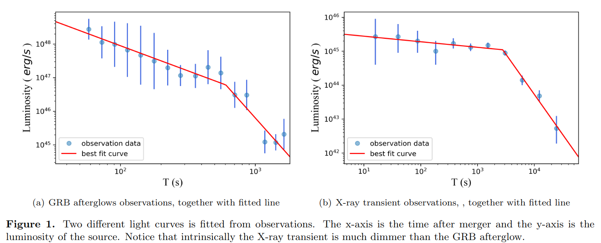
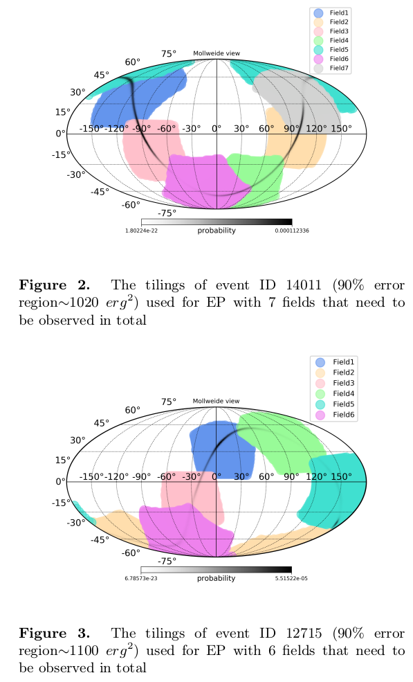
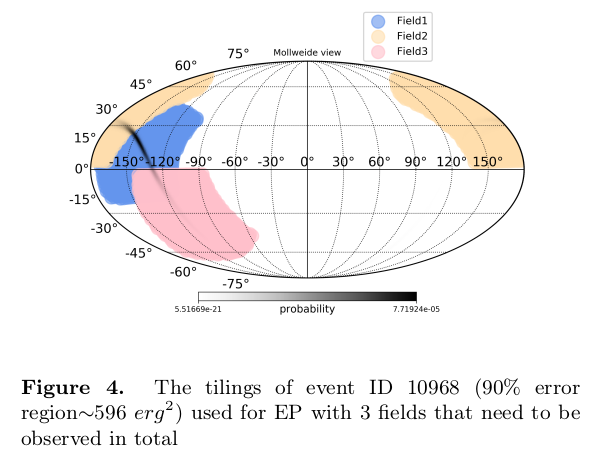
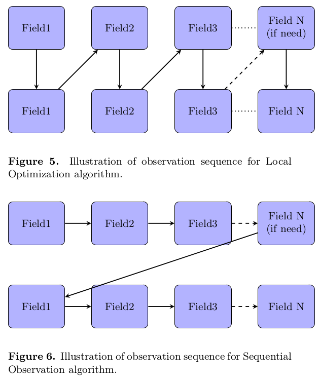
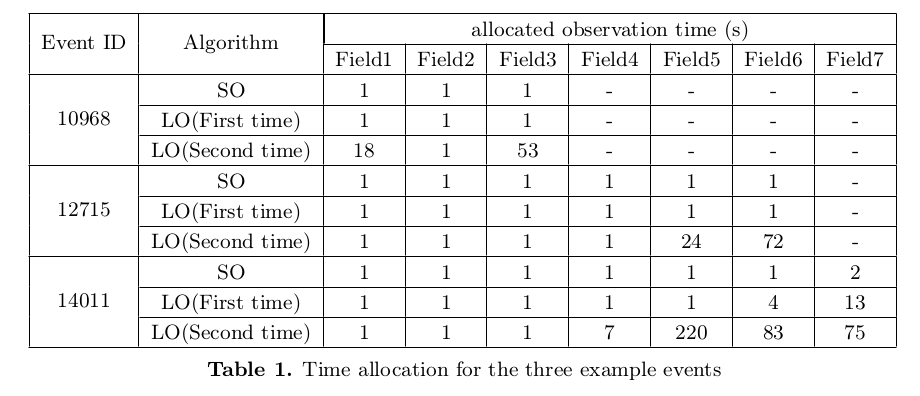
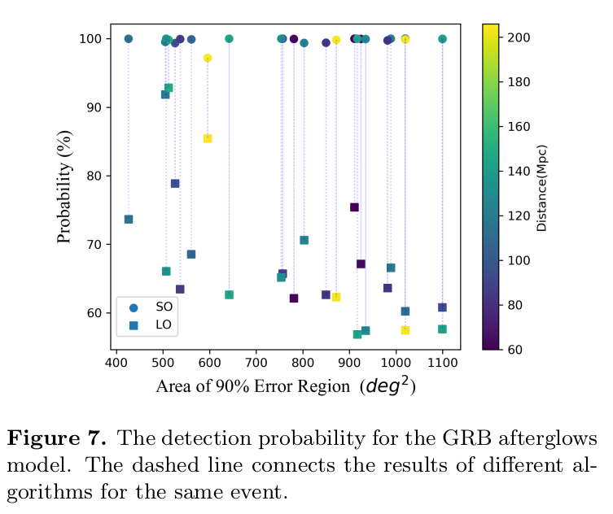
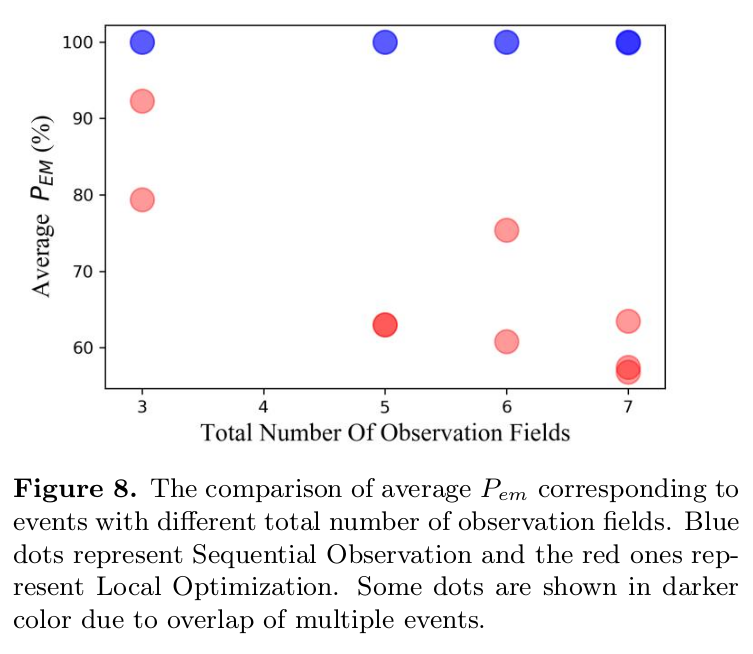
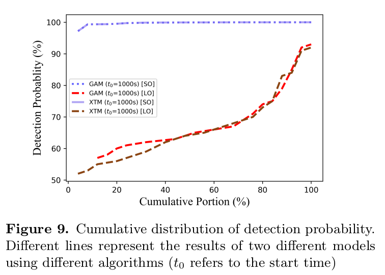

# Following up the afterglow: strategy for X-ray observation triggered by gravitational wave events

Author: Hui Tong, Mu-Xin Liu, Yi-Ming Hu, Man Leong Chan, Martin Hendry, Zhu Liu, and Hui Sun

&emsp;

## 背景

1. 到目前为止，仍只有GW170817这一次引力波事件的电磁对应体被探测到，引力波电磁对应体的搜寻还是比较困难。
2. 选择在X射线波段进行引力波变源搜寻是比较理想的，原因如下：
	- 相比macronova（比如GW170817的情形）比较迟的光学辐射，X射线辐射会发生在更早的阶段；
	- 相比较准直的伽玛射线辐射，探测X射线的视角要求较宽松，且X射线辐射相比伽玛射线能持续更久的时间。

&emsp;

## 研究的问题

当一个引力波事件发生后，如果没有GRB被探测到，那么X射线望远镜应该采取怎样的观测（搜寻）策略来增加成功探测到电磁对应体的几率？

&emsp;

## 假设

1. 成功探测的定义：多次观测显示出明显的亮度变化；
2. 使用EP卫星的WXT望远镜（视场为3600平方度）作为假想望远镜；
3. 天区位置与距离之间相互独立，他们的联合概率等于各自概率的乘积；
4. 望远镜能指向任何方向，忽略太阳、月亮和地球的影响；
5. 在一片观测天区内探测到余辉的概率计算的统计框架如下

成功探测到余辉的几率取决于FOV的大小 $\omega$，观测的天区坐标($\alpha, \delta$)，多次观测分别的曝光时间$\tau_1$ 和 $\tau_2$以及望远镜的性能$I$：
$$
P(D_{ag}|\omega,\tau_1,\tau_2,I) =P(N>N^*|\omega,\alpha,\delta,\tau_1,I) \times P(\Delta f > 0|\tau_1,\tau_2,I)\tag{1}
$$
即第一次探测到流量超出的几率乘以第一次和第二次观测的流量存在差异的几率。

 

上式右边第一项可把位置因素的贡献和曝光时间因素的贡献分开，进一步拆分成
$$
P(N>N^*|\omega,\alpha,\delta,\tau_1,I) = P_{gw}(\omega) \times P_{ag}(\tau_1)
\tag{5}
$$

其中第一项
$$
P_{gw}(\omega) = \int_{\omega} p(\alpha,\delta|I) d\alpha d\delta
\tag{6}
$$
表示仪器的观测区域覆盖到引力波源的几率；
第二项
$$
P_{ag}(\tau_1)=\int df \int dR \int^{\infty}_{N^*} dN \times p(N|f,\tau_1,I)p(f|I,R)p(R|I) \\
= \int df \int^{\infty}_{N^*} dN p(N|f,\tau_1,I) \times \int dR p(f|I,R)p(R|I)
\tag{7}
$$
表示在曝光时间$\tau_1$内探测到余辉的几率。
将此项其记为$P_1$，把式（1）右边第二项记为$P_2$，则式（1）可重新写为：
$$
P(D_{ag}|\omega,\tau_1,\tau_2,I) = P_{gw} \times P_1 \times P_2
\tag{11}
$$

如果搜寻一段时间后信噪比达不到要求，增加曝光时间不会再增加$P_1$，则不再观测新的天区。

 

## 解决方案（观测策略）

首先使用贪婪算法确定观测天区，划分出来的天区根据探测概率的大小由1至n编号。编号越小，探测几率越大。

接着就是制定观测策略去观测这些天区。有两种观测策略：顺序观测算法(Sequential Observation Algorithm, SO)和局部优化算法(Local Optimization Algorithm, LO)。

### 顺序观测算法

原则：

- 如果要观测新的天区，该天区编号应该是所有未观测的天区编号中最小的。
- 第一轮观测应该尽可能多地观测划分出的天区，直到信号无法达到期望的信噪比。
- 第二轮观测不改变观测顺序，但会按照一定规则改变各天区的时间分配。假设由目前观测天区向下一个观测天区的转向时间为$t_s$ s，比较在目前天区多观测 1 + $t_s$ s 带来的$P_1$的增加量和在下一个天区观测1s的探测概率。持续观测目前的天区直至$P_1$增量小于新天区的探测概率。

这种策略通常能得到较高的$P_1$和$P_2$。（只需要两次观测的信号强度有相对差别就能得到比较高的$P_2$了）

### 局部优化算法

原则：

- 如果要观测新的天区，该天区编号应该是所有未观测的天区编号中最小的。
- 如果想第二次观测同一片天区，则这一天区的编号应该是所有以观测天区中最小的。

区别在于，在第一轮观测中就可以重复观测某一天区，而不必等到第二轮观测。

 

## 模拟和结果

- 使用EP卫星对几个模拟的GW事件进行模拟观测。
- 分别使用两种光变模型计算概率：GRB余辉模型(GRB Afterglow Model, GAM)，X射线暂现源模型(X-rays Transient Model, XTM, X射线产生于并合后的磁星)：

 

### 划分观测天区

- 忽略探测概率小于1%的天区。
- 所有的事件都能覆盖到误差天区的95%以上。

 

### 观测次序和时间分配

GRB余辉模型下，四个典型事件的观测次序：

LO策略倾向于同一天区连续观测两次再转向下一天区。

下表显示了三个事件中不同策略在各天区的观测时间分配：

 

### 探测概率比较

GRB余辉模型下，两种策略的探测率比较：

- 所有事件中，顺序观测策略的探测率均比局部优化策略高不少。
- 整体上看，误差天区越大，局部优化策略的效果就越差。

另外，下图也显示了，需要观测的天区数越多，$P_{em}$往往也越小（原文没说$P_{em}$是什么，估计说的是$P_2$，即统一天区两次观测间的信号存在差异的概率）。

对于顺序观测策略，因为第二轮观测与第一轮观测之间通常有一定的时间间隔，所以$P_2$一般都接近饱和。

 

X射线暂现源模型下，两种策略的探测率的累积分布：

同样，顺序观测策略比局部优化策略表现好。

 

## 结论

- 以相对较长的时间间隔多次观测同一天区更有可能观测到余辉。
- 一个大的视场对于余辉的快速探测非常有利。