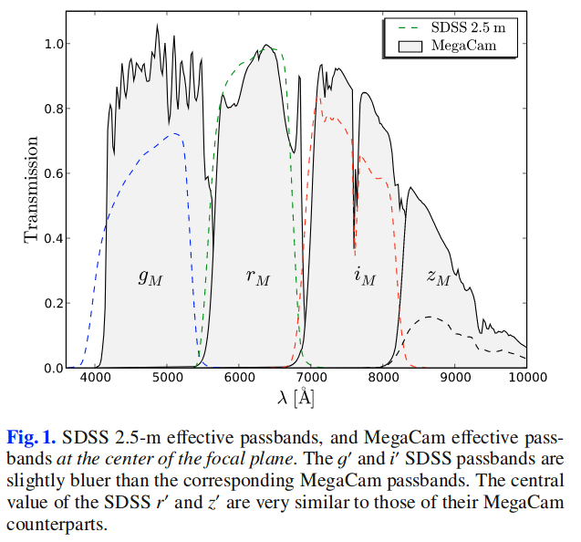

# Photometric selection of Type Ia supernovae in the Supernova Legacy Survey
[Supernoca Legacy Survey](https://arxiv.org/abs/astro-ph/0406242)

## Abstract

We present a sample of 485 photometrically identified Type Ia supernova candidates mined from the first three years of data of the CFHT SuperNova Legacy Survey (SNLS). The images were submitted to a deferred processing independent of the SNLS real-time detection pipeline. Light curves of all transient events were reconstructed in the $g_M$, $r_M$, $i_M$ and $z_M$ filters and submitted to automated sequential cuts in order to identify possible supernovae. Pure noise and long-term variable events were rejected by light curve shape criteria. Type Ia supernova identification relied on event characteristics fitted to their light curves assuming the events to be normal SNe Ia. The light curve fitter SALT2 was used for this purpose, assigning host galaxy photometric redshifts to the tested events. The selected sample of 485 candidates is one magnitude deeper than that allowed by the SNLS spectroscopic identification. The contamination by supernovae of other types is estimated to be 4%. Testing Hubble diagram residuals with this enlarged sample allows us to measure the Malmquist bias due to spectroscopic selections directly. The result is fully consistent with the precise Monte Carlo based estimate used to correct SN Ia distance moduli in the SNLS 3-year cosmological analyses. This paper demonstrates the feasibility of a photometric selection of high redshift supernovae with known host galaxy redshifts, opening interesting prospects for cosmological analyses from future large photometric SN Ia surveys.

- 从CFHT SNLS前三年的数据中通过测光数据证认出了485个Ia型SN。
- 图像被提交到延迟的，独立于SNLS实时探测管道的处理进程（processing）中.
- 所有暂现源的光变曲线都在$g_M$, $r_M$, $i_M$ 和 $z_M$波段进行了重建，并且submitted to automated sequential cuts以识别可能的SN。
- 按照一定的光变曲线形状标准，将纯噪声和长期变化的源被筛选出来并拒绝。
- 对于Ia型SN的识别，是基于在假设一颗源是普通Ia型的情况下对其光变曲线进行拟合而得出的一些特征（ event characteristics）。将宿主星系的红移作为tested evets（？？）的红移的基础上，用光变曲线拟合工具SALT2来实现此目标（对Ia型超新星的识别？？）。
- 选择出来的485个候选体比SNLS所允许进行光谱识别的星等要深一个星等。
- 其它类型的SN的污染估计小于4%。（把其它类型的SN误认为Ia型SN的情况小于4%？？）
- 用这些样本检验Hubble图像残差，让我们测量由直接的光谱选择而导致的Malmquist误差。（Testing Hubble diagram residuals with this enlarged sample allows us to measure the Malmquist bias due to spectroscopic selections directly.）
- 结果与用来修正SNSL 3年宇宙学分析中SN Ia SN距离模数的基于精准MC的估计完全吻合。
- 这篇文章展示了用测光方法来选择（识别？）已知宿主星系红移的高红移SN的可行性。

 

## 1. Introduction

本篇文章描述了一个仅用测光数据来识别超新星候选体的方法。作者使用此方法对SNLS 2003 - 2008 年中的前三年的数据进行了分析。

SNLS的观测区域为4个一平方度的天区。每个天区在全年有5-7个月的夜晚可见窗口。在每个天区的可见窗口期内，每3到4天重复观测这一天区，观测波段为$g_M$, $r_M$, $i_M$ 和 $z_M$，与SDSS的相应波段相似，波长范围400-1000nm。这样就有充足的数据来构建多波段光变曲线。

|  section    |  content |
| ------ | -------------------------- |
| sect2 | 数据处理，暂现源探测和测光 |
| sect3  | 类SN事件的选择及其与宿主星系测光红移的关联             |
| sect4 | 讨论Ia型SN候选体的选择 |
| sect5 | Ia SN的特征（characteristic），发现选择出的有光谱证认和没有光谱证认的事件有相似的性质 |
| sect5.2 | 整个样本通过测光得到的距离与通过有光谱证认的次级样本得到的距离做了比较 |

