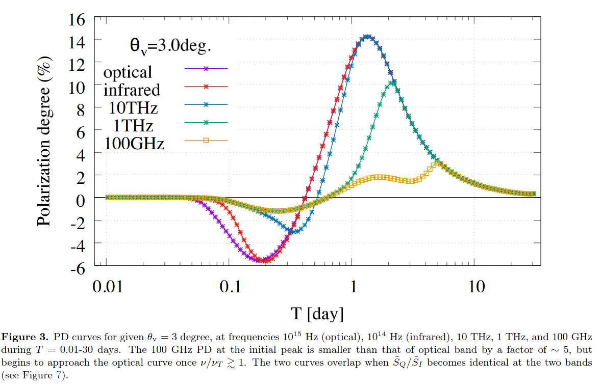
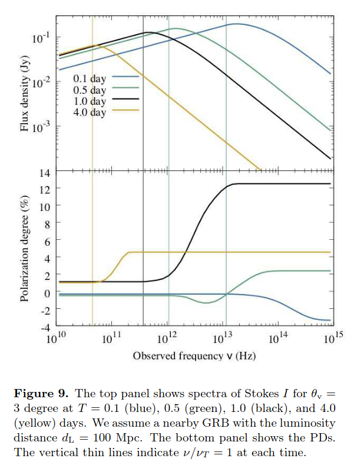
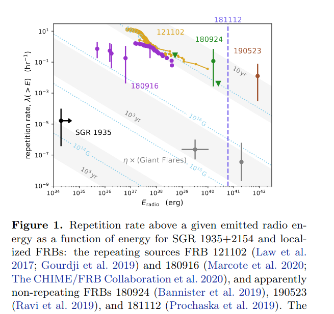
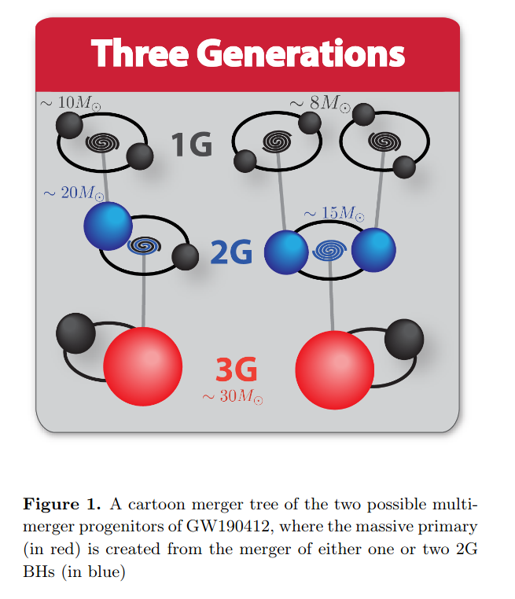
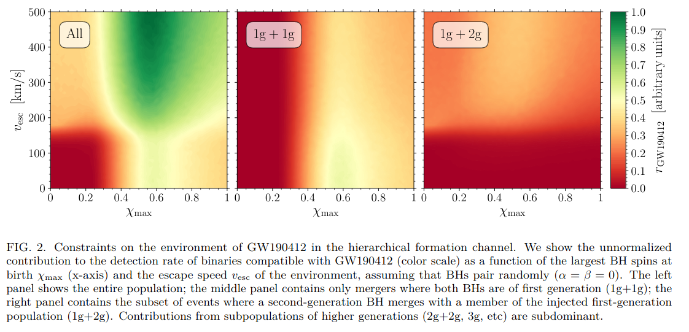
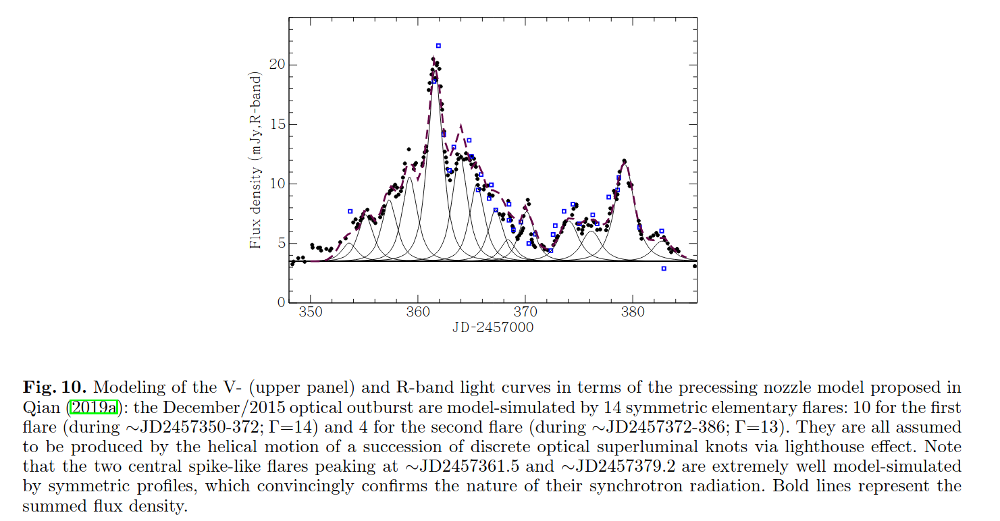
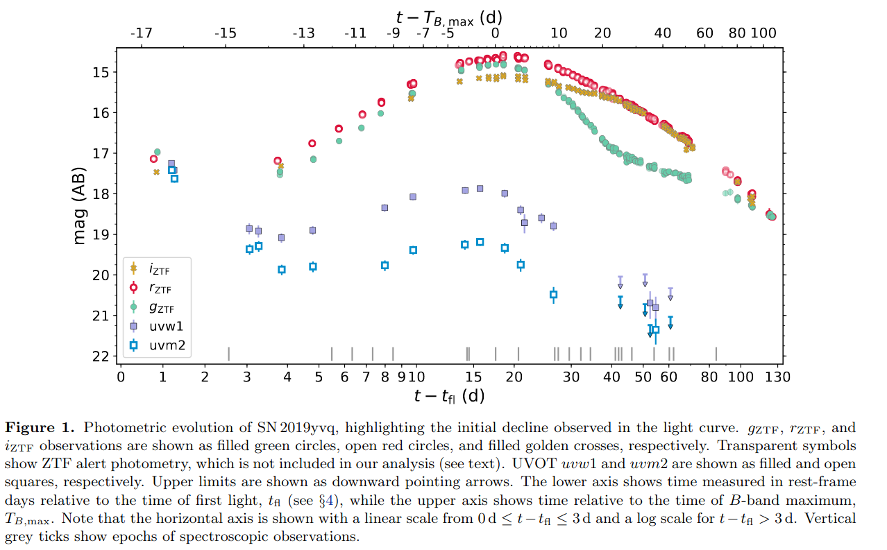
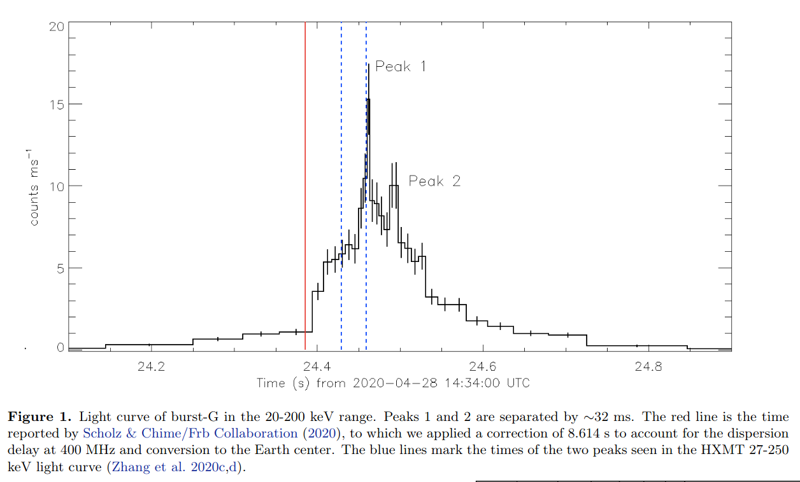
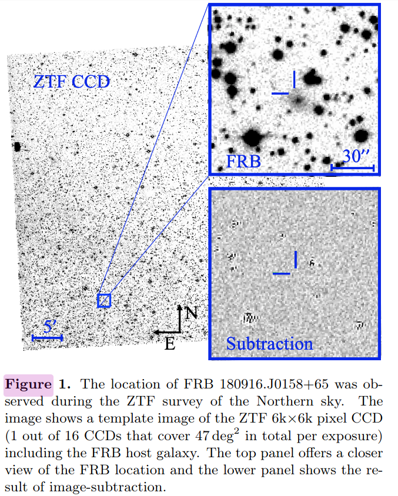

# arxiv一周文献泛读200511-200515

## 200511

中相关：

### Multi-Waveband Synchrotron Polarization of Gamma-Ray Burst Afterglows

`https://arxiv.org/abs/2005.03710`

details

Authors: JIRO SHIMODA, KENJI TOMA

Multi-waveband synchrotron linear polarization of gamma-ray burst (GRB) afterglows is studied <u>under the assumption of anisotropic turbulent magnetic field with coherence length on plasma skin depth scales in the downstream of forward shocks</u>.  
We find that for typical GRBs, in comparison to the optical polarization, the radio polarization degree shows a similar temporal evolution but a smaller peak value by a factor of∼5. This results from differences of <u>observed intensity image shapes between the radio and optical bands</u>.
We also show that the polarization degree spectrum has a gradual variation from low to high polarization regime <u>above the intensity spectral peak frequency</u>, and that the difference of polarization angles in the two regimes is zero or 90 degrees. Thus, simultaneous multi-waveband polarimetric observations of GRB afterglows would be a new firm test of the plasma-scale magnetic field model.
We also discuss theoretical implications from the recent detection of radio linear polarization in GRB 171205A with ALMA, other models of magnetic field configuration, and Faraday depolarization effects by thermal electrons.

- 假设在前向激波下游，各向异性扭曲磁场（turbulent magnetic field）的尺度与等离子体表层深度相当，研究了这种情况下GRB余辉的多波段同步辐射的线偏振情况。
- 通过观察到射电和光学波段之间“强度图”（intensity image）形状的差异，我们发现对于典型的GRB，射电波段的偏振度的演化行为与光学波段类似，但前者的峰值比后者低1-5倍。

- 我们还指出，在偏振度谱的光谱峰值频率以上的部分从偏振度低到偏振度高逐渐变化的，并且偏振度低对应频段的偏振角和偏振度高对应频段的偏振角的差别是0度或90度。

- 据此，对GRB余辉的多波段同时的偏振观测将能有效检验等离子体尺度（plasma-scale）磁场模型。
- 还讨论了最近ALMA对GRB171205A的射电线偏振探测的理论影响，其他结构的磁场模型，以及由热电子导致的法拉第去偏振化的效应。

&emsp;

### Titanium and Iron in the Cassiopeia A Supernova Remnant

`https://arxiv.org/abs/2005.03777`

Authors: Gregory S. Vance, Patrick A. Young, Christopher L. Fryer, et al.

Mixing above the proto-neutron star is believed to play an important role in the supernova engine, and this mixing results in a supernova explosion with asymmetries. Elements produced in the innermost ejecta, e.g., 56Ni and 44Ti, provide a clean probe of this engine. **The production of 44Ti is particularly sensitive to the exact production pathway and, by understanding the available pathways, we can use 44Ti to probe the supernova engine.** Using <u>thermodynamic trajectories from a three-dimensional supernova explosion model</u>, we review the production of these elements and the structures expected to form under the "convective-engine" paradigm behind supernovae. We compare our results to recent X-ray and γ-ray observations of the Cassiopeia A supernova remnant.

- 原生中子星(proto-neutron star)的混合(mixing，与流体力学不稳定性有关)被认为在超新星引擎中发挥重要作用，且这种混合会导致超新星爆发的不对称性。
- 在最内部的喷发物中产生的Ni56和Ti44可以作为这种引擎机制的探针，尤其是Ti44的产生（产量？）对(爆发的)具体生产过程非常敏感。如果能弄清它的产生过程，就可利用Ti44作为超新星引擎的探针。
- 通过使用三维超新星爆发模型的热力学轨迹(thermodynamic trajectories)，我们回顾了这些元素的产生以及超新星“对流引擎”的范式所期望形成的结构。
- 将我们的结果与最近对仙女座A的超新星遗迹的X射线和伽玛射线的观测做了比较。

### Enhancing Gravitational-Wave Science with Machine Learning

`https://arxiv.org/abs/2005.03745`

Authors: Elena Cuoco, Jade Powell, Marco Cavaglià, et al.

Machine learning has emerged as a popular and powerful approach for solving problems in astrophysics. We review applications of machine learning techniques for the analysis of ground-based gravitational-wave detector data. Examples include techniques for improving the sensitivity of Advanced LIGO and Advanced Virgo gravitational-wave searches, methods for fast measurements of the astrophysical parameters of gravitational-wave sources, and algorithms for reduction and characterization of non-astrophysical detector noise. These applications demonstrate how machine learning techniques may be harnessed to enhance the science that is possible with current and future gravitational-wave detectors.

- 我们回顾了机器学习在分析地基引力波探测器的数据中的应用
- 例子包括：提高LIGO/Virgo探测灵敏度的技术，快速测量引力波源的天体物理参数，以及对非天体物理的探测噪音的测定(characterization)及消除的算法等。也可以帮助搜寻引力波信号的电磁对应体。
- 这些例子展示了如何利用机器学习来帮助和促进涉及到现有及将来的引力波探测器相关的科学研究。

低相关：
Constraining superheavy decaying dark matter with ultra-high-energy gamma rays from dwarf spheroidal galaxies
`https://arxiv.org/abs/2005.04085`

Aspects of GR-MHD in High-Energy Astrophysics
`https://arxiv.org/abs/2005.03900`

Technologies for tunable gamma-ray lenses
`https://arxiv.org/abs/2005.03890`
Wide band, tunable gamma-ray lenses
`https://arxiv.org/abs/2005.03894`

Searching for Integrated Sachs-Wolfe Effect from Fermi-LAT Diffuse γ-ray Map
`https://arxiv.org/abs/2005.03833`

## 200512

中相关：

### Implications of a "Fast Radio Burst" from a Galactic Magnetar

`https://arxiv.org/abs/2005.05283`

Authors: Ben Margalit, Paz Beniamini, Navin Sridhar, Brian D. Metzger

A luminous radio burst was recently detected in temporal coincidence with a hard X-ray flare from the Galactic magnetar SGR 1935+2154 with a time and frequency structure consistent with cosmological fast radio bursts (FRB) and a fluence within a factor of ≲30 of the least energetic extragalactic FRB previously detected.

Although active magnetars are commonly invoked FRB sources, several distinct mechanisms have been proposed for generating the radio emission which make different predictions for the accompanying higher frequency radiation.

We show that <u>the properties of the coincident radio and X-ray flares from SGR 1935+2154</u>, including their approximate simultaneity and relative fluence $E_{radio}/E_{X} \sim 10^{-5}$, as well as the duration and spectrum of the X-ray emission, are consistent with extant predictions for the synchrotron maser shock model.

Rather than arising from the inner magnetosphere, the X-rays are generated by (incoherent) synchrotron radiation from thermal electrons heated at the same shocks which produce the coherent maser emission.

Although the rate of SGR 1935+2154-like bursts in the local universe is not sufficient to contribute appreciably to the extragalactic FRB rate, the inclusion of an additional population of more active magnetars with stronger magnetic fields than the Galactic population can explain both the FRB rate as well as the repeating fraction, however only if the population of active magnetars are born at a rate that is at least two-orders of magnitude lower than that of SGR 1935+2154-like magnetars.

This may imply that the more active magnetar sources are not younger magnetars formed in a similar way to the Milky Way population (e.g. via ordinary supernovae), but instead through more exotic channels such as superluminous supernovae, accretion-induced collapse or neutron star mergers.

- 最近探测到了一次明亮的射电爆，它在时间上与河内磁星SGR 1935+2154发出的硬X射线耀发相吻合。这次射电暴的时间和频率结构（光变和光谱？）均与宇宙学起源的FRB相一致，其流量则在之前探测到的河外FRB最小能量1/30以上。

- 尽管通常认为活跃磁星是FRB的起源，也有一些不同的产生射电辐射的机制，这些机制对伴随的高频辐射会作出不同预测。
- 我们指出，来自SGR 1935+2154的X射线耀发和探测到的射电爆发的性质与现有的同步辐射微波激射激波模型的预测一致。这些性质包括他们的近似同时性，相对流量$E_{radio}/E_{X} \sim 10^{-5}$，以及X射线辐射光谱的持续时间和光谱。
- （同步辐射微波激射激波模型中）X射线并非产生自内部磁层，而是由不连贯的热电子同步辐射产生的，且加热这些热电子的激波同时也产生连续的微波激射。
- 尽管邻近宇宙的类SGR 1935+2154事件的发生率不足以对河外FRB的发生率作出显著贡献，但如果把带有更强磁场的活跃磁星作为对河内事件的补充也算进来，就可以解释FRB的发生率以及其中的复现部分。不过这么做的前提是活跃磁星的产生率至少要比类SGR 1935+2154磁星的产生率低两个量级。
- 这可能表示更多活跃磁星的形成方式与银河系中的年轻磁星的形成方式（如普通超新星）有所不同，它们可能是通过更特殊的形成方式产生的，如超亮超新星，吸积导致的塌缩，或中子星的合并。

### Fast Radio Bursts from reconnection events in magnetar magnetospheres

`https://arxiv.org/abs/2005.05093`

Authors: Maxim Lyutikov (Purdue University), Sergey Popov (Sternberg Astronomical Institute, Higher School of Economics)

Lyutikov (2002) predicted "radio emission from soft gamma-ray repeaters (SGRs) during their bursting activity". Detection of a Mega-Jansky radio burst in temporal coincidence with high energy bursts from a Galactic magnetar SGR 1935+2154 confirms that prediction. Similarity of this radio event with Fast Radio Bursts (FRBs) suggests that FRBs are produced within magnetar magnetospheres.

We demonstrate that SGR 1935+2154 satisfies the <u>previously derived constraints on the physical parameters at the FRBs' loci.</u> Coherent radio emission is generated in the inner parts of the magnetosphere at $r<100R_{NS}$. The radio emission is produced by the yet unidentified plasma emission process, occurring during the initial stages of reconnection events.

- Lyutikov在2002年预测了SGR在爆发的活跃时期也会发出射电辐射。最近发生的SGR 1935+2154的爆发以及时间上吻合的射电爆证实了这样的预测。这次射电事件与FRB的相似性反映了FRB是在磁星的磁层中产生的。

- 我们证实了SGR 1935+2154满足先前导出的关于FRB发生地（loci）的物理参数的限制。连续的射电辐射是$r<100R_{NS}$的磁层内部产生的。产生机制为目前还未确定的等离子体辐射过程，它发生在重联事件的起始阶段。

### GW190412 as a Third-Generation Black Hole Merger from a Super Star Cluster

`https://arxiv.org/abs/2005.04239`

Authors: Carl L. Rodriguez, Kyle Kremer, Michael Y. Grudić, et al.

We explore the possibility that GW190412, a binary black hole merger with a non-equal-mass ratio and significantly spinning primary, was formed through repeated black hole mergers in a dense super star cluster. Using a combination of semi-analytic prescriptions for the remnant spin and recoil kick of black hole mergers, we show that the mass ratio and spin of GW190412 are consistent with a binary black hole whose primary component has undergone two successive mergers from a population of ∼10M⊙ black holes in a high-metallicity environment.

We then explore the production of GW190412-like analogs in the CMC Cluster Catalog, a grid of 148 N-body star cluster models, as well as a new model, behemoth, with nearly 107 particles and initial conditions taken from a cosmological MHD simulation of galaxy formation.
We show that the production of binaries with GW190412-like masses and spins is dominated by massive super star clusters with high metallicities and large central escape speeds. While many are observed in the local universe, our results suggest that a careful treatment of these massive clusters, many of which may have been disrupted before the present day, is necessary to characterize the production of unique gravitational-wave events produced through dynamics.

- 我们探索了GW190412所起源的双黑洞并合事件实际上已经经历了重复的黑洞并合过程的可能性，且其发生在稠密的超级星团中(dense super star cluster)。
- 通过结合对残骸自旋的半解析描述(prescription)以及对黑洞并合的反冲效应(recoil kick)，我们指出GW190412中较重质量的黑洞已经经历过两次成功的并合，且它们发生在高金属丰度的环境，过程中有多个10倍M⊙的黑洞参与。

- 我们的工作（分析一些星团模型）指出，要产生质量和自旋类似GW190412这样的双星系统，具有高金属丰度和大的中心逃逸速度的大质量超级星团(massive super star cluster)的存在具有至关重要。
- 由于已经在邻近宇宙中观测到较多这样的星团了，我们的结果表明，对这些星团（其中的许多可能已经被打散(disrupted)了）进行详细的研究对于描述动力学成因(produced through dynamics)的特殊引力波事件是必要的。

### Astrophysical implications of GW190412 as a remnant of a previous black-hole merger

`https://arxiv.org/abs/2005.04243`

Authors: Davide Gerosa, Salvatore Vitale, Emanuele Berti

Two of the dominant channels to produce merging stellar-mass black-hole binaries are believed to be the <u>isolated evolution of binary stars in the field</u> and dynamical formation in star clusters. The first black-hole binary event from the third LIGO/Virgo observing run (GW190412) is unusual in that it has unequal masses, nonzero effective spin, and nonzero primary spin at 90% confidence interval. We show that this event should be exceedingly rare in the context of both the field and cluster formation scenarios.

Interpreting GW190412 as a remnant of a previous black-hole merger provides a promising route to explain its features. If GW190412 indeed formed <u>hierarchically</u>, we show that the region of the parameter space which is best motivated from an astrophysical standpoint (low natal spins and light clusters) cannot accommodate the observation.

We analyze public GW190412 LIGO/Virgo data with a Bayesian prior where the more massive black hole resulted from a previous merger, and find that this scenario is equally supported by the data. If the heavier component of GW190412 is indeed a merger remnant, then its spin magnitude is $\chi_1 = 0.56^{+0.19}_{-0.21}$, higher than the value previously reported by the LIGO/Virgo collaboration.

- 形成双黑洞系统并合的主要途径有两种：双星在场（相互的引力场？）中的独立演化，以及星团中的动力学结果。
- GW190412的双黑洞系统具有非对等的质量，非零的有效自(effective spin)及初始自旋(primary spin)，这些都让此次事件不同寻常，在两种形成方式中都很罕见。
- 将GW190412看作黑洞并合的残骸的话有希望对观测到的特征作出解释。如果GW190412的形成真的具有层级性，则从天体物理角度(low natal spins and light clusters)出发确定的最好的参数空间不符合观测。（下图中GW190412倾向于$\chi_{M} > 0.3, v_{esc} > 150 km/s$,即右上角，而理论上可能更倾向与左下区域）

- 观测数据也支持把更重的黑洞看作是由先前的并合产生的。如果真是这样，那么更重的那个黑洞的自旋程度是$\chi_1 = 0.56^{+0.19}_{-0.21}$，高于之前LIGO/Virgo所报道的。

低相关：

Detecting circular polarisation in the stochastic gravitational-wave background from a first-order cosmological phase transition
`https://arxiv.org/abs/2005.05278`

Probing gravity and growth of structure with gravitational waves and galaxies' peculiar velocity
`https://arxiv.org/abs/2005.04325`

Towards pseudo-Newtonian black hole jets: comparison of forces
`https://arxiv.org/abs/2005.05182`

Prospects on high-energy source searches based on pattern recognition: Object detection in the H.E.S.S. Galactic Plane Survey and catalogue cross-matches
`https://arxiv.org/abs/2005.05176`

## 200513

高相关：

### A high-energy neutrino coincident with a tidal disruption event

`https://arxiv.org/abs/2005.05340`

Authors: Robert Stein, Sjoert van Velzen, Marek Kowalski, et al.

Cosmic neutrinos provide a unique window into the otherwise-hidden mechanism of particle acceleration in astrophysical objects. A flux of high-energy neutrinos was discovered in 2013, and the IceCube Collaboration recently associated one high-energy neutrino with a flare from the relativistic jet of an active galaxy pointed towards the Earth. However a combined analysis of many similar active galaxies revealed <u>no excess from the broader population</u>, leaving the vast majority of the cosmic neutrino flux unexplained.

Here we present the association of a radio-emitting tidal disruption event (AT2019dsg) with another high-energy neutrino, identified as part of our systematic search for optical counterparts to high-energy neutrinos with the Zwicky Transient Facility (ZTF). The probability of finding any radio-emitting tidal disruption event by chance is 0.5%, while the probability of finding one as bright in bolometric energy flux as AT2019dsg is 0.2%. Our electromagnetic observations can be explained through a multi-zone model, with radio analysis revealing a central engine, embedded in a UV photosphere, that powers an extended synchrotron-emitting outflow. This provides an ideal site for <u>PeV</u> neutrino production. The association suggests that tidal disruption events contribute to the cosmic neutrino flux. <u>Unlike previous work which considered the rare subset of tidal disruption events with relativistic jets, our observations of AT2019dsg suggest an empirical model with a mildly-relativistic outflow</u>.

- 宇宙中微子为了解天体物理对象中的粒子加速机制提供了一个独一无二的窗口。
- 2013年发现了一束高能中微子，最近IceCube团队将一次高能中微子事件与来自一个活跃星系发出的朝向地球的相对论性喷流的flare联系起来。
- 然而对许多类似的活动星系的综合分析显示，no excess from the broader population（这些星系并没有释放出大量中微子？），使得绝大部分宇宙中微子流量无法解释。
- 这里我们提出了一个具有射电辐射的潮汐瓦解事件(AT2019dsg)和另一个高能中微子事件的联系，这个高能中微子事件被证认为我们基于ZTF对高能中微子的光学对应体系统搜寻的一部分。
- 偶然发现一个射电辐射的潮汐瓦解事件的几率是0.5%，而找到一个热流量(bolometric energy flux)像AT2019dsg一样亮的事件的几率则是0.2%。
- 我们的电磁波观测可以用一个多空间模型来解释(multi-zone model)，同时，射电分析显示在紫外光球内部的中心引擎驱动了同步辐射的outflow。这为PeV中微子的产生提供了理想的场所。
- 这一联系显示潮汐瓦解事件可能是部分宇宙中微子的来源。
- 以前的工作一般考虑的是潮汐瓦解事件中带有相对论性喷流的数量稀少的子类（认为带有相对论性喷流的潮汐瓦解事件这种很稀少的种类才能发出大量中微子？），而我们对AT2019dsg的观测则比较支持轻度相对论outflow的模型。

中相关：

Radio observations of two intermittent pulsars: PSRs J1832+0029 and J1841-0500

`https://arxiv.org/abs/2005.05558`

We present long-term observations of two intermittent pulsars, PSRs J1832+0029 and J1841−0500 using the Parkes 64m radio telescope. The radio emission for these pulsars switches "off" for year-long durations. Our new observations have enabled us to improve the determination of the on-off timescales and the spin down rates during those emission states. In general our results agree with previous studies of these pulsars, but we now have significantly longer data spans. We have identified two unexpected signatures in the data. Weak emission was detected in a single observation of PSR J1832+0029 during an "off" emission state. For PSR J1841−0500, we identified a quasi-periodic fluctuation in the intensities of the detectable single pulses, with a modulation period between 21 and 36 pulse periods.

Authors: S. Q. Wang, J. B. Wang, G. Hobbs, S.B. Zhang, et al.

- 我们使用Parkes 64米射电望远镜对两个间歇脉冲星: PSRSs J1832+0029 和 J1841-0500进行了长期观测。这两个脉冲星已经持续数年处于“关闭”状态了。
- 我们最新的观测帮助我们更好确定了其活动状态变化的时标，以及他们在辐射阶段的自选减慢速率。
- 整体上说，我们的结果符合之前对这些脉冲星的研究，但我们现在有非常长期的观测数据。我们在数据中发现了两个不同寻常的特征。
  - 在一次对处于“关闭”状态的PSR J1832+0029的观测中我们探测到了微弱的辐射。
  - 对于 PSR J1841−0500，我们在可探测的单脉冲的强度中证认出了一个准周期性的震荡，其调制周期在21个和36个脉冲周期之间。（方法：two-dimensional fluctuation spectrum， 2DFS）
- 目前尚不能确定这两个脉冲星间歇现象背后的物理机制，还需要长期，高节奏，宽频且高灵敏度的观测来对物理模型做更好的限制。

Polarization behavior of periodic optical outbursts in blazar OJ287

`https://arxiv.org/abs/2005.05517`

Author: S.J.Qian （NAOC）

Context. As a characteristic feature of generic blazars the polarization behavior of the quasi-periodic optical outbursts observed in OJ287 is investigated. The optical light-curves of the December/2015 outburst are also simulated in terms of the precessing jet nozzle model previously proposed.

- 背景。研究了OJ287的准周期光学爆发的偏振行为。这种偏振行为是一般耀变体的特征。用之前提出的进动喷流模型(precessing jet nozzle model)模拟了2015年12月的一次爆发的光学光变曲线。

Aims. The polarization behavior of three primary quasi-periodic optical outbursts peaking in 1983.0, 2007.8 and 2015.8 are analyzed in order to understand the nature of their optical radiation.

- 目标。分析了分别在1983.0年,2007.8年，2015.8年达到峰值的三个主要的准周期光学爆发的偏振行为，以此来理解它们光学辐射的机制。

Methods. A two-component model has been applied,showing that the variations in flux density, polarization degree and polarization position angle can be consistently interpreted with two polarized components: one steady-component with constant polarization and one burst-component with varying polarization (e.g., relativistic shock propagating along the jet-beam axis).

- 方法。应用了二成分模型去分析，表明流量密度，偏振角度以及偏振位置角(polarization position angle)的变化可以用两个偏振成分来解释：一个具有稳定偏振性质的稳定成分，以及一个具有变化偏振性质的爆发成分（例如沿喷流轴传播的相对论激波）

Results. The flux light curves of the December/2015 outburst (including its first flare and second flare) are well model-simulated in terms of 14 elementary synchrotron sub-flares, each having a symmetric profile. The model simulations of polarization behavior for the three major outbursts (in 1983.0, 2007.8 and 2015.8) demonstrate that they all exhibit rapid and large rotations in polarization position angle, implying that they are synchrotron flares produced in the jet.

- 2015.12的爆发的流量光变曲线（包括其第一次flare和第二次flare）可以用14个具有对称性质的基本同步辐射的sub-flare来模拟。

- 对三次主要的爆发(1983.0, 2007.8 and 2015.8)的偏振行为的模型模拟显示它们的偏振位置角都展现了迅速且大幅的旋转，表明它们都是在喷流中产生的同步辐射flare.

Conclusions. Combining with the results previously obtained for interpreting the optical light curves in terms of lighthouse effect for both quasi-periodic and non-periodic outbursts, we suggest that relativistic jet models may be the most appropriate models for understanding the nature of the optical flaring radiation in blazar OJ287: its optical outbursts may comprise a number of blended "elementary synchrotron flares" , each produced by the helical motion of individual superluminal optical knots via lighhouse effect.

- 通过分析，我们认为相对论性喷流可能是blazar OJ287的光学耀发辐射(optical flaring radiation)机制最合适的解释：它的光学爆发可能是有一系列混合的“基本同步辐射耀发”(elementary synchrotron flares)组成的，每个基本耀发都是通过单个超亮的光学结(superluminal optical knots)的螺旋运动在经由lighthouse效应产生的。

低相关：

Radio frequency emissions from dark-matter-candidate magnetized quark nuggets interacting with matter

`https://arxiv.org/abs/2005.05316`

一句话介绍：理论上可以在射电波段去探暗物质的候选体：理论上由大约等量的上，下，奇异夸克组成的夸克核(quark nugget)。

Single pulse modeling and the bi-drifting subpulses of radio pulsar B1839-04

`https://arxiv.org/abs/2005.05643`

Primordial Black Holes Confront LIGO/Virgo data: Current situation

`https://arxiv.org/abs/2005.05641`

## 200514

高相关：

### The Spectacular Ultraviolet Flash From the Type Ia Supernova 2019yvq

`https://arxiv.org/abs/2005.05972`

Authors: A. A. Miller, M. R. Magee, A. Polin, et al.

Early observations of Type Ia supernovae (SNeIa) provide essential clues for understanding the progenitor system that gave rise to the terminal thermonuclear explosion.

- 对Ia型超新型的早期观测为理解这样的终极热核爆发时间的前身系统提供了关键的线索。

We present exquisite observations of SN2019yvq, the second observed SNIa, after iPTF14atg, to display an early flash of emission in the ultraviolet (UV) and optical. Our analysis finds that SN2019yvq was unusual, even when ignoring the initial flash, in that it was moderately underluminous for a SNIa ($M_g$≈−18.5mag at peak) yet featured very high absorption velocities (v≈15,000kms$^{−1}$ for Si II λ6355 at peak).

- 我们展现了对SN2019yvq的详尽观测，展示了其在紫外波段和光学波段的一次早期辐射闪耀(flash of emission)，这是继iPTF14atg后第二个观测到此种特征的SNIa。而尽管忽略这个闪耀，我们的分析表明SN2019vyq也是不同寻常的：作为一个SNIa来说，它比较暗($M_g$≈−18.5mag at peak)，但又具有一个很高的吸收速度(absorption velocities， v≈15,000kms$^{−1}$ for Si II λ6355 at peak)。

We find that many of the observational features of SN2019yvq, aside from the flash, can be explained if the explosive yield of radioactive 56Ni is relatively low (we measure $M_{56Ni}=0.31±0.05M_⊙$) and it and other iron-group elements are concentrated in the innermost layers of the ejecta.

- 我们发现，如果爆发中的Ni56产量相对低(we measure $M_{56Ni}=0.31±0.05M_⊙$)，且Ni56和其他铁族元素都集中在喷发物的最内层的话，则可以解释SN2019yvq除早期闪耀之外的其他许多特征。

To explain both the UV/optical flash and <u>peak properties</u> of SN2019yvq we consider four different models: interaction between the SN ejecta and a nondegenerate companion, extended clumps of 56Ni in the outer ejecta, a double-detonation explosion, and the violent merger of two white dwarfs. Each of these models has shortcomings when compared to the observations; it is clear additional tuning is required to better match SN2019yvq.

- 为了解释SN2019yvq的紫外/光学闪耀以及峰值性质，我们考虑了四个不同模型：
  - SN喷射物和一个非简并伴星的相互作用 （可以重现紫外波段的闪耀，但在光学波段的预测存在超出）
  - 喷发物外层也存在Ni56聚集 （produce significant blanketing in the blue-optical region of the spectrum）
  - “双引”爆发(double-detonation explosion) （produces blanketing that is too strong relative to the blue optical spectra；其预言的吸收速度也比观测低很多）
  - 两个白矮星的剧烈并合 （does a poor job of replicating the observations）
- 这些模型与观测比起来均有各自的缺点，显然我们需要对模型做一些补充调整才能更好解释SN2019yvq。

In closing, we predict that the nebular spectra of SN2019yvq will feature either H or He emission, if the ejecta collided with a companion, strong [Ca II] emission, if it was a double detonation, or narrow [O I] emission, if it was due to a violent merger.

- 最后，我们预测，如果喷发物与一个伴星发生碰撞，则其光谱会显现H或He的发射线；如果是“双引”爆发，则会有较强的Ca II线；如果是强烈并合，则会有狭窄的O I线。

### A concordance scenario for the observation of a neutrino from the Tidal Disruption Event AT2019dsg

`https://arxiv.org/abs/2005.06097`

Authors: Walter Winter, Cecilia Lunardini

We introduce a phenomenological concordance scenario with a relativistic jet for the Tidal Disruption Event (TDE) AT2019dsg, which has been proposed as source of the astrophysical neutrino event IceCube-191001A.

Noting that AT2019dsg is one of the brightest (and few) TDEs observed in X-rays, we connect the neutrino production with the X-rays:
an expanding cocoon causes the progressive obscuration of the X-rays emitted by the accretion disk, while at the same time it provides a sufficiently intense external target of back-scattered X-rays for photo-pion production off protons. We also describe the late-term emission of the neutrino (about 150 days after the peak), by scaling the production radius with the black body radius. Our energetics and assumptions for the jet and the cocoon are compatible with expectations from numerical simulations of TDEs. We predict 0.26 neutrino events in the right energy range in IceCube.

- 针对被认为是天体物理中微子事件IceCube-191001A的起源的潮汐瓦解事件AT2019dsg，我们介绍了一个带喷流的现象一致性的情景（phenomenological concordance scenario）。
- 考虑到AT2019dsg是在X射线波段观测到的最亮的几个TDE事件之一，我们将中微子的产生与X射线联系起来：一个膨胀的cocoon导致吸积盘辐射的X射线减弱，同时它为质子产生光子-pi介子提供了足够强的“背散射”X射线(back-scattered X-ray)的外部靶。
- 我们也通过将产生半径（production,产生辐射区域的半径？）按黑体半径来调整，描述了中微子的晚期发射（峰值后约150天）。
- 我们对喷流以及cocoon的假设与TDE的数值模拟的期望相符合。
- We predict 0.26 neutrino events in the right energy range in IceCube.

### INTEGRAL discovery of a burst with associated radio emission from the magnetar SGR 1935+2154

Authors: S. Mereghetti, V. Savchenko, C. Ferrigno, et al.

We report on observations of the soft γ-ray repeater SGR 1935+2154 carried out with the INTEGRAL satellite between 2020 April 28 and May 3, during a period of bursting activity.

Several short bursts with fluence in the range ∼$10^{−7}−10^{−6} erg/cm^2$ were detected by the IBIS instrument in the 20-200 keV range. The burst with the hardest spectrum, discovered and localized in real time by the INTEGRAL Burst Alert System, was spatially and temporally coincident with a fast radio burst detected by the CHIME and STARE2 radio telescopes at 400-880 MHz and 1.5 GHz, respectively. The burst light curve in the 20-200 keV range shows two peaks separated by ∼30 ms, superimposed on a broad pulse lasting ∼0.4 s.The burst spectrum over 0.3 s is well fit with an exponentially cut-off power law with photon index Γ=0.75±0.3, e-folding energy $E_0=52^{+14}_{-8}$ keV, and 20-200 keV flux $(1.5±0.1)×10^{−6} erg cm^{−2} s^{−1}$.

This is the first burst with a radio counterpart observed from a soft γ-ray repeater and it strongly supports the models based on magnetars that have been proposed for extragalactic fast radio bursts, <u>despite the energy budget involved in the SGR 1935+2154 burst is a factor ∼$10^{8−9}$ smaller that that of sources at distances of hundreds of Mpc</u>. We also estimate for SGR 1935+2154 a distance in the range ∼2-7 kpc, based on the analysis of an expanding dust scattering ring seen in X-rays with the Neil Gehrels Swift Observatory XRT instrument.

- 我们报导了在4月28日和5月3日用INTERAL卫星对SGR 1935+2154处于爆发活跃期的观测情况。IBIS在20-200keV能段探测到了一些通量在∼$10^{−7}−10^{−6} erg/cm^2$之间的短爆发。
- 这个爆发是INTEGRAL爆发警报系统(Burst Alert System)发现以及定位的具有最硬光谱的一次爆发。它在空间和时间上都与CHIME与STARE2射电望远镜分别400-800MHz和1.5GHz山探测到的FRB。
- 20-200keV的爆发光变曲线显示了两个相隔30ms的峰，他们重叠在一个约0.4s的较长脉冲中。

- 0.3s时的爆发谱可用一个阶段幂律函数较好拟合，拟合的光子指数为0.75±0.3、e-folding能量为$E_0=52^{+14}_{-8}$ keV，以及20-200keV流量为$(1.5±0.1)×10^{−6} erg cm^{−2} s^{−1}$。
- 这是第一次从一个SGR中发现射电对应体的爆发事件，这有力支持了基于磁星是河外FRB起源这一看法所提出的模型，尽管SGR 1935+2154这个爆发的能量比起数百Mpc以外的源来说要低了∼$10^{8−9}$。（energy budget）
- 通过对Swift XRT在X射线波段观测到的一个膨胀灰尘散射环(dust scattering ring)进行分析，估计出SGR 1935+2154的距离为2-7kpc.

`https://arxiv.org/abs/2005.06335`

Zwicky Transient Facility constraints on the optical emission from the nearby repeating FRB 180916.J0158+65

`https://arxiv.org/abs/2005.06273`

Author: Igor Andreoni, Wenbin Lu, Roger M. Smith, et al.

The discovery rate of fast radio bursts (FRBs) is increasing dramatically thanks to new radio facilities. Meanwhile, wide-field instruments such as the 47 deg2 Zwicky Transient Facility (ZTF) survey the optical sky to study transient and variable sources.

We present serendipitous ZTF observations of the CHIME repeating source FRB 180916.J0158+65, that was localized to a spiral galaxy 149 Mpc away and is the first FRB suggesting periodic modulation in its activity. While 147 ZTF exposures corresponded to expected high-activity periods of this FRB, no single ZTF exposure was at the same time as a CHIME detection. No >3σ optical source was found at the FRB location in 683 ZTF exposures, totalling 5.69 hours of integration time.

We combined ZTF upper limits and expected repetitions from FRB 180916.J0158+65 in a statistical framework using a Weibull distribution, agnostic of periodic modulation priors. The analysis yielded a constraint on the ratio between the optical and radio fluences of η≲200, corresponding to an optical energy Eopt≲3×10$^{46}$ erg for a fiducial 10 Jy ms FRB (90% confidence). A deeper (but less statistically robust) constraint of η≲3 can be placed <u>assuming a rate of r(>5 Jy ms)= 1/hr and 1.2±1.1 FRB occurring during exposures taken in high-activity windows</u>. The constraint can be improved with shorter per-image exposures and longer integration time, or observing FRBs at higher Galactic latitudes. This work demonstrated how current surveys can statistically constrain multi-wavelength counterparts to FRBs even without deliberately scheduled simultaneous radio observation.

- 得益于新的射电观测设备，FRB的探测率明显上升。同时，像ZTF(47 deg^2)这样的大视场望远镜也在进行光学波段训天以研究暂现源和变源。
- 我们展示了使用ZTD对CHIME望远镜发现的重复FRB 180916.J0158+65这个源（其定位在距离149Mpc的一个漩涡星系，且它是第一个被观测到在其活动过程中具有周期性调制[periodic modulation]的FRB）的观测结果。尽管我们在其高度活跃阶段有147次曝光，但没有一次是与CHIME的探测同时进行的。
- 在684次ZTF的曝光（总计5.69小时的积分时间内）中没有发现置信度大于3$\sigma$的光学对应体。

- 我们通过基于Weibull distribution (agnostic of periodic modulation priors) 的一个统计框架下结合分析了ZTF的上线以及FRB 180916.J0158+65的期望重复状态。分析结果对光学和射电流量的比值给出了一个限制：η≲200，相当于一个10 Jy的msFRB的光学能量不超过3×10$^{46}$ erg。
- 如果放弃一定程度的统计可信度，在假设>5 Jy ms的复现率(repeating rate)为1个/小时，且高度活跃窗口下的所有曝光中能够看到1.2±1.1次射电爆发的情况下，我们可以做一个更深的限制：η≲3。
- 如果有更短的单张曝光和更长的积分时间的观测，或者有更高银纬的FRB观测，限制程度则可以进一步提高。
- 本次工作展示了，就算没有与射电观测同步的光学观测（或其它波段观测）的数据，也可以利用现有的巡天数据，用统计方法去限制FRB的多波段对应体（的位置）。

中相关：

Data-driven detection of multi-messenger transients

`https://arxiv.org/abs/2005.06406`
