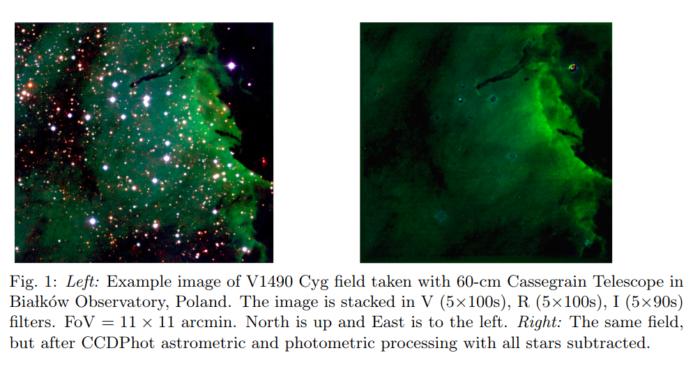

# arxiv一周文献泛读200608-200612

## 200608

高相关：

中相关：

### The FRB-SGR Connection

`https://arxiv.org/abs/2006.03468`

details

Author: J. I. Katz

The discovery that the Galactic SGR 1935+2154 emitted FRB 200428 simultaneous with a gamma-ray flare demonstrated the common source and association of these phenomena. If FRB radio emission is the result of coherent curvature radiation, the net charge of the radiating "bunches" or waves may be estimated. A statistical argument indicates that the radiating bunches must have a Lorentz factor ⪆10. The observed radiation frequencies indicate that their phase velocity (pattern speed) corresponds to Lorentz factors ⪆100. Coulomb repulsion implies that the electrons making up these bunches may have yet larger Lorentz factors, limited by their incoherent curvature radiation. These electrons also Compton scatter in the soft gamma-ray field of the SGR. In FRB 200428 the power radiated coherently at radio frequencies exceeded that of Compton scattering, but in more luminous SGR outbursts Compton scattering dominates, precluding the acceleration of energetic electrons. This explains the absence of a FRB associated with the giant 27 December 2004 outburst of SGR 1806−20. SGR with luminosity ≳10^42 ergs/s do not emit FRB, while those of lesser luminosity can do so.

- SGR 1935+2154 产生带有gamma-ray耀发的 FRB 200428 揭示了这几类现象的共同起源。
- 如果FRB射电辐射是相干曲率辐射(coherent curvature radiation)的结果，那么辐射“束(bunches)”或波中的净电量是可以估计的。
- 统计性的讨论表明辐射束的洛伦兹因子应该大于10，观测到的辐射频率表明他们的相速度相应的洛伦兹因子大于100。
- 库仑斥力意味着组成这些束的电子可能有更大的洛伦兹因子，但会受限于它们的非相干曲率辐射。这些电子在SGR的软伽玛射线区域也会受到（逆）康普顿散射。
- 在FRB 200428，射电波段相干辐射出的能量超过了由康普顿散射得到的能量，但在更亮的SGR爆发里，康普顿散射占主导，阻碍了高能电子的加速。
- 这解释了SGR 1806-20在2004年12月27日的一次强爆发没有发现成协的FRB。
- 光度超过$10^{42} erg/s$的SGR不会产生FRB，那些光度不那么强的则可以。

&emsp;

### Variability in Short Gamma-ray Bursts: Gravitationally Unstable Tidal Tails

`https://arxiv.org/abs/2006.03174`

details

Authors: Eric R. Coughlin, C. J. Nixon, Jennifer Barnes, Brian D. Metzger, R. Margutti
Comments: ApJ Accepted

Short gamma-ray bursts are thought to result from the mergers of two neutron stars or a neutron star and stellar mass black hole. The final stages of the merger are generally accompanied by the production of one or more tidal "tails" of ejecta, which fall back onto the remnant-disc system at late times. Using the results of a linear stability analysis, we show that if the material comprising these tails is modeled as adiabatic and the effective adiabatic index satisfies γ ≥ 5/3, then the tails are gravitationally unstable and collapse to form small-scale knots. We analytically estimate the properties of these knots, including their spacing along the tidal tail and the total number produced, and their effect on the mass return rate to the merger remnant. We perform hydrodynamical simulations of the disruption of a polytropic (with the polytropic and adiabatic indices γ equal), γ=2 neutron star by a black hole, and find agreement between the predictions of the linear stability analysis and the distribution of knots that collapse out of the instability. The return of these knots to the black hole induces variability in the fallback rate, which can manifest as variability in the lightcurve of the GRB and -- depending on how rapidly the instability operates -- the prompt emission. The late-time variability induced by the return of these knots is also consistent with the extended emission observed in some GRBs.

- 短暴一般认为是双中子星或中子星-黑洞并合产生的。在并合过程的结尾，抛射物通常会留下一个或多个抄袭“尾巴”(tidal tails)，这些物质会在晚些时候回落到并合残骸-吸积盘系统中。
- 通过线性稳定性分析(linear stability analysis)，显示如果这些尾巴中的物质是绝热的且有效绝热指数满足γ ≥ 5/3，那么这些尾巴就是引力不稳定的，并且会塌缩形成尺度小一些的结(knots)。随后进一步分析了这些knots的各种性质
- 做了中子星-黑洞并合的流体动力学模拟，发现线性稳定性分析的预测和由不稳定性产生的knots的分布是相符合的。
- 这些返回到黑洞的knots引起了回落率的变化，进一步反映为GRB的光变曲线的变化性以及瞬时辐射（取决于不稳定性有多块起作用）的变化上。另外，这些knots的回返产生的晚期变化也与在一些GRB中观测到的后延辐射(extended emission)吻合。

&emsp;

### The synchrotron maser emission from relativistic magnetized shocks: Dependence on the pre-shock temperature

`https://arxiv.org/abs/2006.03081`

details

Authors: Aliya-Nur Babul, Lorenzo Sironi

Electromagnetic precursor waves generated by the synchrotron maser instability at relativistic magnetized shocks have been recently invoked to explain the coherent radio emission of Fast Radio Bursts. By means of two-dimensional particle-in-cell simulations, we explore the properties of the precursor waves in relativistic electron-positron perpendicular shocks as a function of the pre-shock magnetization $\sigma ≳ 1$ (i.e., the ratio of incoming Poynting flux to particle energy flux) and thermal spread $\Delta \gamma ≡ kT/mc^2 = 10^{-5} - 10^{-1}$. We measure the fraction $f_\xi$ of total incoming energy that is converted into precursor waves, as computed in the post-shock frame. At fixed magnetization, we find that $f_\xi$ is nearly independent of temperature as long as $\Delta \gamma ≲ 10^{-1.5}$ (with only a modest decrease of a factor of three from $\Delta \gamma = 10^{-5}$ to $\Delta \gamma = 10^{-1.5}$), but it drops by nearly two orders of magnitude for $\Delta \gamma ≳ 10^{-1}$. At fixed temperature, the scaling with magnetization $f_\xi \sim 10^{-3} \sigma^{-1}$ is consistent with our earlier one-dimensional results. For our reference $\sigma = 1$, the power spectrum of precursor waves is relatively broad (fractional width ∼1−3) for cold temperatures, whereas it shows pronounced line-like features with fractional width ∼ 0.2 for $10^{-3} ≲ \Delta \gamma ≲ 10^{-1.5}$. For $\sigma ≳ 1$, the precursor waves are beamed within an angle $\simeq \sigma_{-1/2}$ from the shock normal (as measured in the post-shock frame), as required so they can outrun the shock. Our results can provide physically-grounded inputs for FRB emission models based on maser emission from relativistic shocks.

- 由相对论性磁化激波中同步辐射maser不稳定性产生的电磁先导波(electromagnetic precursor waves)最近被用来解释FRB的相干射电辐射。
- 通过二维particle-in-cell模拟，我们研究了在相对论性电子-介子垂直激波中的先导波的性质，作为激波前磁化程度$\sigma ≳ 1$以及热扩散$\Delta \gamma ≡ kT/mc^2 = 10^{-5} - 10^{-1}$的函数。
- 我们发现，在固定磁化程度的情况下，如果$\Delta \gamma ≲ 10^{-1.5}$，则所有注入能量中转化为先导波的那部分能量$f_\xi$的大小是与温度无显著相关的。而如果$\Delta \gamma ≳ 10^{-1}$，则$f_\xi$会减弱两个量级。如果温度固定，则$f_\xi \sim 10^{-3} \sigma^{-1}$符合早前的一维结果。
- 对于$\sigma = 1$，低温下的先导波的能谱相对较宽(fractional width ∼1−3)，尽管对于$10^{-3} ≲ \Delta \gamma ≲ 10^{-1.5}$（较高温）下的能普显示了fractional width ∼ 0.2的线状特征。
- 对于$\sigma ≳ 1$，先导波集束在大小约为$\simeq \sigma_{-1/2}$的角度内，比激波传播得更快。
- 我们的结果可以为基于相对论激波中maser辐射的FRB辐射模型提供physically-grounded输入。

&emsp;

### Pair separation in parallel electric field of a magnetar magnetosphere and narrow spectra of fast radio bursts

`https://arxiv.org/abs/2006.03270`

details

Authors: Yuan-Pei Yang, Jin-Ping Zhu, Bing Zhang, Xue-Feng Wu

When a magnetar magnetosphere is trigged by crustal deformations, an electric field $E_\parallel$ parallel to the magnetic field line would appear via Alvfén waves in the charge starvation region. If electron-positron pair bunches pre-exist, e.g., via some possible plasma instabilities, in the magnetosphere, these pairs will undergo charge separation in the$E_\parallel$ and in the meantime emit coherent curvature radiation. Following the approach of Yang & Zhang (2018), we find that the superposed curvature radiation becomes narrower due to charge separation, with the width of spectrum depending on the separation between the electron and positron clumps. This mechanism can interpret the narrow spectra of FRBs, in particular, the Galactic FRB 200428 recently detected in association with a hard X-ray burst from the Galactic magnetar SGR J1935+2154.

- 提出了一个解释FRB窄光谱的机制：电子-介子对在与磁星磁层平行的电场中会被分离，同时发出相干曲率辐射。该情景下的叠加的曲率辐射（的光谱）会变窄，其光谱宽度取决与电子簇和介子簇的分离程度。
- 可以用来解释FRB 200428 - SGR J1935+2154的窄光谱

&emsp;

低相关：

### A measurement of the Hubble constant from Type II supernovae

`https://arxiv.org/abs/2006.03412`

details

Authors: T. de Jaeger, B. E. Stahl, W. Zheng, A. V. Filippenko, A. G. Riess, L. Galbany
Comments: Submitted to MNRAS, comments welcome

Progressive increases in the precision of the Hubble-constant measurement via Cepheid-calibrated Type Ia supernovae (SNe Ia) have shown a discrepancy of ∼4.4σ with the current value inferred from Planck satellite measurements of the cosmic microwave background radiation and the standard ΛCDM cosmological model. This disagreement does not appear to be due to known systematic errors and may therefore be hinting at new fundamental physics. Although all of the current techniques have their own merits, further improvement in constraining the Hubble constant requires the development of as many independent methods as possible. In this work, we use SNe II as standardisable candles to obtain an independent measurement of the Hubble constant. Using 7 SNe II with host-galaxy distances measured from Cepheid variables or the tip of the red giant branch, we derive $H_0 = 75.8^{+5.2}_{−4.9} km s^{−1} Mpc^{−1}$ (statistical errors only). Our value favours that obtained from the conventional distance ladder (Cepheids + SNe Ia) and exhibits a difference of $8.4 km s^{−1} Mpc^{−1}$ from the Planck +ΛCDM value. Adding an estimate of the systematic errors ($2.8 km s^{−1} Mpc^{−1}$) changes the ∼1.7σ discrepancy with Planck +ΛCDM to ∼1.4σ. Including the systematic errors and performing a bootstrap simulation, we confirm that the local H0 value exceeds the value from the early Universe with a confidence level of 95%. As in this work we only exchange SNe II for SNe Ia to measure extragalactic distances, we demonstrate that there is no evidence that SNe Ia are the source of the H0 tension.

- 使用7个已知宿主距离的II型超新星,测出 $H_0 = 75.8^{+5.2}_{−4.9} km s^{−1} Mpc^{−1}$。
- 本地的H0值比早期宇宙的大。

 

## 200609

高相关：

中相关：

### Bayesian Time-Resolved Spectroscopy of GRB Pulses: α-Intensity Correlation

`https://arxiv.org/abs/2006.03797`

details

Authors: Husne Dereli Begue, Hoi-Fung Yu, Felix Ryde
Comments: A proceeding for the poster presented at the Yokohama GRB-GW 2019 conference

Gamma-ray bursts (GRBs) show different behaviours and trends intheir spectral evolution. One ofthe methods used to understand the physical origin of these behaviours is to study correlation betweenthe spectral fit parameters. In this work, we used a Bayesian analysis method to fit time-resolved spectra of GRB pulses that were detected by theFermi/GBM during its first 9 years of mission. We studied single pulsed long bursts (T90≥2 s). Among all the parameter correlations, we found that the correlation between the low-energy power-law index α and the energy flux exhibited a systematic behaviour. We presented the properties of the observed characteristics of this behaviour and interpreted it in the context of **the photospheric emission model**.

- 使用贝叶斯分析，拟合了GBM在前9年中探测到的单脉冲长爆（样本包含38个）的光谱，发现低能幂律谱指数α和流量（对数）存在关联，线性拟合斜率k在1-5之间，对于CPL平均值为2.80；对于BAND平均值为3.67。
- 这种相关性可以用光球层辐射来解释，其理论期望值约为3。
- 70%的长爆中上述斜率符合k=3。

&emsp;

### Plasmoid ejection by Alfvén waves and the fast radio bursts from SGR 1935+2154

`https://arxiv.org/abs/2006.04649`

details

Authors: Yajie Yuan, Andrei M. Beloborodov, Alexander Y. Chen, Yuri Levin
Comments: Submitted to ApJL

Using numerical simulations we show that low-amplitude Alfvén waves from a magnetar quake propagate to the outer magnetosphere and convert to "plasmoids" (closed magnetic loops) which accelerate from the star, driving blast waves into the magnetar wind. Quickly after its formation, the plasmoid becomes a thin relativistic pancake. It pushes out the magnetospheric field lines, and they gradually reconnect behind the pancake, generating a variable wind far stronger than the normal spindown wind of the magnetar. Repeating ejections drive blast waves in the amplified wind. We suggest that these ejections generate the simultaneous X-ray and radio bursts detected from SGR 1935+2154. A modest energy budget of the magnetospheric perturbation ∼$10^{40}$ erg is sufficient to produce the observed bursts with the energy ratio $\varepsilon_X / \varepsilon_{radio} \sim 10^5$. Our simulation predicts a narrow (a few ms) X-ray spike from the magnetosphere, arriving simultaneously with the radio burst emitted far outside the magnetosphere. This timing is caused by the extreme relativistic motion of the ejecta. 

- 数值模拟显示磁星地震(magnetar quake)产生的低振幅阿尔文波会传播至外部磁层，转化为等离子体团(plasmoids，闭合的磁回路)并获得加速，将冲击波朝驱向磁星风。
- 这些等离子团形成后很快变成一个相对论性的薄层(pancake)，将磁层磁力线向外推，（磁力线）又在薄层后重联，由此形成变化的星风。这样的星风比普通的磁星自旋减慢星风强得多。
- 该过程重复发生，增强星风，这些抛射物产生了SGR 1935+2154的X-ray和射电爆发的同时发生。
- 模拟预测有一个来自磁层的几ms的X-ray 脉冲(spikd)和一个磁层外部较远地区辐射的射电爆会同时到达。

&emsp;

### FRB 200428: an Impact between an Asteroid and a Magnetar?

`https://arxiv.org/abs/2006.04601`

details

Authors: Jin-Jun Geng, Bing Li, Long-Biao Li, Shao-Lin Xiong, Rolf Kuiper, Yong-Feng Huang

A fast radio burst was recently detected to be associated with a hard X-ray burst from the Galactic magnetar SGR 1935+2154. Scenarios involving magnetars for FRBs are hence highly favored. In this work, we suggest that the impact between an asteroid and a magnetar could explain such a detection. According to our calculations, an asteroid of mass $10^{20}$ g will be disrupted at $7×10^{9}$ cm when approaching the magnetar, the accreted material will flow along the magnetic field lines at Alfvén radius ∼$10^7$ cm. After falling onto the magnetar surface, an instant accretion column will be formed, producing a Comptonized X-ray burst and an FRB in the magnetosphere. We show that all the observational features could be interpreted self-consistently in our scenario. The quasi-periodic oscillations in this specific X-ray burst may help to verify our scenario. 

- 这篇文章提出了SGR 1935+2154产生FRB的另一种机制：小行星与磁星的相互作用。
- 一个质量为$10^{20}$ g的小行星在约$7×10^{9}$ cm的位置被瓦解吸积，吸积物质在大约$10^7$ cm的阿尔文半径会沿着磁力线运动。在落到磁星表面后，一个“瞬时吸积柱”(instant accretion column)将会形成，并产生康普顿散射的X射线爆发以及磁层中的一个FRB。
- 观测特征（大概是一些特征能量？）可用该情景自洽地解释。

&emsp;

### Future Simulations of Tidal Disruption Events

`https://arxiv.org/abs/2006.03693`

details

Authors: Julian H. Krolik, Philip J. Armitage, Yanfei Jiang, Giuseppe Lodato
Comments: A chapter in the ISSI review book "The Tidal Disruption of Stars by Massive Black Holes", to be published in Space Science Reviews

Tidal disruption events involve numerous physical processes (fluid dynamics, magnetohydrodynamics, radiation transport, self-gravity, general relativistic dynamics) in highly nonlinear ways, and, because TDEs are transients by definition, frequently in non-equilibrium states. For these reasons, numerical solution of the relevant equations can be an essential tool for studying these events. In this chapter, we present a summary of the key problems of the field for which simulations offer the greatest promise and identify the capabilities required to make progress on them. We then discuss what has been---and what cannot be---done with existing numerical methods. We close with an overview of what methods now under development may do to expand our ability to understand these events. 

- TDE事件涉及到许多高度非线性的物理过程（流体动力学，磁流体动力学，辐射转移，自引力，广义相对论动力学），并且TDE一般都处于非平衡态。因此，这些方程的数值解将会在研究这类事件中起关键作用。
- 本章总结了这方面的有希望用模拟方法解决的关键问，讨论了目前数值方法的发展情况。

&emsp;

### A Demonstration of Extremely Low Latency γ-ray, X-Ray & UV Follow-Up of a Millisecond Radio Transient

`https://arxiv.org/abs/2006.04550`

details

Authors: Aaron Tohuvavohu, Casey J. Law, Jamie A. Kennea, et al.
Comments: Technical note and capability update for the community. We encourage low latency FRB alerts from relevant facilities to enable this science

We report results of a novel high-energy follow-up observation of a potential Fast Radio Burst. The radio burst was detected by VLA/realfast and followed-up by the Neil Gehrels Swift Observatory in very low latency utilizing new operational capabilities of Swift (arXiv:2005.01751), with pointed soft X-ray and UV observations beginning at T0+32 minutes, and hard X-ray/gamma-ray event data saved around T0. These observations are >10x faster than previous X-ray/UV follow-up of any radio transient to date. No emission is seen coincident with the FRB candidate at T0, with a 0.2s fluence 5σ upper limit of $1.35×10^{−8} erg cm^{−2}$ (14-195 keV) for a SGR 1935+2154-like flare, nor at T0+32 minutes down to 3σ upper limits of 22.18 AB mag in UVOT u band, and $3.33×10^{−13} erg cm^{−2} s^{−1}$ from 0.3-10 keV for the 2 ks observation. The candidate FRB alone is not significant enough to be considered astrophysical, so this note serves as a technical demonstration. These new Swift operational capabilities will allow future FRB detections to be followed up with Swift at even lower latencies than demonstrated here: 15-20 minutes should be regularly achievable, and 5-10 minutes occasionally achievable. We encourage FRB detecting facilities to release alerts in low latency to enable this science. 

- 记录了对一次潜在FRB的快速反应观测：由VLA/realfast探测（2020.4.8），Swift做快速反应观测，软X-射线和UV波段的观测开始于T0+32分钟，硬X及gamma射线在T0左右就有数据保存。这些观测比以往任何一次对射电爆的X射线/UV跟踪观测都快10倍不止。
- 但在T0，没有观测到与FRB候选体相应的辐射，给出14-195 keV能段$1.35×10^{−8} erg cm^{−2}$ 上限；在32分钟时也没有观测到源,给出u波段22.18等的上限。
- 这次记录主要是证明Swift有能力对未来的FRB作出低延迟的跟踪观测。15-20分钟应该不成问题，5-10分钟应该也能偶尔达到。

&emsp;

低相关：

### Gamma-ray binaries

`https://arxiv.org/abs/2006.03615`

details

Authors: Maria Chernyakova, Denys Malyshev
Comments: Conference Proceedings: "Multifrequency Behaviour of High Energy Cosmic Sources" - XIII - MULTIF2019

Gamma-ray binaries are a subclass of high-mass binary systems whose energy spectrum peaks at high energies (E≳100 MeV) and extends to very high energies (E≳100 GeV) γ rays. In this review we summarize properties of well-studied non-transient γ-ray binaries as well as briefly discuss poorly known systems and transient systems hosting a microquasar. We discuss also theoretical models that have been used to describe spectral and timing characteristics of considered systems

- 总结了经详细研究的非暂现源γ-ray双星，也简单讨论了包含微类星体(microquasar)的未知系统和暂现系统以及一些理论模型。

 

## 200611

高相关：

### Optical Observations Reveal Strong Evidence for High Energy Neutrino Progenitor

`https://arxiv.org/abs/2006.04918`

details

Authors: V. M. Lipunov, V. G. Kornilov, K. K. Zhirkov, et al.
Comments: 17 pages, 3 figures, 1 Table accepted to The Astrophysical Journal Letters

We present the earliest astronomical observation of a high energy neutrino error box in which its variability was discovered after high-energy neutrinos detection. The one robotic telescope of the MASTER global international network (Lipunov et al. 2010) automatically imaged the error box of the very high-energy neutrino event IceCube-170922A. Observations were carried out in minute after the IceCube-170922A neutrino event was detected by the IceCube observatory at the South Pole. MASTER found the blazar TXS 0506+056 to be in the off-state after one minute and then switched to the on-state no later than two hours after the event. The effect is observed at a 50-sigma significance level. Also we present own unique 16-years light curve of blazar TXS 0506+056 (518 data set).

- MASTER的一个自动望远镜在Ice-Cube-170922A被探测到后快速自动对误差天区进行了观测。
- 发现在该中微子事件一分钟后，blazar TXS 0506+056处于沉默状态，而小于两小时后则处于活跃状态。TXS 0506+056很有可能与Ice-Cube-170922A有联系。
- 文章发布了对TXS 0506+056长达16年的光变观测数据。

 

中相关：

### Reverse Shocks in Short Gamma-Ray Bursts -- The case of GRB 160821B and prospects as gravitational-wave counterparts

`https://arxiv.org/abs/2006.05893`

details

Author: Gavin P Lamb
Comments: 3 pages, 2 figures - Proceedings of the Yamada Conference LXXI: Gamma-ray Bursts in the Gravitational Wave Era 2019, contribution talk

The shock system that produces the afterglow to GRBs consists of a forward- and a reverse-shock. For short GRBs, observational evidence for a reverse-shock has been sparse, however, the afterglow to GRB 160821B requires a reverse-shock at early times to explain the radio observations. GRB 160821B is additionally accompanied by the best-sampled macronova without a gravitational-wave detection, and an interesting late-time X-ray afterglow behaviour indicative of a refreshed-shock. The presence of an observed reverse-shock in an on-axis short GRB means that the reverse-shock should be considered as a potential counterpart to gravitational-wave detected mergers. As a gravitational-wave counterpart, the afterglow to an off-axis GRB jet can reveal the jet structure -- a reverse-shock will exist in these structured jet systems and the signature of these reverse-shocks, if observed, can indicate the degree of magnetisation in the outflow. Here we show the case of GRB 160821B, and how a reverse-shock will appear for an off-axis observer to a structured jet.

- 产生GRB余辉的激波系统一般由前向激波和逆向激波组成。逆向激波在短暴中的观测证据尚不充足。
- GRB 160821B 的余辉就需要用早期逆向激波的模型来解释射电波段的观测（可看作逆向激波的观测证据）。同时这一事件也伴随一个macronova，这个macronova有较多的观测数据(best-sampled)，但是没有探测到相关的引力波；另外GRB 160821B 晚期的X射线余辉行为或显示了一个refreshed shock。
- 在正轴短暴中观测到逆向激波，意味着逆向激波可以被视为由并合事件发出的引力波的一种潜在对应体。
- 偏轴GRB喷流的余辉可以反映喷流的结构，这些结构性的喷流中就存在逆向激波。如果这样的逆向激波被观测到，则可以作为外流磁化程度的指示。
- 这里介绍了GRB 160821B的情况，并展示了对于偏轴观测的情况下，结构性喷流中的逆向激波是看起来是什么样子的。

### The slow heartbeats of an ultra-luminous X-ray source in NGC 3621

`https://arxiv.org/abs/2006.05384`

details

Authors: S. E. Motta, M. Marelli, F. Pintore, P. Esposito, R. Salvaterra, A. De Luca, G. L. Israel, A.Tiengo, G.A.Rodríguez Castillo
Comments: Accepted for publication in ApJ. 13 pages, 6 figures

We report on the results of X-ray observations of 4XMM J111816.0-324910, a transient ultra-luminous X-ray source located in the galaxy NGC 3621. This system is characterised by a transient nature and marked variability with characteristic time-scale of ~3500 s, differently from other ULXs, which in the vast majority show limited intra-observation variability. Such a behaviour is very reminiscent of the so-called heartbeats sometimes observed in the Galactic black hole binary GRS 1915+105, where the variability time-scale is ~10-1000 s. We study the spectral and timing properties of this object and find that overall, once the differences in the variability time-scales are taken into account, they match quite closely those of both GRS 1915+105, and of a number of objects showing heartbeats in their light-curves, including a confirmed neutron star and a super-massive black hole powering an active galactic nucleus. We investigate the nature of the compact object in 4XMM J111816.0-324910 by searching for typical neutron star signatures and by attempting a mass estimate based on different methods and assumptions. Based on the current available data, we are not able to unambiguously determine the nature of the accreting compact object responsible for the observed phenomenology. 

- 4XMM J111816.0-324910是一个位于NGC 3621星系的超亮X射线暂现源(ultra-luminous X-ray source, ULX)，它有显著的变化性，特征变化时标约3500s，不同于其它ULX（应该是比较大）。
- 该目标的光谱和光变特性与那些在光变曲线中显现“心跳”的目标比较像，这些目标中包括银河系双黑洞GRS 1915+105，一个以确认的中子星和一个驱动AGN的超大质量黑洞。
- 基于现有的数据，文章探索了4XMM J111816.0-324910背后的致密星的性质（寻找典型中子星的特征，尝试估计质量），但还是不能给出明确的答案。

 

低相关：

### On the Origin of the Gamma-Ray Emission toward SNR CTB 37A with Fermi-LAT

`https://arxiv.org/abs/2006.05731`

details

Authors: Soheila Abdollahi, Jean ballet, Yasushi Fukazawa, Hideaki Katagiri, Benjamin Condon
Comments: 16 pages, 3 figures, to be published in The Astrophysical Journal

The middle-aged supernova remnant (SNR) CTB 37A is known to interact with several dense molecular clouds through the detection of shocked H2 and OH 1720 MHz maser emission. In the present work, we use eight years of Fermi-LAT Pass 8 data, with an improved point-spread function and an increased acceptance, to perform **detailed morphological and spectral studies of the γ-ray emission toward CTB 37A from 200 MeV to 200 GeV**. The best fit of the source extension is obtained for a very compact Gaussian model with a significance of 5.75σ and a 68\% containment radius of 0.116∘ ± 0.014∘stat ± 0.017∘sys above 1 GeV, which is larger than the TeV emission size. The energy spectrum is modeled as a LogParabola, resulting in a spectral index α = 1.92 ± 0.19 at 1 GeV and a curvature β = 0.18 ± 0.05, which becomes softer than the TeV spectrum above 10 GeV. The SNR properties, including a dynamical age of 6000 yr, are derived assuming the Sedov phase. From the multiwavelength modeling of emission toward the remnant, we conclude that the nonthermal radio and GeV emission is mostly due to the reacceleration of preexisting cosmic rays (CRs) by radiative shocks in the adjacent clouds. Furthermore, the observational data allow us to constrain the total kinetic energy transferred to the trapped CRs in the clouds. Based on these facts, we infer a composite nature for CTB 37A to explain the broadband spectrum and to elucidate the nature of the observed γ-ray emission.

- 这篇文章使用LAT8年的数据，对超新星残骸 CTB 37A 的所辐射的伽玛射线(200 MeV - 200 GeV)的来源做了研究（光谱研究和形态学研究）。已知CTB 37A与几个稠密的分子云相互作用。
- 从多波段拟合的结果来看，非热的射电和GeV辐射大概率是由先前存在的宇宙线被邻近星云中的辐射激波(radiative shocks in the adjacent clouds)重新加速的结果。
- 另外文章还认为，CTB 37A是一个复合系统(composite system)，其外壳内部可能存在一个pulsar wind nebula (PWN)，辐射TeV和硬X射线；SNR shock则辐射射电，软X和GeV伽玛射线。

 

### Towards an automatic processing of CCD images with CPCS 2.0

`https://arxiv.org/abs/2006.05160`

details

Authors: Pawel Zielinski, Lukasz Wyrzykowski, Przemyslaw Mikolajczyk, et al.
Comments: 4 pages, 1 figure, to appear on the Proceedings of the XXXIX Assembly of the Polish Astronomical Society (9-12.09.2019, Olsztyn, Poland)

We present a new automatic tool for time-domain astronomy - the Cambridge Photometric Calibration Server 2.0 - developed under OPTICON H2020 programme. It has been designed to respond to the need of automated rapid photometric data calibration and dissemination for transient events, primarily from Gaia space mission. CPCS has been in operation since 2013 and has been used to calibrate around 130 000 observations of hundreds of transients. We present the status of this tool's development and demonstrate improvements made in the second version. The tests present the ability to combine CCD imaging data from multiple telescopes and a whole variety of instruments. New tool provides science-ready photometric data within minutes from observations in the automatic manner.

- 一个还在开发中的在线CCD图像处理和测光工具CPCS 2.0，基于OPTICON H2020项目(http://astro-opticon.org)。
- 老版网站：http://gsaweb.ast.cam.ac.uk/followup

 

## 200612

高相关：

中相关：

### The variable radio counterpart of Swift J1858.6-0814

`https://arxiv.org/abs/2006.06425`

details

Authors: J. van den Eijnden, N. Degenaar, T. D. Russell et al.
Comments: 14 pages, 8 figures, 3 tables; accepted for publication in MNRAS

Swift J1858.6-0814 is a transient neutron star X-ray binary discovered in October 2018. Multi-wavelength follow-up observations across the electromagnetic spectrum revealed many interesting properties, such as erratic flaring on minute timescales and evidence for wind outflows at both X-ray and optical wavelengths, strong and variable local absorption, and an anomalously hard X-ray spectrum. Here, we report on a detailed radio observing campaign consisting of one observation at 5.5/9 GHz with the Australia Telescope Compact Array, and nine observations at 4.5/7.5 GHz with the Karl G. Jansky Very Large Array. A radio counterpart with a flat to inverted radio spectrum is detected in all observations, consistent with a compact jet being launched from the system. Swift J1858.6-0814 is highly variable at radio wavelengths in most observations, showing significant variability when imaged on 3-to-5-minute timescales and changing up to factors of 8 within 20 minutes. The periods of brightest radio emission are not associated with steep radio spectra, implying they do not originate from the launching of discrete ejecta. We find that the radio variability is similarly unlikely to have a geometric origin, be due to scintillation, or be causally related to the observed X-ray flaring. Instead, we find that it is consistent with being driven by variations in the accretion flow propagating down the compact jet. We compare the radio properties of Swift J1858.6-0814 with those of Eddington-limited X-ray binaries with similar X-ray and optical characteristics, but fail to find a match in radio variability, spectrum, and luminosity.

- Swift J1858.6-0814是一个暂现的中子星X射线双星，发现于2018年10月。
- 对该目标的多波段观测显示出了一些有趣的性质，例如分钟时标的不稳定耀发(erratic flaring on minute timescales)和X射线及光学波段星风外流(wind outflow)的证据、强烈且变化的局部吸收(absorption)、反常的硬X射线光谱。
- 这篇文章报道了对该目标详细的射电观测，观测包括使用Australia Telescope Compact Array在5.5/9 GHz进行的一次观测和用Karl G. Jansky Very Large Array在4.5/7.5 GHz进行的九次观测。
- 所有观测中都显现了一个射电谱从平缓($\alpha > 0$)到inverted($\alpha > 1$)变化的射电源，符合致密喷流从系统中喷发的情景。
- 射电辐射在最亮的阶段并没有呈现陡峭的射电谱(steep radiao spectra)，表明这些辐射并非来自分立单独的ejecta。
- 发现射电辐射的变化不大可能来自几何因素，也可也排除来自于闪烁(scinllation)和X-ray耀发的可能。这种变化性可能来自于沿致密喷流传播的吸积流本身的变化性，这种变化性可能来自于吸积盘中的质量吸积率的波动。
- 最后比较了该源的射电性质与其它显示出相似X射线耀发行为的LMXB的射电行为，但没有找到射电行为相似的其它事件。

 

### A Variable X-ray Source Close to the Magnetar SGR 1935+2154

`https://arxiv.org/abs/2006.06407`

details

Authors: A. K. H. Kong, K. L. Li, S. Kim, C. Y. Hui
Comments: 3 pages, 1 figure; Published in RNAAS

The recent discovery of a millisecond radio burst from the Galactic magnetar SGR 1935+2154 has initiated an intense discussion about the connection between magnetars and fast radio bursts (FRBs). Although some properties of the radio burst from SGR 1935+2154 are not the same as cosmological FRBs, there are theoretical models which propose a connection between magnetars and FRBs (see review by Margalit et al. 2020). In particular, the role of a magnetar wind nebula is included in some models, and therefore it is worthwhile to investigate the X-ray environment of SGR 1935+2154 in more detail. Here, we report on the discovery of an X-ray transient feature near SGR 1935+2154 using archival Chandra data and discuss its possible origin.

- 这篇文章分析了SGR 1935+2154附近（西南方向约3角秒）的一个X射线暂现源的观测数据（包括拟合其能谱），并讨论了该X射线暂现源的可能起源，其中比较有可能的起源是磁星风星云或外流(magnetarwind nebula or outflow)。

 

### Tidal disruption events in the first billion years of a galaxy

`https://arxiv.org/abs/2006.06565`

details

Authors: Hugo Pfister, Jane Dai, Marta Volonteri, Katie Auchettl, Maxime Trebitsch, Enrico Ramirez-Ruiz
Comments: submitted to MNRAS, 13 pages.

Accretion of stars on massive black holes (MBHs) can feed MBHs and generate tidal disruption events (TDEs). We introduce a new physically motivated model to self-consistently treat TDEs in cosmological simulations, and apply it to the assembly of a galaxy with final mass $3×10^{10}M_{\odot}$ at z=6. This galaxy exhibits a TDE rate of ∼$10^{−5}yr^{−1}$, consistent with local observations but already in place when the Universe was one billion year old. A fraction of the disrupted stars participate in the growth of MBHs, dominating it until the MBH reaches mass ∼ $5×10^5 M_{\odot}$, but their contribution then becomes negligible compared to gas. TDEs could be a viable mechanism to grow light MBH seeds, but fewer TDEs are expected when the MBH becomes sufficiently massive to reach the luminosity of, and be detected as, an active galactic nucleus. Galaxy mergers bring multiple MBHs in the galaxy, resulting in an enhancement of the global TDE rate in the galaxy by ∼1 order of magnitude during 100Myr around mergers. This enhancement is not on the central MBH, but caused by the presence of MBHs in the infalling galaxies. This is the first self consistent study of TDEs in a cosmological environment and highlights that accretion of stars and TDEs are a natural process occurring in a Milky~Way-mass galaxy at early cosmic times.

- 在大质量黑洞吸积周围的恒星时会产生TDE事件。
- 这篇文章针对大质量黑洞(MBH)的吸积和TDE事件的产生提出了新的物理模型，并依此在多星系并合的情景下进行了宇宙学模拟(cosmological simulations)。合并星系最终的质量是$3×10^{10}M_{\odot}$，红移为6，TDE发生率为$10^{−5}yr^{−1}$，并且在宇宙十亿岁的时候已经存在。
- 主要结论如下：
  - TDE中被瓦解的部分星星参与了MBH的质量增长，且在黑洞质量达到$5×10^5 M_{\odot}$之前，TDE对质量增长的贡献占主导，即TDE对MBH的早期(300Myr)成长做了主要贡献。随着黑洞质量的增加，TDE的发生率会减小。在$5×10^5 M_{\odot}$之后，做出主要贡献是气体，TDE的贡献可忽略。
  - 星系合并使得星系中MBH增多，导致整体的TDE发生率在之后的100Myr中升高约一个量级。
  - 一些质量与银河系相当的z>6的星系现在已经有了比较可信的TDE发生率：$10^{-5} - 10^{-4} yr^{-1}$，与本地估计相当。
- 文章称这是第一个在宇宙学环境中对TDE的自洽研究，强调了在早期宇宙中，恒星吸积和TDE事件在一个类银河系的星系中是自然发生的过程。

 

低相关：

### THESEUS−BTA cosmological tests using Multimessenger Gamma-Ray Bursts observations

`https://arxiv.org/abs/2006.06488`

details

Authors: S. I. Shirokov, I. V. Sokolov, V. V. Vlasyuk, L. Amati, V. V. Sokolov, Yu. V. Baryshev
Comments: 22 pages, 4 figures, accepted for publication in Astrophys. Bulletin June 10 2020

Modern Multimessenger Astronomy opens unique possibility for performing cosmological tests of the Standard Cosmological Model in the wide redshift interval up to z∼10. This is principally important for recent discussion related to discrepancies between local and global measurements of cosmological parameters. We present a review of multimessenger Gamma-Ray Bursts observations currently performed and planed for THESEUS-BTA cooperative program. Such observations allow testing the fundamental basis of cosmological models: gravitation theory; cosmological principle of homogeneity and isotropy of the large scale matter distribution; and space expansion paradigm. Important role of different selection effects, which lead to systematic distortions of the true cosmological relations, is discussed.

- THESEUS: Transient High Energy Sky and Early Universe Surveyor; BTA: 6m SAO telescope.
- 文章主要介绍了利用GRB的多波段观测来检验标准宇宙学模型,例如：
  - BTA对THESEUS的GRB的光学对应体的证认和监测，以及对中微子和引力波信号的证认监测，可以用于检验作为SCM基础的引力理论。
  - THESEUS的大量GRB以及BTA的宿主星系观测可用于检验宇宙大尺度空间中的均匀性和各向同性。
  - 通过构建高红移GRB的哈勃图以及比较多波段观测的时间延迟，可以检验space expansion paradigm。

