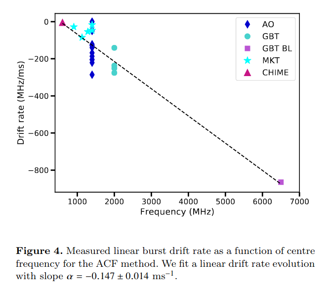
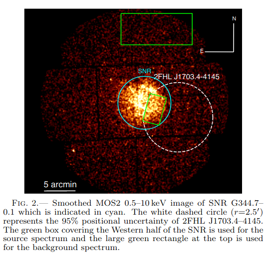
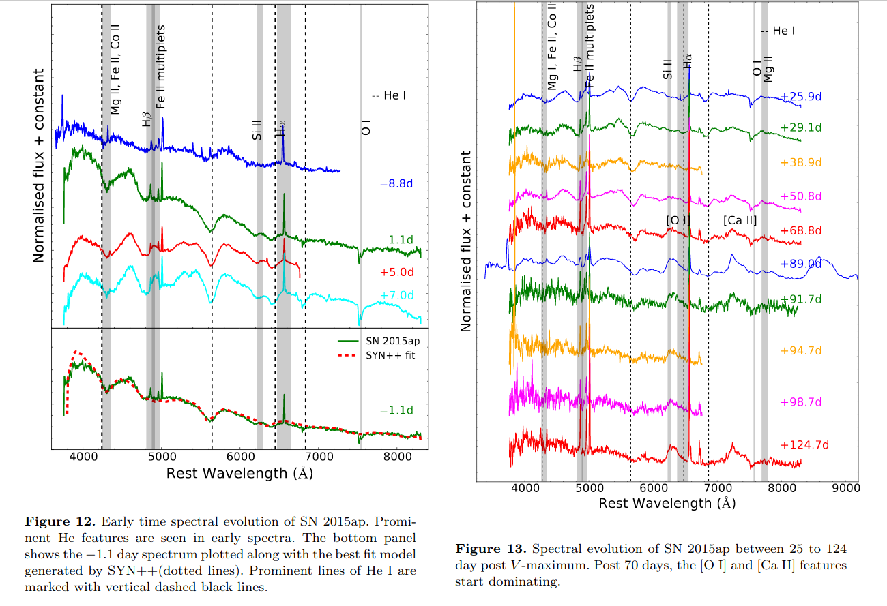
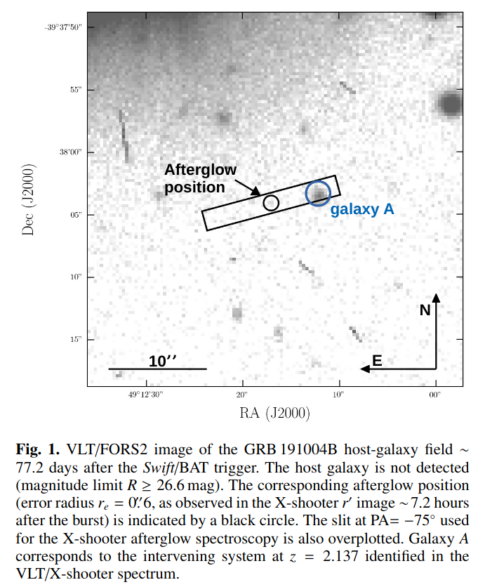
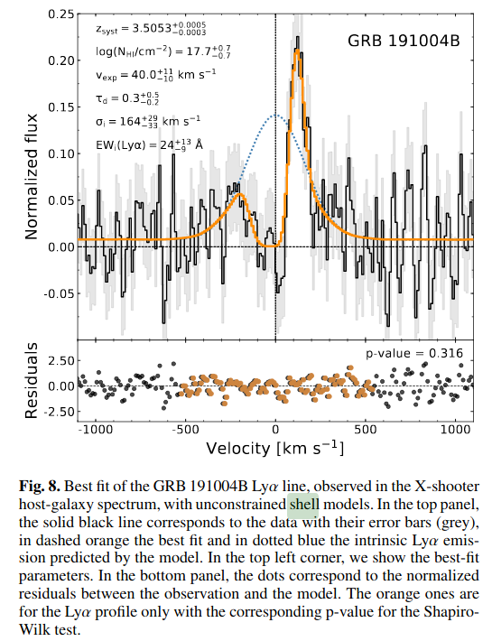
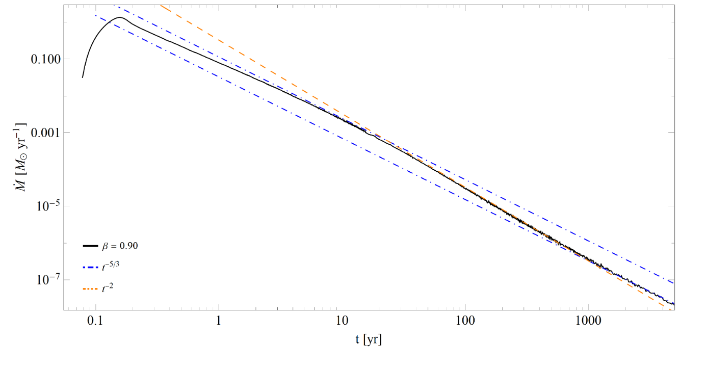
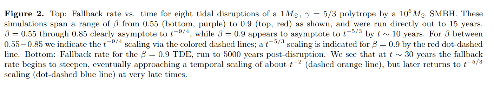
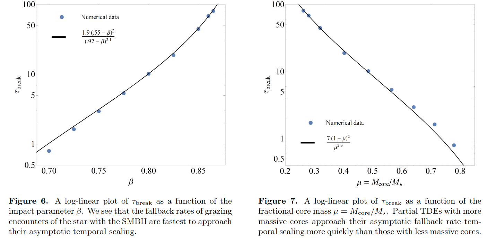

# arxiv一周文献泛读200615-200619

## 200617

高相关：

### Simultaneous multi-telescope observations of FRB 121102

`https://arxiv.org/abs/2006.08662`

details

Authors: M. Caleb, B. W. Stappers, T. D. Abbott et al.
Comments: Accepted for publication in MNRAS

We present 11 detections of FRB 121102 in ~3 hours of observations during its 'active' period on the 10th of September 2019. The detections were made using the newly deployed MeerTRAP system and single pulse detection pipeline at the MeerKAT radio telescope in South Africa. Fortuitously, the Nancay radio telescope observations on this day overlapped with the last hour of MeerKAT observations and resulted in 4 simultaneous detections. The observations with MeerKAT's wide band receiver, which extends down to relatively low frequencies (900-1670 MHz usable L-band range), have allowed us to get a detailed look at the complex frequency structure, intensity variations and frequency-dependent sub-pulse drifting. The drift rates we measure for the full-band and sub-banded data are consistent with those published between 600-6500 MHz with a slope of -0.147 +/- 0.014 ms^-1. Two of the detected bursts exhibit fainter 'precursors' separated from the brighter main pulse by ~28 ms and ~34 ms. A follow-up multi-telescope campaign on the 6th and 8th October 2019 to better understand these frequency drifts and structures over a wide and continuous band was undertaken. No detections resulted, indicating that the source was 'inactive' over a broad frequency range during this time.

- 这篇文章介绍了在2019年9月10日对处于活跃状态的FRB 121102（z~0.2）进行的约3小时的11次探测。这些探测使用的是在南非的MeerKAT望远镜新部署的MeerTRAP系统和单脉冲探测管线(single pulse detection pipeline)。
- 巧合的是，Nancay望远镜在这天也对该目标进行了观测，且其观测与MeerKAT最后一小时的观测重叠，这就有了4个同时被探测的爆发（08,09,10,11）。
- 利用MeerKAT的可延伸到较低频段（900-1670 MHz的可用L波段范围）的宽频接收器，我们得以详细了解复杂的频率结构（比如？），强度变化以及与频率相关的子脉冲漂移（sub-pulse drift，大概是一些次级脉冲结构随时间会在频谱上移动，即频率发生变化）。

- 本文测量（ACF方法，Auto-Correction Function）的全频段（full-band）以及子频段（sub-banded）数据的漂移率填补了600-1400MHz的漂移率空白，且与在600-6500MHz之间发布的斜率为$-0.147 \pm 0.014 ms^{-1}$的漂移率分布相一致。

- 有两次探测到的爆发显示出较弱的前兆，分别在更亮的主脉冲前28ms和34ms。
- 19年10月6号和8号进行了后续的多望远镜观测以期更好的了解宽连续频带上的这些频率漂移和结构，但没有探测到目标，表示在此期间，源在较宽的频率范围内处于非活动状态。

 

中相关：

### Gamma-ray emission revealed at the western edge of SNR G344.7-0.1

`https://arxiv.org/abs/2006.08757`

details

Authors: J. Eagle, S. Marchesi, M. Ajello, D. Castro, A. Vendrasco
Comments: 9 pages, 6 figures

We report on the investigation of a very high energy (VHE), Galactic gamma-ray source recently discovered at >50GeV using the Large Area Telescope (LAT) on board the Fermi Gamma-Ray Space Telescope. This object, 2FHL J1703.4-4145, displays a very hard >50GeV spectrum with a photon index ~1.2 in the 2FHL catalog and, as such, is one of the most extreme sources in the 2FHL sub-sample of Galactic objects. A detailed analysis of the available multi-wavelength data shows that this source is located on the western edge of the supernova remnant (SNR) G344.7--0.1, along with extended TeV source, HESS J1702-420. The observations and the spectral energy distribution modeling support a scenario where this gamma-ray source is the byproduct of the interaction between the SNR shock and the dense surrounding medium, with escaping cosmic rays (CRs) diffusing into the dense environment and interacting with a large local cloud, generating the observed TeV emission. If confirmed, an interaction between the SNR CRs and a nearby cloud would make 2FHL J1703.4-4145 another promising candidate for efficient particle acceleration of the 2FHL Galactic sample, following the first candidate from our previous investigation of a likely shock-cloud interaction occurring on the West edge of the Vela SNR.

- 这篇文章研究了最近用Fermi/LAT在50GeV以上能段探测到的系内伽玛射线源2FHL J1703.4-4145的情况。
- 该源展现了非常硬的光谱，光子指数约为1.2，是2FHL中系内源部分最极端的源之一。
- 对现有的多波段数据的详细分析显示，这个伽玛射线源位于SNR G344.7--0.1的西侧边缘，其附近还有一个TeV扩展源(extended TeV source)HESS J1702-420。
- 观测以及对光谱能量分布进行拟合的模型显示这个伽玛射线源是SNR激波与周围的致密介质相互作用的副产物，且从SNR逃逸的被激波加速的宇宙射线(escaping cosmic rays)被分散到致密环境介质中，与附近大尺度的分子云(large local cloud)发生作用并产生观测到的TeV辐射。
- 如果这一情景被证实，则SNR CRs和附近的分子云相互作用的机制就可以使2FHL J1703.4-4145成为2FHL系内样本中另一个有希望的高效粒子加速的候选体。

 

### Evidence of a Type Ia Progenitor for Supernova Remnant 3C 397m

`https://arxiv.org/abs/2006.08681`

details

Authors: Héctor Martínez-Rodríguez, Laura A. Lopez, Katie Auchettl et al.
Comments: 9 pages, 4 figures, submitted to MNRAS

The explosive origin of the young supernova remnant (SNR) 3C 397 (G41.1-0.3) is debated. Its elongated morphology and proximity to a molecular cloud are suggestive of a core-collapse (CC) SN origin, yet recent X-ray studies of heavy metals show chemical yields and line centroid energies consistent with a Type Ia SN. In this paper, we analyze the full X-ray spectrum from 0.7-10 keV of 3C 397 observed with Suzaku and compare the line centroid energies, fluxes, and elemental abundances of intermediate-mass and heavy metals (Mg to Ni) to Type Ia and CC hydrodynamical model predictions. Based on the results, we conclude that 3C 397 likely arises from an energetic Type Ia explosion in a high-density ambient medium, and we show that the progenitor was a near Chandrasekhar mass white dwarf.

- 这篇文章讨论了年轻的超新星遗迹 SNR 3C 397的爆炸起源。
- 这个SNR的拉长的形态和接近分子云的位置似乎显示它的起源是核塌缩型超新星，但最近对重金属的X射线研究显示其化学产生情况(chemical yields)和线心能量(line centroid energy)与Ia型超新星一致。
- 本文分析了用Suzaku观测到的0.7-10keV的全X射线光谱，并将中等质量和重金属(Mg 到 Ni)的线心能量、流量和元素丰度（前两者使用唯象模型测量，后者用多个NEI成分拟合测量）与分别在CC模型和Ia型模型下的流体力学预测值进行比较。
- 根据结果，文章认为这个超新星遗迹更可能是由高密度环境介质中的高能Ia型爆发产生的，且其前身是一个接近Chandrasekhar质量的白矮星(通过计算元素质量比$M_{Si} / M_{Fe} = 0.09 \sim m=1.06-1.15 M_\odot$)。

 

低相关：

 

## 200618

高相关：

### Optical studies of two stripped envelope supernovae SN 2015ap (Type Ib) and SN 2016P (Type Ic)

`https://arxiv.org/abs/2006.09810`

details

Authors: Anjasha Gangopadhyay, Kuntal Misra, D. K. Sahu et al.
Comments: 22 pages, 21 Figures, Accepted for publication in MNRAS

We present the photometric and spectroscopic studies of a Type Ib SN 2015ap and a Type Ic SN 2016P. SN 2015ap is one of the bright ($M_V$ = −18.04 mag) Type Ib while SN 2016P lies at an average value among the Type Ic SNe ($M_V$ = −17.53 mag). Bolometric light curve modelling of SNe 2015ap and 2016P indicates that both the SNe are powered by $Ni^{56}$ + magnetar model with  $Ni^{56}$ masses of 0.01 $M_⊙$ and 0.002 $M_⊙$, ejecta masses of 3.75 $M_⊙$ and 4.66 $M_⊙$, spin period $P_0$ of 25.8 ms and 36.5 ms and magnetic field $B_p$ of $28.39 × 10^{14}$ Gauss and $35.3 × 10^{14}$ Gauss respectively. The early spectra of SN 2015ap shows prominent lines of He with a "W" feature due to Fe complexes while other lines of Mg II, Na I and Si II are present in both SNe 2015ap and 2016P. Nebular phase [O I] profile indicates an asymmetric profile in SN 2015ap. The [O I]/[Ca II] ratio and nebular spectral modelling of SN 2015ap hints towards a progenitor mass between 12 − 20 $M_⊙$.

- 本文对Ib型超新星SN 2015ap和Ic型超新星SN 2016P进行了测光和测谱研究。
- SN 2015ap是一个较亮的Ib型（$M_V$ = −18.04 mag），而SN 2016P则是一个亮度处平均水平的Ic型超新星（$M_V$ = −17.53 mag）。
- 对二者的bolometric（用至少三个波段的数据进行黑体谱拟合）光变曲线的模型拟合显示两个超新星都是由 $Ni^{56}$ + 磁星模型驱动的，$Ni^{56}$质量分别为 0.01 $M_⊙$ 和 0.002 $M_⊙$，喷射物质量分别为 3.75 $M_⊙$ 和 4.66 $M_⊙$，自旋周期分别为25.8 ms 和 36.5 ms，磁场强度分别为$28.39 × 10^{14}$ Gauss 和 $35.3 × 10^{14}$ Gauss。

- SN 2015ap的早期光谱显示出显著的He线以及一个由Fe complexes造成的“W”型特征（4000埃左右）。同时两个超新星的光谱都包含MgII，Na I 和 Si II线。
- 星云阶段的[O I]的profile显示SN 2015ap中存在一个不对称的profile。SN 2015ap的[O I]/[Ca II]比值和星云光谱模型拟合显示其前身质量在12-20$M_⊙$之间。

中相关：

### Lyman continuum leakage in faint star-forming galaxies at redshift z=3-3.5 probed by gamma-ray bursts

`https://arxiv.org/abs/2006.09377`

details

Authors: J.-B. Vielfaure, S. D. Vergani, J. Japelj et al.
Comments: 13 pages, 9 figures. Abridged abstract. Accepted for publication in A&A

Context. The identification of the sources that reionized the Universe and their specific contribution to this process are key missing pieces of our knowledge of the early Universe. Faint star-forming galaxies may be the main contributors to the ionizing photon budget during the epoch of reionization (EoR), but their escaping photons cannot be detected directly due to inter-galactic medium opacity. Hence, it is essential to characterize the properties of faint galaxies with significant Lyman continuum (LyC) photon leakage up to z∼4 to define indirect indicators allowing analogs to be found at the highest redshift.

- 背景：对使宇宙再电离的源以及它们对再电离的贡献的确认，将填补对早期宇宙认知的空缺。在再电离期间（EoR），形成恒星（star-forming）的暗星系可能是电离光子的主要贡献者，但它们的逃逸光子由于星系间介质的不透明性而不能直接被探测到。因此，对红移高至z ~ 4的有显著Lyman连续光子（Lyman continuum (LyC) photon）泄漏的暗星系进行间接研究是非常重要的。

Aims. Long gamma-ray bursts (LGRB) explode typically in star-forming regions of faint, star-forming galaxies. Through LGRB afterglow spectroscopy it is possible to detect directly LyC photons. Our aim is to use LGRBs as tools to study LyC leakage from faint, star-forming galaxies at high redshift.

- 目标：长伽玛爆一般发生在形成恒星的暗星系的恒星形成区域。有可能通过长爆余辉的光谱直接发现LyC光子。本文的目的就是以长爆为工具研究高红移形成恒星的暗星系的LyC泄漏。
- 也就是去寻找这些星系产生的LyC光子中能够逃出当地局部环境以电离星系间介质的那部分光子的占比。

Methods. Here we present the observations of LyC emission in the afterglow spectra of GRB 191004B at z=3.5055, together with those of the other two previously known LyC-emitting LGRB (GRB 050908 at z=3.3467, and GRB 060607A at z=3.0749), to determine their LyC escape fraction and compare their properties.

- 文章展示了对z=3.5055的GRB 191004B余辉光谱中的LyC发射的观测情况，以及已知的另两个同样发射LyC的长爆（GRB 050908  z=3.3467, 和 GRB 060607A  z=3.0749）的观测情况，以确定它们的LyC逃逸占比并比较它们的性质。

Results. From the afterglow spectrum of GRB 191004B we determine a neutral hydrogen column density at the LGRB redshift of $log(N_{HI}/cm^{−2})=17.2±0.15$, and negligible extinction ($A_V$=0.03±0.02 mag). The only metal absorption lines detected are $C_{iv}$ and $Si_{iv}$. In contrast to GRB 050908and GRB 060607A, the host galaxy of GRB 191004B displays significant Ly α emission. From its Ly α emission and the non-detection of Balmer emission lines we constrain its star-formation rate (SFR) to 1≤SFR≤4.7 $Myr^{−1}$. We fit the Ly α emission with a $shell$ model and find parameters values consistent with the observed ones. The absolute (relative) LyC escape fractions we find for GRB 191004B, GRB 050908 and GRB 060607A are of $0.35^{+0.10}_{−0.11}$($0.43^{+0.12}_{−0.13}$), $0.08^{+0.05}_{−0.04}$($0.08^{+0.05}_{−0.04}$) and $0.20^{+0.05}_{−0.05}$($0.45^{+0.15}_{−0.15}$), respectively. We compare the LyC escape fraction of LGRBs to the values of other LyC emitters found from the literature, showing that LGRB afterglows can be powerful tools to study LyC escape for faint high-redshift star-forming galaxies. Indeed we could push LyC leakage studies to much higher absolute magnitudes. The host galaxies of the three LGRBpresented here have all $M_{1600}$>−19.5 mag, with the GRB 060607A host at $M_{1600}>−16$ mag. LGRB hosts may therefore be particularly suitable for exploring the ionizing escape fraction in galaxies that are too faint or distant for conventional techniques. Furthermore the time investment is very small compared to galaxy studies.

- 根据GRB 191004B的余辉光谱，文章得出了一个中等的氢柱密度$log(N_{HI}/cm^{−2})=17.2±0.15$，以及可忽略的消光值$A_V$=0.03±0.02 mag。
- 唯一检测到的金属吸收线是$C_{iv}$和$Si_{iv}$。
- 与GRB 050908和GRB 060607A相比，GRB 191004B的宿主星系显示出显著的Ly α发射。从其Ly α发射以及没有探测到Balmer发射的情况，文章将宿主星系的恒星形成率（SFR）限制在1 ≤ SFR ≤ 4.7 $Myr^{−1}$。
- 文章使用了一个shell模型拟合了Ly α发射，得到的拟合参数与观测符合。
- GRB 191004B, GRB 050908 和 GRB 060607A的绝对（相对）LyC逃逸占比分别为$0.35^{+0.10}_{−0.11}$($0.43^{+0.12}_{−0.13}$), $0.08^{+0.05}_{−0.04}$($0.08^{+0.05}_{−0.04}$) 和 $0.20^{+0.05}_{−0.05}$($0.45^{+0.15}_{−0.15}$)。
- 文章将LGRBs的LyC逃逸占比与文献中其他被发现的LyC发射源的LyC逃逸占比进行了比较，表明LGRB余辉可以成为研究高红移恒星形成的暗星系的LyC逃逸的有力工具。进一步的，LGRB也非常适合成为研究那些对于传统技术来说太弱或太远的星系的电离逃逸占比。

 

### Fallback Rates from Partial Tidal Disruption Events

`https://arxiv.org/abs/2006.09375`

details

Authors: Patrick R. Miles, Eric R. Coughlin, C. J. Nixon
Comments: Accepted for publication in The Astrophysical Journal, 13th June 2020. 11 pages, 8 figures

A tidal disruption event (TDE) occurs when a star plunges through a supermassive black hole's tidal radius, at which point the star's self-gravity is overwhelmed by the tidal gravity of the black hole. In a partial TDE, where the star does not reach the full disruption radius, only a fraction of the star's mass is tidally stripped while the rest remains intact in the form of a surviving core. Analytical arguments have recently suggested that the temporal scaling of the fallback rate of debris to the black hole asymptotes to $t^{−9/4}$ for partial disruptions, effectively independently of the mass of the intact core. We present hydrodynamical simulations that verify the existence of this predicted, $t^{−9/4}$ scaling. We also define a break timescale -- the time at which the fallback rate transitions from a $t^{−5/3}$ scaling to the characteristic $t^{−9/4}$ scaling -- and measure this break timescale as a function of the impact parameter and the surviving core mass. These results deepen our understanding of the properties and breadth of possible fallback curves expected from TDEs and will therefore facilitate more accurate interpretation of data from wide-field surveys.

- 本文讨论了局部潮汐瓦解事件（partial TDE）的回落率的问题。
- 在局部潮汐瓦解事件中，恒星没有达到完全瓦解半径，只有一小部分恒星的质量被潮汐剥离，而其余的以幸存下来的核的形式保持完整。
- 最近的分析表明，对这类事件，碎片到黑洞的回落率的时间变化（time scaling）渐近于$t^{−9/4}$，且与幸存核的质量无关。本文使用了流体动力学模拟，证实了这一预测。
- 本文还提出了一个拐折时标（break timescale），即回落率在某个时间会从$t^{−5/3}$边到$t^{−9/4}$，并且将它看作碰撞参数（impact parameter，$\beta=r_t / r_p$，$r_t=R_{star}(M_{BH}/M_{star})^{1/3}$是tidal radius，$r_p$是星体的近心点(pericenter)到黑洞的距离）以及幸存核质量的函数加以测量。
  - $\tau_{break}$

 

低相关：

### Combined Limit on the Photon Mass with Nine Localized Fast Radio Bursts

`https://arxiv.org/abs/2006.09680`

details

Authors: Jun-Jie Wei, Xue-Feng Wu
Comments: 11 pages, 3 figures, 1 table. Accepted for publication in RAA

A nonzero-mass hypothesis for the photon can produces a frequency-dependent dispersion of light, which results in arrival-time differences of photons with different frequencies originating from a given transient source. Extragalactic fast radio bursts (FRBs), with their low frequency emissions, short time durations, and long propagation distances, are excellent astrophysical probes to constrain the rest mass of the photon $m_γ$. However, the derivation of a limit on $m_γ$ is complicated by the similar frequency dependences of dispersion expected from the plasma and nonzero photon mass effects. If a handful measurements of redshift for FRBs are available, the different redshift dependences of the plasma and photon mass contributions to the dispersion measure (DM) might be able to break dispersion degeneracy in testing the photon mass. For now, nine FRBs with redshift measurements have been reported, which can turn this idea into reality. Taking into account the DM contributions from both the plasma and a possible photon mass, we use the data on the nine FRBs to derive a combined limit of  $m_γ ≤ 7.1×10^{−51}kg$, or equivalently $m_γ ≤ 4.0×10^{-15}eV/c^2$ at 68\% confidence level, which is essentially as good as or represents a factor of 7 improvement over previous limits obtained by the single FRBs. Additionally, a reasonable estimation for the DM contribution from the host galaxy, DM$_{host}$, can be simultaneously achieved in our analysis. The rapid progress in localizing FRBs will further tighten the constraints on both $m_γ$ and DM$_{host}$.

- 文章提出光子的非零质量假设会产生与频率相关的光色散，导致来自给定暂现源的不同频率光子的到达时间差异。
- 系外的快速射电爆发（FRBs）具有发射频率低、持续时间短、传播距离长等优点，是限制光子$m_γ$静止质量极佳的天体物理探针。
- 本文使用九个测量了红移的FRBs，推到出$m_γ ≤ 7.1×10^{−51}kg$, or equivalently $m_γ ≤ 4.0×10^{-15}eV/c^2$（68%置信水平下）。

