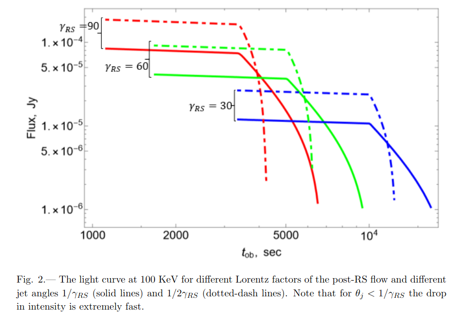

# arxiv一周文献泛读200706-200710

## 200706

---

### A catalog of over ten million variable source candidates in ZTF data release 1

https://arxiv.org/abs/2007.01537

details

Authors: Eran O. Ofek, Maayane Soumagnac, Guy Nir et al.
Comments: Submitted to MNRAS

Variable sources probe a wide range of astrophysical phenomena. We present a catalog of over ten million variable source candidates found in Data Release 1 (DR1) of the Zwicky Transient Facility (ZTF). We perform a periodicity search up to a frequency of 160 day$^{-1}$, and we classify the light curves into erratic and smooth variables. We also present variability indicators and the results of a periodicity search, up to a frequency of 5 day$^{-1}$, for about 1 billion sources in the ZTF-DR1 light curve database. We present several new short-period (<90 min) candidates, and about 60 new dwarf nova candidates, including two candidate eclipsing systems. Both the 10 million variables catalog and ~1 billion source catalog are available online in catsHTM format. 

- 作者在ZTF-DR1的约$1.7 \times 10^9$个non-unique光变曲线（约10亿unique源）中找到了超过1千万个变源候选体星表。
- 作者进行了周期搜索（periodicity search），搜索最高频率为160 day$^{-1}$，并依据光变曲线划分为erratic和smooth两种变源。
- 对ZTF-DR1光变曲线数据库中的约10亿个源，作者展示了周期搜寻的variability indicators以及搜寻结果（up to a frequency of 5 day$^{-1}$）。
- 展示了在搜寻结果中发现一些新的短周期（< 90 分钟）的侯选体，以及60个新的矮新星（dwarf nova）候选体，包括两个候选的食变系统（eclipsing system）。
- 1000万个变源和约10亿个源这两个星表都可在网络上获取，格式为catsHTM。

数据预处理：

- 把官网的光变曲线数据库中的文件（每个文件包含一个ZTF视场中所有源的g和r波段的光变曲线；这些文件包括$1.7 \times 10^9$个non-unique光变曲线）转化成HDF5的格式，并将相关文件的各类信息（如坐标，视场编号等index）存储在catsHTM格式的文件中。这样可以根据坐标等信息快速检索需要的光变曲线等数据信息。

筛选变源：
- 首先通过全天的40000个随机指向附近100角秒内所有源的测光数据来构建一个robust StD — magnitude的关系，用于提供变源筛选的阈值。

- 如果数据库中的一个光变曲线满足一下条件中的一个，则判定为变源	
  - 变源的robust StD应大于上面的阈值，且数据点大于24个；
  - stars for which the highest peak in the classical periodogram calculated up to 5 day$^{−1}$ is above 12 (normalized to the noise) and the number of data points is larger than 24.
- 这样筛选出来的候选光变曲线为12,761,565个（non-unique）。在把角距离在1.5角秒以内的源算作同一个源，得到约1080万个变源候选体。

变源候选体性质（properties）
作者对每个变源候选都计算了一系列性质，并讨论了其中三个性质及相应分布

- The five highest peaks in the periodogram
- Standard deviation after a high -order polynomial fit
  - 对每个候选体，作者用10阶多项式去拟合时间归一化的光变曲线，并将拟合值从原数据中减掉，再计算减掉后数值的标准偏差（Std-Poly10）。

  - 之所以计算这个量，是因为光滑且演化较慢的变源（如 Mira stars）通常有比较低的Std-Poly10，而爆发性（eruptive）的变源（如Dwarf novae）通常有较高的Std。

  - 上图实线为$y = 0.2 x$，蓝点对应周期图（periodogram）中最高峰低于12的源，红点则对应高于12的源。
  - 这张图区分了快变源（主要在黑线上方）和慢变源（主要在黑线下方），展示了慢变源大多是周期性的，且被归为快变源的周期性变源比其它快变源通常有较低的幅度。

- Peaks in the magnitude histogram
  -  对每个光变曲线都计算了一个光度测量的直方图，间隔为0.25 mag。
  -  选取计数最高的三个光度区间，记录这三个区间的中值星等以及每个区间的测量次数除以总测量次数的值。
  -  这些indicators可能对证认那些会发生阶段性状态变化的源有帮助，如eclipsing binaries和dwarf novae。

筛选结果：
文章分别展示了短周期变源和白矮星新星的预搜寻（preliminary）结果。
- short period variability
  - 由于ZTF的最小cadence是30分钟左右，所以短周期变源搜寻的效率不高，且错误率较高。
  - 通过一定的判断条件，找出了63个短周期变源候选体，再通过肉眼检查，找出了8个较可靠的短周期候选体。

- Dwarf novae candidates
  - 同样通过一定条件，找出了452个候选体，再通过肉眼检查选出了76个dwarf novae候选体，其中60个是目前未知的，另还包括两个有食变迹象的候选体。

 

---

### Periodic fast radio bursts from forcedly  precessing neutron stars, anomalous torque, and internal magnetic field  for FRB 180916.J0158+65 and FRB 121102

https://arxiv.org/abs/2007.01616

details

Authors: Denis Nikolaevich Sob'yanin (Lebedev Physical Institute)
Comments: 8 pages, 2 figures, MNRAS accepted

A recent discovery of the periodic activity of the repeating fast radio burst source FRB 180916.J0158+65 in the Canadian Hydrogen Intensity Mapping Experiment (CHIME) hints at possible origin of the FRB from a freely precessing neutron star with a magnetar magnetic field of about $10^{16}$ G. However, the absence of simultaneously detected high-energy emission in the Swift and AGILE observations imposes stringent constraints on the field magnitude and questions the possibility of such a progenitor. We show that consideration of forced precession of a neutron star **does not encounter the difficulty**. This kind of precession takes place even if the neutron star is not deformed and is brought about by the anomalous moment of electromagnetic forces induced by stellar rotation and determined by non-corotational currents. Contrary to what is expected for the currents of corotation, the anomalous torque calculated by the direct method appears to be non-zero. If the observed 16.35-day period corresponds to the period of stellar precession, the inferred internal magnetic field appears to be about $6×10^{14}$ G for rotational period 1 s. For another possibly periodic FRB 121102 with 157-day period the magnetic field is even lower, $2×10^{14} G, thereby justifying earlier considerations and not ruling out the hypothesis of FRB origin from precessing neutron stars. 

- 这篇文章就CHIME近来发现的重复FRB 180916.J0158+65的周期性行为，探讨了受迫进动的中子星作为周期性FRB起源的可能性。
- FRB 180916.J0158+65的起源可能是磁场强度为$10^{16}$ G的自由进动（freely precessing）的中子星 (Levin et al. 2020;Zanazzi & Lai 2020)。
- 但因为Swift和AGILE并没有同时探测到这颗FRB的高能辐射，该系统的磁场会受到很强的限制(Tavani et al.2020)而降低上面说的这种起源的可能性，不过作者表示若考虑中子星是受迫进动的则不会遇到此问题。
- 这种进动在中子星没有变形的情况下也可以发生，且它是由电磁力的异常力矩（anomalous moment of electromagnetic forces）引起的，而这种异常力矩则是由星体旋转（steller rotation）和非同步旋转电流（non-corotational currents）引起并决定的。
- 如果观测到的16.35天的周期是与星体进动的周期对应，那么由此算出的内部磁场约为$6×10^{14}$ G ，对应自旋周期为1s。
- 另有一例周期为157天的周期性FRB121102在此情景下算出的磁场更低，$2×10^{14}$ G，（大概是符合高能的观测），因此不能排除进动的中子星作为FRB起源的可能性。

 

### Local starburst conditions and formation of GRB 980425 / SN 1998bw within a collisional ring

https://arxiv.org/abs/2007.01317

details

Authors: M. Arabsalmani, F. Renaud, S. Roychowdhury et al.
Comments: ApJ (in press), 12 pages, 4 figures, 1 table

We present the first spatially resolved study of molecular gas in the vicinity of a Gamma Ray Burst, using CO(2-1) emission line observations with the Atacama Large Millimetre Array (ALMA) at ~50 pc scales. The host galaxy of GRB 980425 contains a ring of high column density HI gas which is likely to have formed due to a collision between the GRB host and its companion galaxy, within which the GRB is located. We detect eleven molecular gas clumps in the galaxy, seven of which are within the gas ring. The clump closest to the GRB position is at a projected separation of ~280 pc. Although it is plausible that the GRB progenitor was ejected from clusters formed in this clump, we argue that the in situ formation of the GRB progenitor is the most likely scenario. We measure the molecular gas masses of the clumps and find them to be sufficient for forming massive star clusters. The molecular gas depletion times of the clumps show a variation of ~2 dex, comparable with the large variation in depletion times found in starburst galaxies in the nearby Universe. This demonstrates the presence of starburst modes of star formation on local scales in the galaxy, even while the galaxy as a whole cannot be categorised as a starburst based on its global properties. Our findings suggest that the progenitor of GRB 980425 was originated in a young massive star cluster formed in the starburst mode of star formation. 

- 本文讨论了在碰撞气体环中局部星暴条件下 GRB 980425 / SN 1998bw的形成。
- 我们使用ALMA在~50 pc 尺度下，通过CO(2-1)发射线的观测，对一个GRB附近的分子云进行了首次空间分辨研究。
- GRB 980425的宿主星系ESO 184–G82有一个高柱密度的HI气体环，这个环可能是在GRB宿主星系与其伴星系的碰撞中形成的。GRB 980425就位于这个环中。
- 我们在该星系中发现了11个分子气体团（molecular gas clump），其中7个在气体气体环中。最靠近GRB位置的气体团的投影距离为~280 pc。
- 尽管GRB的前身确有可能从这个气体团中形成的星团（clusters）中喷射出来的，作者认为这个GRB前身星是原位形成的情形是最有可能的，且前身星所在的气体云因为stellar feedback而被分散。
- 文章测量了这些气体团中分子气体耗尽时间（depletion times）$\tau_{dep}$（分子气体质量比上SFR，star formation rate），发现这些气体团的耗尽时间显示了  ~2 dex的弥散（spread,variation），显著大于类似尺度的普通星系的$\tau_{dep}$的弥散），但与附近宇宙中星暴星系里发现的耗尽时间的弥散相当。测量表明ESO 184–G82中存在（局部）星暴模式的恒星形成区，有利于致密且大质量的星团的形成。文章也估计了这些团的分子气体质量，发现它们足以形成大质量的星团。
- 我们的发现表明GRB 980425的前身星起源于恒星形成的星暴模式下形成的大质量星团。支持了GRB的大质量前身星是在 通常由低红移（$z \lt \sim 1.0$）的（星系？）相互作用 触发的星暴条件下形成的这一观点。

 

---

 

## 200707

---

### A Distant Fast Radio Burst Associated to its Host Galaxy with the Very Large Array

https://arxiv.org/abs/2007.02155

details

Authors: C. J. Law, B. J. Butler,  J. X. Prochaska et al.
Comments: Submitted to AAS Journals (ApJ) and revised for referee comments

We present the discovery and subarcsecond localization of a new Fast Radio Burst with the Karl G. Jansky Very Large Array and realfast search system. The FRB was discovered on 2019 June 14 with a dispersion measure of 959 pc/cm3. This is the highest DM of any localized FRB and its measured burst fluence of 0.6 Jy ms is less than nearly all other FRBs. The source is not detected to repeat in 15 hours of VLA observing and 153 hours of CHIME/FRB observing. We describe a suite of statistical and data quality tests we used to verify the significance of the event and its localization precision. Follow-up optical/infrared photometry with Keck and Gemini associate the FRB to a pair of galaxies with r∼23 mag. The false-alarm rate for radio transients of this significance that are associated with a host galaxy is roughly 3×10−4 hr−1. The two putative host galaxies have similar photometric redshifts of zphot∼0.6, but different colors and stellar masses. Comparing the host distance to that implied by the dispersion measure suggests a modest (~ 50 pc/cm$^3$) electron column density associated with the FRB environment or host galaxy/galaxies. 

- 19年6月14日，realfast系统发现并定位了一个FRB，其DM高达959 pc/cm3，是迄今为止DM最高的已定位的FRB，且其能量通量的测量值，0.6 Jy ms则几乎低于所有其它FRB。
- 这颗源在VLA的15小时观测以及CHIME/FRB的153小时观测中都没有显示出重复的迹象。
- Keck和Gemini的光学/近红外跟踪测光观测显示FRB与两个可能的遥远的宿主星系关联，它们的r星等均约为23等，且红移z均约为 0.6，但这两个星系的颜色和质量不同，所以作为FRB的环境也不同。
- 若把宿主星系的距离与由DM值推出的距离（z = 1.1 ~ 1.3）相比较，发现FRB的红移要远超过两个可能的宿主星系。文章指出这可能是因为DM值中出银河系介质的贡献外还有其它的成分的贡献，例如宿主星系以及星际介质的贡献，或低估了银河系对DM的贡献。
- In the future, the system will transition to a community service mode, in which real-time alerts are distributed automatically.

 

---

### Wind-powered afterglows of gamma-ray bursts:  flares, plateaus and steepdecays

https://arxiv.org/abs/2007.02889

details

Authors: Yonggang Luo (Purdue University), Maxim Lyutikov (Purdue University)
No comments.

Afterglows of gamma-ray bursts often show flares, plateaus, and sudden intensity drops: these temporal features are difficult to explain as coming from the forward shock. We calculate radiative properties of early GRB afterglows with the dominant contribution from the reverse shock (RS) propagating in an ultra-relativistic (pulsar-like) wind produced by the long-lasting central engine. RS emission occurs in the fast cooling regime - this ensures high radiative efficiency and allows fast intensity variations. We demonstrate that: (i) mild wind power, of the order of ∼$10^{46}$ erg/s, can reproduce the afterglows' plateau phase; (ii) termination of the wind can produce sudden steep decays; (iii) mild variations in the wind luminosity can produce short-duration afterglow flares. 

- 针对GRB余辉中出现的单凭前向激波难以解释的耀发，平台以及突然的强度衰减等现象，本文计算了当在 由长期活动的中心引擎产生的极端相对论性wind 中传播的反向激波（反向激波发生在快冷却阶段，因此有较高的辐射效率，导致其辐射可以随着wind的性质的变化而发生较快的强度变化）占主导时的早期GRB余辉的辐射性质，展示了：
  - mild（这里应该也包含平稳的意思，因为按原文意思，辐射功率与wind功率成比例，只要wind功率保持平稳，辐射就会保持相对平稳）功率的wind，如$~ 10^{46}$ erg/s，可以产生余辉的平台期；
  - wind的终止(termination，比如因为中子星塌缩成黑洞或吸积盘物质耗尽)能产生突然的快速衰减；
  - wind光度轻微的变化能产生短暂的余辉耀发。
- 关于wind: 假设在最初的GRB爆发中形成了一个高能的脉冲星，脉冲星会产生高度磁化且高度相对论性的类脉冲星风(pulsar-likewind)，星风再激波化外面扩展开来的喷射物。因此该系统是由两个相对论性爆发组成的。

### Triaxially-deformed Freely-precessing Neutron Stars: Continuous electromagnetic and gravitational radiation

https://arxiv.org/abs/2007.02528

details

Authors: Yong Gao, Lijing Shao, Rui Xu et al.
Comments: 13 pages, 9 figures

The shape of a neutron star (NS) is closely linked to its internal structure and the equation of state of supranuclear matters. A rapidly rotating, asymmetric NS in the Milky Way undergoes free precession, making it a potential source for multimessenger observation. The free precession could manifest in (i) the spectra of continuous gravitational waves (GWs) in the kilohertz band for ground-based GW detectors, and (ii) the timing behavior and pulse-profile characteristics if the NS is monitored as a pulsar with radio and/or X-ray telescopes. We extend previous work and investigate in great detail the free precession of a triaxially deformed NS with analytical and numerical approaches. In particular, its associated continuous GWs and pulse signals are derived. Explicit examples are illustrated for the continuous GWs, as well as timing residuals in both time and frequency domains. These results are ready to be used for future multimessenger observation of triaxially-deformed freely-precessing NSs, in order to extract scientific implication as much as possible.

- 本文通过解析和数值方法研究了做为可以持续辐射电磁波和引力波的潜在候选体，三轴形变的自由进动中子星，的动力学演化以及其辐射信号的可能表现，包括脉冲轮廓特征以及连续的引力波的特征，并就不同情况进行了举例说明。

 

### A Search for Supernova Light Echoes in NGC 6946 with SITELLE

https://arxiv.org/abs/2007.02778

details

Authors: M.C. Radica, D. Welch, L. Rousseau-Nepton
Comments: 10 pages, 5 figures, accepted for publication in MNRAS

We present the analysis of four hours of spectroscopic observations of NGC 6946 with the SITELLE Imaging Fourier Transform Spectrometer on the Canada-France-Hawaii Telescope, acquired to search for supernova light echoes from its ten modern supernovae. We develop a novel spectroscopic search method: identifying negatively sloped continua in the narrow-band SN3 filter as candidate highly-broadened P-Cygni profiles in the Hα line, which would be characteristic of the spectra of supernovae ejecta. We test our methodology by looking for light echoes from any of the ten supernovae observed in NGC 6946 in the past 100 years. We find no evidence of light echoes above the survey surface brightness limit of $1×10^{−15} erg/s/cm^2/arcsec^2$. 

- 本文提出了一种新的光谱搜寻方法搜寻超新星的光回声（light echoes），并将尝试将其用来寻找NGC 6946中观测到的10颗超新星的光回声，使用的仪器为加拿大-法国-夏威夷望远镜的SITELLE Imaging Fourier Transform Spectrometer。但结果并未能成功在这10个超新星中找到回声。
- 超新星光回声是指超新星爆发后一小部分光被尘埃散射回观测者的视线内而表现出来的晚期辐射。

 

---

### Supernova Triggers for End-Devonian Extinctions?

https://arxiv.org/abs/2007.01887

details

Authors: Brian D. Fields, Adrian L. Melott, John Ellis et al.
Comments: 4 pages, no figures. Submitted to PNAS Brief Reports. Comments welcome. Creative Commons CC BY-NC-ND license

The Late Devonian was a protracted period of low speciation resulting in biodiversity decline, culminating in extinction events near the Devonian-Carboniferous boundary. Recent evidence indicates that the final extinction event may have coincided with a dramatic drop in stratospheric ozone, possibly due to a global temperature rise. Here we study an alternative possible cause for the postulated ozone drop:a nearby supernova explosion that could inflict damage by accelerating cosmic rays that can deliver ionizing radiation for up to∼100kyr. We therefore propose that end-Devonian extinction was triggered by one or more supernova explosions at∼20 pc, somewhat beyond the “kill distance” that would have precipitated a full mass extinction.Nearby supernovae are likely due to core-collapses of massive starsin clusters in the thin Galactic disk in which the Sun resides. Detect-ing any of the long-lived radioisotopes 146 Sm, 235 U or 244 Pu in one or more end-Devonian extinction strata would confirm a supernova origin, point to the core-collapse explosion of a massive star, and probe supernova nucleosythesis. Other possible tests of the supernova hypothesis are discussed.

- 本文提出一个导致泥盆纪晚期生物灭绝的可能原因：附近的超新星爆发导致被加速的宇宙线释放出作用距离超远的电离辐射，进而导致地球平流层臭氧急剧下降，最后导致大规模生物灭绝。

 

## 200708

---

 

中相关：

### Constraining the X-ray - Infrared spectral index of second-timescale flares from SGR1935+2154 with Palomar Gattini-IR

https://arxiv.org/abs/2007.02978

details

Authors: Kishalay De, Michael C. B. Ashley et al.
Comments: 10 pages, 4 figures, submitted to ApJL. Comments welcome

The Galactic magnetar SGR1935+2154 has been reported to produce the first known example of a bright millisecond duration radio burst (FRB 200428) similar to the cosmological population of fast radio bursts (FRBs), bolstering the association of FRBs to active magnetars. The detection of a coincident bright X-ray burst has revealed the first observed multi-wavelength counterpart of a FRB. However, the search for similar emission at optical wavelengths has been hampered by the high inferred extinction on the line of sight. Here, we present results from the first search for second-timescale emission from the source at near-infrared wavelengths using the Palomar Gattini-IR observing system in J-band, made possible by a recently implemented detector read-out mode that allowed for short exposure times of 0.84 s with 99.9% observing efficiency. With a total observing time of 12 hours (47728 images) on source, we place median 3σ limits on the second-timescale emission of <20 mJy (13.1 AB mag). We present non-detection limits from epochs of four simultaneous X-ray bursts detected by the Insight-{\it HXMT} and {\it NuSTAR} telescopes during our observing campaign. The limits translate to an extinction corrected fluence limit of  < 125 Jy ms for an estimated extinction of $A_J$=2.0 mag. These limits provide the most stringent constraints to date on the fluence of flares at frequencies of ∼$10^{14}$ Hz, and constrain the ratio of the near-infrared (NIR) fluence to that of coincident X-ray bursts to $R_{NIR} \lt 2.5×10^{−2}$. Our observations were sensitive enough to easily detect a near-infrared counterpart of FRB 200428 if the NIR emission falls on the same power law as that observed across its radio to X-ray spectrum. The non-detection of NIR emission around the coincident X-ray bursts constrains the fluence index of the brightest burst to be steeper than 0.35. 

- 本文尝试对SGR 1935+2154，也即FRB 200428，在近红外的J波段上进行了观测，以期发现秒时标的耀发辐射（second-timescale flare/emission），使用的仪器是Palomar Gattini-IR observing system。这个源在射电和X射线波段均有观测，而光学波段还没有探测到，部分原因是受到视线上较大的红外消光的影响。
- 从5月1日开始，作者进行了总时长12个小时的观测，未探测到明显的短时标耀发，尽管在观测期间HXMT和NuSTAR探测到了四次X射线爆发。作者给出3$\sigma$上限 $\lt 20 mJy$(13.1 AB mag)，进行消光修正后给出目前为止在$\sim 10^{14}$ Hz上最严格的通量限制：< 125 Jy ms，同时也限制了NIR和X-ray波段的通量比例： $R_{NIR} \lt 2.5×10^{−2}$，以及限制了X-ray到NIR的通量指数$\beta \gt 0.35$ (对应光谱指数 $\alpha > -0.65$)

### Supersoft X-Ray Phases of Recurrent Novae as an Indicator of their White Dwarf Masses

https://arxiv.org/abs/2007.03387

details

Authors: Mariko Kato, Izumi Hachisu
Comments: 19 pages, 14 figures, accepted for publication in PASJ

We have examined the optical/X-ray light curves of seven well-observed recurrent novae, V745 Sco, M31N 2008-12a, LMC N 1968, U Sco, RS Oph, LMC N 2009a, T Pyx, and one recurrent nova candidate LMC N 2012a. Six novae out of the eight show a simple relation that the duration of supersoft X-ray source (SSS) phase is 0.70 times the total duration of the outburst (= X-ray turnoff time), i.e., $t_{SSS}=0.70t_{off}$, the total duration of which ranges from 10 days to 260 days. These six recurrent novae show a broad rectangular X-ray light curve shape, first half a period of which is highly variable in the X-ray count rate. The SSS phase corresponds also to an optical plateau phase that indicates a large accretion disk irradiated by a hydrogen-burning WD. The other two recurrent novae, T Pyx and V745 Sco, show a narrow triangular shape of X-ray light curve without an optical plateau phase. Their relations between $t_{SSS}$ and $t_{off}$ are rather different from the above six recurrent novae. We also present theoretical SSS durations for recurrent novae with various WD masses and stellar metallicities (Z=0.004, 0.01, 0.02, and 0.05) and compare with observed durations of these recurrent novae. We show that the SSS duration is a good indicator of the WD mass in the recurrent novae with a broad rectangular X-ray light curve shape. 
形状
- 本文研究了七个详细观测的recurrent新星以及一个recurrent新星候选体的光学/X射线光变曲线，讨论了它们的Supersoft X-Ray阶段的持续时间与总时间的关系，它们光变曲线形状上的特点，最后通过理论和观测比较指出Supersoft X-Ray Phases的持续时间可以作为具有特定性状X-ray光变曲线的新星的质量指示器。
- Supersoft X-Ray 阶段（SSS阶段）是新星演化中经历的一个阶段。新星随着白矮星吸积包层的扩散而发生演化，其主要辐射波段会从光学到紫外到supersoft X-ray转变。
- 8个样本中，有6个样本的光变曲线的 $t_{SSS}$和 $t_{off}$是简单的$t_{SSS}=0.70t_{off}$关系，且X-ray曲线呈现出矩形的形状，矩形的前半段的X射线的count rate是高度变化的。另外SSS阶段也对应这光学波段的平台期，反映了来自被H燃烧的白矮星所照射的巨大吸积盘的辐射。
- 另两个样本的X射线光变曲线呈现较窄三角形的性状，且没有光学平台。它们的$t_{SSS} -- t_{off}$关系也与其它六个不同。
- 文章计算了不同WD质量和不同金属丰度下recurrent新星在SSS阶段持续时间的理论值，通过与观测比较，提出对于有矩形X射线光变的recurrent新星，其SSS阶段持续时间可用来指示白矮星的质量。

 

低相关：

 

---

### Search for high energy γ-rays from the direction of the candidate electromagnetic counterpart to the binary black hole merger gravitational-wave event S190521g

https://arxiv.org/abs/2007.03086

details

Authors: Egor Podlesnyi, Timur Dzhatdoev
Comments: 3 pages, 2 figures. Comments are welcome!

The gravitational-wave event S190521g -- a likely binary black hole merger in the accretion disk of an active galactic nucleus -- was accompanied by an optical counterpart. Such dense environments around luminous energy release regions are favourable for high energy γ-ray production. We report on a search for high energy γ-rays from the direction of the candidate electromagnetic counterpart to the S190521g event using publicly-available data of the Fermi-LAT space γ-ray telescope. No significant signal was found. We present upper limits on the spectral energy distribution of the source in the 100 MeV -- 300 GeV energy range. We discuss the importance of studying S190521g-like transients in the context of cosmic ray acceleration, γ-ray and neutrino production in such sources. 

- 本文尝试在LAT的数据中寻找引力波事件的S190521g可能伴随的γ-ray辐射。
- 这一事件可能是一次发生在活跃星系核吸积盘中的双黑洞并合事件，且伴有光学对应体（[M. Graham, K. Ford, B. McKernan et al, 2020](https://journals.aps.org/prl/abstract/10.1103/PhysRevLett.124.251102)）。像这种致密环境中发生的明亮的能量爆发事件往往会辐射伽玛射线。

- 但作者并未成功找到对应的高能信号，在100MeV - 300GeV 能段内给出了一个上限。

- 关于为什么没有找到高能对应信号，作者提出如下几个原因：

 

## 200709

---

### Discovery of the optical afterglow and host galaxy of short GRB181123B at z=1.754: Implications for Delay Time Distributions

https://arxiv.org/abs/2007.03715

details

Authors: K. Paterson, W. Fong, A. Nugent et al.
No comments.

We present the discovery of the optical afterglow and host galaxy of the$Swift$ short-duration gamma-ray burst, GRB\,181123B. Observations with Gemini-North starting at ≈9.1~hr after the burst reveal a faint optical afterglow with i≈25.1~mag, at an angular offset of 0.59 ± 0.16′′ from its host galaxy. Using grizYJHK observations, we measure a photometric redshift of the host galaxy of z=1.77+0.30−0.17. From a combination of Gemini and Keck spectroscopy of the host galaxy spanning 4500-18000 Å, we detect a single emission line at 13390 Å, inferred as Hβ at z=1.754±0.001 and corroborating the photometric redshift. The host galaxy properties of GRB181123B are typical to those of other SGRB hosts, with an inferred stellar mass of ≈ $1.7 \times 10^{10} M_⊙$, mass-weighted age of  ≈ 0.9 Gyr and optical luminosity of  ≈ 0.9 L*. At z = 1.754, GRB181123B is the most distant secure SGRB with an optical afterglow detection, and one of only three at z > 1.5. Motivated by a growing number of high-z SGRBs, we explore the effects of a missing  z >1.5 SGRB population among the current $Swift$ sample on delay time distribution models. We find that log-normal models with mean delay times of ≈ 4−6~Gyr are consistent with the observed distribution, but can be ruled out to 95% confidence with an additional ≈1−5 $Swift$ SGRBs recovered at z > 1.5. In contrast, power-law models with ∝ $t^{−1}$ are consistent with the redshift distribution and can accommodate up to ≈ 30 SGRBs at these redshifts. Under this model, we predict that ≈ 1/3 of the current $Swift$ population of SGRBs is at z > 1. The future discovery or recovery of existing high-z SGRBs will provide significant discriminating power on their delay time distributions, and thus their formation channels. 

- 发现了Swift短暴 GRB 181123B的光学余辉以及宿主星系。
- 观测（Gemini-North）开始于暴后9.2小时，显现出较弱的光学余辉（i ~ 25.1 mag）。观测位置距离宿主星系$0.59 \pm 0.16''$。
- 利用grizYJHK多波段观测数据，测量了测光红移（photometric redshift）为$z=1.77^{+0.30}_{-0.17}$。
- 另外从Gemini和Keck的星系测谱结果中显现了一条13390埃的发射线，证认（根据测光红移以及谱线的情况进行的推测）为$z=1.754 \pm 0.001$的$H_{\beta}$线，佐证了前面测光红移的结果。

- 宿主星系的性质与其它短暴的宿主星系性质差不多：stellar mass $≈ 1.7 \times 10^{10} M_{⊙}$，mass-weighted age ≈ 0.9 Gyr，可见光光度$≈ 0.9 L^*$。
- 这个GRB是有光学余辉被探测到的最远的短暴，而且红移大于1.5的短暴只有3个。
- 根据目前SGRB的红移分布，主要就高红移的部分，对现有的DTD模型作出限制:
  - delay time包括星体演化的时标和并合的时标。目前有两张主要的DTD形式：power-law DTD （用$t^{-\eta}$形式描述）以及log-normal DTD（用平均延迟时间$\tau$和宽度$\sigma$描述），其中前者倾向于原生双星的情景，后者则倾向于动力学形成的情景，分别对应致密双星的两种形成渠道（isolated binaryevolution vs dynamical assembly in globular clusters）。
  - 不同的DTD模型可以导出不同的红移分布，所以$Swift$短暴的红移分布（以及$Swift$短暴中未确定红移的相当一部分作为辅助）可以反过来限制DTD模型。
  - 作者选取了8个DTD模型进行讨论，其中4个power-law模型和4个log-normal模型。最终作者排除了log-normal（能容纳的高红移数量太少，或者低红移部分不符合观测）模型，选择了$t^{-1}$的power-law模型（可容纳约30个高红移）。在这个模型下，作者预测现有的$Swift$短暴中有1/3的红移大于1。

 

---

### Probing the intergalactic turbulence with fast radio bursts

https://arxiv.org/abs/2007.04089

details

Authors: Siyao Xu, Bing Zhang
Comments: 6 pages, 5 figures

The turbulence in the diffuse intergalactic medium (IGM) plays an important role in various astrophysical processes across cosmic time, but it is very challenging to constrain its statistical properties both observationally and numerically. Via the statistical analysis of turbulence along different sightlines toward a population of fast radio bursts (FRBs), we demonstrate that FRBs provide a unique tool to probe the intergalactic turbulence. We measure the structure function (SF) of dispersion measures (DMs) of FRBs to study the multi-scale electron density fluctuations induced by the intergalactic turbulence. The SF has a large amplitude and a Kolmogorov power-law scaling with angular separations, showing large and correlated DM fluctuations over a range of length scales. Given that the DMs of FRBs are IGM dominated, our result suggests that the intergalactic turbulence has a Kolmogorov power spectrum and an outer scale on the order of 100 Mpc. 

- 星系间的湍流在很多天体物理现象中都能产生重要的影响，但我们很难用直接观测或数值模拟的手段去研究限制其统计性质。
- 而通过对不同视线上FRB的湍流的统计分析，作者展示了FRB可以作为研究星系际湍流的独特工具。
- 作者测量了FRBs的dispersion measures的结构函数（structure function, SF）以研究湍流引发的多尺度电子密度涨落（multi-scale electron density fluctuations ？）。
- 结构函数具有较大幅度？以及一个随角分隔距离的Kolmogorov幂律（Kolmogorov power-law scaling with angular separations），表明一系列长度尺度上有着较大且相互关联的DM涨落。
- 考虑到FRBs的DM值的主要贡献来自星系际介质，文章结果表明星系际湍流有一个Kolmogorv幂律谱以及一个尺度在100Mpc的外部轮廓。

 

### Probing primordial non-Gaussianity with Fast Radio Bursts

https://arxiv.org/abs/2007.04054

details

Authors: Robert Reischke, Steffen Hagstotz, Robert Lilow
Comments: 9 pages, 5 figures

Fast radio bursts (FRBs) are astrophysical transients of currently unknown origin, and so far several events have been detected at extragalactic distances. The dispersion measure (DM) of the radio signal is a probe of the integrated electron density along the line of sight and therefore allows to map the electron distribution within the large-scale structure.Since a fraction of electrons gets expelled from galaxies by feedback, they are anticorrelated with halos at large scales and hence the angular DM correlations show a scale-dependent bias caused by primordial non-Gaussianity.Although the signal is weaker than in other probes like galaxy clustering, FRBs can potentially probe considerably larger volumes. We show that while studying the FRB clustering signal requires very large samples, correlations in the DM are cosmic-variance limited on large angular scales with only ∼$10^{3−4}$ events. A tomographic analysis of the angular DM correlation function can constrain the local primordial bispectrum shape parameter $f_{NL}$ to a precision down to $f_{NL} \sim O(1)$ depending on assumptions about the FRB redshift distribution and the astrophysical feedback on large scales. This makes FRBs a competitive probe to constrain inflationary physics. 

- FRB射电信号的DM值反映了视线上电子密度的积分，因此可用于研究在大尺度结构中的电子分布。
- 由于有一部分电子是通过反馈作用被星系排出，它们在大尺度上与halos是负相关的，因此DM的角关联（angular DM correlation）显示出由primordial non-Gaussianity引起的尺度决定的偏差。
- 所以通过大量FRB观测样本，我们可以分析DM的角关联，进而寻找primordial non-Gaussianity。

 

### Gravitational Microlensing Time Delays at High Optical Depth: Image Parities and the Temporal Properties of Fast Radio Bursts

https://arxiv.org/abs/2007.03919

details

Author: Geraint F. Lewis
Comments:  7 pages, 6 figures, to appear in MNRAS

Due to differing gravitational potentials and path lengths, gravitational lensing induces time delays between multiple images of a source which, for solar mass objects, is of order ∼$10^{−5}$ seconds. If an astrophysically compact source, such as a Fast Radio Burst (FRB), is observed through a region with a high optical depth of such microlensing masses, this gravitational lensing time delay can be imprinted on short timescale transient signals. In this paper, we consider the impact of the parity of the macroimage on the resultant microlensing time delays. It is found that this parity is directly imprinted on the microlensing signal, with macroimages formed at minima of the time arrival surface beginning with the most highly magnified microimages and then progressing to the fainter microimages. At macroimages at the maxima of the time arrival surface, this situation is reversed, with fainter images observed first and finishing with the brightest microimages. For macroimages at saddle-points, the signal again begins with fainter images, followed by brighter images before again fading through the fainter microimages. The growing populations of cosmologically distant bursty transient sources will undoubtedly result in the discovery of strong lensed, multiply imaged FRBs, which will be susceptible to microlensing by compact masses. With the temporal resolution being offered my modern and future facilities, the detection of microlensing induced time delays will reveal the parities of the gravitational lens macroimages, providing additional constraints on macrolensing mass models and improving the efficacy of these transient sources as a cosmological probes. 

- 如果FRB这种遥远且瞬变（爆发性）的源发出的辐射穿过微引力透镜区域，信号的接收理论上会在极短的时标内表现出时间延迟。
- 本文考虑the parity of the macroimage对微引力透镜时间延迟会产生的影响。
- 可利用FRB的观测去研究这些现象并限制相关理论模型。

 

## 200710

---

### Discovery of a transient X-ray source Suzaku J1305-4930 in NGC 4945

https://arxiv.org/abs/2007.04465

details

Authors: Shuntaro Ide, Kiyoshi Hayashida, Hirofumi Noda et al.
Comments: 17 pages, 10 figures

We report the serendipitous discovery of a transient X-ray source, Suzaku J1305−4930, ∼3 kpc southwest of the nucleus of the Seyfert 2 galaxy NGC 4945. Among the seven Suzaku observations of NGC 4945 from 2005 to 2011, Suzaku J1305−4930 was detected four times in July and August in 2010. The X-ray spectra are better approximated with a multi-color disk model than a power-law model. At the first detection on 2010 July 4--5, its X-ray luminosity was $(8.9^{+0.2}_{-0.4}) \times 10^{38} erg s^{-1}$ and the temperature at the inner-disk radius ($kT_{in}$) was $1.12 \pm 0.04 keV$. At the last detection with Suzaku on 2010 August 4--5, the luminosity decreased to $(2.2^{+0.3}_{-0.8}) \times 10^{38} erg^{-1} $ and $kT_{in}$ was $0.62 \pm 0.07$. The source was not detected on 2011 January 29, about six months after the first detection, with a luminosity upper limit of $2.4 \times 10^{38} erg s^{-1}$. We also find an absorption feature which is similar to that reported in Cyg X-1. Assuming the standard disk, we suggest that Suzaku J1305−4930 consists of a black hole with a mass of $\sim 10M_⊙$. The relation between the disk luminosity and $kT_{in}$ is not reproduced with the standard model of a constant inner radius but is better approximated with a slim-disk model.

- 本文介绍了作者在以前的观测中发现的一个X射线暂现源：Suzaku J1305-4930，确定了拟合其光谱的最佳模型，讨论了其来源黑洞的光度以及$L_{disk}$和$kT_{in}$的关系。
- 从2005到2011年间，Suzaku对该区域的NGC 4945进行了7次观测，其中在2010年的四次观测中均看到了这个X射线暂现源。

- 作者使用了XPEC测试了多种模型去拟合X射线光谱的效果，结果发现效果最好的是多色吸积盘黑体模型（Multi-color black-body model）。
- 拟合结果显示第一次探测时X射线光度为 $(8.9^{+0.2}_{-0.4}) \times 10^{38} erg s^{-1}$，内部吸积盘半径（inner-disk radius）温度为$1.12 \pm 0.04 keV$。而到最后探测到的时候，光度减为$(2.2^{+0.3}_{-0.8}) \times 10^{38} erg^{-1} $,温度减为 $kT_{in} = 0.62 \pm 0.07$。

>Cyan, green,and blue solid lines represent the thermal plasma component intrinsic to the SOURCE-region spectrum, contamination from the AGN region, and the CXB,respectively.

- 根据拟合得到的X射线光度$L_X$和内部吸积盘半径$R_{in}$，作者判断中心天体可能是一个双黑洞，质量约10倍太阳质量。
- 另外作者还讨论了$L_{disk}$和$kT_{in}$的关系，单幂律拟合的结果显示这个源没有展现出标准吸积盘模型所期望的$L_{disk} \propto T_{in}^4$的关系，而是一个较平些的$L_{disk} \propto T_{in}^{2.2 \pm 0.5}$的关系，这样的情况比较符合slim-disk模型。用拐折幂律拟合的话，也可以解释为这个关系发生了从slim-disk模型到标准吸积盘模型的状态转变。

 

### Modeling Synchrotron Self-Compton and Klein-Nishina Effects in Gamma-Ray Burst Afterglows

https://arxiv.org/abs/2007.04418 

details

Authors: Taylor Jacovich, Paz Beniamini, Alexander van der Horst
Comments: 15 pages, 11 figures, 6 tables. Submitted to MNRAS

We present a self-consistent way of modeling synchrotron self-Compton (SSC) effects in gamma-ray burst afterglows, with and without approximated Klein-Nishina suppressed scattering. We provide an analytic approximation of our results, so that it can be incorporated into the afterglow modeling code $boxfit$, which is currently based on pure synchrotron emission. We discuss the changes in spectral shape and evolution due to SSC effects, and comment on how these changes affect physical parameters derived from broadband modeling. We show that SSC effects can have a profound impact on the shape of the X-ray light curve using simulations including these effects. This leads to data that cannot be simultaneously fit well in both the X-ray and radio bands when considering synchrotron-only fits, and an inability to recover the correct physical parameters, with some fitted parameters deviating orders of magnitude from the simulated input parameters. This may have a significant impact on the physical parameter distributions based on previous broadband modeling efforts. 

- 本文对GRB余辉中的同步逆康普顿效应的影响做了详细的讨论，将其结果的解析近似纳入了余辉拟合工具$boxfit$（该工具目前只考虑同步辐射）中，并使用改进前后的模型拟合了模拟的GRB余辉以考察SSC效应的加入会对参数拟合产生何种影响。

 

### Gravitational-wave Signature of a First-order Quantum Chromodynamics Phase Transition in Core-Collapse Supernovae

https://arxiv.org/abs/2007.04716

details

Authors: Shuai Zha, Evan P. O'Connor, Ming-chung Chu, Lap-Ming Lin, Sean M. Couch
Comments: 6 pages, 4 figures, with Supplementary Materials. Submitted to Physical Review Letters on May 29th, accepted on July 6th

A first-order quantum chromodynamics (QCD) phase transition (PT) may take place in the protocompact star (PCS) produced by a core-collapse supernova (CCSN). In this work, we study the consequences of such a PT in a non-rotating CCSN with axisymmetric hydrodynamic simulations. We find that the PT leads to the collapse of the PCS and results in a loud burst of gravitational waves (GWs). The amplitude of this GW burst is ∼30 times larger than the post-bounce GW signal normally found for non-rotating CCSN. It shows a broad peak at high frequencies (∼2500−4000 Hz) in the spectrum, has a duration of ≲5ms, and carries ∼3 orders of magnitude more energy than the other episodes. Also, the peak frequency of the PCS oscillation increases dramatically after the PT-induced collapse. In addition to a second neutrino burst, the GW signal, if detected by the ground-based GW detectors, is decisive evidence of the first-order QCD PT inside CCSNe and provides key information about the structure and dynamics of the PCS. 

-在核塌缩型超新星（CCSN）中产生的原致密星（protocompact star，PCS）的内部可能会发生一阶量子色动力学（QCD）相变（PT），这种相变还会引起PCS发生进一步塌缩形成更致密的星体甚至是黑洞，导致观测上的一些有趣特征，比如二次中微子爆和稀有r过程元素的产生。

- 本文利用轴对称流体力学的模拟研究在非旋转的核塌缩型SN中这样的相变会对引力波信号产生何种影响。
- 作者发现，这种相变在引发PCS进一步塌缩的同时会产生响亮的引力波爆。这种引力波爆的幅度是一般在非旋转CCSN中bounce后产生的引力波信号幅度的30倍，且其光谱的峰值频率跨较宽，持续时间$\lt \sim 5ms$，携带能量比其他阶段大3个数量级。

 
