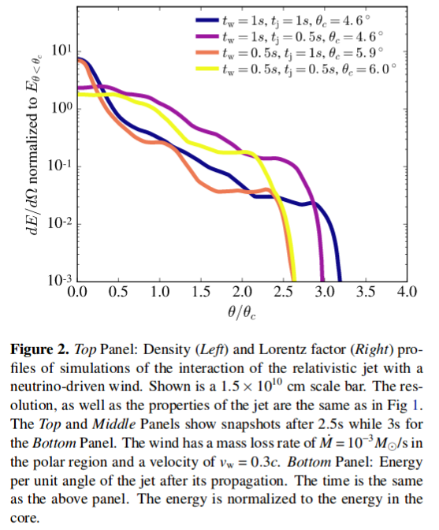

# arxiv一周文献泛读200727-200731

## 200727

---

### Optical spectroscopic classification of 35 hard X-ray sources from the Swift-BAT 70-month catalogue

https://arxiv.org/abs/2007.12609

abstract

Authors: E. J. Marchesini, N. Masetti, E. Palazzi, et al.
Comments: Last draft version before referee's approval. Closest to the final published article

The nature of a substantial percentage (about one fifth) of hard X-ray sources discovered with the BAT instrument onboard the Neil Gehrels Swift Observatory (hereafter Swift) is unknown because of the lack of an identified longer-wavelength counterpart. Without such follow-up, an X-ray catalogue is of limited astrophysical value: we therefore embarked, since 2009, on a long-term project to uncover the optical properties of sources identified by Swift by using a large suite of ground-based telescopes and instruments. 

In this work, we continue our programme of characterization of unidentified or poorly studied hard X-ray sources by presenting the results of an optical spectroscopic campaign aimed at pinpointing and classifying the optical counterparts of 35 hard X-ray sources taken from the 70-month BAT catalogue. This sample was selected out of the available information about the chosenobjects: either they are completely unidentified sources,or their association with a longer-wavelength counterpart is still ambiguous. 

With the use of optical spectra taken at six different telescopes we were able to identify the main spectral characteristics (continuum type, redshift, and emission or absorption lines) of the observed objects, and determined their nature. 

We identify and characterize a total of 41 optical candidate counterparts corresponding to 35 hard X-ray sources given that, because of positional uncertainties, multiple lower energy counterparts can sometimes be associated with higher energy detections. We discuss which ones are the actual (or at least most likely) counterparts based on our observational results.

In particular, 31 sources in our sample are active galactic nuclei: 16 are classified as Type 1 (with broad and narrow emission lines) and 13 are classified as Type 2 (with narrow emission lines only); two more are BL Lac-type objects. We also identify one LINER, one starburst, and 3 elliptical galaxies. The remaining 5 objects are galactic sources: we identify 4 of them as cataclysmic variables, whereas one is a low mass X-ray binary.

- 本文使用一批地面望远镜设备，尝试对Swift/BAT 70个月的目录中的35个未经良好证认的硬X射线源进行候选体证认，并从可见光光谱分析角度进行分类。
- 文章为这35个源找出了41个光学候选体，其中：
  - 31个候选体是活动星系核，其中16个为1型（兼有宽线和窄线），13个为2型（仅有窄线），另外2个为蝎虎座BL型天体（BL Lacertae objects）。
  - 1个LINER（Low ionization Nuclear Emission Region，低电离星系核发射区域），1个星暴星系，3个椭圆星系。
  - 剩下5个是系内目标，其中4个是激变变星（cataclysmic variables，一个白矮星加一个被吸积的伴星组成的双星系统），另1个是低质量X射线双星。

 

### The Fate of the Merger Remnant in GW170817 and its Imprint on the Jet Structure

https://arxiv.org/abs/2007.12245

abstract

Authos: Ariadna Murguia-Berthier, Enrico Ramirez-Ruiz, Fabio De Colle, Agnieszka Janiuk, Stephan Rosswog, William H. Lee
Comments: 5 figures, 7 pages, submitted to ApJL

The first neutron star binary merger detected in gravitational waves, GW170817 and the subsequent detection of its emission across the electromagnetic spectrum showed that these systems are viable progenitors of short γ-ray bursts (sGRB). The afterglow signal of GW170817 has been found to be consistent with a structured GRB jet seen off-axis, requiring significant amounts of relativistic material at large angles. This trait can be attributed to the interaction of the relativistic jet with the external wind medium. Here we perform numerical simulations of relativistic jets interacting with realistic wind environments in order to explore how the properties of the wind and central engine affect the structure of successful jets. We find that the angular energy distribution of the jet depends primarily on the ratio between the lifetime of the jet and the time it takes the merger remnant to collapse. We make use of these simulations to constrain the time it took for the merger remnant in GW170817 to collapse into a black hole based on the angular structure of the jet as inferred from afterglow observations. We conclude that the lifetime of the merger remnant in GW170817 was ≈0.8−0.9s, which, after collapse, triggered the formation of the jet. 

- GW170817成协的短暴的余辉反映了其喷流具有结构性，这可能是相对论喷流与外部星风介质相互作用的结果。
- 本文对这种相互作用进行了数值模拟，探究星风的性质和中心引擎对成功喷流的结构会产生怎样的影响。结果发现喷流的能量角分布主要决定于喷流的存在时间与并合残骸塌缩时间的比值。
- 利用以上结果，跟据观测得到的喷流能量角分布，即可得出GW170817中的并合残骸的存活时间（塌缩至黑洞所经历的时间）为0.8-0.9秒。

 

### An Energy Inventory of Tidal Disruption Events

https://arxiv.org/abs/2007.12198

abstract

Authors: Brenna Mockler, Enrico Ramirez-Ruiz
Comments: submitted to ApJL. 13 pages, 4 figures, 1 table

Tidal disruption events (TDEs) offer a unique opportunity to study a single super-massive black hole (SMBH) under feeding conditions that change over timescales of days or months. However, the primary mechanism for generating luminosity during the flares remains debated. Despite the increasing number of observed TDEs, it is unclear whether most of the energy in the initial flare comes from accretion near the gravitational radius or from circularizing debris at larger distances from the SMBH. The energy dissipation efficiency increases with decreasing radii, therefore by measuring the total energy emitted and estimating the efficiency we can derive clues about the nature of the emission mechanism. Here we calculate the integrated energy, emission timescales, and average efficiencies for the TDEs using the Modular Open Source Fitter for Transients (MOSFiT). Our calculations of the total energy generally yield higher values than previous estimates. This is predominantly because, if the luminosity follows the mass fallback rate, TDEs release a significant fraction of their energy long after their light curve peaks. We use MOSFiT to calculate the conversion efficiency from mass to radiated energy, and find that for many of the events it is similar to efficiencies inferred for active galactic nuclei. There are, however, large systematic uncertainties in the measured efficiency due to model degeneracies between the efficiency and the mass of the disrupted star, and these must be reduced before we can definitively resolve the emission mechanism of individual TDEs. 

-目前我们还不清楚TDE的耀发中的主要辐射机制，不清楚在最初耀发中的能量的主要来源（来自引力半径附近的吸积区域或远一些的环绕碎片circularizing debris）。在TDE吸积区域中，半径越小，能量耗散效率（energy dissipation efficiency）越高，所以测量TDE辐射的总能量并估算其（辐射）效率可以给我们提供有关辐射机制的线索。
- 本文使用MOSFiT来计算TDE事件的总能量（integrated energy），辐射时标和平均辐射效率。
- 本文计算给出的能量要普遍高于以往的估计，主要原因在于，如果TDE光度是随质量回落率（mass fallback rate），则在光变曲线的峰值过后，TDE仍会继续辐射大量能量。
- 计算给出的多数TDE事件的能量转换效率与活动星系核的效率类似。不过文章指出效率的测量存在较大的系统误差（由于模型存在辐射效率和被瓦解的星体质量间的简并），有必要减少这样的简并才能够更准确地解决单个事件的能量机制问题。

 

## 200728

---

### A targeted search for repeating fast radio bursts associated with gamma-ray bursts

https://arxiv.org/abs/2007.13246

abstract

Authors: Nipuni T. Palliyaguru, Devansh Agarwal, Golnoosh Golpayegani et al.
Comments: 7 pages, 4 figures, submitted to MNRAS

The origin of fast radio bursts (FRBs) still remains a mystery, even with the increased number of discoveries in the last three years. Growing evidence suggests that some FRBs may originate from magnetars. Large, single-dish telescopes such as Arecibo Observatory (AO) and Green Bank Telescope (GBT) have the sensitivity to detect FRB~121102-like bursts at gigaparsec distances. Here we present searches using AO and GBT that aimed to find potential radio bursts at 11 sites of past γ--ray bursts that show evidence for the birth of a magnetar. We also performed a search towards GW170817, which has a merger remnant whose nature remains uncertain. We place 10σ fluence upper limits of ≈0.036 Jy ms at 1.4 GHz and ≈0.063 Jy ms at 4.5 GHz for AO data and fluence upper limits of ≈0.085 Jy ms at 1.4 GHz and ≈0.098 Jy ms at 1.9 GHz for GBT data, for a maximum pulse width of ≈42 ms. The AO observations had sufficient sensitivity to detect any FRB of similar luminosity to the one recently detected from the Galactic magnetar SGR 1935+2154. Assuming a Schechter function for the luminosity function of FRBs, we find that our non-detections favor a steep power--law index (α≲−1.0) and a large cut--off luminosity ($L_0$≳ $10^{42} erg/s). 

- 作者尝试使用两个较大的单盘（single-dish）射电望远镜Arecibo Observatory (AO)和Green Bank Telescope (GBT)在11个疑似产生磁星的过往GRB的发生地，以及GW170817的区域进行潜在射电爆的搜寻。这两个望远镜足可在Gpc的距离探测到类FRB121102的爆。
- 结果没能探测到明显的射电信号，分别给出如下10σ通量上限：
  - AO:  1.4GHz upper limit ≈ 0.036 Jy ms ; 4.5 GHz upper limit ≈ 0.063 Jy ms
  - GBT: 1.4GHz upper limit ≈ 0.085 Jy ms ; 1.9 GHz upper limit ≈ 0.098 Jy ms
- 如果FRB的光度函数为Schechter function，则以上结果支持函数中应有一个较陡的幂律指数（α≲−1.0）以及一个较大的截断光度($L_0$≳ $10^{42} erg/s)。

 

### The gravitational wave background signal from tidal disruption events

https://arxiv.org/abs/2007.13225

abstract

Authors: Martina Toscani (1), Elena M. Rossi (2), Giuseppe Lodato (1) ((1) Dipartimento di Fisica, Università Degli Studi di Milano, Via Celoria, 16, Milano, 20133, Italy, (2) Leiden Observatory, Leiden University, PO Box 9513, 2300 RA, Leiden, the Netherlands)
Comments: Accepted for Publications in MNRAS. 11 pages, 5 figures

In this paper we derive the gravitational wave stochastic background from tidal disruption events (TDEs). We focus on both the signal emitted by main sequence stars disrupted by super-massive black holes (SMBHs) in galaxy nuclei, and on that from disruptions of white dwarfs by intermediate mass black holes (IMBHs) located in globular clusters. We show that the characteristic strain $h_c$'s dependence on frequency is shaped by the pericenter distribution of events within the tidal radius, and under standard assumptions $h_c∝f^{−1/2}$. This is because the TDE signal is a burst of gravitational waves at the orbital frequency of the closest approach. In addition, we compare the background characteristic strains with the sensitivity curves of the upcoming generation of space-based gravitational wave interferometers: the Laser Interferometer Space Antenna (LISA), TianQin, ALIA, the DECI-hertz inteferometer Gravitational wave Observatory (DECIGO) and the Big Bang Observer (BBO). We find that the background produced by main sequence stars might be just detected by BBO in its lowest frequency coverage, but it is too weak for all the other instruments. On the other hand, the background signal from TDEs with white dwarfs will be within reach of ALIA, and especially of DECIGO and BBO, while it is below the LISA and TianQin sensitive curves. This background signal detection will not only provide evidence for the existence of IMBHs up to redshift z∼3, but it will also inform us on the number of globular clusters per galaxy and on the occupation fraction of IMBHs in these environments. 

- 本文计算了两种TDE事件——星系核中SMBH瓦解主序星、球状星团中IMBH瓦解白矮星——中的被瓦解天体发出的引力波背景信号，并估计下一代天基引力波探测器——the Laser Interferometer Space Antenna (LISA), TianQin, ALIA, the DECI-hertz inteferometer Gravitational wave Observatory (DECIGO) and the Big Bang Observer (BBO)——是否能探测到这些信号。结果发现，对于前一种TDE的引力波信号，只有BBO能够在其最低频率探测到，而对于后一种，ALLA、DECIGO和BBO都可以探测到。
- 这样的探测工作可以为我们提供远距离（z~3）IMBH存在的证据，以及提供关于星系中球状星团的数量，IMBH在球状星团中所占比例等信息。

 

### Diverse Jet Structures Consistent with the Off-axis Afterglow of GRB 170817A

https://arxiv.org/abs/2007.13116

abstract

Authors: Kazuya Takahashi, Kunihito Ioka
Comments: 11 pages, 5 figures, 2 tables, submitted to MNRAS

The jet structure of short gamma-ray bursts (GRBs) has been controversial after the detection of GRB 170817A as the electromagnetic counterparts to the gravitational wave event GW170817. Different authors use different jet structures for calculating the afterglow light curves. We formulated a method to inversely reconstruct the jet structure uniquely from a given off-axis GRB afterglow, without assuming any functional form of the structure. By systematically applying our inversion method, we find that more diverse jet structures are consistent with the observed afterglow of GRB 170817A within errors: such as hollow-cone, spindle, Gaussian, and power-law jet structures. In addition, the total energy of the reconstructed jet is arbitrary, proportional to the ambient density n0, with keeping the same jet shape if the parameters satisfy the degeneracy combination $n_0 ε_B^{(p+1)/(p+5)} ε_e^{4(p−1)/(p+5)}=const.$. Observational accuracy less than ∼6 per cent is necessary to distinguish the different shapes, while the degeneracy of the energy scaling would be broken by observing the spectral breaks. Future events in denser environment with brighter afterglows and observable spectral breaks are ideal for our inversion method to pin down the jet structure, providing the key to the jet formation and propagation. 

- 短暴GRB 170817A的结构性喷流一直以来讨论颇多。本文使用一种逆向构建喷流结构的方法，即通过给定的偏轴GRB余辉的光变曲线，不加任何函数形式的限制，反推喷流结构的方法，试图确定GRB 170817A的喷流结构，但发现多种喷流结构都在一定误差允许范围内与GRB 170817A的观测符合，如hollow-cone, spindle, Gaussian, and power-law jet structures。

 

### Revisiting AGN as the Source of IceCube's Diffuse Neutrino Flux

https://arxiv.org/abs/2007.12706

abstract

Authors: Daniel Smith, Dan Hooper, Abby Vieregg
Comments: 14 pages, 7 figures, to be submitted to JCAP

The origin of the astrophysical neutrino flux reported by the IceCube Collaboration remains an open question. In this study, we use three years of publicly available IceCube data to search for evidence of neutrino emission from the blazars and non-blazar Active Galactic Nuclei (AGN) contained the Fermi 4LAC catalog. We find no evidence that these sources produce high-energy neutrinos, and conclude that blazars can produce no more than 15% of IceCube's observed flux. The constraint we derive on the contribution from non-blazar AGN, which are less luminous and more numerous than blazars, is significantly less restrictive, and it remains possible that this class of sources could produce the entirety of the diffuse neutrino flux observed by IceCube. We anticipate that it will become possible to definitively test such scenarios as IceCube accumulates and releases more data, and as gamma-ray catalogs of AGN become increasingly complete. We also comment on starburst and other starforming galaxies, and conclude that these sources could contribute substantially to the signal observed by IceCube, in particular at the lowest detected energies. 

- 本文使用IceCube三年的数据来寻找blazars（ 2860 sources in the Fermi 4LAC catalog）和non-blazar AGN（65个，63个包含在4LAC 中）作为中微子源的证据。
- 作者没有发现证据表明这些源产生了高能中微子，并给出blazar来源的中微子不超过IceCube观测的15%的结论。
- 至于非blazar的AGN的贡献，作者不能给出严格的限制，并称这类源仍有可能是IceCube探测到的全部diffuse neutrino flux的来源。
- 另外作者也提到星暴星系和其它starforming星系也能大量贡献观测到的中微子信号。

 

### On the Energy Sources of the Most Luminous Supernova ASASSN-15lh

https://arxiv.org/abs/2007.13464

abstract

Authors: Long Li, Zi-Gao Dai, Shan-Qin Wang, and Shu-Qing Zhong

In this paper, we investigate the energy-source models for the most luminous supernova ASASSN-15lh. We revisit the ejecta-circumstellar medium (CSM) interaction (CSI) model and the CSI plus magnetar spin-down with full gamma-ray/X-ray trapping which were adopted by Chatzopoulos et al.(2016) and find that the two models cannot fit the bolometric LC of ASASSN-15lh. Therefore, we consider a CSI plus magnetar model with the gamma-rays/X-rays leakage effect to eliminate the late-time excess of the theoretical LC. We find that this revised model can reproduce the bolometric LC of ASASSN-15lh. Moreover, we construct a new hybrid model (i.e., the CSI plus fallback model), and find that it can also reproduce the bolometric LC of ASASSN-15lh. Assuming that the conversion efficiency (η) of fallback accretion to the outflow is typically ∼ $10^{−3}$ , we derive that the total mass accreted is ∼ 3.9 $M_ ⊙$ . The inferred CSM mass in the two models is rather large, indicating that the progenitor could have experienced an eruption of hydrogen-poor materials followed by an energetic core-collapse explosion leaving behind a magnetar or a black hole.

- 目前学界存在多种模型解释超亮超新星的能源机制问题，如pair instability SN，磁星自旋减慢，喷射物与爆周介质相互作用，回落吸积等模型。本文讨论了超新星ASASSN-15lh——最明亮的超新星（？？）——的能量来源模型。
- 文章首先回顾了Chatzopoulos et al.(2016)采用的两种模型：ejecta-circumstellar medium interaction  (CSI)模型和CSI加上伴随 full gamma-ray/X-ray trapping的磁星自旋减慢模型，发现这两种模型均不能拟合ASASSN-15lh的bolometric光变曲线。
- 故作者考虑了CSI加上伴随gamma-rays/X-rays leakage effect的磁星模型以消除理论光变曲线在晚期的超出，修改后的模型可以重现bolometric光变曲线。另外作者还考虑了CSI加回落吸积的组合模型，在一定条件下也能重现光变曲线，此情况下假设回落吸积物质到外流的转化效率为典型的~$10^{-3}$，则总吸积质量约为3.9$M_ ⊙$。
- 两种模型导出的CSM质量都比较大（SN ejecta + CSM: ~61 $M_⊙$, ~ 47 $M_⊙$），表明前身星可能是经历了一次少氢物质的爆发，随后是一次高能的核塌缩爆炸，留下一个磁星或是黑洞。

### PTF11rka: an interacting supernova at the crossroads ofstripped-envelope and H-poor super-luminous stellar core collapses

https://arxiv.org/abs/2007.13144

abstract

Authors: Elena Pian , Paolo A. Mazzali , Takashi J. Moriya et al.
Comments:  18 page, 9 figures, MNRAS, in press

The hydrogen-poor supernova PTF11rka (z = 0.0744), reported by the Palomar Transient Factory, was observed with various telescopes starting a few days after the estimated explosion time of 2011 Dec. 5 UT and up to 432 rest-frame days thereafter. The rising part of the light curve was monitored only in the $R_{PTF}$ filter band, and maximum in this band was reached ~30 rest-frame days after the estimated explosion time. The light curve and spectra of PTF11rka are consistent with the core-collapse explosion of a ~10  $M_⊙$ carbon-oxygen core evolved from a progenitor of main-sequence mass 25--40  $M_⊙$, that liberated a kinetic energy ($E_K$) ~ $4 \times 10^{51} erg$, expelled ~8  $M_⊙$ of ejecta ($M_{ej}$), and synthesised ~0.5  $M_⊙$ of 56Ni. The photospheric spectra of PTF11rka are characterised by narrow absorption lines that point to suppression of the highest ejecta velocities ~>15,000 km/s. This would be expected if the ejecta impacted a dense, clumpy circumstellar medium. This in turn caused them to lose a fraction of their energy (~$5 \times 10^{50} erg$), less than 2% of which was converted into radiation that sustained the light curve before maximum brightness. This is reminiscent of the superluminous SN 2007bi, the light-curve shape and spectra of which are very similar to those of PTF11rka, although the latter is a factor of 10 less luminous and evolves faster in time. PTF11rka is in fact more similar to gamma-ray burst supernovae (GRB-SNe) in luminosity, although it has a lower energy and a lower $E_K/M_{ej}$ ratio.

- 作者对少氢超新星 PTF11rka (z=0.074)的观测数据，包括光变曲线和光谱，进行了讨论分析。
- 测光开始于爆后数天（估计爆发时间为2011年12月5日UT），并一直持续，最后一次观测在开始观测的432天后。PTF11rka光变的上升阶段仅有$R_{PTF}$波段（P48）的数据，该波段下大概在爆后30天左右达到峰值。之后P60也参与进来，提供了gri波段的数据。在最后的fully nebular phase，即430天左右，由VLT提供了BVRI的数据。测光期间一共进行了6次测谱。

- 由PTF11rka的光变和光谱得出其前生星是一个质量 ~25 - 40 $M_⊙$的主序星，塌缩演化称~ 10 $M_⊙$的炭氧核心并发生爆炸，释放出动能$E_K$) ~ $4 \times 10^{51} erg$，和质量~8  $M_⊙$的抛射物，并且产生了~0.5  $M_⊙$的56Ni.其光球层光谱具有窄线特征，限制了喷射物的最高速度，表明这些喷射物“撞进”了一个密度较大，比较厚重的介质中，损失了~$5 \times 10^{50} erg$的能量。

- 除了光度较弱，演化较快之外，PTF11rka的光变和光谱均与超量超新星SN 2007bi相似；不过另一方面，其光度和56Ni的产量均与GRB-SNe非常相近，尽管它的能量和$E_K/M_{ej}$更低。

## 200729

### Spectroscopic properties of the dwarf nova-type cataclysmic variables observed by LAMOST

https://arxiv.org/abs/2007.14016

abstract

Authors: Han Zhongtao, Boonrucksar Soonthornthum, Qian Shengbang, et al.
Comments: 29 pages, 11 figures

Spectra of 76 known dwarf novae from the LAMOST survey were presented. Most of the objects were observed in quiescence, and about 16 systems have typical outburst spectra. 36 of these systems were observed by SDSS, and most of their spectra are similar to the SDSS spectra. 2 objects, V367 Peg and V537 Peg, are the first to observe their spectra. The spectrum of V367 Peg shows a contribution from a M-type donor and its spectral type could be estimated as M3-5 by combining its orbital period. The signature of white dwarf spectrum can be seen clearly in four low-accretion-rate WZ Sge stars. Other special spectral features worthy of further observations are also noted and discussed. We present a LAMOST spectral atlas of outbursting dwarf novae. 6 objects have the first outburst spectra, and the others were also compared with the published outburst spectra. We argue that these data will be useful for further investigation of the accretion disc properties. The HeII λ4686 emission line can be found in the outburst spectra of seven dwarf novae. These objects are excellent candidates for probing the spiral asymmetries of accretion disc. 

- 作者使用LAMOST对76个已知的矮新星拍摄了131张光谱，讨论了它们的光谱性质。
- 大部分光谱是在矮新星的沉默阶段的光谱（光学薄，主要呈现较强的Balmer线和中性氦系列线叠加在较平坦的连续谱上），而有16个系统的光谱是比较典型的爆发时期的光谱（变为光学厚，以吸收线为主，且由于吸积盘温度高，连续谱偏蓝）。

- V367 Peg  V537 Peg这两个目标是首次被拍光谱，其中V367 Peg的光谱显示出了伴星（donor）的M型光谱。
- 另外，在4个低吸积率的系统（WZ Sge stars, EG Cnc, EZLyn, PQ And and V355 UMa）的光谱中显漏出白矮星的光谱（通常由比较陡的“蓝色”连续谱加上围绕Blamer线的较宽的吸收"翼""  -> often reveal a steep blue continuum plus broad absorption wings around the Balmer emissions）

- 另外，文章提到outburst时期的光谱可用来研究吸积盘的性质。

### SN 2018zd: An Unusual Stellar Explosion as Part of the Diverse Type II Supernova Landscape

https://arxiv.org/abs/2007.14348

 

## 200730

### Detection of 15 bursts from FRB 180916.J0158+65 with the uGMRT

https://arxiv.org/abs/2007.14404

 

## 200731

### Dust-scattering halo and giant hard X-ray flare from the Supergiant Fast X-ray Transient IGR J16479-4514 investigated with XMM-Newton and INTEGRAL

https://arxiv.org/abs/2007.15329

### Confirmed width-Eiso and width-Liso relations in GRB: comparison with the Amati and Yonetoku relations

https://arxiv.org/abs/2007.15443

### Gravitational-wave signal of a core-collapse supernova explosion of a 15 Solar mass star

https://arxiv.org/abs/2007.15099