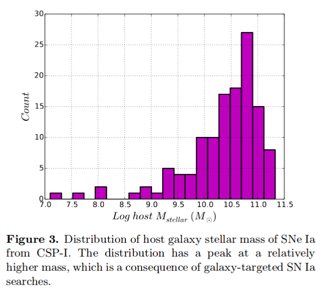
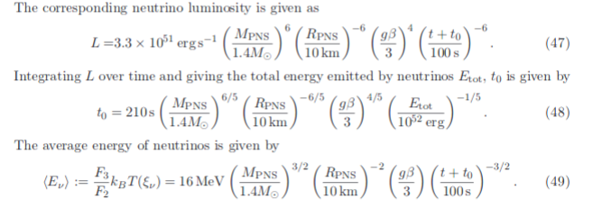
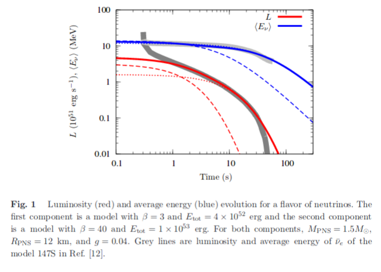

# arxiv一周文献泛读200817-200821

## 200817

### [IceCube Search for High-Energy Neutrino Emission from TeV Pulsar Wind Nebulae](./2003.12071.pdf)

`https://arxiv.org/abs/2003.12071`

details

Authors: M. G. Aartsen, M. Ackermann, J. Adams, et al.
Comments: 11 pages, 2 figures; matches the published version in ApJ

Pulsar wind nebulae (PWNe) are the main gamma-ray emitters in the Galactic plane. They are diffuse nebulae that emit nonthermal radiation. Pulsar winds, relativistic magnetized outflows from the central star, shocked in the ambient medium produce a multiwavelength emission from the radio through gamma rays. Although the leptonic scenario is able to explain most PWNe emission, a hadronic contribution cannot be excluded. A possible hadronic contribution to the high-energy gamma-ray emission inevitably leads to the production of neutrinos. Using 9.5 yr of all-sky IceCube data, we report results from a stacking analysis to search for neutrino emission from 35 PWNe that are high-energy gamma-ray emitters. In the absence of any significant correlation, we set upper limits on the total neutrino emission from those PWNe and constraints on hadronic spectral components. 

- 脉冲星风星云PWNe是具有非热辐射的弥散星云，脉冲星风是来自中心源的相对论性磁化外流，与周围介质相互作用而产生从射电到伽马射线的多波段辐射。
- 脉冲星风星云是银道面上主要的gamma-ray辐射源。
- 尽管轻子情形可以解释大部分PWNe辐射，也不能否定存在来自重子的贡献。如果在高能伽马射线辐射中存在重子的贡献，就不可避免会产生中微子。
- 本文使用IceCube9.5年的全天数据，报告了对辐射高能伽马射线的35个PWNe进行中微子辐射搜寻的stacking分析结果。
- 在没有发现明显的关联的结果下，作者给出了这些PWNe的总中微子辐射的上限，对重子光谱成分进行了限制。

 

### [The Carnegie Supernova Project-I: Correlation  Between Type Ia Supernovae and Their Host Galaxies from Optical to  Near-Infrared Bands](./2006.15164.pdf)

`https://arxiv.org/abs/2006.15164`

details

Authors: Syed A. Uddin, Christopher R. Burns, M. M. Phillips et al.
Comments: Accepted to The Astrophysical Journal

We present optical and near-infrared ($ugriYJH$) photometry of host galaxies of Type Ia supernovae (SN Ia) observed by the Carnegie Supernova Project-I. We determine host galaxy stellar masses and, for the first time, study their correlation with SN Ia **standardized** luminosity across optical and near-infrared ($uBgVriYJH$) bands. In the individual bands, we find that SNe Ia are more luminous in more massive hosts with **luminosity offsets** ranging between −0.07±0.03 mag to −0.15±0.04 mag after **light-curve standardization**. The slope of the SN Ia Hubble residual-host mass relation is negative across all $uBgVriYJH$ bands with values ranging between −0.036±0.025 mag/dex to −0.097±0.027 mag/dex -- implying that **SNe Ia in more massive galaxies are brighter than expected**. The near-constant observed correlations across optical and near-infrared bands indicate that dust may not play a significant role in the observed **luminosity offset**--host mass correlation. We measure projected separations between SNe Ia and their host centers, and find that SNe Ia that explode beyond a projected 10 kpc have a 30% to 50% reduction of the dispersion in Hubble residuals across all bands -- making them a more uniform subset of SNe~Ia. Dust in host galaxies, peculiar velocities of nearby SN Ia, or a combination of both may drive this result as the **color excesses** of SNe Ia beyond 10 kpc are found to be generally lower than those interior, but there is also a diminishing trend of the dispersion as we exclude nearby events. We do not find that SN Ia average luminosity varies significantly when they are grouped in various **host morphological types**. Host galaxy data from this work will be useful, in conjunction with future high-redshift samples, in constraining cosmological parameters. 

- 作者报道了[Carnegie Supernova Project](https://csp.obs.carnegiescience.edu/)-I (CSP-I)项目中观测的Ia型SN的宿主星系的光学近红外测光。

  - CSP-I 2004-2010，主要对低红移（0<z<0.1） 的SNe 进行精准的多波段光变曲线测光观测以及光谱的获取。

- 决定了宿主星系质量，首次研究了它们与Ia型SN从光学到近红外 ($uBgVriYJH$) 波段标准化光度间的关系。

  

- 在单个波段，发现更大质量星系的Ia型SN会更明亮，with **luminosity offsets** ranging between −0.07±0.03 mag to −0.15±0.04 mag after **light-curve standardization**(correcting for the luminosity-decline rate relation).

- Ia型 SN 哈勃残差-宿主星系质量的相关性在所有$uBgVriYJH$ 波段都是负值，变化范围为 −0.029±0.029 mag/dex to −0.093±0.031 mag/dex，这表明更大质量星系的Ia型SN比预期的更亮（由于斜率是负数，质量越大即哈勃残差绝对值越大，即实际越亮）。

  - The Hubble residual is the deviation of the inferred distance modulus to the SN, calculated from its apparent luminosity and light curve properties, away from the expected value at the SN redshift. [Kelly et al 2009](https://arxiv.org/abs/0912.0929)
  - Hubble residual is the difference between the predicted and the observed values of distance moduli after obtaining a best-fit cosmological model for a given set of SNe Ia.  We will refer to Hubble residuals as luminosities in such a way that negative values indicate more luminous SNe Ia. This work

   

- 从光学到近红外波段上观测的相关性近似不变，表明尘埃在观测到的**luminosity offset**--host mass correlation中没有显著影响。

- 测量了Ia型 SNe 距离它们宿主星系中心的投影距离，发现在10kpc以上爆发的Ia SN的各波段哈勃残差的弥散要小30%到50%，表明这部分SN是一个更均匀的Ia SN 的子集。宿主星系的尘埃，邻近Ia SN的peculiar velocity (refers to the motion of an object relative to a Galactic rest fram)，都可能导致这样的结果。

  

- 另外，10kpc以上 Ia SNe 的 color excesses 普遍低于10kpc以内的，but there is also a diminishing trend of the dispersion as we exclude nearby events.

  

- 如果按照宿主形态类型把Ia SNe 进行分组，没有发现 Ia SNe 平均光度有显著的变化。

 

## 200818

### [Analytic solutions for neutrino-light curves of core-collapse supernovae](./2008.07070.pdf)

`https://arxiv.org/abs/2008.07070`

details

Athours: Yudai Suwa (Kyoto Sangyo U. & YITP), Akira Harada (ICRR), Ken'ichiro Nakazato (Kyushu U.), Kohsuke Sumiyoshi (NIT, Numazu College)
Comments: 12 pages, 1 figure, 1 table

Neutrino is a guaranteed signal from supernova explosions in the Milky Way and is the most valuable messenger that can provide us with information about the deepest part of supernovae. In particular, neutrinos will provide us with physical quantities, such as the radius and mass of protoneutron stars (PNS), which are the central engine of supernovae. It requires a theoretical model that connects observables such as neutrino luminosity and average energy with physical quantities. Here we show analytic solutions for the neutrino-light curve derived from the neutrino radiation transport equation by employing the diffusion approximation and the analytic density solution of the hydrostatic equation for the PNS. The neutrino luminosity and the average energy as functions of time are explicitly presented, with dependence on PNS mass, radius, the total energy of neutrinos, surface density, and opacity. The analytic solutions provide good representations of the numerical models from a few seconds after the explosion and let our rough estimate of these physical quantities to be made from observational data. 

- 文章提出了一个核塌缩超新星的中微子辐射光变曲线的解析模型。如中微子光度和平均能量随时间的变化关系，其中涉及到PNS(prototypeneutron star)质量，半径，中微子总能亮，表面密度，不透明度等参数。
- 此模型可描述爆后>~ 1s的中微子辐射行为。

 

### [The early discovery of SN 2017ahn: signatures of persistent interaction in a fast declining Type II supernova](./2008.06515.pdf)

`https://arxiv.org/abs/2008.06515`

details

Authors: L. Tartaglia, D. J. Sand, J. H. Groh et al.
Comments: 24 pages (20+Appendices), 16 figures, 4 tables, submitted to ApJ

We present high-cadence, comprehensive data on the nearby (D≃33Mpc) Type II SN 2017ahn, discovered within ∼1 day of explosion, from the very early phases after explosion to the nebular phase. The observables of SN 2017ahn show a significant evolution over the ≃470d of our follow-up campaign, first showing prominent, narrow Balmer lines and other high-ionization features purely in emission (i.e. flash spectroscopy features), which progressively fade and lead to a spectroscopic evolution similar to that of more canonical Type II supernovae. Over the same period, the decline of the light curves in all bands is fast, resembling the photometric evolution of linearly declining H-rich core-collapse supernovae. The modeling of the light curves and early flash spectra suggest a complex circumstellar medium surrounding the progenitor star at the time of explosion, with a first dense shell produced during the very late stages of its evolution being swept up by the rapidly expanding ejecta within the first ∼6d of the supernova evolution, while signatures of interaction are observed also at later phases. Hydrodynamical models support the scenario in which linearly declining Type II supernovae are predicted to arise from massive yellow super/hyper giants depleted of most of their hydrogen layers.

- 报道了对一颗邻近Type II SN 2017ahn的长期跟踪观测。从爆后1天内到星云阶段，一共约470天。
  
  - 2017 02 8.29 由Cerro  Tololo  Inter-American  Observatory  (CTIO,Cerro  Pach ́on,  Chile).的0.41米 PROMPT5望远镜发现。
  - 后续观测大多使用了Las Cumbres Observatory network (Brown et al. 2013) within the Supernova Key Project的仪器，部分数据使用了挂载于智利ESO La Silla Observatory 2.2米的MPG望远镜上的Gamma-Ray Burst Optical/Near-Infrared Detector (GROND）
  
- 观测上表现出明显的演化行为，首先是有显著的窄Balmer线系以及其它的高电离度的发射特征（如耀发光谱特征），约一周后逐渐衰减并与大多数典型II型超新星的光谱演化相似。 

- 在同一阶段，所有波段的光变曲线的衰减都很快，与线性衰减的H-rich核塌缩超新星的光变相似。

  

  

- 对光变曲线和早期耀发光谱的模型拟合表明爆发时前身星周围的介质比较复杂，在约6天内，密度大的壳层被后面迅速扩张的抛射物扫过（with a first dense shell produced during the very late stages of its evolution being swept up by the rapidly expanding ejecta within the first ∼6d of the supernova evolution），同时在晚期也观测到了相互作用的迹象。

- 流体动力学模型支持线性衰减的II型超新星来自于耗尽大部分氢层的yellow super/hyper giants。

 

### [Repeating behaviour of FRB 121102: periodicity, waiting times and energy distribution](./2008.03461.pdf)

`https://arxiv.org/abs/2008.03461`

details

Authors: M. Cruces, L. G. Spitler, P. Scholz et al.

Since the discovery of repetition it has been clear that the detections of fast radio burst (FRB) 121102 are clustered. Recently, it was argued that it is periodic, raising the question of whether the clustering reflected a not-yet-defined periodicity. We performed an extensive multi-wavelength campaign with Effelsberg, Green Bank telescope and the Arecibo observatory to shadow the Gran Telescope Canaria (optical), NuSTAR (X-ray) and INTEGRAL (gamma-ray). We detected 36 bursts with Effelsberg, one with a pulse width of 39\,ms. We tested the periodicity hypothesis using 165-hr of Effelsberg, and find a periodicity of 161±5 days. We predict the source to be active from 2020-07-09 to 2020-10-14 and, posteriorly, from 2020-12-17 to 2021-03-24. With the bursts detected, we compare the waiting times between consecutive bursts with a Weibull distribution with shape parameter k<1, and a Poissonian distribution. We conclude that the strong clustering was indeed a consequence of a periodic activity and show that if few events of millisecond scale separation are excluded, the sample agrees with a Poissonian distribution. We model the bursts cumulative energy distribution, with energies from ∼1038-1039 erg, and find that it is well described by a power-law with slope of γ=−1.1±0.2. We exclude a time changing slope to reconcile the discrepancies between the published values and propose that a single power-law might not fit the data over many orders of magnitude. With one burst detected during simultaneous NuSTAR observations, we place a 5-σ upper limit of 6−40×1046 erg on the 3−79 keV energy of an X-ray burst counterpart. 

 

### [SN2020bvc: a Broad-lined Type Ic Supernova with a Double-peaked Optical Light Curve and a Luminous X-ray and Radio Counterpart](./2004.10406v2.pdf)

`https://arxiv.org/abs/2004.10406`

details

Authors: Anna Y. Q. Ho, S. R. Kulkarni, Daniel A. Perley et al.
Commetns: Accepted to ApJ. 39 pages, 17 figures. Comments welcome

We present optical, radio, and X-ray observations of SN2020bvc (=ASASSN20bs; ZTF20aalxlis), a nearby (z=0.0252; d=114 Mpc) broad-lined (BL) Type Ic supernova (SN). Our observations show that SN2020bvc shares several properties in common with the Ic-BL SN2006aj, which was associated with the low-luminosity gamma-ray burst (LLGRB) 060218. First, the 10 GHz radio light curve is on the faint end of LLGRB-SNe (Lradio≈1037erg/s): we model our VLA observations (spanning 13-43 d) as synchrotron emission from a mildly relativistic (v≳0.3c) forward shock. Second, with Swift and Chandra we detect X-ray emission (LX≈1041erg/s) that is not naturally explained as inverse Compton emission or as part of the same synchrotron spectrum as the radio emission. Third, high-cadence (6×/night) data from the Zwicky Transient Facility (ZTF) shows a double-peaked optical light curve, the first peak from shock-cooling emission from extended low-mass material (mass M<10−2$M_⊙$ at radius R>1012cm) and the second peak from the radioactive decay of Ni-56. SN2020bvc is the first confirmed double-peaked Ic-BL SN discovered without a GRB trigger, and shows X-ray and radio emission similar to LLGRB-SNe: this is consistent with models in which the same mechanism produces both the LLGRB and the shock-cooling emission. For four of the five other nearby (z≲0.05) Ic-BL SNe with ZTF high-cadence data, we rule out a first peak like that seen in SN2006aj and SN2020bvc, i.e. that lasts ≈1d and reaches a peak luminosity M≈−18. X-ray and radio follow-up observations of future such events will establish whether double-peaked optical light curves are indeed predictive of LLGRB-like X-ray and radio emission. 

 

## 200819

### [Supernovae Ib and Ic from the explosion of helium stars](./2008.07601.pdf)

`https://arxiv.org/abs/2008.07601`

details

Authors: Luc Dessart, Sung-Chul Yoon, David R. Aguilera-Dena, and Norbert Lange
Comments: Accepted for publication in A&A

Much difficulty has so far prevented the emergence of a consistent scenario for the origin of Type Ib and Ic supernovae (SNe). Either the SN rates, or the ejecta masses and composition were in tension with inferred properties from observations. Here, we follow a heuristic approach by examining the fate of helium stars in the mass range 4 to 12 Msun, which presumably form in interacting binaries. The  helium  stars  are  evolved  using  stellar  wind  mass  loss  rates  that  agree  with  observations,  and  which  reproduce  the  observed luminosity range of galactic WR stars, leading to stellar masses at core collapse in the range 3 to 5.5 Msun. We then explode these models adopting an explosion energy proportional to the ejecta mass, roughly consistent with theoretical predictions. We impose a fixed 56Ni mass and strong mixing. The SN radiation from 3 to 100 d is computed self-consistently starting from the input stellar models using the time-dependent non-local thermodynamic equilibrium radiative-transfer code CMFGEN. By design, our fiducial models yield very similar light curves, with a rise time of about 20 d and a peak luminosity of ~ $10^{42.2}erg/s, in line with representative SNe Ibc. The less massive progenitors retain a He-rich envelope and reproduce the color, line widths, and line strengths of a representative sample of SNe Ib, while stellar winds remove most of the helium in the more massive progenitors, whose spectra match typical SNe Ic in detail. The transition between the predicted Ib-like and Ic-like spectra is continuous, but it is sharp, such that the resulting models essentially form a dichotomy. Further models computed with varying explosion energy,56Ni mass, and long-term power injection from the remnant show that a moderate variation of these parameters can reproduce much of the diversity of SNe Ibc. We conclude that stars stripped by a binary companion can account for the vast majority of ordinary Type Ib and Ic SNe, and that stellar wind mass loss is the key to remove the helium envelope in the progenitors of SNe Ic

- 文章对相互作用双星中的氦星进行了演化模拟，用不同的参数（如56Ni，质量损失率，爆炸能量等）可以重现不同类型的Ib/Ic型SN的行为（如光变曲线，峰值光度等）。
- 质量不那么大的前身星会保留富He的包层，可重现典型Ib型SN的颜色，线宽，线强度。
- 更大质量的前身星的氦被星风剥离，产生典型Ic型SN的光谱细节。
- 结论是在双星中被伴星剥离的恒星可以解释绝大多数的普通SNe-Ib和Ic，且星风质量损失是SN-Ic前身中氦包层被剥离的关键。

 

### [Optical and spectral observations and hydrodynamic modelling of Type IIb Supernova 2017gpn](./2008.07934.pdf)

`https://arxiv.org/abs/2008.07934`

details

Authors: Elena A. Balakina, Maria V. Pruzhinskaya, ...  Xiaofeng Wang, Danfeng Xiang, Han Lin et al.
Comments: 18 pages, 13 figures

In this work we present the photometric and spectroscopic observations of Type IIb Supernova 2017gpn. This supernova was discovered in the error-box of LIGO/Virgo G299232 gravitational-wave event. We obtained the light curves in B and R passbands and modelled them numerically using the one-dimensional radiation hydrocode STELLA. The best-fit model has the following parameters: the pre-SN star mass and the radius are 3.5 Msun and 50 Rsun, respectively; the explosion energy is $E_{exp} = 1.2 * 10^{51} erg$; the mass of radioactive nickel is $M_{56Ni} =0.11 M_{sun}$, which is totally mixed through the ejecta, the mass of the hydrogen envelope 0.06 Msun. Moreover, SN 2017gpn is a confirmed SN IIb that is located at the farthest distance from the center of its host galaxy NGC 1343 (i.e. the projected distance is about 21 kpc). This challenges the scenario of the origin of Type IIb Supernovae from massive stars. 

- 对IIb型超新星2017gpn进行了测光和测谱。这颗超新星是在LIGO/Virgo G299232引力波事件的误差天区中发现的。
  - 在O2的最后一天2017 08 27.017，首先由MASTER发现，名为 MASTER OT J033744.97+723159.0
  - 作者使用SAO RAS 的 Zeiss-1000 望远镜进行了20次测光
  - 兴隆216参与了后续测谱，进一步证实SN类型
- 对B R波段的光变曲线进行了拟合（one-dimensional radiation hydrocode STELLA），最佳拟合参数为：
  -  前身星质量和半径：3.5 $M_⊙$ ， 50 $R_⊙$
  -  爆炸能量：$E_{exp} = 1.2 * 10^{51} erg$
  -  56Ni质量： $M_{56Ni} =0.11 M_⊙$，完全与抛射物混合
- SN 2017gpn是已确定的距离宿主星系最远的IIb SN （21 kpc from NGC 1343）

 

## 200820

### [NGC 2770: high supernova rate due to interaction ](./2008.08091.pdf)

`https://arxiv.org/abs/2008.08091`

details

Authors: Michał J. Michałowski, Christina Thöne, Antonio de Ugarte Postigo et al.
Comments: Astronomy & Astrophysics, in press, 8 pages, 3 figures, 1 table

Context. Galaxies that hosted many core-collapse supernova (SN) explosions can be used to study the conditions necessary for the formation of massive stars. NGC 2770 was dubbed an SN factory because it hosted four core-collapse SNe in 20 years (three type Ib and one type IIn). Its star formation rate (SFR) was reported to not be enhanced and, therefore, not compatible with such a high SN rate.

Aims. We aim to explain the high SN rate of NGC 2770.

Methods. We used archival HI line data for NGC 2770 and reinterpreted the Hα and optical continuum data.

Results.Even though the continuum-based SFR indicators do not yield high values, the dust-corrected Hα luminosity implies  a high SFR, consistent with the high SN rate. Such a disparity between the SFR estimators is an indication of recently enhanced starformation activity because the continuum indicators trace long timescales of the order of 100 Myr, unlike the line indicators, which trace timescales of the order of 10 Myr. Hence, the unique feature of NGC 2770 compared to other galaxies is the fact that it was observed very shortly after the enhancement of the SFR. It also has high dust extinction,E(B−V) above 1 mag. We provide support for the hypothesis that the increased SFR in NGC 2770 is due to the interaction with its companion galaxies. We report an HI bridge between NGC 2770 and its closest companion and the existence of a total of four companions within 100 kpc (one identified for the first time). There are no clear HI concentrations close to the positions of SNe in NGC 2770 such as those detected for hosts of gamma-ray bursts (GRBs) and broad-lined SNe type Ic (IcBL).This suggests that the progenitors of type Ib SNe are not born out of recently accreted atomic gas, as was suggested for GRB and IcBL SN progenitors.

- NGC 2770 在20年内发生了4次核塌缩超新星事件（3个Ib 1个IIn），有很高的SN发生率，而其恒星形成率（SFR）没有发现有增大，与高SN发生率不匹配 (Thöne et al. 2009)。
- 本篇文章的目标是解释NGC 2770的高SN发生率。
- 分别使用了基于连续谱（continuum-based）和尘埃修正的Hα 光度来估算SFR。前者没有给出较高的SFR，后者则给出高的SFR（40-50$M_⊙ /yr$ ），与高SN发生率匹配。两种方法的不一致可能是因为前者追踪的时标较长，数量级100Myr；而后者相对较短，为10Myr，表明NGC 2770的S恒星形成活动在最近被增强。
- 作者提出NGC 2770 的 SFR 增大的原因是其与伴星系的相互作用。
- NGC 2770 中 SN 发生的位置没有像在GRB和宽线Ic型SN的宿主星系中发现的明显的HI聚集（concentration），表明Ib SN的前身星不像GRB和IcBL SN的前身星那样产生于新近加速吸积的原子气体（recently accreted atomic gas）。

 