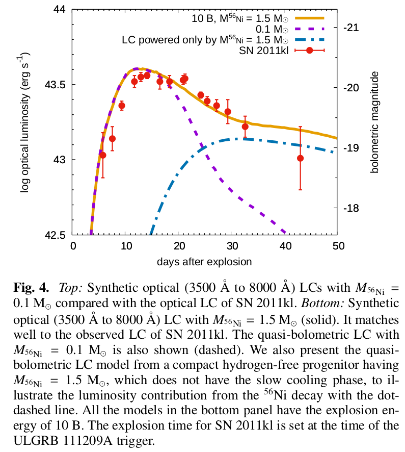

# arxiv一周文献泛读200907-200901

## 200097

### [Luminous supernovae associated with ultra-long gamma-ray bursts from hydrogen-free progenitors extended by pulsationalpair-instability](./2007.06221.pdf)

`https://arxiv.org/abs/2007.06221`

details

Authors: Takashi J. Moriya, Pablo Marchant, Sergei I. Blinnikov
Comments: 5 pages, 5 figures, accepted by Astronomy & Astrophysics Letters

We show that the luminous supernovae associated with ultra-long gamma-ray bursts can be related to the slow cooling from the explosions of hydrogen-free progenitors extended by pulsational pair-instability. In the accompanying paper (Marchant & Moriya 2020),we have shown that some rapidly-rotating hydrogen-free gamma-ray burst progenitors that experience pulsational pair-instability can keep an extended structure caused by pulsational pair-instability until the core collapse. Such progenitors have large radii exceeding10 $R_⊙$ and they sometimes reach beyond 1000 $R_⊙$ at the time of the core collapse. They are, therefore, promising progenitors of ultra-long gamma-ray bursts. We here perform the light-curve modeling of the explosions of one extended hydrogen-free progenitor with a radius of 1962 $R_⊙$. The progenitor mass is 50 $M_⊙$ and 5 $M_⊙$ exists in the extended envelope. We use one-dimensional radiation hydrodynamics code STELLA in which the explosions are initiated artificially by setting given explosion energy and 56Ni mass.Thanks to the large progenitor radius, the ejecta experience slow cooling after the shock breakout and they become rapidly evolving( <~ 10 days) luminous ( >~ $10^{43} erg/s$) supernovae in optical even without the energy input from the 56Ni nuclear decay when the explosion energy is more than $10^{52}erg$. The 56Ni decay energy input can affect the light curves after the optical light-curve peak and make the light-curve decay slow when the 56Ni mass is around 1 $M_⊙$. They also have fast photospheric velocity above 10,000 km/s and hot photospheric temperature above 10,000 K at around the peak luminosity. We find that the rapid rise and luminous peak found in the optical light curve of SN 2011kl, which is associated with the ultra-long gamma-ray burst GRB 111209A, can be explained as the cooling phase of the extended progenitor. The subsequent slow light-curve decline can be related to the 56Ni decay energy input.The ultra-long gamma-ray burst progenitors proposed in Marchant & Moriya (2020) can explain both the ultra-long gamma-ray burst duration and the accompanying supernova properties. When the gamma-ray burst jet is off-axis or choked, the luminous supernovae could be observed as fast blue optical transients without accompanying gamma-ray bursts.

- 与超长伽玛暴成协的明亮超新星可能与受脉冲对不稳定性(pulsational pair-instability)影响被扩展(extended)的无氢前身星爆发后的慢冷却阶段相关。
- Marchant & Moriya 2020 中说明了核塌缩之前发生的pulsational pair-instability可以让无氢的GRB前身星的结构发生延展。这样的前身星在核塌缩时的半径大于10$R_⊙$，有时可达1000$R_⊙$以上，因此可以作为超长暴的前身星。
- 由于前身星的半径大，抛射物在激波突破后经历慢冷却阶段而形成快速演化( <~ 10 days)且明亮 ( >~ $10^{43} erg/s$)的超新星。如果爆发能量足够($10^{52}erg$)，此过程还无需56Ni的参与。不过56Ni的衰变可影响峰值后的光变曲线，使其衰减较慢。
- 与超长暴GRB 111209A成协的SN 2011kl就可以用这样的模型解释。

 

### [The Carnegie Supernova Project-I: Correlation  Between Type Ia Supernovae and Their Host Galaxies from Optical to  Near-Infrared Bands](./2006.15164.pdf)

`https://arxiv.org/abs/2006.15164`

details

Authors: Syed A. Uddin, Christopher R. Burns, M. M. Phillips et al.
Comments: Accepted to The Astrophysical Journal

We present optical and near-infrared ($ugriYJH$) photometry of host galaxies of Type Ia supernovae (SN Ia) observed by the Carnegie Supernova Project-I. We determine host galaxy stellar masses and, for the first time, study their correlation with SN Ia **standardized** luminosity across optical and near-infrared ($uBgVriYJH$) bands. In the individual bands, we find that SNe Ia are more luminous in more massive hosts with **luminosity offsets** ranging between −0.07±0.03 mag to −0.15±0.04 mag after **light-curve standardization**. The slope of the SN Ia Hubble residual-host mass relation is negative across all $uBgVriYJH$ bands with values ranging between −0.036±0.025 mag/dex to −0.097±0.027 mag/dex -- implying that **SNe Ia in more massive galaxies are brighter than expected**. The near-constant observed correlations across optical and near-infrared bands indicate that dust may not play a significant role in the observed **luminosity offset**--host mass correlation. We measure projected separations between SNe Ia and their host centers, and find that SNe Ia that explode beyond a projected 10 kpc have a 30% to 50% reduction of the dispersion in Hubble residuals across all bands -- making them a more uniform subset of SNe~Ia. Dust in host galaxies, peculiar velocities of nearby SN Ia, or a combination of both may drive this result as the **color excesses** of SNe Ia beyond 10 kpc are found to be generally lower than those interior, but there is also a diminishing trend of the dispersion as we exclude nearby events. We do not find that SN Ia average luminosity varies significantly when they are grouped in various **host morphological types**. Host galaxy data from this work will be useful, in conjunction with future high-redshift samples, in constraining cosmological parameters. 

- 作者报道了[Carnegie Supernova Project](https://csp.obs.carnegiescience.edu/)-I (CSP-I)项目中观测的Ia型SN的宿主星系的光学近红外测光。

  - CSP-I 2004-2010，主要对低红移（0<z<0.1） 的SNe 进行精准的多波段光变曲线测光观测以及光谱的获取。

- 决定了宿主星系质量，首次研究了它们与Ia型SN从光学到近红外 ($uBgVriYJH$) 波段标准化光度间的关系。

  

- 在单个波段，发现更大质量星系的Ia型SN会更明亮，with **luminosity offsets** ranging between −0.07±0.03 mag to −0.15±0.04 mag after **light-curve standardization**(correcting for the luminosity-decline rate relation).

- Ia型 SN 哈勃残差-宿主星系质量的相关性在所有$uBgVriYJH$ 波段都是负值，变化范围为 −0.029±0.029 mag/dex to −0.093±0.031 mag/dex，这表明更大质量星系的Ia型SN比预期的更亮（由于斜率是负数，质量越大即哈勃残差绝对值越大，即实际越亮）。

  - The Hubble residual is the deviation of the inferred distance modulus to the SN, calculated from its apparent luminosity and light curve properties, away from the expected value at the SN redshift. [Kelly et al 2009](https://arxiv.org/abs/0912.0929)
  - Hubble residual is the difference between the predicted and the observed values of distance moduli after obtaining a best-fit cosmological model for a given set of SNe Ia.  We will refer to Hubble residuals as luminosities in such a way that negative values indicate more luminous SNe Ia. This work

   

- 从光学到近红外波段上观测的相关性近似不变，表明尘埃在观测到的**luminosity offset**--host mass correlation中没有显著影响。

- 测量了Ia型 SNe 距离它们宿主星系中心的投影距离，发现在10kpc以上爆发的Ia SN的各波段哈勃残差的弥散要小30%到50%，表明这部分SN是一个更均匀的Ia SN 的子集。宿主星系的尘埃，邻近Ia SN的peculiar velocity (refers to the motion of an object relative to a Galactic rest fram)，都可能导致这样的结果。

  

- 另外，10kpc以上 Ia SNe 的 color excesses 普遍低于10kpc以内的，but there is also a diminishing trend of the dispersion as we exclude nearby events.

  

- 如果按照宿主形态类型把Ia SNe 进行分组，没有发现 Ia SNe 平均光度有显著的变化。

 

## 200818

### [Analytic solutions for neutrino-light curves of core-collapse supernovae](./2008.07070.pdf)

`https://arxiv.org/abs/2008.07070`

details

Athours: Yudai Suwa (Kyoto Sangyo U. & YITP), Akira Harada (ICRR), Ken'ichiro Nakazato (Kyushu U.), Kohsuke Sumiyoshi (NIT, Numazu College)
Comments: 12 pages, 1 figure, 1 table

Neutrino is a guaranteed signal from supernova explosions in the Milky Way and is the most valuable messenger that can provide us with information about the deepest part of supernovae. In particular, neutrinos will provide us with physical quantities, such as the radius and mass of protoneutron stars (PNS), which are the central engine of supernovae. It requires a theoretical model that connects observables such as neutrino luminosity and average energy with physical quantities. Here we show analytic solutions for the neutrino-light curve derived from the neutrino radiation transport equation by employing the diffusion approximation and the analytic density solution of the hydrostatic equation for the PNS. The neutrino luminosity and the average energy as functions of time are explicitly presented, with dependence on PNS mass, radius, the total energy of neutrinos, surface density, and opacity. The analytic solutions provide good representations of the numerical models from a few seconds after the explosion and let our rough estimate of these physical quantities to be made from observational data. 

- 文章提出了一个核塌缩超新星的中微子辐射光变曲线的解析模型。如中微子光度和平均能量随时间的变化关系，其中涉及到PNS(prototypeneutron star)质量，半径，中微子总能亮，表面密度，不透明度等参数。
- 此模型可描述爆后>~ 1s的中微子辐射行为。

 

### [The early discovery of SN 2017ahn: signatures of persistent interaction in a fast declining Type II supernova](./2008.06515.pdf)

`https://arxiv.org/abs/2008.06515`

details

Authors: L. Tartaglia, D. J. Sand, J. H. Groh et al.
Comments: 24 pages (20+Appendices), 16 figures, 4 tables, submitted to ApJ

We present high-cadence, comprehensive data on the nearby (D≃33Mpc) Type II SN 2017ahn, discovered within ∼1 day of explosion, from the very early phases after explosion to the nebular phase. The observables of SN 2017ahn show a significant evolution over the ≃470d of our follow-up campaign, first showing prominent, narrow Balmer lines and other high-ionization features purely in emission (i.e. flash spectroscopy features), which progressively fade and lead to a spectroscopic evolution similar to that of more canonical Type II supernovae. Over the same period, the decline of the light curves in all bands is fast, resembling the photometric evolution of linearly declining H-rich core-collapse supernovae. The modeling of the light curves and early flash spectra suggest a complex circumstellar medium surrounding the progenitor star at the time of explosion, with a first dense shell produced during the very late stages of its evolution being swept up by the rapidly expanding ejecta within the first ∼6d of the supernova evolution, while signatures of interaction are observed also at later phases. Hydrodynamical models support the scenario in which linearly declining Type II supernovae are predicted to arise from massive yellow super/hyper giants depleted of most of their hydrogen layers.

- 报道了对一颗邻近Type II SN 2017ahn的长期跟踪观测。从爆后1天内到星云阶段，一共约470天。
  
  - 2017 02 8.29 由Cerro  Tololo  Inter-American  Observatory  (CTIO,Cerro  Pach ́on,  Chile).的0.41米 PROMPT5望远镜发现。
  - 后续观测大多使用了Las Cumbres Observatory network (Brown et al. 2013) within the Supernova Key Project的仪器，部分数据使用了挂载于智利ESO La Silla Observatory 2.2米的MPG望远镜上的Gamma-Ray Burst Optical/Near-Infrared Detector (GROND）
  
- 观测上表现出明显的演化行为，首先是有显著的窄Balmer线系以及其它的高电离度的发射特征（如耀发光谱特征），约一周后逐渐衰减并与大多数典型II型超新星的光谱演化相似。 

- 在同一阶段，所有波段的光变曲线的衰减都很快，与线性衰减的H-rich核塌缩超新星的光变相似。

  

  

- 对光变曲线和早期耀发光谱的模型拟合表明爆发时前身星周围的介质比较复杂，在约6天内，密度大的壳层被后面迅速扩张的抛射物扫过（with a first dense shell produced during the very late stages of its evolution being swept up by the rapidly expanding ejecta within the first ∼6d of the supernova evolution），同时在晚期也观测到了相互作用的迹象。

- 流体动力学模型支持线性衰减的II型超新星来自于耗尽大部分氢层的yellow super/hyper giants。

 

### [Repeating behaviour of FRB 121102: periodicity, waiting times and energy distribution](./2008.03461.pdf)

`https://arxiv.org/abs/2008.03461`

details

Authors: M. Cruces, L. G. Spitler, P. Scholz et al.

Since the discovery of repetition it has been clear that the detections of fast radio burst (FRB) 121102 are **clustered**. Recently, it was argued that it is periodic, raising the question of whether the clustering reflected a not-yet-defined periodicity. We performed an extensive multi-wavelength campaign with Effelsberg, Green Bank telescope and the Arecibo observatory to **shadow** the Gran Telescope Canaria (optical), NuSTAR (X-ray) and INTEGRAL (gamma-ray). We detected 36 bursts with Effelsberg, one with a pulse width of 39ms. We tested the periodicity hypothesis using 165-hr of Effelsberg, and find a periodicity of 161±5 days. We predict the source to be active from 2020-07-09 to 2020-10-14 and, posteriorly, from 2020-12-17 to 2021-03-24. With the bursts detected, we compare the **waiting times** between consecutive bursts with a Weibull distribution with shape parameter k<1, and a Poissonian distribution. We conclude that the strong clustering was indeed a consequence of a periodic activity and show that if few events of millisecond scale separation are excluded, the sample agrees with a Poissonian distribution. We model the bursts cumulative energy distribution, with energies from ~ $10^{38}-10^{39}$ erg, and find that it is well described by a power-law with slope of γ=−1.1±0.2. We exclude a time changing slope to reconcile the discrepancies between the published values and propose that a single power-law might not fit the data over many orders of magnitude. With one burst detected during simultaneous NuSTAR observations, we place a 5-σ upper limit of $6−40×10^{46}$ erg on the 3−79 keV energy of an X-ray burst counterpart. 

- 本文讨论了FRB 121102 的周期性，爆发时间间隔和能量分布的情况。

- 对于FRB 121102的探测是簇集的（clustered）。这些簇集的爆发是否反映了还未被定义的周期性？

- 作者利用Effelsberg（17年9月到20年6月）、Green Bank和Arecibo进行了长期的多波段观测to **shadow** the Gran Telescope Canaria (optical), NuSTAR (X-ray) and INTEGRAL (gamma-ray).

- Effelsberg探测到了36个爆，其中一个的脉冲宽度为39ms。作者对165小时的Effelsberg观测数据进行了周期性检验，发现161±5天的周期性行为，预测此源在2020-07-09 to 2020-10-14为活跃期，下一个活跃期为2020-12-17 to 2021-03-24。

- 作者把这些连续探测间等待时间与形状参数k<1的韦伯分布以及泊松分布比较，发现强簇集性的确是周期活动的结果，而且如果忽略少量毫秒级别的时间间隔，样本就呈现一个泊松分布。

  

- 作者在拟合了~ $10^{38}-10^{39}$ erg能段的爆发累计能量分布，发现其较好符合斜率γ=−1.1±0.2的幂率。

- 有一个爆同时被NuSTAR探测到，给出了X-射线对应体在3−79 keV 区间内的5-σ能量上限为$6−40×10^{46}$ erg

 

### [SN2020bvc: a Broad-lined Type Ic Supernova with a Double-peaked Optical Light Curve and a Luminous X-ray and Radio Counterpart](./2004.10406v2.pdf)

`https://arxiv.org/abs/2004.10406`

details

Authors: Anna Y. Q. Ho, S. R. Kulkarni, Daniel A. Perley et al.
Commetns: Accepted to ApJ. 39 pages, 17 figures. Comments welcome

We present optical, radio, and X-ray observations of SN2020bvc (=ASASSN20bs; ZTF20aalxlis), a nearby (z=0.0252; d=114 Mpc) broad-lined (BL) Type Ic supernova (SN). Our observations show that SN2020bvc shares several properties in common with the Ic-BL SN2006aj, which was associated with the low-luminosity gamma-ray burst (LLGRB) 060218. First, the 10 GHz radio light curve is on the faint end of LLGRB-SNe ($L_{radio}≈10^{37}erg/s$): we model our VLA observations (spanning 13-43 d) as synchrotron emission from a mildly relativistic (v≳0.3c) forward shock. Second, with Swift and Chandra we detect X-ray emission ($L_X≈10^{41}erg/s$) that is not naturally explained as inverse Compton emission or as part of the same synchrotron spectrum as the radio emission. Third, high-cadence (6×/night) data from the Zwicky Transient Facility (ZTF) shows a double-peaked optical light curve, the first peak from shock-cooling emission from extended low-mass material (mass $M_e<10^{−2}M_⊙$ at radius $R>10^{12}cm$) and the second peak from the radioactive decay of Ni-56. SN2020bvc is the first confirmed double-peaked Ic-BL SN discovered without a GRB trigger, so it is noteworthy that it shows X-ray and radio emission similar to LLGRB-SNe: this is consistent with models in which the same mechanism produces both the LLGRB and the shock-cooling emission. For four of the five other nearby (z≲0.05) Ic-BL SNe with ZTF high-cadence data, we rule out a first peak like that seen in SN2006aj and SN2020bvc, i.e. that lasts ≈1d and reaches a peak luminosity M≈−18. X-ray and radio follow-up observations of future such events will establish whether double-peaked optical light curves are indeed predictive of LLGRB-like X-ray and radio emission. 

- 报道了对一个邻近（z=0.0252; d=114 Mpc）的宽线Ic型超新星 SN2020bvc的光学，射电和X射线观测。观测显示SN2020bvc与另一个Ic-BL SN2006aj有一些相似的性质，而后者与低光度GRB060218成协。
  - 半数GRB-SNe成协的GRB是LLGRB，$L_{\gamma,iso} < 10^{48.5} erg/s$。宇宙学GRB $L_{\gamma,iso} > 10^{49.5} erg/s$。
  - LLGRB 的普遍程度是 宇宙学GRB的10倍到100倍（Soderberg et al. 2006; Liang
    et al. 2007），但探测率很低，样本很少，传统GRBs, LLGRBs, Ic-BL SNe的联系还不清楚。
  - 通过光学-X射线-射电的观测来发现与GRB相关的但没有GRB触发的事件现象可以帮助加深对三者联系的理解。
  - SN2020bvc于2月4.34首次探测到（P48），$i=17.48 \pm 0.05 mag$，$ra= 14:33:57.01,dec=40:14:37.5$。而最近一次non-detection为ASAS-SN的0.67天前即Feb 03.67，$o>19.4mag$。探测的2小时后P60的SEDM进行测谱，光谱由热连续谱主导，有一些宿主星系的氢线以及微弱的吸收线。在Feb 08.24使用Liverpool Telescope的SPRAT再次测谱，显示出Ic-BL SN的特征。

  

- 首先，10GHz的射电光变曲线在LLGRB-SNe中处于弱端（$L_{radio}≈10^{37}erg/s$），采用来自轻相对论性前向激波（v≳0.3c）的同步辐射情景来拟合VLA观测（14-43d）。

- 其次，使用$Swift$和$Chandra$探测的X射线辐射（$L_X≈10^{41}erg/s$）用逆康普顿散射或是用同步辐射都不能很好的解释观测（that is **not naturally** explained as inverse Compton emission or as part of the same synchrotron spectrum as the radio emission.），可能是多成分的辐射。

- 第三，高节奏（6x/night）的ZTF观测呈现了一个双峰的光变曲线，第一个峰来自延展的低质量物质 (mass $M_e<10^{−2}M_⊙$ at radius $R>10^{12}cm$)的激波冷却（shock-cooling ），第二个峰来自Ni-56的放射性衰变。

- SN2020bvc是第一个被证实的没有探测到GRB的双峰Ic-BL SN，而且它展示出了与LLGRB-SNe相似的X射线和射电辐射：这符合LLGRB和激波冷却辐射产生自相同机制的模型是符合的。

- 在另外5个ZTF观测的邻近（z≲0.05）的Ic-BL SNe中，4个SN没有类似于SN2006aj和SN2020bvc第一个峰（持续1天，峰值达到M=-18）的峰。

  

- 对未来这类事件的X射线和射电的跟踪观测将有助于确定双峰光学光变曲线是否能预测类LLGRB的X射线和射电辐射。

 

## 200819

### [Supernovae Ib and Ic from the explosion of helium stars](./2008.07601.pdf)

`https://arxiv.org/abs/2008.07601`

details

Authors: Luc Dessart, Sung-Chul Yoon, David R. Aguilera-Dena, and Norbert Lange
Comments: Accepted for publication in A&A

Much difficulty has so far prevented the emergence of a consistent scenario for the origin of Type Ib and Ic supernovae (SNe). Either the SN rates, or the ejecta masses and composition were in tension with inferred properties from observations. Here, we follow a heuristic approach by examining the fate of helium stars in the mass range 4 to 12 Msun, which presumably form in interacting binaries. The  helium  stars  are  evolved  using  stellar  wind  mass  loss  rates  that  agree  with  observations,  and  which  reproduce  the  observed luminosity range of galactic WR stars, leading to stellar masses at core collapse in the range 3 to 5.5 Msun. We then explode these models adopting an explosion energy proportional to the ejecta mass, roughly consistent with theoretical predictions. We impose a fixed 56Ni mass and strong mixing. The SN radiation from 3 to 100 d is computed self-consistently starting from the input stellar models using the time-dependent non-local thermodynamic equilibrium radiative-transfer code CMFGEN. By design, our fiducial models yield very similar light curves, with a rise time of about 20 d and a peak luminosity of ~ $10^{42.2}erg/s, in line with representative SNe Ibc. The less massive progenitors retain a He-rich envelope and reproduce the color, line widths, and line strengths of a representative sample of SNe Ib, while stellar winds remove most of the helium in the more massive progenitors, whose spectra match typical SNe Ic in detail. The transition between the predicted Ib-like and Ic-like spectra is continuous, but it is sharp, such that the resulting models essentially form a dichotomy. Further models computed with varying explosion energy,56Ni mass, and long-term power injection from the remnant show that a moderate variation of these parameters can reproduce much of the diversity of SNe Ibc. We conclude that stars stripped by a binary companion can account for the vast majority of ordinary Type Ib and Ic SNe, and that stellar wind mass loss is the key to remove the helium envelope in the progenitors of SNe Ic

- 文章对相互作用双星中的氦星进行了演化模拟，用不同的参数（如56Ni，质量损失率，爆炸能量等）可以重现不同类型的Ib/Ic型SN的行为（如光变曲线，峰值光度等）。
- 质量不那么大的前身星会保留富He的包层，可重现典型Ib型SN的颜色，线宽，线强度。
- 更大质量的前身星的氦被星风剥离，产生典型Ic型SN的光谱细节。
- 结论是在双星中被伴星剥离的恒星可以解释绝大多数的普通SNe-Ib和Ic，且星风质量损失是SN-Ic前身中氦包层被剥离的关键。

 

### [Optical and spectral observations and hydrodynamic modelling of Type IIb Supernova 2017gpn](./2008.07934.pdf)

`https://arxiv.org/abs/2008.07934`

details

Authors: Elena A. Balakina, Maria V. Pruzhinskaya, ...  Xiaofeng Wang, Danfeng Xiang, Han Lin et al.
Comments: 18 pages, 13 figures

In this work we present the photometric and spectroscopic observations of Type IIb Supernova 2017gpn. This supernova was discovered in the error-box of LIGO/Virgo G299232 gravitational-wave event. We obtained the light curves in B and R passbands and modelled them numerically using the one-dimensional radiation hydrocode STELLA. The best-fit model has the following parameters: the pre-SN star mass and the radius are 3.5 Msun and 50 Rsun, respectively; the explosion energy is $E_{exp} = 1.2 * 10^{51} erg$; the mass of radioactive nickel is $M_{56Ni} =0.11 M_{sun}$, which is totally mixed through the ejecta, the mass of the hydrogen envelope 0.06 Msun. Moreover, SN 2017gpn is a confirmed SN IIb that is located at the farthest distance from the center of its host galaxy NGC 1343 (i.e. the projected distance is about 21 kpc). This challenges the scenario of the origin of Type IIb Supernovae from massive stars. 

- 对IIb型超新星2017gpn进行了测光和测谱。这颗超新星是在LIGO/Virgo G299232引力波事件的误差天区中发现的。
  - 在O2的最后一天2017 08 27.017，首先由MASTER发现，名为 MASTER OT J033744.97+723159.0
  - 作者使用SAO RAS 的 Zeiss-1000 望远镜进行了20次测光
  - 兴隆216参与了后续测谱，进一步证实SN类型
- 对B R波段的光变曲线进行了拟合（one-dimensional radiation hydrocode STELLA），最佳拟合参数为：
  -  前身星质量和半径：3.5 $M_⊙$ ， 50 $R_⊙$
  -  爆炸能量：$E_{exp} = 1.2 * 10^{51} erg$
  -  56Ni质量： $M_{56Ni} =0.11 M_⊙$，完全与抛射物混合
- SN 2017gpn是已确定的距离宿主星系最远的IIb SN （21 kpc from NGC 1343）

 

## 200820

### [NGC 2770: high supernova rate due to interaction ](./2008.08091.pdf)

`https://arxiv.org/abs/2008.08091`

details

Authors: Michał J. Michałowski, Christina Thöne, Antonio de Ugarte Postigo et al.
Comments: Astronomy & Astrophysics, in press, 8 pages, 3 figures, 1 table

Context. Galaxies that hosted many core-collapse supernova (SN) explosions can be used to study the conditions necessary for the formation of massive stars. NGC 2770 was dubbed an SN factory because it hosted four core-collapse SNe in 20 years (three type Ib and one type IIn). Its star formation rate (SFR) was reported to not be enhanced and, therefore, not compatible with such a high SN rate.

Aims. We aim to explain the high SN rate of NGC 2770.

Methods. We used archival HI line data for NGC 2770 and reinterpreted the Hα and optical continuum data.

Results.Even though the continuum-based SFR indicators do not yield high values, the dust-corrected Hα luminosity implies  a high SFR, consistent with the high SN rate. Such a disparity between the SFR estimators is an indication of recently enhanced starformation activity because the continuum indicators trace long timescales of the order of 100 Myr, unlike the line indicators, which trace timescales of the order of 10 Myr. Hence, the unique feature of NGC 2770 compared to other galaxies is the fact that it was observed very shortly after the enhancement of the SFR. It also has high dust extinction,E(B−V) above 1 mag. We provide support for the hypothesis that the increased SFR in NGC 2770 is due to the interaction with its companion galaxies. We report an HI bridge between NGC 2770 and its closest companion and the existence of a total of four companions within 100 kpc (one identified for the first time). There are no clear HI concentrations close to the positions of SNe in NGC 2770 such as those detected for hosts of gamma-ray bursts (GRBs) and broad-lined SNe type Ic (IcBL).This suggests that the progenitors of type Ib SNe are not born out of recently accreted atomic gas, as was suggested for GRB and IcBL SN progenitors.

- NGC 2770 在20年内发生了4次核塌缩超新星事件（3个Ib 1个IIn），有很高的SN发生率，而其恒星形成率（SFR）没有发现有增大，与高SN发生率不匹配 (Thöne et al. 2009)。
- 本篇文章的目标是解释NGC 2770的高SN发生率。
- 分别使用了基于连续谱（continuum-based）和尘埃修正的Hα 光度来估算SFR。前者没有给出较高的SFR，后者则给出高的SFR（40-50$M_⊙ /yr$ ），与高SN发生率匹配。两种方法的不一致可能是因为前者追踪的时标较长，数量级100Myr；而后者相对较短，为10Myr，表明NGC 2770的S恒星形成活动在最近被增强。
- 作者提出NGC 2770 的 SFR 增大的原因是其与伴星系的相互作用。
- NGC 2770 中 SN 发生的位置没有像在GRB和宽线Ic型SN的宿主星系中发现的明显的HI聚集（concentration），表明Ib SN的前身星不像GRB和IcBL SN的前身星那样产生于新近加速吸积的原子气体（recently accreted atomic gas）。

 

## 200821

### [The Broad-band Counterpart of the Short GRB 200522A at *z*=0.5536: A Luminous Kilonova or a Collimated Outflow with a Reverse Shock?](./2008.08593.pdf)

`https://arxiv.org/abs/2008.08593`

details

Authors: W. Fong (Northwestern/CIERA), T. Laskar, J. Rastinejad  et al.
Comments: 33 pages, 13 figures, 5 tables. Submitted to AAS Journals

We present the discovery of the radio afterglow and near-infrared (NIR) counterpart of the Swift short GRB 200522A, located at a small projected offset of ≈1 kpc from the center of a young, star-forming host galaxy at z=0.5536. The radio and X-ray luminosities of the afterglow are consistent with those of on-axis cosmological short GRBs. The NIR counterpart, revealed by our HST observations at a rest-frame time of ≈2.3 days, has a luminosity of $≈(1.3−1.7)×10^{42} erg/s$. This is substantially lower than on-axis short GRB afterglow detections, but is a factor of ≈8-17 more luminous than the kilonova of GW170817, and significantly more luminous than any kilonova candidate for which comparable observations exist. The combination of the counterpart's color ($i−y=− 0.08±0.21$; rest-frame) and luminosity cannot be explained by standard radioactive heating alone. We present two scenarios to interpret the broad-band behavior of GRB 200522A: a synchrotron forward shock with a luminous kilonova (potentially boosted by magnetar energy deposition), or forward and reverse shocks from a $≈14^∘$, relativistic ($Γ_0≳80$) jet. Models which include a combination of enhanced radioactive heating rates, low-lanthanide mass fractions, or additional sources of heating from late-time central engine activity may provide viable alternate explanations. If a stable magnetar was indeed produced in GRB 200522A, we predict that late-time radio emission will be detectable starting ≈0.3-6 years after the burst for a deposited energy of ≈$10^{53}$ erg. Counterparts of similar luminosity to GRB 200522A associated with gravitational wave events will be detectable with current optical searches to ≈250 Mpc. 

- 本文报道了对$Swift$短爆 GRB 200522A的射电余辉和近红外对应体的发现。这颗爆位于一个红移z=0.5536的年轻恒星形成星系中心1kpc开外。

- 余辉的射电光度和X射线光度与正轴宇宙学短伽玛爆一致。

- 哈勃拍摄的静系2.3天近红外图像光度为$≈(1.3−1.7)×10^{42} erg/s$，这显著低于其它正轴短爆的余晖探测，但比GW170817的kilonova要亮8-17倍。作者估计的$E_{\gamma,iso}(15-150keV) = (8.4 \pm 1.1) \times 10^{49} erg$。

  

- 该候选体的颜色 ($i−y=−0.08±0.21$; rest-frame) 以及光度无法仅用标准的放射性加热来解释，作者提出了两种情景解释GRB 200522A的宽频行为：

  - 同步辐射的前向激波加上一个较亮的kilonova（可能由磁星的energy deposition驱动）

    

  - 14度角的相对论性（$Γ_0≳80$）喷流中的前向和反向激波

    

  - PS1 $y: \lambda_{eff} = 9613.5$

- 另外包括增强的放射性加热率、低镧系元素质量、或来自晚期中心引擎活动的额外加热源都可能提供可行的解释。

- 如果GRB 200522A 中产生了稳定磁星，作者预测，对于deposited energy of ≈$10^{53}$ erg，将在爆后约0.3-6年开始探测到晚期射电辐射。

 

### [Pre-supernova evolution, compact object masses and explosionproperties of stripped binary stars](./2008.08599.pdf)

`https://arxiv.org/abs/2008.08599`

  
details

 Authors: F.R.N. Schneider, Ph. Podsiadlowski, and B. M ̈uller 
 Comments: 24 pages (incl. appendix), 17 figures, 2 tables; submitted to A&A; comments welcome

 The era of large transient surveys, gravitational-wave observatories and multi-messenger astronomy has opened up new possibilitiesfor our understanding of the evolution and final fate of massive stars. Most massive stars are born in binary or higher-order multiple systems and exchange mass with a companion star during their lives. In particular, the progenitors of a large fraction of compact object mergers, and Galactic neutron stars (NSs) and black holes (BHs) have been stripped offtheir envelopes by a binary companion.Here, we study the evolution of single and stripped binary stars up to core collapse with the stellar evolution code Mesa and their final fates with a parametric supernova (SN) model. We find that stripped binary stars can have systematically different pre-SN structures compared to genuine single stars and thus also different SN outcomes. The bases of these differences are already established by the end of core helium burning and are preserved up to core collapse. Consequently, we find that Case A & B stripped stars and single & Case C stripped stars develop qualitatively similar pre-SN core structures. We find a non-monotonic pattern of NS and BH formationas a function of CO core mass that is different in single and stripped binary stars. In terms of initial masses, single stars of 35 Msun all form BHs, while this transition is only at about 70 Msun in stripped stars. On average, stripped stars give rise to lower NS and BHmasses, higher explosion energies, higher kick velocities and higher nickel yields. Within a simplified population synthesis model, w eshow that our results lead to a significant reduction of the rates of BH-NS and BH-BH mergers with respect to typical assumptionsmade on NS and BH formation. Therefore, we predict lower detection rates of such merger events by, e.g., advanced LIGO thanis often considered. We further show how certain features in the NS–BH mass distribution of single and stripped stars relate to thechirp-mass distribution of compact object mergers. Further implications of our findings are discussed with respect to the missingred-supergiant problem, a possible mass gap between NSs and BHs, X-ray binaries and observationally inferred nickel masses fromType Ib/c and IIP SNe.

 - 单星和包层剥离的双星之间在爆发SN之前的结构存在系统性差异(关键的量是CO核心质量和氢燃烧后炭的丰富度)，因此导致SN的不同。这些差异在核心氦燃烧结束时已经开始存在，一直延续到核塌缩。
 - 初始质量大于35倍太阳质量的单星最后都会形成黑洞，而对于剥离双星，这个质量是70太阳质量。
 - 平均而言，剥离恒星会导致较低的NS和BH质量，较高的爆炸能量，较高的反冲速度和较高的Ni产率。
 - 简化的population综合模型表明，本文的结果将导致BH-NS和BH-BH并合的几率将会比传统预期大大降低。

