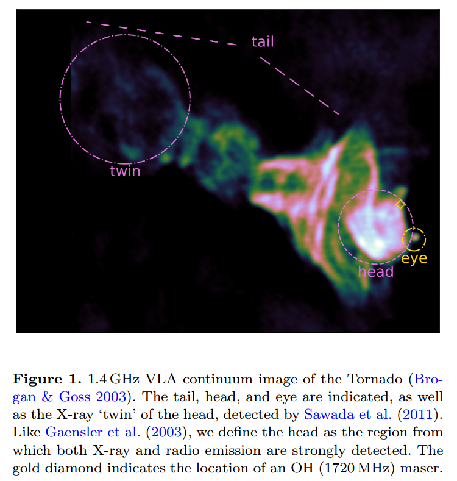

# arxiv一周文献泛读200921

## 200921

### [Directional association of TeV to PeV astrophysical neutrinos with active galaxies hosting compact radio jets](./2009.08914.pdf)

`https://arxiv.org/abs/2009.08914`

details

Authors: A.V. Plavin (ASC Lebedev, MIPT), Y.Y. Kovalev (ASC Lebedev, MIPT, MPIfR), Y.A. Kovalev (ASC Lebedev), S.V. Troitsky (INR)
Comments: 12 pages, 4 figures; submitted to ApJ

We have shown recently that high-energy neutrinos above 200 TeV detected by IceCube are produced within several parsecs in the central regions of radio-bright active galactic nuclei (AGNs). To independently test this result and to extend the analysis to a wider energy range, we use here public data for all energies from seven years of IceCube observations. The IceCube point-source likelyhood map is analyzed against positions of AGNs from a large complete sample selected by their compact radio flux density. The latter analysis delivers 3.0σ significance with the combined post-trial significance of both studies being 4.1σ. The correlation is driven by a large number of AGNs. Together with fainter but physically similar sources not included in the sample, these radio-bright quasars may explain the entire IceCube astrophysical neutrino flux as derived from muon-track analyses. The neutrinos can be produced in interactions of relativistic protons with X-ray self-Compton photons in parsec-scale AGN jets. 

- 作者在之前( Plavin et al. (2020) )提出IceCube探测到的200TeV以上的高能中微子是在射电明亮的AG中心区域几个pc尺度内产生的。
- 这篇文章使用IceCube最近公布的7年来的数据进一步验证并扩展这个结论。
- 结果证明从TeV 到PeV能段，这个联系均成立。
- 高能靶光子（target photons）是pγ相互作用中产生低能中微子的必要条件，这是agn中产生中微子最可能途径。而在射电明亮的AGN中，这些靶光子可以由X射线自康普顿辐射提供，而这就伴随非热电子在射电波段产生的同步辐射被我们观测到。

 

### [A Galactic Dust Devil: far-infrared observations of the Tornado Supernova Remnant candidate](./2009.08471.pdf)

`https://arxiv.org/abs/2009.08471`

details

Authors: Hannah Chawner, Alex D.P. Howard, Haley L. Gomez, et al.
Comments: 16 pages, 10 figures + 3 appendix figures. Accepted to be published in MNRAS

We present complicated dust structures within multiple regions of the candidate supernova remnant (SNR) the 'Tornado' (G357.7-0.1) using observations with Spitzer and Herschel. We use Point Process Mapping, PPMAP, to investigate the distribution of dust in the Tornado at a resolution of 8", compared to the native telescope beams of 5-36". We find complex dust structures at multiple temperatures within both the head and the tail of the Tornado, ranging from 15 to 60K. Cool dust in the head forms a shell, with some overlap with the radio emission, which envelopes warm dust at the X-ray peak. Akin to the terrestrial sandy whirlwinds known as `Dust Devils', we find a large mass of dust contained within the Tornado. We derive a total dust mass for the Tornado head of 16.7 solar masses, assuming a dust absorption coefficient of kappa_300 =0.56m^2 kg^1, which can be explained by interstellar material swept up by a SNR expanding in a dense region. The X-ray, infra-red, and radio emission from the Tornado head indicate that this is a SNR. The origin of the tail is more unclear, although we propose that there is an X-ray binary embedded in the SNR, the outflow from which drives into the SNR shell. This interaction forms the helical tail structure in a similar manner to that of the SNR W50 and microquasar SS433. 

- 使用Spitzer和Herschel对超新星遗迹'Tornado'进行了观测，展现这个SNR中多个区域存在复杂的尘埃结构。研究尘埃分布的方法：Point Process Mapping, PPMAP。

  

- 在Tornado的头部和尾部均发现了不同温度的复杂尘埃结构，这些尘埃的温度范围为15K到60K。

- 在头部，较冷的尘埃形成一个壳层，包裹着较热的具有X射线辐射的尘埃。还计算了头部尘埃质量为16.7倍太阳质量，并且发现大多数尘埃是被辐射加热的而不是碰撞加热的。

- 其尾巴内部可能存在一个X射线双星，它们的外流与SNR的shell相互作用形成螺旋状的尾部结构。

 

### [Black Hole Mergers from Hierarchical Triples in Dense Star Clusters](./2009.08468.pdf)

`https://arxiv.org/abs/2009.08468`

details

Authors: Miguel A. S. Martinez, Giacomo Fragione, et al.
Comments: 21 Pages, 11 Figures, 2 Tables, Accepted for publication in ApJ

Hierarchical triples are expected to be produced by the frequent binary-mediated interactions in the cores of globular clusters. In some of these triples, the tertiary companion can drive the inner binary to merger following large eccentricity oscillations, as a result of the eccentric Kozai-Lidov mechanism. In this paper, we study the dynamics and merger rates of black hole (BH) hierarchical triples, formed via binary--binary encounters in the CMC Cluster Catalog, a suite of cluster simulations with present-day properties representative of the Milky Way's globular clusters. We compare the properties of the mergers from triples to the other merger channels in dense star clusters, and show that triple systems do not produce significant differences in terms of mass and effective spin distribution. However, they represent an important pathway for forming eccentric mergers, which could be detected by LIGO--Virgo/KAGRA (LVK), and future missions such as LISA and DECIGO. We derive a conservative lower limit for the merger rate from this channel of 0.35 Gpc$^{−3}$yr$^{−1}$ in the local Universe and up to ∼9% of these events may have a detectable eccentricity at LVK design sensitivity. Additionally, we find that triple systems could play an important role in retaining second-generation BHs, which can later merge again in the core of the host cluster. 

- 层级性三星可能产生与球状星团核心中频繁发生的binary-mediated interactions。在这样的三星中，由于eccentric Kozai-Lidov，第三颗伴星的潮汐作用可以使内部的双星发生大程度偏心震荡(large eccentricity oscillations)，结果发生并合。
- 本文计算了这种并合情况的动力学以及并合率。
- 比较了三星系统与稠密星团中其他并合途径的特性，发现在质量和有效自旋分布方面两者没有显著差异。
- 给出了这种并合途径在本地宇宙的保守发生率下限为 0.35 Gpc$^{−3}$yr$^{−1}$。

 