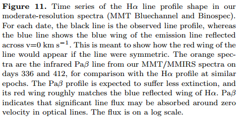
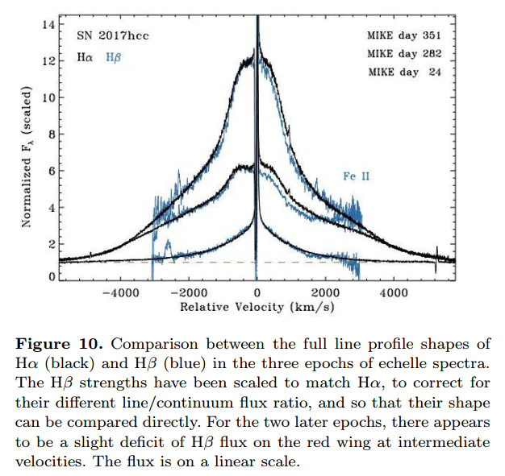
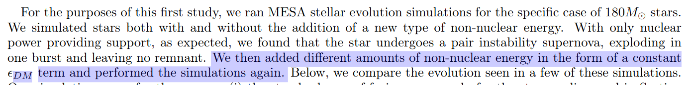
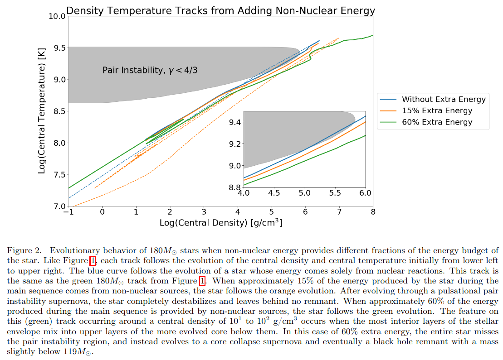

# arxiv一周文献泛读2001001-1002

## 201001

### [High-resolution spectroscopy of SN 2017hcc and its blueshifted line profiles from post-shock dust formation](./2009.14215.pdf)

`https://arxiv.org/abs/2009.14215`

details

Authors: Nathan Smith, Jennifer E. Andrews
Comments: 21 pages, 16 figures, accepted in MNRAS

SN2017hcc was remarkable for being a nearby and strongly polarized superluminous TypeIIn supernova (SN). We obtained high-resolution echelle spectra that we combine with other spectra to investigate its line profile evolution. All epochs reveal narrow P Cygni components from pre-shock circumstellar material (CSM), indicating an axisymmetric outflow from the progenitor of 40-50 km/s. Intermediate-width and broad components exhibit the classic evolution seen in luminous SNe~IIn: symmetric Lorentzian profiles from pre-shock CSM lines broadened by electron scattering at early times, transitioning at late times to multi-component, irregular profiles coming from the SN ejecta and post-shock shell. As in many SNe~IIn, profiles show a progressively increasing blueshift, with a clear flux deficit in red wings of the intermediate and broad velocity components after day 200. This blueshift develops after the continuum luminosity fades, and in the intermediate-width component, persists at late times even after the SN ejecta fade. In SN2017hcc, the blueshift cannot be explained as occultation by the SN photosphere, pre-shock acceleration of CSM, or a lopsided explosion or CSM. Instead, the blueshift arises from dust formation in the post-shock shell and in the SN ejecta. The effect has a wavelength dependence characteristic of dust, exhibiting an extinction law consistent with large grains. Thus, SN2017hcc experienced post-shock dust formation and had a mildly bipolar CSM shell, similar to SN2010jl. Like other superluminous SNeIIn, the progenitor lost around 10Msun due to extreme eruptive mass loss in the decade before exploding.

- SN 2017hcc 是一颗邻近且高度极化的 IIn型超亮超新星。作者获取了该目标的高分辨率梯度(echelle ？？)光谱，结合其它低分光谱分析了谱线轮廓的演化。
  - 仪器：MIKE,Magellan Inamori Kyocera Echelle, Magellan Telescopes at Las Campanas Observatory in Chile.
  
  
- 各时段的光谱都展现出来自激波之前星周介质的P Cygni成分，这表明存在一个轴对称的外流。
  

- 中等宽度成分和宽成分的谱线演化是比较经典的IIn型SN的演化：来自激波前CSM对称的Lorentzian轮廓发射线被早期电子散射拓宽，在晚期变成来自SN喷流和激波后形成的shell的多成分不规则的轮廓。
  
  

- SN 2017hcc 的发射线轮廓显示出逐渐蓝移的迹象（progressively increasing blueshift），这在IIn型超新星中是普遍的现象。这一现象通常有4种不同的解释：
  - 被辐射加速的星周介质 轮廓和窄线的中心（centorid）应该相同
  - 红移侧的光被连续光球层（continuum photosphere）遮挡 当连续谱减弱，谱线轮廓应该变得对称
  - 单侧CSM或单侧爆发 谱线应该始终不对称
  - 尘埃的形成 可以解释不同谱线的消光不同（短波长的H线较长波长的H线在红移部分消光更多）；其次，尘埃只吸收红移的发射，不影响谱线的蓝移部分（？）；不断形成积累的尘埃可以解释普先不对称性的增加等。
  

- 其它结论：爆发前10年左右期间的质量流失~$1 M_{sun} yr^{-1}$，CSM shell 质量~ $10 M_{sun}$ 等。

 

## 201002

### [Filling the Black Hole Mass Gap: Avoiding Pair Instability in Massive Stars through Addition of Non-Nuclear Energy](./2010.00254.pdf)

https://arxiv.org/abs/2010.00254

details

Authors: Joshua Ziegler, Katherine Freese
Comments: 20 pages, 9 figures, 2 tables

In standard stellar evolution, stars with masses ranging from approximately 150 to 240M⊙ are expected to evolve to a pair instability supernova with no black hole (BH) remnant. This evolutionary behavior leads to a predicted gap in the black hole mass function from approximately 50 to 140M⊙. Yet the LIGO and Virgo Collaborations recently discovered black holes of masses 66M⊙ and 85M⊙ in the gravitational wave event GW190521. We propose a new method to populate the BH mass gap. If an energy source is added throughout the star in addition to nuclear fusion, it is possible for the altered evolution to avoid the complete destruction of a pair instability supernova, and instead a BH remnant is left behind. An example of an extra energy source is dark matter annihilation within the star, but our results hold more generally. We show this phenomenon by exploring the effect of adding an energy source independent of temperature and density to a 180M⊙ star, using the MESA one-dimensional stellar evolution software. If ∼50% of the star's energy is due to this new source, the star is capable of avoiding the pair instability entirely and evolving towards a core-collapse supernova and ultimately a BH remnant with mass ∼120M⊙. 

- 标准恒星演化模型中，150倍到240倍太阳质量恒星产生的SN会因为对不稳定性而无法留下黑洞。这导致理论上无法产生约50倍到140倍太阳质量的黑洞。但在GW190521中发现了质量分别为 66M⊙ 和 85M⊙ 的黑洞。

- 本文提出，如果存在一种非核能量源作为核聚变之外的能源给整个恒星供能，在SN中就可能避免对不稳定性造成的完全解体，从而留下一个中等质量的黑洞。举例来说这种能量源可能是恒星内部的暗物质湮灭（dark matter annihilation within the star）。

- 文章使用MESA恒星演化模拟软件，模拟了加入非核能量源对180太阳质量恒星的演化影响，发现如果恒星能量有50%左右是来自于这种新的能量源，则对不稳定性SN可完全避免并演化为核塌缩型超新星，最后留下一个~120太阳质量的黑洞。

 