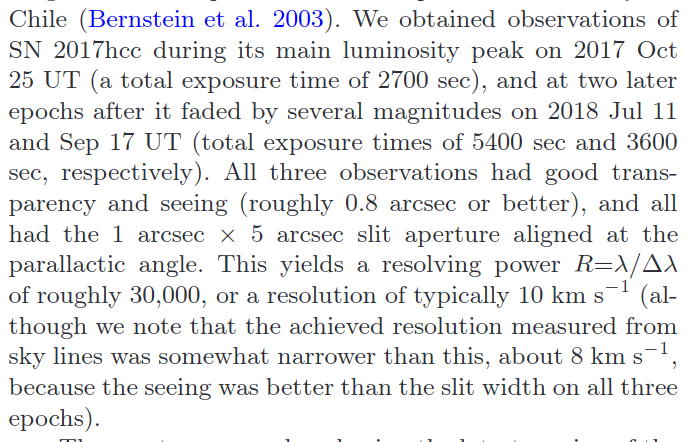
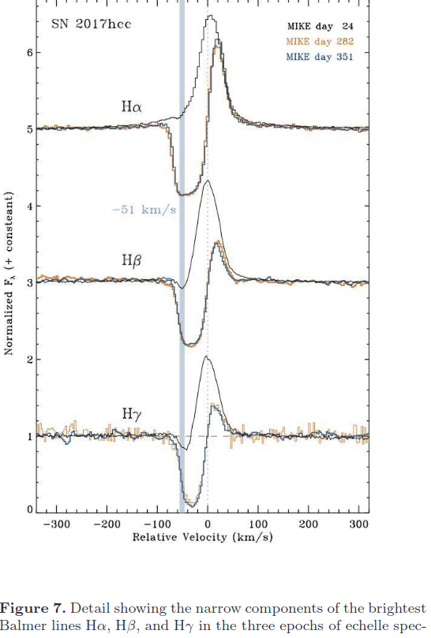
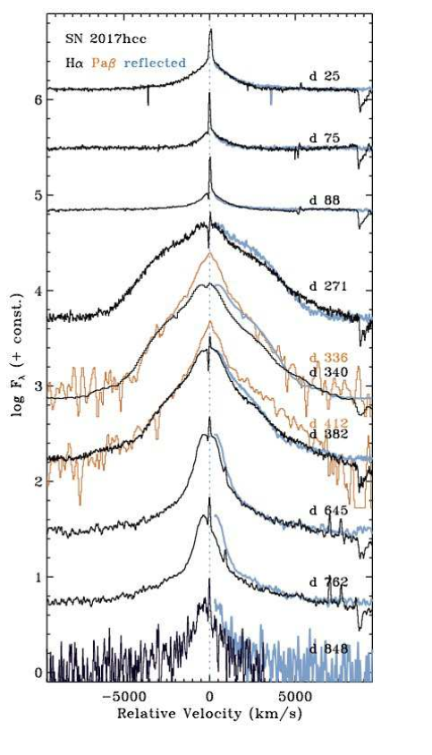

# arxiv一周文献泛读2001001-1002

## 201001

### [Directional association of TeV to PeV astrophysical neutrinos with active galaxies hosting compact radio jets](./2009.08914.pdf)

`https://arxiv.org/abs/2009.08914`

details

Authors: A.V. Plavin (ASC Lebedev, MIPT), Y.Y. Kovalev (ASC Lebedev, MIPT, MPIfR), Y.A. Kovalev (ASC Lebedev), S.V. Troitsky (INR)
Comments: 12 pages, 4 figures; submitted to ApJ

We have shown recently that high-energy neutrinos above 200 TeV detected by IceCube are produced within several parsecs in the central regions of radio-bright active galactic nuclei (AGNs). To independently test this result and to extend the analysis to a wider energy range, we use here public data for all energies from seven years of IceCube observations. The IceCube point-source likelyhood map is analyzed against positions of AGNs from a large complete sample selected by their compact radio flux density. The latter analysis delivers 3.0σ significance with the combined post-trial significance of both studies being 4.1σ. The correlation is driven by a large number of AGNs. Together with fainter but physically similar sources not included in the sample, these radio-bright quasars may explain the entire IceCube astrophysical neutrino flux as derived from muon-track analyses. The neutrinos can be produced in interactions of relativistic protons with X-ray self-Compton photons in parsec-scale AGN jets. 

- 作者在之前( Plavin et al. (2020) )提出IceCube探测到的200TeV以上的高能中微子是在射电明亮的AG中心区域几个pc尺度内产生的。
- 这篇文章使用IceCube最近公布的7年来的数据进一步验证并扩展这个结论。
- 结果证明从TeV 到PeV能段，这个联系均成立。
- 高能靶光子（target photons）是pγ相互作用中产生低能中微子的必要条件，这是agn中产生中微子最可能途径。而在射电明亮的AGN中，这些靶光子可以由X射线自康普顿辐射提供，而这就伴随非热电子在射电波段产生的同步辐射被我们观测到。

 

### [High-resolution spectroscopy of SN 2017hcc and its blueshifted line profiles from post-shock dust formation](./2009.14215.pdf)

`https://arxiv.org/abs/2009.14215`

details

Authors: Nathan Smith, Jennifer E. Andrews
Comments: 21 pages, 16 figures, accepted in MNRAS

SN2017hcc was remarkable for being a nearby and strongly polarized superluminous TypeIIn supernova (SN). We obtained high-resolution echelle spectra that we combine with other spectra to investigate its line profile evolution. All epochs reveal narrow P Cygni components from pre-shock circumstellar material (CSM), indicating an axisymmetric outflow from the progenitor of 40-50 km/s. Intermediate-width and broad components exhibit the classic evolution seen in luminous SNe~IIn: symmetric Lorentzian profiles from pre-shock CSM lines broadened by electron scattering at early times, transitioning at late times to multi-component, irregular profiles coming from the SN ejecta and post-shock shell. As in many SNe~IIn, profiles show a progressively increasing blueshift, with a clear flux deficit in red wings of the intermediate and broad velocity components after day 200. This blueshift develops after the continuum luminosity fades, and in the intermediate-width component, persists at late times even after the SN ejecta fade. In SN2017hcc, the blueshift cannot be explained as occultation by the SN photosphere, pre-shock acceleration of CSM, or a lopsided explosion or CSM. Instead, the blueshift arises from dust formation in the post-shock shell and in the SN ejecta. The effect has a wavelength dependence characteristic of dust, exhibiting an extinction law consistent with large grains. Thus, SN2017hcc experienced post-shock dust formation and had a mildly bipolar CSM shell, similar to SN2010jl. Like other superluminous SNeIIn, the progenitor lost around 10Msun due to extreme eruptive mass loss in the decade before exploding.

- SN 2017hcc 是一颗邻近且高度极化的 IIn型超亮超新星。作者获取了该目标的高分辨率梯度(echelle ？？)光谱，结合其它低分光谱分析了谱线轮廓的演化。
  - 仪器：MIKE,Magellan Inamori Kyocera Echelle, Magellan Telescopes at Las Campanas Observatory in Chile.
  
  
- 各时段的光谱都展现出来自激波之前星周介质的P Cygni成分，这表明存在一个轴对称的外流。
  

- 中等宽度成分和宽成分的谱线演化是比较经典的IIn型SN的演化：来自激波前CSM对称的Lorentzian轮廓发射线被早期电子散射拓宽，在晚期变成来自SN喷流和激波后形成的shell的多成分不规则的轮廓。
  
  

 

https://arxiv.org/abs/2009.14274
https://arxiv.org/abs/2009.14327

 

## 201002

https://arxiv.org/abs/2010.00078
https://arxiv.org/abs/2010.00254
https://arxiv.org/abs/2010.00337
https://arxiv.org/abs/2010.00396

details

 