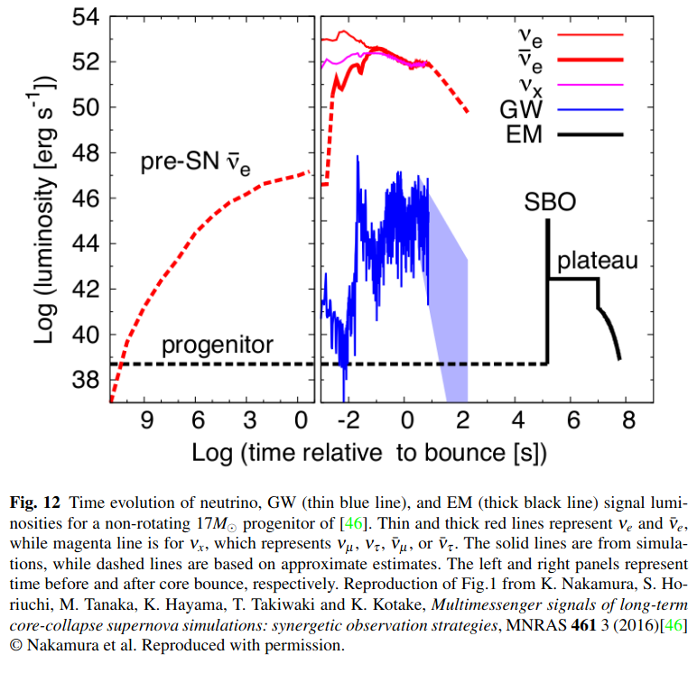

# arxiv一周文献泛读2001012-1016_周一

## 201012

### [Gravitational Waves from Core-Collapse Supernovae](./2010.04356.pdf)

[link](https://arxiv.org/abs/2010.04356)

details

Authors: Ernazar Abdikamalov, Giulia Pagliaroli, David Radice
Comments: Submitted as a chapter in "Handbook of Gravitational Wave Astronomy" (Eds. C. Bambi, S. Katsanevas and K. Kokkotas; Springer Singapore, 2021). The maximum number of allowed references is used

We summarize our current understanding of gravitational wave emission from core-collapse supernovae. We review the established results from multi-dimensional simulations and, wherever possible, provide back-of-the-envelope calculations to highlight the underlying physical principles. The gravitational waves are predominantly emitted by protoneutron star oscillations. In slowly rotating cases, which represent the most common type of the supernovae, the oscillations are excited by multi-dimensional hydrodynamic instabilities, while in rare rapidly rotating cases, the protoneutron star is born with an oblate deformation due to the centrifugal force. The gravitational wave signal may be marginally visible with current detectors for a source within our galaxy, while future third-generation instruments will enable more robust and detailed observations. The rapidly rotating models that develop non-axisymmetric instabilities may be visible up to a megaparsec distance with the third-generation detectors. Finally, we discuss strategies for multi-messenger observations of supernovae. 

- 总结了目前对来自核塌缩型超新星的引力波的理解。
- 这类引力波主要来自原中子星的震荡（oscillations）
  - 慢旋转的情况下（如2rad/s 代表超新星普遍情况），震荡由在post-shock区域产生的多维流体动力学流对PNS的扰动而激发。这样的源如果发生在银河系内，以目前的探测水平只能勉强探测到其引力波信号，但第三代探测器将能够进行更细致的观测。
  - 对于比较罕见的快速旋转(如5rad/s 以上)的情况，原中子星诞生时就有一定的离心形变（centrifugal deformation），这会导致持续约10-20ms的“ring-down”震荡。部分快速旋转的模型会伴随非轴对称的不稳定性的发展，导致持续时间较长的GW辐射，可在百万秒差距距离上观测。
- CCSNe 释放的~ $10^{53}$ erg的能量99%转化为低能（MeV）中微子，约1%转化为激波的动能（这其中的约0.01%转化为EM辐射），另外只有~ $10^{46}$ erg的能量通过引力波形式辐射。
- 讨论了对CCSNe的多信使结合观测（如引力波+中微子+EM）。
  

 
