arxiv一周文献泛读2001019

## 201019

### [Type Ic supernovae from the (intermediate) Palomar Transient Factory](./2010.08392.pdf)

https://arxiv.org/abs/2010.08392

type:statistic-IcSN
comment:分析了44个非宽线的Type Ic型超新星的光变曲线, 通过光变曲线研究它们的爆炸参数。

details

Authors: C. Barbarino, J. Sollerman, F. Taddia, C. Fremling, E. Karamehmetoglu, I. Arcavi, A. Gal-Yam, R. Laher, S. Schulze, P. Wozniak, Lin Yan
Comments: 28 pages, 21 figures, Submitted to A&A

Context. Type Ic supernovae represent the explosions of the most stripped massive stars, but their progenitors and explosion mechanisms remain unclear. Larger samples of observed supernovae can help characterize the population of these transients.

Aims. We present an analysis of **44 spectroscopically normal Type Ic supernovae**, with focus on the **light curves**. The photometric data were obtained over 7 years with the Palomar Transient Factory (PTF) and its continuation, the intermediate PalomarTransientFactory (iPTF). This is the first homogeneous and large sample of SNe Ic from an untargeted survey, and we aim to estimate explosion parameters for the sample.

Methods. We present K-corrected $Bgriz$ light curves of these SNe, obtained through photometry on **template-subtracted images**. We performed an analysis on the shape of the r-band light curves and confirmed the **correlation between the rise parameter $∆m_{−10}$ and the decline parameter $∆m_{15}$.** **Peak r-band absolute magnitudes** have an average of −17.71±0.85 mag. To derive the explosion epochs,we fit the $r$-band lightcurves to a **template derived from a well-sampled light curve.** We **computed the bolometric light curves using $r$ and $g$ band data,  $g−r$ colors and bolometric corrections.** **Bolometric light curves and Feiiλ5169 velocities at peak were used to fit to the Arnett semianalytic model** in order to estimate the **ejecta mass** $M_{ej}$, the **explosion energy** $E_K$ and the **mass of radioactive nickel** $M_{56Ni}$ for each SN.

Results. Including 41 SNe, we find average values of < $M_{ej}$>=4.50±0.79 $M_⊙$,< $E_{K}$ >=1.79±0.29×$10^{51}$erg, and< $M_{56Ni}$ >=0.19±0.03 $M_{⊙}$. The explosion-parameter distributions are comparable to those available in the literature, but our large sample also includes some transients with narrow and very broad light curves leading to more extreme ejecta masses values.

- 分析了44个光谱普通(as opposed to broad lined)的Type Ic型超新星的光变曲线（来自PTF和iPTF 7年内的测光数据）。目的是研究通过光变曲线研究它们的爆炸参数。
  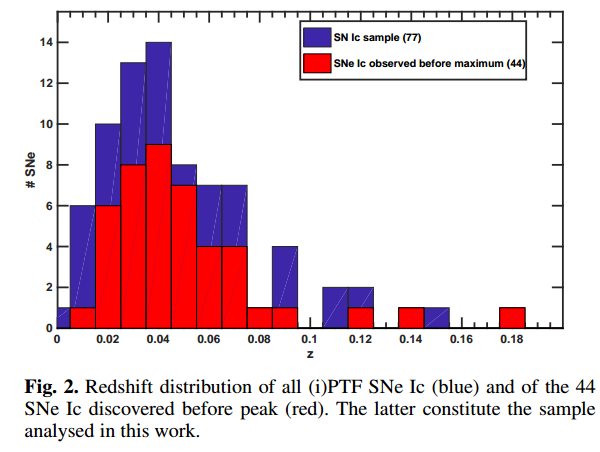
- 发表了这些超新星经过K修正(Taddia et al. (2019))的$Bgriz$光变曲线（通过对减去模板的图像测光得到，工具为Palomar Transient Factory Image Differencing and Extraction (PTFIDE) pipeline，[A&A, 618, A37]；相减之后用PSF测光。
- 分析r波段光变曲线，验证了$∆m_{−10}$和$∆m_{15}$的关系，得到r波段峰值绝对星等平均为 $M_r ~ -17.71 \pm 0.85$。
  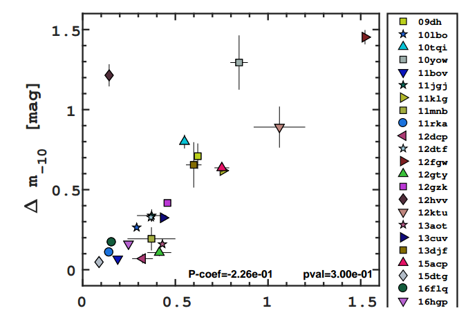
- 为了得到爆发时间，将r波段光变曲线向充分采样源(iptf13djf)的光变曲线模板拟合，并使用r和g波段光变曲线，g-r色指数以及热修正(Lyman et al. (2014) MNRAS, 437, 3848, eg. g - BC or (r -> g) - BC)计算bolometric 光变曲线，再利用得到的bolometric LC和Feiiλ5169线来估算（Arnett semianalytic model）抛射物质量$M_{ej}$，爆发能量$E_K$和56Ni的质量 $M_{56Ni}$。
- 结果为，在41个SN中，平均爆炸参数为：< $M_{ej}$>=4.50±0.79 $M_⊙$,< $E_{K}$ >=1.79±0.29×$10^{51}$erg, < $M_{56Ni}$ >=0.19±0.03 $M_{⊙}$。这些参数分布与以往文献相符，尽管本文样本中也存在窄的和很宽的光变曲线，这回导致更极端的抛射物质量。
  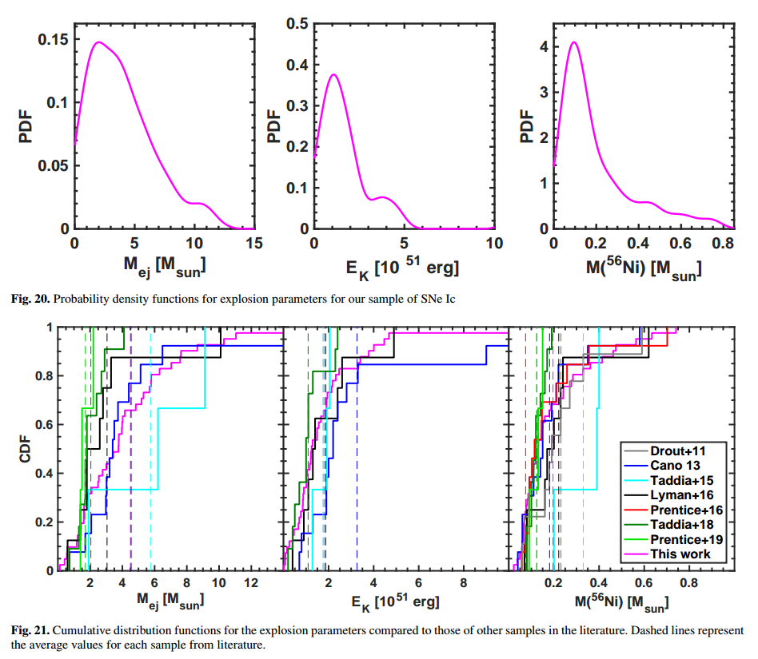

 

## [MAGICal GRB 190114C: Implications of cutoff in the spectrum at sub-GeV energies](./1905.11844.pdf)

https://arxiv.org/abs/1905.11844

type:observation
comment:GRB190114C的光谱呈现了由非热谱到包含准热和余辉的双成分谱的转变,基于光谱的sub-GeV截断以及热成分的情况，作者限制了瞬时辐射的区域以及洛伦兹因子

details

Authors: Vikas Chand, Partha Sarathi Pal, Ankush Banerjee, Vidushi Sharma, P. H. T. Tam, Xinbo He
Comments: Revised and accepted for publication in the ApJ

GRB 190114C is an unusual gamma-ray burst (GRB) due to its **detection at sub-TeV energies by MAGIC**, seen at redshift z = 0.42. This burst is one of the brightest GRB detected by $Fermi$. A joint GBM-LAT analysis of the prompt emission reveals the presence of sub-GeV spectral cutoff when the LAT $low-energy\ events$ (LLE) data is also examined. A similar high-energy cutoff was likewise reported in GRB 160509A and GRB 100724B earlier, as well as handful of other sources. The cutoff can be explained by the intrinsic opacity due to pair production within the emitting region. GRB 190114C shows a transition from non-thermal to a quasi-thermal-like spectrum and a radiation component that can be attributed to afterglow. **Based on spectral analysis, we constrain the site of the prompt emission and Lorentz factor.** Knowing that sub-TeV photons are detected in MAGIC, w**e perceive that the observed spectrum is indeed an overlap from two emission sites, where the emission observed in $Fermi$ is more consistent with prompt emission produced via photospheric dissipation along with a concurrent component from the external shock.** 

- 红移 z=0.42的GRB 190114C 因MAGIC探测到其高能亚TeV波段而显得不寻常。这是$Fermi$探测到的最亮的爆之一。
  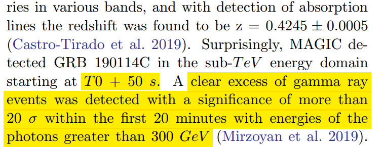
  
  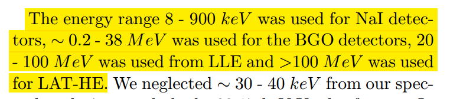
  
  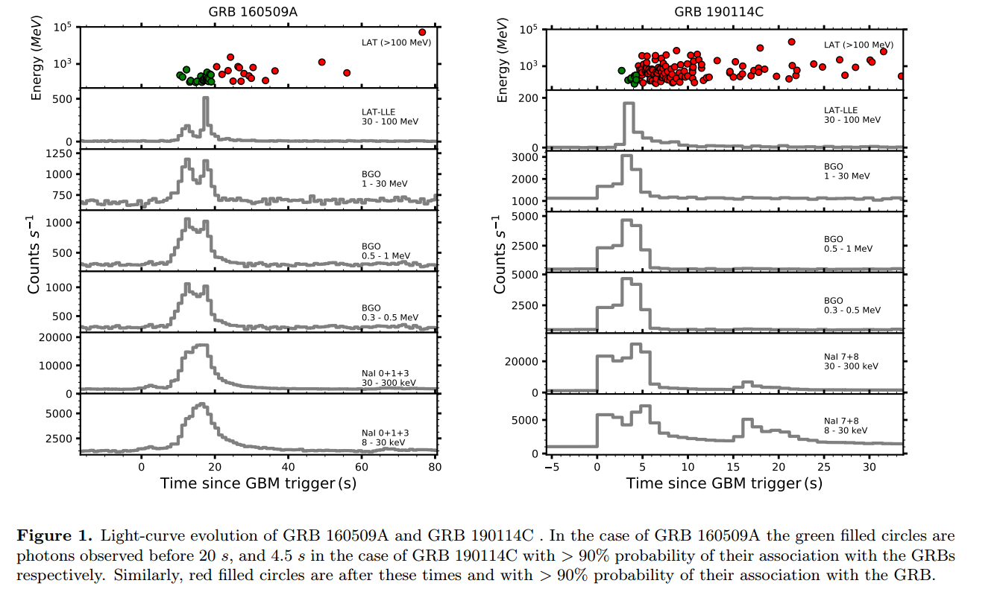

- 瞬时辐射时期的BAT-LAT数据联合分析显示，若考虑LAT的低能数据 (when the LAT $low-energy\ events$ (LLE) data is also exiamined)，则会呈现一个亚GeV的光谱截断（Q：指什么？）类似的高能截断在GRN 160509A 和 GRB 100724B 以及其它几个源中也出现过。这个截断可由辐射区域内的对形成(pair-production)造成的内秉不透明度来解释。
  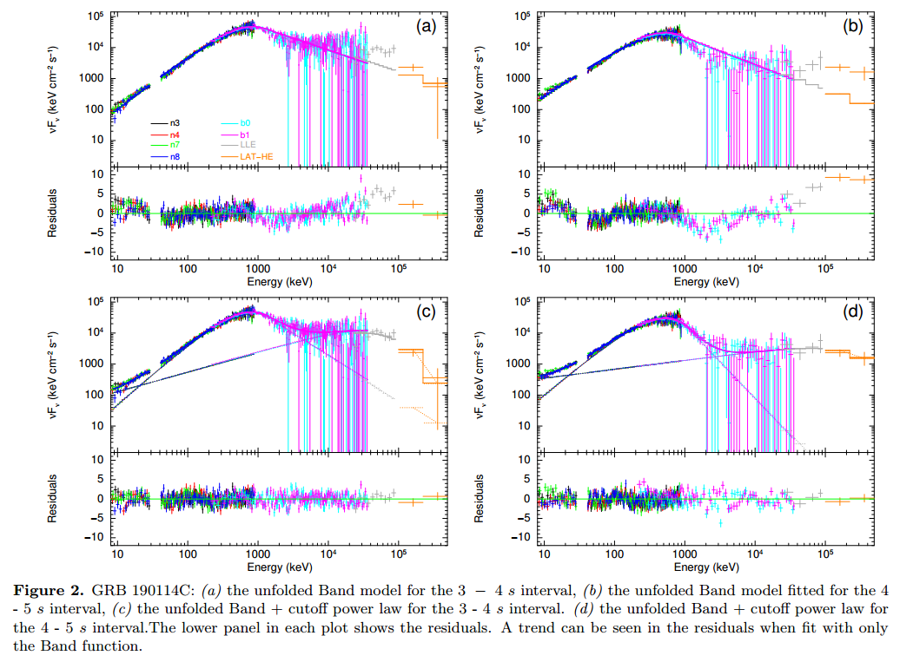
  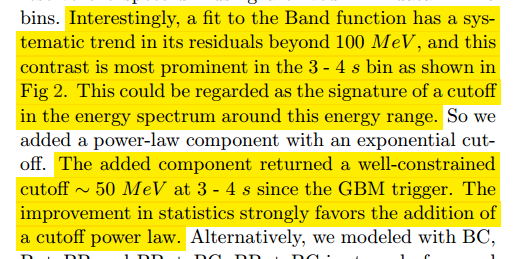

- GRB 190114C的光谱呈现了由非热谱到包含准热和余辉的双成分谱的转变。

- 基于光谱的sub-GeV截断以及热成分的情况，作者限制了瞬时辐射的区域以及洛伦兹因子。

- 鉴于MAGIC探测到亚TeV的光子，作者认为观测到的光谱实际上是来自两个辐射区域的叠加，其中$Fermi$探测到的辐射更像是来自 外激波中并发成分 加上光球层耗散 产生的瞬势辐射 发出的。( photospheric dissipation along with a concurrent component from the external shock )

  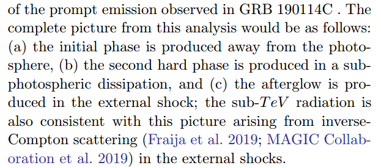

 

## [ZTF20aajnksq (AT2020blt): A Fast Optical Transient at z≈2.9 With No Detected Gamma-Ray Burst Counterpart](./2006.10761.pdf)

https://arxiv.org/abs/2006.10761

type:observation-Optical_transient
comment:认为AT2020blt是一个被高能卫星错过的典型（$Γ_0≳100$）的正轴GRB

details

Authors: Anna Y. Q. Ho, et al.
Comments:  19 pages, 4 figures, 1 table. Version accepted by ApJ on 17 Oct 2020

We present ZTF20aajnksq (AT2020blt), a fast-fading (Δr=2.4 mag in Δt=1.3 days) red (g−r≈0.6 mag) and luminous ($M_{1626 AA}$=−25.9) optical transient at z=2.9 discovered by the Zwicky Transient Facility (ZTF). AT2020blt shares several features in common with afterglows to long-duration gamma-ray bursts (GRBs): (1) an optical light curve well-described by a broken power-law with a break at $t_j$=1 day (observer-frame); (2) a luminous ($L_X=10^{46} erg s^{−1}$) X-ray counterpart; and (3) luminous ($L_ν=4×10^{31} erg sec^{−1} Hz^{−1}$ at 10 GHz) radio emission. However, no GRB was detected in the 0.74d between the last ZTF non-detection (r>20.64) and the first ZTF detection (r=19.57), with an upper limit on the isotropic-equivalent gamma-ray energy release of $E_{γ,iso}<7×10^{52} erg$. AT2020blt is thus the third afterglow-like transient discovered without a detected GRB counterpart (after PTF11agg and ZTF19abvizsw) and the second (after ZTF19abvizsw) with a redshift measurement. We conclude that the properties of AT2020blt are consistent with a classical (initial Lorentz factor $Γ_0≳100$) on-axis GRB that was **missed by high-energy satellites**. Furthermore, by estimating the rate of transients with light curves similar to that of AT2020blt in ZTF high-cadence data, we agree with previous results that there is no evidence for an afterglow-like phenomenon that is significantly more common than classical GRBs. We conclude by discussing the status and future of **fast-transient searches in wide-field high-cadence optical surveys**. 

- ZTF20aajnksq (AT2020blt)是一个快速衰减（1.3天内r波段星等衰减了2.4）的较红（g-r ≈ 0.6）且较亮（$M_{1626 AA}$=−25.9）的红移z为2.9的光学暂现源。
- Discovery: show section 2.1
  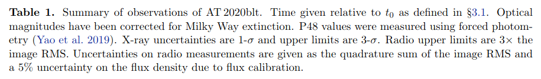
  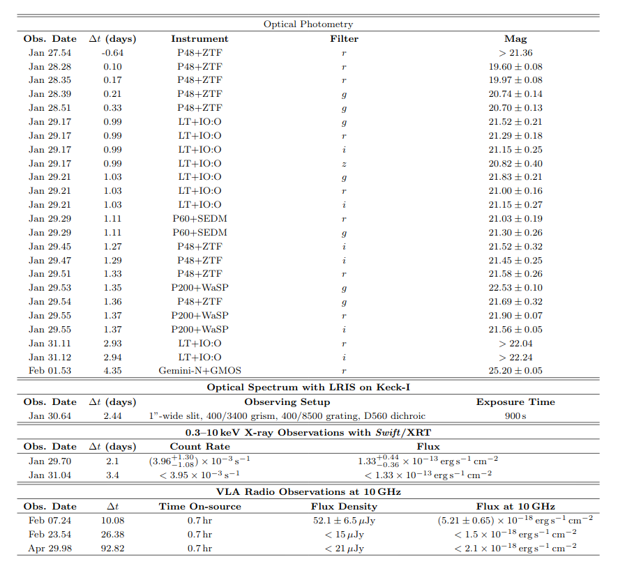
- 这个源在余辉上显示出一些和长伽玛暴相似的特征，如：
  - 光学光变曲线可以很好得由一个BPL来描述，拐折时间$t_j$=1天（观测者系）;
  - 存在明亮的X射线对应体（$L_X=10^{46} erg s^{−1}$）
  - 具有明亮的射电辐射（$L_ν=4×10^{31} erg\ s^{−1}\ Hz^{−1}$）
- 然而在ZTF最后的non-dection（0.74d r>20.64）之前都没有发现有GRB的存在，相应等效各向同性伽马射线能量$E_{γ,iso}<7×10^{52} erg$。 因此AT2020blt是第三个 (after PTF11agg and **ZTF19abvizsw**) 有相似余辉但没有对应GRB被探测的暂现源，同时也是第二个测量红移的测类源。
- 作者得出结论认为AT2020blt是一个被高能卫星错过的典型（$Γ_0≳100$）的正轴GRB。并且，通过估计在ZTF高节律的数据中出现类似此源光变曲线出现的几率(这样的几率不会超过典型GRB发生的几率)，可以进一步增加上述结论是正确的可能性。
- Zackay et al. (2016) ApJ, 830, 27, doi: 10.3847/0004-637X/830/1/27  Masci et al. (2019)  PASP, 131, 018003 . about image subtraction

 l

