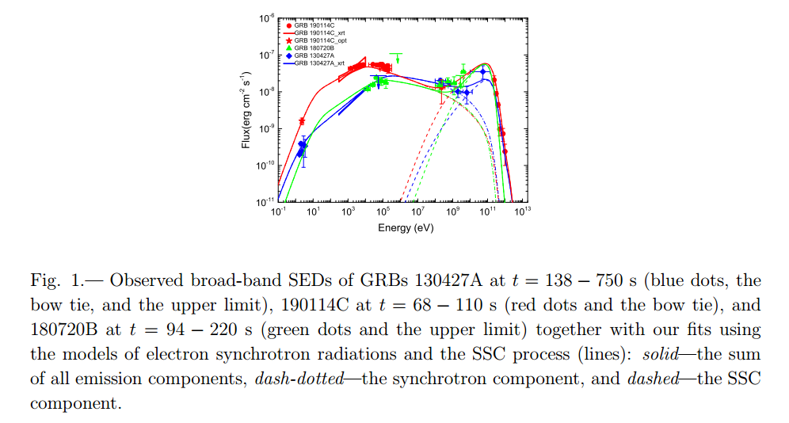
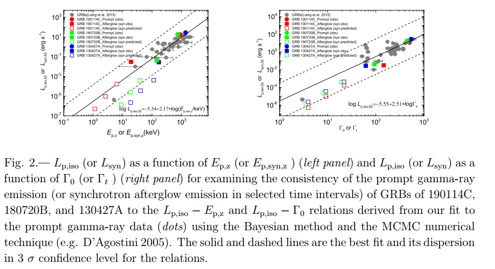
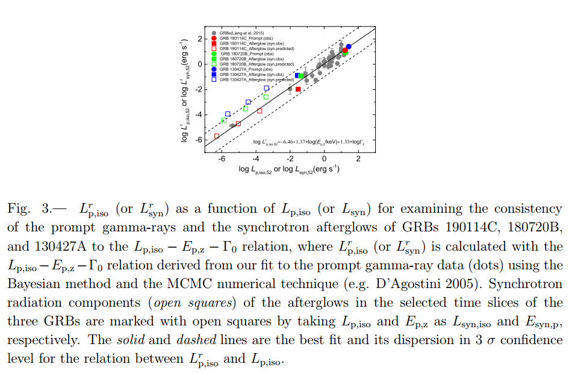
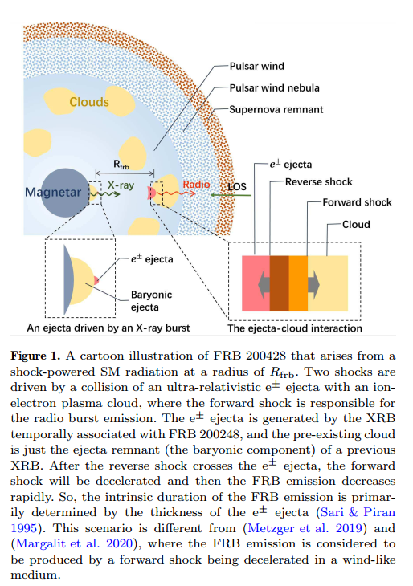
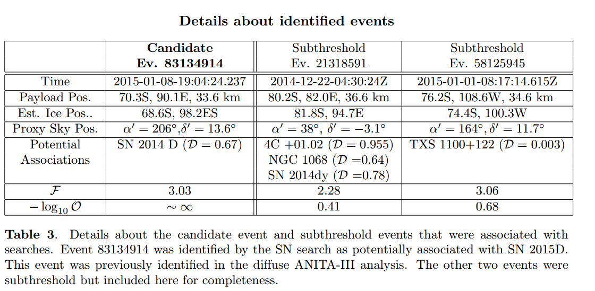

# arxiv一周文献泛读2001027

## 201027

### [Afterglow Synchrotron Radiations follow the Lp,iso−Ep,z−Γ0 relation of Gamma-Ray Bursts? Cases of GRBs 190114C, 130427A, and 180720B](./2010.12501.pdf)

https://arxiv.org/abs/2010.12501

type:observation-GRB
comment:也许$L_{p,iso} − E_{p,z} − Γ_0$关系在GRB喷流中的同步辐射中是普遍成立的，不论是瞬时阶段还是余辉阶段

details

Authors: Xiao-Li Huang, En-Wei Liang, Ruo-Yu Liu1, Ji-Gui Cheng2, Xiang-Yu Wang

Bimodal spectral energy distributions (SEDs) of gamma-ray burst (GRB) afterglow of GRBs 190114C, 130427A and 180720B confirm that they are originated from the synchrotron emission (Syn) and synchrotron self-Compton Scattering process (SSC) of electrons accelerated in the jets. The radiation mechanism and the physics of the observed spectrum-luminosity/energy relations of GRBs remain as open questions. By extracting the Syn component through fitting their early afterglow SEDs with the Syn+SSC model, we find that their luminosity ($L_{syn}$), peak energy ($E_{p,syn,z}$), and the Lorentz factor of the afterglow fireball ($Γ_t$) follow the $L_{p,iso} − E_{p,z} − Γ_0$ (Liang et al. (2015)) relation of prompt gamma-rays, where **Lp,iso is the isotropic luminosity, Ep,z is the peak energy of the νfν spectrum in the burst frame, and Γ0 is the initial Lorentz factor of the fireball.** To examine whether late afterglows is consistent with this relation, we calculate the synchrotron component at late afterglows. It is found that they also follow the same Lp,iso−Ep,z−Γ0 relation, albeit they are not consistent with the Lp,iso −Ep,z relation. Our results may imply that the Lp,iso −Ep,z −Γ0 would be an universal feature of synchrotron radiations of electrons accelerated in GRB jets throughout the prompt and afterglow phases among GRBs. Its origin is not fully understood and possible explanations are briefly discussed.

- GRB 190114C 130427A 180720B的余辉能谱分析显示它们的辐射包含来自同步辐射和同步自康普顿辐射的两个成分。将同步辐射成分通过拟合早期SED抽取出来，可以验证瞬时辐射中的$L_{p,iso} − E_{p,z} − Γ_0$关系。
  

- 同时计算了晚期余辉中的同步辐射成分，发现在晚期上述关系也存在，尽管$L_{p,iso} − E_{p,z}$关系不成立。
  
  

- 也许$L_{p,iso} − E_{p,z} − Γ_0$关系在GRB喷流中的同步辐射中是普遍成立的，不论是瞬时阶段还是余辉阶段。

 

### [The confrontation of the shock-powered synchrotron maser model with the Galactic FRB 200428](./2006.00484.pdf)

https://arxiv.org/abs/2006.00484

type:theory-FRB
comment:对于FRB 200428 和与之成协的XRB，作者探讨了在XRB是在磁层中产生的假设下，FRB由激波驱动的maser产生的可能性

details

Authors: Yun-Wei Yu, Yuan-Chuan Zou, Zi-Gao Dai, Wen-Fei Yu
Comments: 7 pages, 1 figure, 1 table

The association of FRB 200428 with an X-ray burst (XRB) from the Galactic magnetar SGR 1935+2154 offers important implications for the physical processes responsible for the fast radio burst (FRB) phenomena. By assuming that the XRB emission is produced in the magnetosphere, we investigate the possibility that the FRB emission is produced by shock-powered synchrotron maser (SM), which is phenomenologically described with a plenty of free parameters. The observational constraints on the model parameters indicate that the model can in principle be consistent with the FRB 200428 observations, **if the ejecta lunched by magnetar activities can have appropriate ingredients and structures and the shock processes occur on the line of sight.** To be specific, a complete burst ejecta should consist of an ultra-relativistic and extremely highly collimated e± component and a sub-relativistic and wide-spreading baryonic component. **The internal shocks producing the FRB emission arise from a collision between the e± ejecta and the remnant of a previous baryonic ejecta at the same direction.** The parameter constraints are still dependent on the uncertain spectrum and efficiency of the SM emission. While the spectrum is tentatively described by a spectral index of −2, we estimate the emission efficiency to be around $10^{−4}$ by requiring that the synchrotron emission of the shocked material cannot be much brighter than the magnetosphere XRB emission. 

- 对于FRB 200428 和与之成协的XRB，作者探讨了在XRB是在磁层中产生的假设下，FRB由激波驱动的maser产生的可能性。
- 简单说，就是产生XRB的抛射物中会留下一些重子物质，而正负电子对的喷射物与这些重子物质碰撞，形成内激波从而产生FRB。

  

 

### [A search for ultrahigh-energy neutrinos associated with astrophysical sources using the third flight of ANITA](./2010.02869.pdf)

https://arxiv.org/abs/2010.02869

type:statistic-neutrino
comment:提出了一种方法在ANITA数据中搜寻空间和时间上与一些种类的源（包括blazar,GRB,SN等）成协的高能中微子,一个候选体被认为与SN 2015D相关

details

Authors: C. Deaconu, L. Batten, P. Allison, et al.
Comments: 21 pages, 6 figures, minor updates and reformatted for submission to JCAP

The ANtarctic Impulsive Transient Antenna (ANITA) long-duration balloon experiment is sensitive to interactions of ultra high-energy ($E > 10^{18} eV$) neutrinos in the Antarctic ice sheet. The third flight of ANITA, lasting 22 days, began in December 2014. We develop a methodology to search for energetic neutrinos spatially and temporally coincident with potential source classes in ANITA data. This methodology is applied to several source classes: **the TXS 0506+056 blazar and NGC 1068, the first potential TeV neutrino sources identified by IceCube, flaring high-energy blazars reported by the Fermi All-Sky Variability Analysis, gamma-ray bursts, and supernovae.** Among searches within the five source classes, one candidate was identified as associated with SN 2015D, although not at a statistically significant level. We proceed to place upper limits on the source classes. We further comment on two subthreshold events and potential application of this methodology to more sensitive future instruments. 

- ANITA 能够探测到南极冰盖发生的甚高能($E > 10^{18} eV$)中微子的反应。ANITA的第三次运行从2014年12月开始，持续了22天。
- 作者提出了一种方法在ANITA数据中搜寻空间和时间上与一些种类的源（包括blazar,GRB,SN等）成协的高能中微子。
- 有一个候选体被认为与SN 2015D相关，尽管统计上并不显著。还另外讨论了两个亚阈值事件
  

 