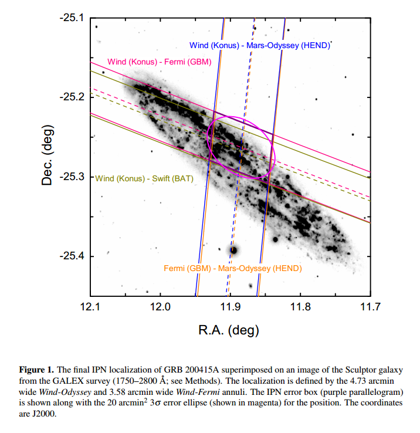

# arxiv文献泛读20210114_15

### [A bright gamma-ray flare interpreted as a giant magnetar flare in NGC 253](./2101.05104.pdf)

https://arxiv.org/abs/2101.05104

details

Authors: D. Svinkin, D. Frederiks, K. Hurley et al.
Comments: Preprint version of Nature paper

Magnetars are young, highly magnetized neutron stars that produce extremely rare giant flares of gamma-rays, the most luminous astrophysical phenomena in our Galaxy. The detection of these flares from outside the Local Group of galaxies has been predicted, with just two candidates so far. Here we report on the extremely bright gamma-ray flare GRB 200415A of April 15, 2020, which we localize, using the Interplanetary Network, to a tiny (20 sq. arcmin) area on the celestial sphere, that overlaps the central region of the Sculptor galaxy at 3.5 Mpc from the Milky Way. From the Konus-Wind detections, we find a striking similarity between GRB 200415A and GRB 051103, the even more energetic flare that presumably originated from the M81/M82 group of galaxies at nearly the same distance (3.6 Mpc). Both bursts display a sharp, millisecond-scale, hard-spectrum initial pulse, followed by an approximately 0.2 s long steadily fading and softening tail. Apart from the huge initial pulses of magnetar giant flares, no astrophysical signal with this combination of temporal and spectral properties and implied energy has been reported previously. At the inferred distances, the energy released in both flares is on par with that of the December 27, 2004 superflare from the Galactic magnetar SGR 1806-20, but with a higher peak luminosity. Taken all together, this makes GRB 200415A and its twin GRB 051103 the most significant candidates for extragalactic magnetar giant flares, both a factor of five more luminous than the brightest Galactic magnetar flare observed previously, thus providing an important step towards a better understanding of this fascinating phenomenon.

- 磁星能产生相当少见的剧烈伽玛射线耀发（giant flares, GFs）。目前仅有两例事件是河外磁星耀发的候选体。（GRB 051103,  GRB 070201）.
  
  - SGR是磁星的一类，存在时标~$10^5 yr$，相当于磁场衰减时标，活跃期（days ~ years）会发生短时标硬X爆发，峰值光度~$10^{38-42} erg/s$。更稀有的是SGR存在期间可能会发生几次GF，以伽玛射线形式释放~$(0.01 - 1) \times 10^{46} erg$巨大能量(vs sGRB, $E_{iso,equi}\sim 10^{49-51}$)。
  - 一次GF表现为一个由极尖锐的上升期加上较缓和的衰减期组成的不到一秒的初脉冲（initial pulse, IP），随后光谱变软，形成持续时间较长的后期衰减（受磁星旋转周期影响）。目前在银河系和LMC中已知在活跃阶段产生GF的爆发磁星只有3个。
  - 由于其初始脉冲非常明亮，可以在几十Mpc的距离上被探测到，此时它们的初始脉冲可能看上去像一个sGRB。将磁星耀发和并合短暴区分开主要靠 1.是否与一个星系空间位置重合；2.将其光变曲线与已知GF进行比对；3.是否有GW信号。目前仅有两个短暴被认为是eMGF：GRB 051103，$D_{81/82} = 3.6 Mpc$，GRB 070201，$D_{M31}=0.77Mpc$，GF在短暴中的占比不超过10%。
  
- 本文主要讨论了一次极明亮的伽玛射线耀发GRB 200415A，主要将其与GRB 051103进行对比，发现诸多相似之处，表明这也很可能是一次河外星系磁星giant flare事件。

  - 2020.04.15T08:48:06 , GRB 200415A由IPN的5个卫星探测器：GBM，BAT，SPI-ACS， IBIS-PICsIT(INTEGRAL)，Mars-Odyssey HEND 探测到。作者这些探测器的探测情况对GRB 200415A进行定位，得到一个面积为20 sq. arcmin的区域，该区域与Sculptor galaxy (NGC 253) 中心重合，星系距离为3.5Mpc。而GRB 051103的可能发生地（M81/M82星系群）距离为3.6Mpc.
    

  - 两个爆都呈现一个尖锐的，毫秒时标的，硬谱的初脉冲（initial pulse），其后跟随约0.2秒的稳定衰减且软化的尾阶段。除了磁星GF发出的脉冲，还没有其它同时具有这种光变光谱性质且具有相当能量的信号被探测到。

    - temporal properties:

      - ∼ 2 ms fast rise of a narrow (∼ 4 ms) initial pulse + exponentially decaying phase with count-rate e-folding time $\tau_{cr}$ ∼ 50 ms
      - 总持续时间：0.138 s (GRB 200415A) ， 0.324 s (GRB 051103)
      - $T_{90}$：0.100±0:014s，  0.138±0:005s
      - IP阶段峰值计数率：~$(1.5-1.7) \times 10^5 s^{-1}$
      - 但在整个衰减阶段的光子流量，GRB 051103是GRB 200415A的两倍
      - 20keV - 10 MeV能段能流：均在IP阶段达到峰值，峰值流量分别为$0.96^{+0.32}_{-0.16} \times 10^{-3} erg\ cm^{-2}\ s^{-1}$，$1.15^{+0.52}_{-0.24} \times 10^{-3} erg\ cm^{-2}\ s^{-1}$.峰值后指数衰减，衰减时标$\tau_{flux} \sim 30\ ms$。

    - spectral properties

      - GRB 200415A 的硬度（这里指 390-1600 keV / 90-390keV 计数率之比，另外应该也可以用光谱峰值能量表征）

      - 两个爆在$T_0$开始100ms以内都可以用CPL较好描述，EF(E) 能谱峰值能量$E_p$接近指数衰减。

        |stage|200415A|051103|
        | ---- | ---- | ---- |
        |IP|$E_p$ ~ 1.2 MeV, $\alpha$~ -0.6|$E_p$ ~ 1.2 MeV, $\alpha$~ -0.1|
        |subsequent|$E_p$<1.2 MeV, exp decay|~30ms(hardest): $E_p$ ~ 3 MeV, $\alpha$~ 0.2|
        
      - GRB 200415A 在100 ms后的能谱可由$kT ~ 70-100$的黑体谱描述
      
      - $T_0$~$T_0+0.192s$的总光谱均用CPL+BB描述最佳
      
        ||200415A|051103|
        | ---- | ---- | ---- |
        |Fluence|$8.5^{1.2}_{-1.0} \times 10^{-6}\ erg\ cm^{-2}$|$34.3^{+4.0}_{-2.0} \times 10^{-6}\ erg\ cm^{-2}$|
        |BB|14%|9%|
        |IP|45%|13%|
    - 这两个爆在光变形态，光谱特征，峰值流量方面均有较强相似之处
      
      
    - 这样明亮，毫秒级IP后随指数衰减的辐射在短爆中很不常见，KW25年内探测到的500+个宇宙学距离短爆中均无此形状，而这种形状在另外两个系内磁星耀发中出现：SGR 1900+14，SGR 1806-20。
    - 另外，更高分辨率的光变曲线显示GRB 200415A在主峰之前还存在一个次峰，这种模式在SGR 1806-20中也存在，可能是磁星耀发的一个普遍特征，可以用于区分短爆。
    - 所以GRB 200415A 和 GRB 051103是磁星耀发的可能性非常大。

  - 另外，若这两个爆的距离是真实的，那么它们的总释放能量与河内磁星SGR 1806-20在04年12月27日的superflare的能量（~$2.3\times 10^{46} erg$）相当，但后者的峰值光度比前两者低，它们比迄今观测到的最亮河内磁星耀发都亮5倍以上。
    ||dist|radius|$E_{\gamma,iso}$|$L_{iso,p}$|
    |---|---|---|---|---|
    |200415A|3.5Mpc|~23km|~$1.3\times 10^{46} erg$|~$1.4\times 10^{48} erg\ s^{-1}$|
    |051103|3.6Mpc|~37km|~$5.3\times 10^{46} erg$|~$1.8 \times 10^{48} erg\ s^{-1}$|

  - 不过这两个爆的光变与另一个eMGF，GRB 070201的光变有较大差别，后者在~50ms内都表现出高度变化性，表明IP背后的物理过程的变化时标具有不同的量级。

- [GRB 200415A KW LV](http://www.ioffe.ru/LEA/GRBs/GRB200415_T31681/), [GCN](https://gcn.gsfc.nasa.gov/gcn3/27596.gcn3)
- [GRB 210119A GBM LC](https://heasarc.gsfc.nasa.gov/FTP/fermi/data/gbm/triggers/2021/bn210119121/quicklook/glg_lc_medres34_bn210119121.gif)
- [GRB 210119A  Insight-HXMT/HE LC](http://twiki.ihep.ac.cn/pub/HXMT/GRBList/HEB210119120_lc.jpg) (80-800keV); [GCN](https://gcn.gsfc.nasa.gov/gcn3/29331.gcn3)
- [GRB 210119A GECAM LC](http://twiki.ihep.ac.cn/pub/GECAM/GRBList/GECAM-B-tn210119_025409.png); [GCN](https://gcn.gsfc.nasa.gov/gcn3/29331.gcn3)
- [GRB 210119A SWIFT GCN](https://gcn.gsfc.nasa.gov/gcn3/29323.gcn3)
- [GRB 210119A SWIFT GCN2](https://gcn.gsfc.nasa.gov/gcn3/29332.gcn3)

---

#### [Identification of a Local Sample of Gamma-Ray Bursts Consistent with a Magnetar Giant Flare Origin](./2101.05144.pdf)
https://arxiv.org/abs/2101.05144

details

Authors: E. Burns, D. Svinkin, K. Hurley, Z. Wadiasingh
Comments: Accepted for publication in ApJL

Cosmological Gamma-Ray Bursts (GRBs) are known to arise from distinct progenitor channels: short GRBs mostly from neutron star mergers and long GRBs from a rare type of core-collapse supernova (CCSN) called collapsars. Highly magnetized neutron stars called magnetars also generate energetic, short-duration gamma-ray transients called Magnetar Giant Flares (MGFs). Three have been observed from the Milky Way and its satellite galaxies and they have long been suspected to contribute a third class of extragalactic GRBs. We report the unambiguous identification of a distinct population of 4 local (<5 Mpc) short GRBs, **adding GRB 070222 to previously discussed events. While identified solely based on alignment to nearby star-forming galaxies, their rise time and isotropic energy release are independently inconsistent with the larger short GRB population at >99.9% confidence. These properties, the host galaxies, and non-detection in gravitational waves all point to an extragalactic MGF origin.** Despite the small sample, the inferred volumetric rates for events above 4×10^44 erg of RMGF=$3.8^{+4.0}_{−3.1}×10^5\ Gpc^{−3}\ yr^{−1}$ place MGFs as the dominant gamma-ray transient detected from extragalactic sources. As previously suggested, these rates imply that some magnetars produce multiple MGFs, providing a source of repeating GRBs. **The rates and host galaxies favor common CCSN as key progenitors of magnetars.** 

SN 2013ai: a link between hydrogen-rich and hydrogen-poor core-collapse supernovae
https://arxiv.org/abs/2101.05424
We present a study of optical and near-infrared (NIR) spectra along with the light curves of SN 2013ai. These data range from discovery until 380 days after explosion. SN 2013ai is a fast declining type II supernova (SN II) with an unusually long rise time; 18.9±2.7d in V band and a bright V band peak absolute magnitude of −18.7±0.06 mag. The spectra are dominated by hydrogen features in the optical and NIR. The spectral features of SN 2013ai are unique in their expansion velocities, which when compared to large samples of SNe II are more than 1,000 km/s faster at 50 days past explosion. In addition, the long rise time of the light curve more closely resembles SNe IIb rather than SNe II. If SN 2013ai is coeval with a nearby compact cluster we infer a progenitor ZAMS mass of ∼17 M⊙. After performing light curve modeling we find that SN 2013ai could be the result of the explosion of a star with little hydrogen mass, a large amount of synthesized 56Ni, 0.3-0.4 M⊙, and an explosion energy of 2.5−3.0×1051 ergs. The density structure and expansion velocities of SN 2013ai are similar to that of the prototypical SN IIb, SN 1993J. However, SN 2013ai shows no strong helium features in the optical, likely due to the presence of a dense core that prevents the majority of γ-rays from escaping to excite helium. Our analysis suggests that SN 2013ai could be a link between SNe II and stripped envelope SNe. 

Alternative possibility of GW190521: Gravitational waves from high-mass black hole-disk systems
https://arxiv.org/abs/2101.05440
We evolve high-mass disks of mass 15−50M⊙ orbiting a 50M⊙ spinning black hole in the framework of numerical relativity. Such high-mass systems could be an outcome during the collapse of rapidly-rotating very-massive stars. The massive disks are dynamically unstable to the so-called one-armed spiral-shape deformation with the maximum fractional density-perturbation of δρ/ρ≳0.1, and hence, high-amplitude gravitational waves are emitted. The waveforms are characterized by an initial high-amplitude burst with the frequency of ∼40−50 Hz and the maximum amplitude of (1−10)×10−22 at the hypothetical distance of 100 Mpc and by a subsequent low-amplitude quasi-periodic oscillation. We illustrate that the waveforms in our models with a wide range of the disk mass resemble that of GW190521. We also point out that gravitational waves from rapidly-rotating very-massive stars can be the source for 3rd-generation gravitational-wave detectors for exploring the formation process of rapidly-rotating high-mass black holes of mass ∼50−100M⊙ in an early universe. 

The Physics of Fast Radio Bursts
Di Xiao, Fayin Wang, Zigao Dai
https://arxiv.org/abs/2101.04907
 In 2007, a very bright radio pulse was identified in the archival data of the Parkes Telescope in Australia, marking the beginning of a new research branch in astrophysics. In 2013, this kind of millisecond bursts with extremely high brightness temperature takes a unified name, fast radio burst (FRB). Over the first few years, FRBs seemed very mysterious because the sample of known events was limited. With the improvement of instruments over the last five years, hundreds of new FRBs have been discovered. The field is now undergoing a revolution and understanding of FRB has rapidly increased as new observational data increasingly accumulates. In this review, we will summarize the basic physics of FRBs and discuss the current research progress in this area. We have tried to cover a wide range of FRB topics, including the observational property, propagation effect, population study, radiation mechanism, source model, and application in cosmology. A framework based on the latest observational facts is now under construction. In the near future, this exciting field is expected to make significant breakthroughs. 

The Physics of Accretion Discs, Winds And Jets in Tidal Disruption Events
Jane Lixin Dai, Giuseppe Lodato, Roseanne M. Cheng
https://arxiv.org/abs/2101.05195
Accretion onto black holes is an efficient mechanism in converting the gas mass-energy into energetic outputs as radiation, wind and jet. Tidal disruption events, in which stars are tidally torn apart and then accreted onto supermassive black holes, offer unique opportunities of studying the accretion physics as well as the wind and jet launching physics across different accretion regimes. In this review, we systematically describe and discuss the models that have been developed to study the accretion flows and jets in tidal disruption events. A good knowledge of these physics is not only needed for understanding the emissions of the observed events, but also crucial for probing the general relativistic space-time around black holes and the demographics of supermassive black holes via tidal disruption events. 