# arxiv文献泛读20210211-12

### [FIRST J153350.8+272729: the radio afterglow of a decades-old tidal disruption event](./2102.05795.pdf)

https://arxiv.org/abs/2102.05795

details

Authors: Vikram Ravi, Hannah Dykaar, Jackson Codd, Ginevra Zaccagnini, Dillon Dong, Maria R. Drout, Bryan M. Gaensler, Gregg Hallinan, Casey Law
Comments: 10 pages, 3 figures, 1 table, submitted to AAS Journals (ApJ)

We present the discovery of the fading radio transient FIRST J153350.8+272729. The source had a maximum observed 5-GHz radio luminosity of 8×10^39 erg s−1 in 1986, but by 2019 had faded by a factor of nearly 400. It is located 0.15 arcsec from the center of a galaxy (SDSS J153350.89+272729) at 147 Mpc, which shows weak Type II Seyfert activity. We show that a tidal disruption event (TDE) is the preferred scenario for FIRST J153350.8+272729, although it could plausibly be interpreted as the afterglow of a long-duration gamma-ray burst. This is only the second TDE candidate to be first discovered at radio wavelengths. Its luminosity fills a gap between the radio afterglows of sub-relativistic TDEs in the local universe, and relativistic TDEs at high redshifts. The unusual properties of FIRST J153350.8+272729 (ongoing nuclear activity in the host galaxy, high radio luminosity) motivate more extensive TDE searches in untargeted radio surveys. 

- 变暗的射电暂现源 FIRST J153350.8+272729
- 5-GHz光度在1986年极大（$8\times 10^{39} erg/s$），到2019年衰减了400倍。
- 距离一星系中心0.15角秒，光度距离147 Mpc（红移z=0.03243 ± 0.00001），该星系具有弱的II型Seyfert活动。
- 作者认为该射电源的对应体为TDE事件，尽管也可能是长伽玛暴的余辉。
- 这是第二个首先在射电波段被发现的TDE候选体。
- 该源的光度填补了邻近宇宙亚相对论TDE以及高红移相对论TDE之间射电余辉的空缺。
- 该源特殊的性质（宿主星系持续的核活动 nuclear activity 以及高射电光度）促使在射电巡天中进行更多TDE的搜寻。

---

- Q
  - 是先发现的这个源，做了证认后发现是一个之前已经观测过的源吗？1986年是怎么样观测的？
  - 什么是II型Seyfert活动？一种星系核活动？
  - 之前一直没有对该源分类吗，为什么认为是TDE事件？TDE事件的射电余辉能持续多久？为什么也可以用长伽玛暴解释，长爆的射电余辉可以持续这么久吗？
  - 为什么其它波段没有发现该源？
  - TDE射电余辉光度与红移有关？TDE的相对论性与红移有关？

---

- A
  - 对VLASS一期前半(VLASS1.1， 应该是2017年)的数据以及FIRST(VLA Faint Images of the Radio Sky at Twenty centimeters) survey(1994-1999)的数据进行对比发现的。该源曾在1995年被FIRST探测到（流量密度9.7 mJy），但VLASS在2017年没有探测到（这是作者进行对比的一个标准，即找那些FIRST有，VLASS1.1没有的）。更进一步的数据搜索发现该源在1986年和1987年被Green Bank望远镜探测到，4.85GHz平均流量密度为51mJy。

    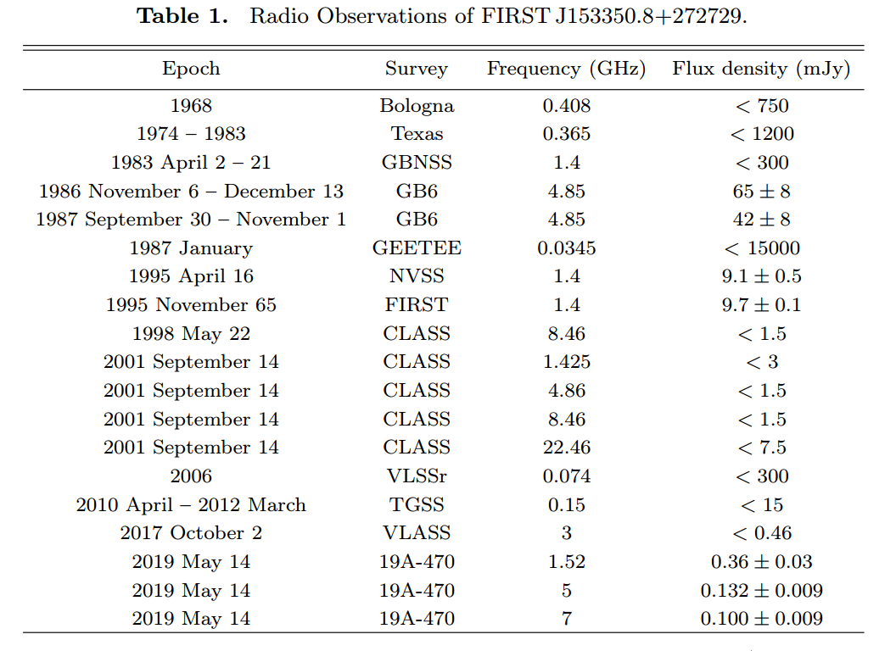

  - 该源曾出现在Green Bank 300-foot telescope 6 cm survey catalog中。

  - 作者在2019.3.14用VLA进行多波段观测，重新探测到了该源，5GHz流量密度仅为132$\mu$Jy（基本相当于上限）。33年内衰减400被，表明这是一个transient。

    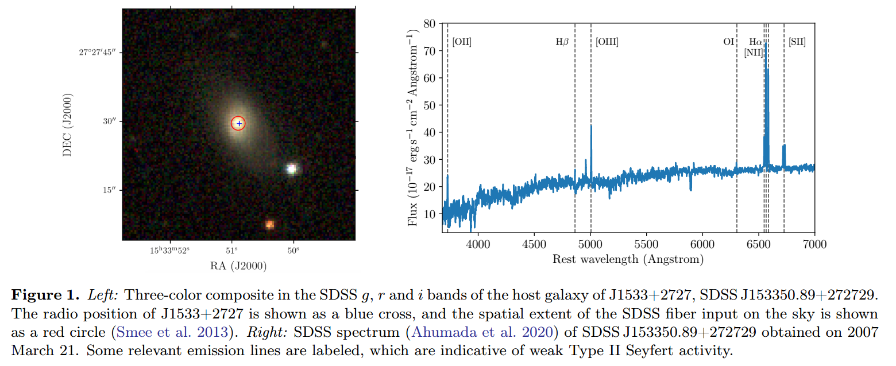

  - II型Seyfert 活动特征

    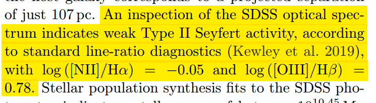

    - Seyfert星系核拥有非常明亮的辐射，中心存在超大质量黑洞及其吸积盘，主要光谱特征是具有强发射线。根据谱线特征不同分为不同的类型。大体上I型宽线居多，II型窄线居多。[wiki](https://en.wikipedia.org/wiki/Seyfert_galaxy)

    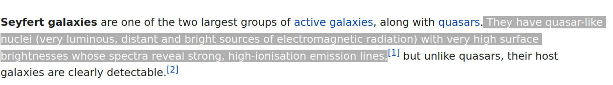

  - 对应体证认基本上是用排除法，排除了AGN的变化以及长爆余辉的情形。

    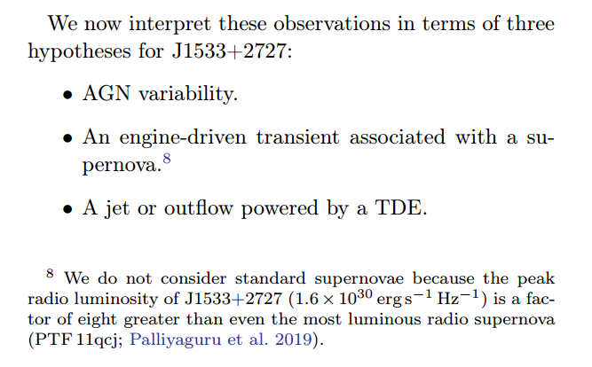
    - 排除AGN活动

      - 作者分别计算了ROSAT/PSPC1990年和1991年在该源位置的上限，基于一定假设得出2-10KeV光度上限$L_X < 3.0 \times 10^{42} erg/s$ 以及 $L_X < 2.6 \times 10^{41} erg/s$。根据星系黑洞质量和吸积物质的射电与X波段光度关系，作者计算出相应射电光度上限应该为$4.8 \times 10^{38} erg/s$以及$9.8\times 10^{37} erg/s$，对应3.7mJy和0.8mJy。

        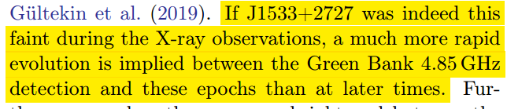

    - 排除LGRB

  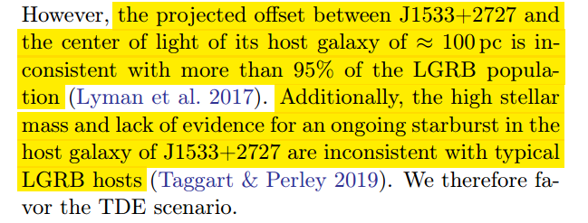

  - 该源在射电光度上填补了三个相对论性TDE事件及剩余的有射电探测的TDE事件间的空缺。相对论性TDE指具有相对论性喷流。不清楚剩余TDE的红移都是多少，估计射电光度不一定和红移有关系。

    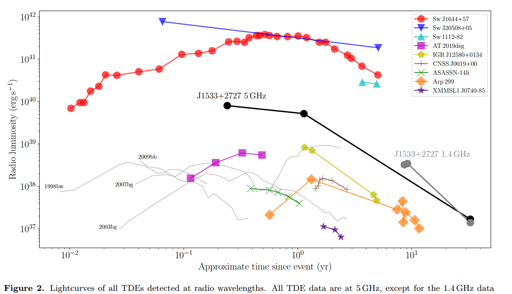

    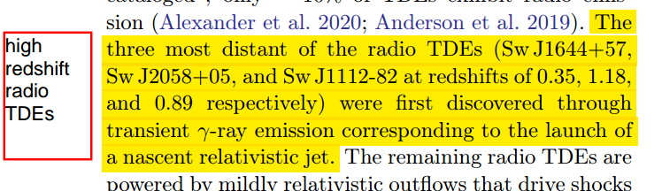

    - implications?

---

- Knowledges
  - the radio emission generated by extragalactic explosions (e.g., supernovae, γ-ray bursts, and TDEs) is enhanced in the presence of **more energetic outflows,and denser circum-explosion material**.

### [Periodic Fast Radio Bursts from ULX-Like Binaries](./2102.06138.pdf)

https://arxiv.org/abs/2102.06138

details

Authors: Navin Sridhar, Brian D. Metzger, Paz Beniamini et al.

The discovery of periodicity in the arrival times of the fast radio bursts (FRB) from two repeating sources poses a potential challenge to oft studied magnetar scenarios. However, models which postulate that FRB emission results from relativistic magnetized shocks, or magnetic reconnection in a striped outflow, are not necessarily specific to magnetar engines, instead requiring only the impulsive injection of relativistic energy into a dense magnetized medium. Motivated thus, we outline a new scenario in which FRBs are powered by short-lived relativistic outflows ("flares") from accreting black hole or neutron star systems, which propagate into the cavity of the pre-existing ("quiescent") jet. In order to reproduce FRB luminosities and rates, we are driven to consider binaries of stellar-mass compact objects undergoing super-Eddington mass transfer, similar to those which characterize some ultra-luminous X-ray (ULX) sources. Indeed, the host galaxies of FRBs, and their spatial offsets within their hosts, show broad similarities to those of ULX. Periodicity on timescales of days to years could be attributed to precession (e.g., Lens-Thirring) of the polar accretion funnel, along which the FRB emission is geometrically and relativistically beamed, across the observer line of sight. Accounting for the most luminous FRBs via accretion power may require a population of binaries undergoing brief-lived phases of unstable (dynamical timescale) mass transfer. This could lead to secular evolution in the burst properties of some repeating FRB sources on timescales as short as months to years, followed by a transient optical/IR counterpart akin to a luminous red nova or dusty common envelope transient. We encourage targeted FRB searches of known ULX sources. 

- FRB不一定起源于磁星，只需要存在“the impulsive injection of relativistic energy into a dense magnetized medium”。
- 作者提出FRB可能源于于吸积中的黑洞或中子星系统中短暂存在的相对论性外流（耀发），它们传播到cavity of the pre-existing ("quiescent") jet 从而造成FRB。？？？
- 作者考虑了正经历“super-Eddington mass transfer”的太阳质量致密双星的模型，与ULX（ultra-luminous X-ray soruces）的模型类似。
- 这种情形下，FRB的周期性可能来自于吸积系统的进动。
- 那些最亮的FRB可能产生于质量转移不稳定的双星，这样会导致爆发性质的演化（月到年），并且伴随与“a luminous red nova or dusty common envelope transient”相似的光学/红外暂现源对应体。

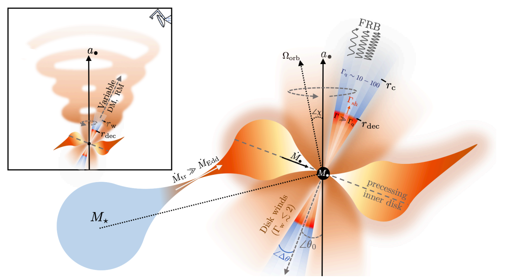
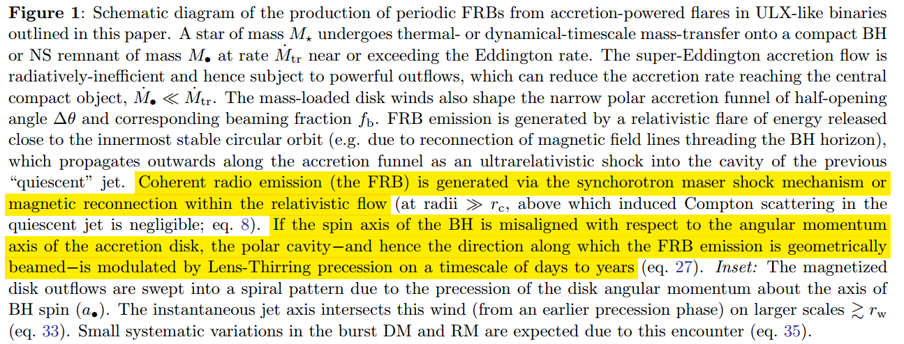

