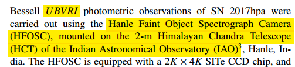
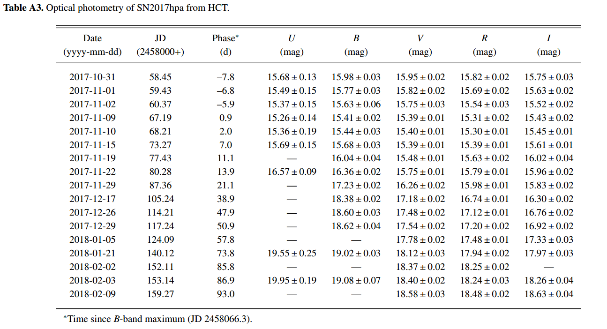
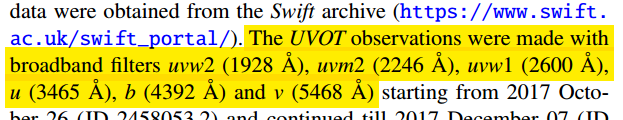
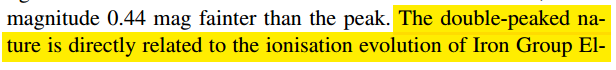
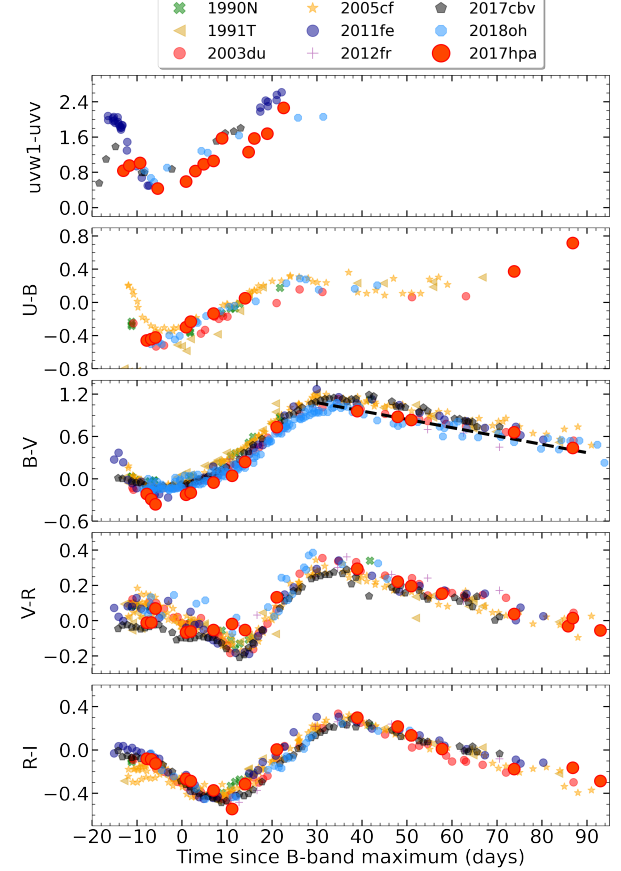
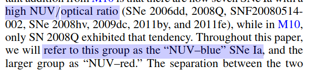
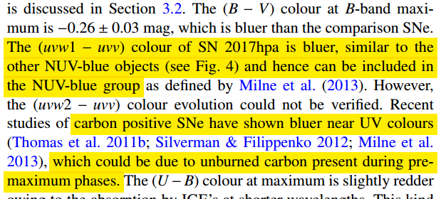
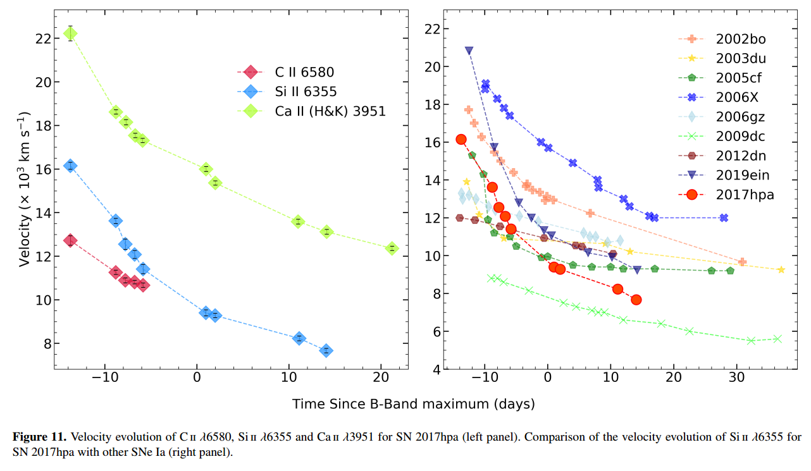
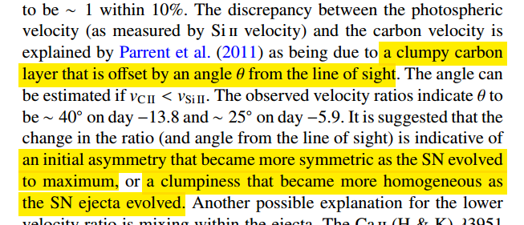
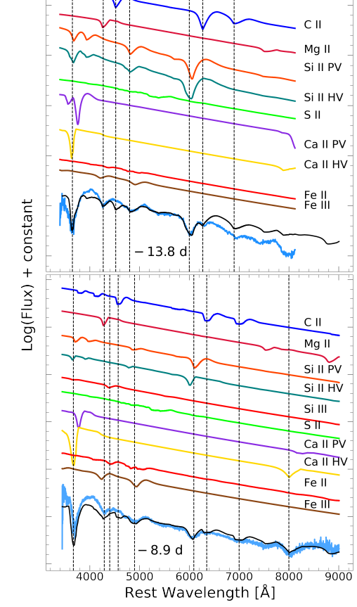

# arxiv文献泛读20210215-17

### [SN 2017hpa: A carbon-rich type Ia supernova](./2102.08121.pdf)

https://arxiv.org/abs/2102.08121

details

Authors: Anirban Dutta, Avinash Singh, G.C. Anupama, D.K. Sahu, Brajesh Kumar
Comments: 15 pages, 13 figures, Accepted for publication in MNRAS

We present the optical (UBVRI) and ultraviolet (Swift-UVOT) photometry, and optical spectroscopy of Type Ia supernova SN 2017hpa. We study broadband UV+optical light curves and low resolution spectroscopy spanning from −13.8 to +108~d from the maximum light in B-band. The photometric analysis indicates that SN 2017hpa is a normal type Ia with ΔmB(15)=0.98±0.16 mag and MB=−19.45±0.15 mag at a distance modulus of μ=34.08±0.09 mag. The (uvw1−uvv) colour evolution shows that SN 2017hpa falls in the NUV-blue group. The (B−V) colour at maximum is bluer in comparison to normal type Ia supernovae. Spectroscopic analysis shows that the Si II 6355 absorption feature evolves rapidly with a velocity gradient, v˙=128±7 km s−1 d−1. The pre-maximum phase spectra show prominent C II 6580 Å absorption feature. The C II 6580 Å line velocity measured from the observed spectra is lower than the velocity of Si II 6355 Å, which could be due to a line of sight effect. The synthetic spectral fits to the pre-maximum spectra using syn++ indicate the presence of a high velocity component in the Si II absorption, in addition to a photospheric component. Fitting the observed spectrum with the spectral synthesis code TARDIS, the mass of unburned C in the ejecta is estimated to be ∼0.019~M⊙. The peak bolometric luminosity is Lbolpeak=1.43×1043 erg s−1. The radiation diffusion model fit to the bolometric light curve indicates 0.61±0.02 M⊙ of 56Ni is synthesized in the explosion.

- 对Ia 型 SN 2017hpa 光学+紫外（UBVRI+swift/uvot）波段测光以及光学波段测谱，-13.8天 至 108天。
- $\Delta m_B(15) = 0.98 \pm 0.16$ mag， $M_B = -19.45\pm 0.15$ mag（峰值星等），$D_L = 34.08 \pm 0.09$ mag.（根据测光分析）
- (uvw1 - uvv) 颜色演化表明SN 2017hpa 属于 NUV-blue group。峰值处(B-V)颜色相比普通Ia型超新星更蓝。
- 测谱分析显示Si II 6355 吸收线有较快的演化，$\dot{v} = 128 \pm 7\  km\ s^{-1}\ d^{-1}$。且峰值前的光谱显示出较强C II 6580吸收线。后者的速度比前者速度慢，原因可能是"a line of sight effect."
- 峰值前光普拟合显示Si II 吸收中存在一个光球成分之外的高速成分
- 光普拟合还给出喷射物中未燃烧的C质量为~0.019 $M_⊙$
- 热光度峰值为$L^{bol}_{peak} = 1.43 \times 10^{43} erg\ s^{-1}$，热光变曲线拟合给出56Ni 合成量为$0.61\pm 0.02 M_⊙$.

---

Q:

- 观测情况？

- NUV-blue group是什么？其颜色演化有何特征？与该超新星峰值处更蓝有联系吗？
- 什么样的"line of sight effect"导致不同谱线速度不一样？

---

A:

- 测光：

  - UBVRI，2-m HCT(Himalayan Chandra Telescope)

    

    

  - UVOT

    

    

- 测谱：

  - HCT 双光栅低分光谱

    

    

- 光变分析

  

  - I波段的双峰特征源自抛射物中铁族元素随温度降低的电离演化。Ia SN超新星的普遍特征。

    

    

  - 颜色演化

    

    - (uvw1-uvv)更蓝，属于NUV-blue group。NUV-blue group：Milne et al. (2013):https://iopscience.iop.org/article/10.1088/0004-637X/779/1/23/pdf

      

      

    - 更蓝的原因可能与峰值前未燃烧的carbon有关。

      

- 关于光球速度(Si II 6355)与C的速度（C II 6580）不一致：碳元素集团运动速度与实现方向不一致，夹角逐渐变小。

- 光谱拟合

  

