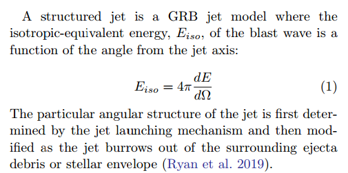
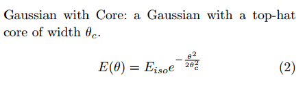
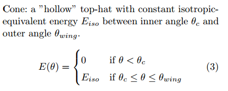
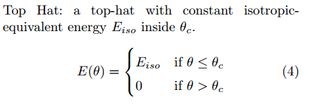
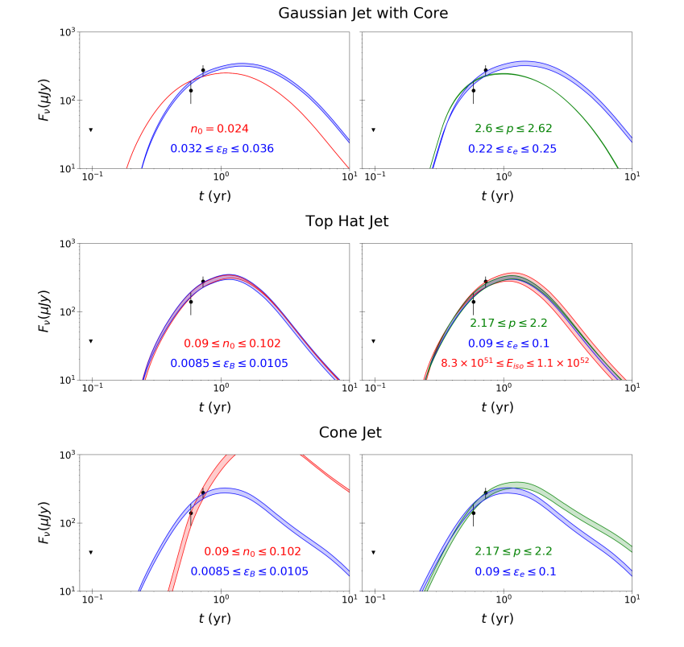
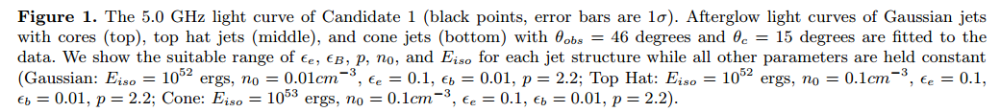
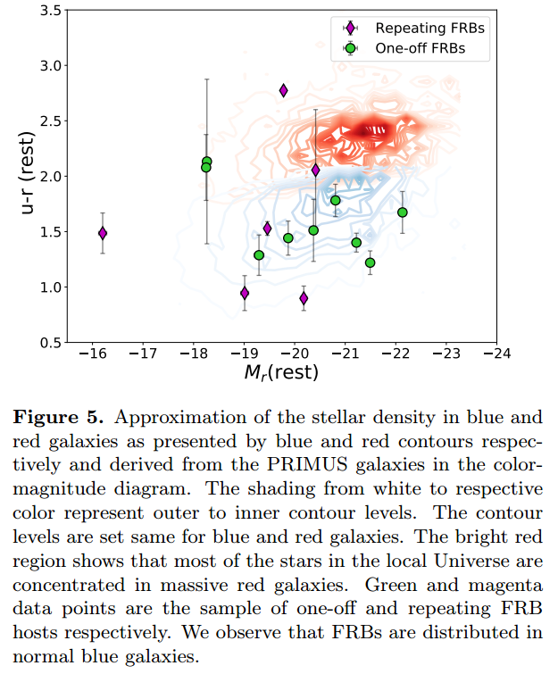
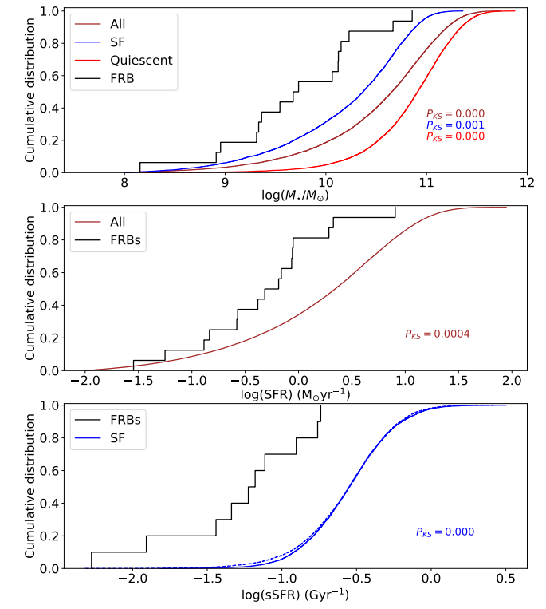
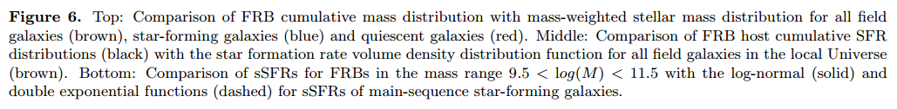
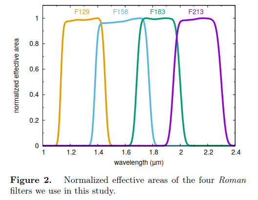

# arxiv文献泛读20210804-06

## 20210804

### [Understanding Gamma-ray Burst Jet Structures from Afterglow Light Curves](./2108.01079.pdf)

https://arxiv.org/abs/2108.01079

details

Authors: Celia Tandon, Nicole Lloyd-Ronning

Gamma-ray bursts (GRBs), associated with the collapse of massive stars or the collisions of compact objects, are the most luminous events in our universe. However, there is still much to learn about the nature of the relativistic jets launched from the central engines of these objects. We examine how jet structure - that is, the energy and velocity distribution as a function of angle - affects observed GRB afterglow light curves. Using the package afterglowpy, we compute light curves arising from an array of possible jet structures, and present the suite of models that can fit the coincident electromagnetic observations of GW190814 (which is likely due to a background AGN). Our work emphasizes not only the need for broadband spectral and timing data to distinguish among jet structure models, but also the necessity for high resolution radio follow-up to help resolve background sources that may mimic a GRB afterglow. 

- 讨论喷流的结构(能量和速度随角度的分布)如何影响余辉光变曲线
- 使用afterglowpy包,作者计算了在各种可能的喷流结构下的光变曲线, 展示了能够拟合GW190814电磁对应体(可能是一个背景AGN)观测的模型.
- 此研究不仅说明, 为了要区分不同的喷流结构, 还需要宽波段测谱和测光数据; 还说明了需要高分辨率的射电后随观测以分辨可能看起来像GRB余辉的背景源

Q:
- 什么是能量随角度的变化?
- 文章讨论了哪些结构性喷流?
- 不同的结构性喷流对余辉大概有何种影响?

---

A:
- 什么是能量随角度的变化?
  - 就是各个方向的辐射的能量不一样

- 文章讨论了哪些结构性喷流?

  - 描述参数: 归一化能量$E_{iso}$和角宽度$\theta_c$, 以及截止角宽度$\theta_{wing}$. 截止宽度外的能量为0.

  - 高斯轮廓:

    

  - 中空锥:

    

  - top-hat:

    

  - 另外一些对余辉光变有影响的参数为: 爆周介质密度$n_0$, 磁场以及电子密度$\epsilon_B$和$\epsilon_e$, 电子分布指数$p$, 观测视角$\theta_{obs}$. 引力波观测对限制观测角作用很大.

- 不同的结构性喷流对余辉大概有何种影响?

  - 文章没有对此的讨论, 只是用三种模型分别对GW190814的射电对应候选体已有的三个数据点(包含一个上限点, 不确定是谁的观测)做了余辉模型拟合(6GHz), 都能拟合得上.

    

    

- 此外, VLA在266天时对候选体拍摄的图像显示了一个双瓣结构, 且从该辐射大概能分辨出两个相隔约3''的成分, 大约对应4kpc, 这对于GRB余辉来说尺度太大了, 故作者认为这个候选体并非GRB余辉, 而是一个更老更大的源, 有可能是一个正经历耀发事件的背景AGN.

- 作者认为需要高分辨率射电数据来分辨GW对应体是真的对应体还是背景如AGN.

- 感觉有点

---

- **可调研点: afterglowpy**

### [Characterizing the FRB host galaxy population and its connection to transients in the local and extragalactic Universe](./2108.01282.pdf)

> 描述FRB宿主星系族类,以及它们在本地和系外宇宙中与暂现原的关系

https://arxiv.org/abs/2108.01282

details

Authors: Shivani Bhandari, Kasper E. Heintz, Kshitij Aggarwal, et al
Comments: 24 pages, 11 figures, 6 tables. Submitted for publication in the Astrophysical Journal

We present the localization and host galaxies of one repeating and two apparently non-repeating Fast Radio Bursts. FRB20180301A was detected and localized with the Karl G. Jansky Very Large Array to a star-forming galaxy at z=0.3304. FRB20191228A, and FRB20200906A were detected and localized by the Australian Square Kilometre Array Pathfinder to host galaxies at z=0.2430 and z=0.3688, respectively. We combine these with 13 other well-localised FRBs in the literature, and analyse the host galaxy properties. We find no significant differences in the host properties of repeating and apparently non-repeating FRBs. FRB hosts are moderately star-forming, with masses slightly offset from the star-forming main-sequence. Star formation and low-ionization nuclear emission-line region (LINER) emission are major sources of ionization in FRB host galaxies, with the former dominant in repeating FRB hosts. FRB hosts do not track stellar mass and star formation as seen in field galaxies (95% confidence). FRBs are rare in massive red galaxies, suggesting that progenitor formation channels are not solely dominated by delayed channels which lag star formation by gigayears. The global properties of FRB hosts are indistinguishable from core-collapse supernovae (CCSNe) and short gamma-ray bursts (SGRBs) hosts (95% confidence), and the spatial offset (from galaxy centers) of FRBs is consistent with that of the Galactic neutron star population. The spatial offsets of FRBs (normalized to the galaxy effective radius) mostly differs from that of globular clusters (GCs) in late- and early-type galaxies with 95% confidence. 

- 文章给出了三个FRB的位置和宿主星系, 其中一个是重复爆FRB 20180301A, 由VLA发现并定位于z=0.03304处的一个恒星形成星系; 另外的两个明显非重复爆FRB20191228A和FRB20200906A由SKA发现并分别定位于z=0.2430和z=0.3688处的星系.
- 文章将这三个FRB与其它13个精确定位的FRB结合起来,分析它们的宿主星系性质.
  - 重复爆和非重复爆的宿主星系没有明显的差别
  - FRB宿主星系具有中等程度(moderately)的恒星形成(0.03 − 8 $M_{\odot}/yr$), 其质量与star-forming main-sequence稍有差别.
  - 在FRB宿主星系中, 恒星形成以及low-ionization nuclear emission-line region 辐射是电离的主要方式, 其中前者在重复性FRB的宿主星系中占主导.
  - FRB宿主星系的stellar mass和恒星形成率与其它场星系存在区别(FRB hosts do not track stellar mass and star formation as seen in field galaxies (95% confidence))
  - FRB在大质量红星系中很少见, 表明它们的前身星形成途径并非单纯由delayed channels which lag star formation by gigayears主导.
  - FRB宿主星系的整体(global)性质与核塌缩型超新星以及短伽马爆的宿主星系的一些性质(stellar masses, star-formation rates, projected physical offsets, absolute r-band magnitudes, and specific SFRs)并无差别(indistinguishable).
  - FRB在宿主星系中的位置(相对星系中心的偏移量)与系内中子星的位置相当.
  - FRB在宿主星系中的位置与球状星团在晚型和早型星系中的位置大部分都不一样.

---

Q&A:

- star-formation main-sequence是什么?

  - 星系的恒星形成率与星系的恒星质量之间存在一个幂律关系, 在这个关系上的成为"主序恒星形成星系"

  > Recent advances have led to an emerging picture where most galaxies form stars at a level dictated mainly by their stellar masses, and regulated by secular processes. This is seen as a rather tight relation between galaxy star formation rate (SFR) and stellar mass, so called main sequence of star forming galaxyies, in place from redshift ~0 up to ~4. [ref](./refs/1812.07057.pdf)

- low-ionization nuclear emission-line region是什么?如何形成的?有什么特征?

  > A **low-ionization nuclear emission-line region** (LINER) is a type of [galactic](https://en.wikipedia.org/wiki/Galaxy) [nucleus](https://en.wikipedia.org/wiki/Galaxy_nucleus) that is defined by its [spectral line emission](https://en.wikipedia.org/wiki/Spectral_line).  The spectra typically include line emission from [weakly ionized](https://en.wikipedia.org/wiki/Ion) or neutral atoms, such as [O](https://en.wikipedia.org/wiki/Oxygen), [O+](https://en.wikipedia.org/wiki/Oxygen), [N+](https://en.wikipedia.org/wiki/Nitrogen), and [S+](https://en.wikipedia.org/wiki/Sulfur).  Conversely, the spectral line emission from [strongly ionized](https://en.wikipedia.org/wiki/Ion) atoms, such as [O++](https://en.wikipedia.org/wiki/Oxygen), [Ne++](https://en.wikipedia.org/wiki/Neon), and [He+](https://en.wikipedia.org/wiki/Helium), is relatively weak.

- FRB宿主星系与其它星系的区别?

  > We observe a dearth of red galaxies in our current sample of FRB host galaxies.

  

  > Thus, we conclude that FRB hosts have lower M∗, SFR and sSFR than randomly selected field galaxies weighted by M∗, SFR or sSFR.

  

  

- FRB前身星问题?

  > We find that FRBs in our sample do not track the stellar mass and in general are not hosted in old, red and dead galaxies which have old stellar population. The dearth of FRBs in the massive red galaxies suggest that **FRBs are not solely produced in channels with a large average delay between star formation and the FRB source formation** such as magnetars formed via compact object-related systems, including neutron star mergers, or the AIC of a white dwarf to a neutron star. **Current data supports a mix of prompt (core-collapse SNe) and delayed channels for producing FRB progenitors, suggesting that they are drawn from the general stellar population rather than an exotic and rare subpopulation.** Furthermore, FRB hosts do not follow the specific SFRs of star-forming galaxies, nor do they track the star formation rates of field galaxies in the nearby Universe.

  - FRB不仅只通过从恒星形成到FRB前身形成之间有很长时间延迟的途径产生, 也会通过一些瞬时(prompt)过程(CCSNe)产生.???

---

背景知识:

- 大多数FRB发生的位置显著偏离其宿主星系的中心, 且这些位置并不位于那些高于星系平均恒星形成和平均stellar mass surface densities的区域.
- 大多数FRB宿主星系在红外波段显示出旋臂特征, 且FRB发生的位置应该在旋臂上.
- 一些分析(host-burst offset distribution and other host properties)排除了LGRB和SLSNe是FRB来源的可能性, 支持致密星合并事件,吸积导致的白矮星塌缩以及核塌缩超新星作为非重复性FRB可能的产生机制.

### [Does a long-lived remnant neutron star exist after short gamma-ray burst GRB 160821B?](./2108.01349.pdf)

> 短伽马爆 GRB 160821B是否残留了一个长寿的中子星?

https://arxiv.org/abs/2108.01349

details

Authors: Guang-Lei Wu, Yun-Wei Yu, Jin-Ping Zhu
Comments: 7 pages, 2 figures

Mergers of double neutron stars (DNSs) could lead to the formation of a long-lived massive remnant NS, which has been previously suggested to explain the AT 2017gfo kilonova emission in the famous GW170817 event. For an NS-affected kilonova, it is expected that a non-thermal emission component can be contributed by a pulsar wind nebula (PWN), which results from the interaction of the wind from the remnant NS with the preceding merger ejecta. Then, the discovery of such a non-thermal PWN emission can provide an evidence for the existence of the remnant NS. Similar to GRB 170817A, GRB 160821B is also one of the nearest short gamma-ray bursts (SGRBs). A candidate kilonova is widely believed to appear in the ultraviolet-optical-infrared afterglows of GRB 160821B. Here, by modeling the afterglow light curves and spectra of GRB 160821B, we find that the invoking of a non-thermal PWN emission can indeed be well consistent with the observational data. This may indicate that the formation of a stable massive NS could be not rare in the DNS merger events and, thus, the equation of state of the post-merger NSs should be stiff enough. 

- 双中子星并合时发生的短伽马爆可能会遗留下一个长寿的大质量中子星. 
- 对于一个受中子星影响的千新星, 中子星星风与抛射物相互作用而形成的脉冲星星风星云可能会贡献非热的辐射成分.
- GRB 160821B 被认为伴随有一个千新星, 文章通过拟合余辉光变曲线和光谱, 发现一个非热的PWM成分可以参与数据拟合并符合得较好, 文章进而认为这可能表示双子星并合后形成一稳定的大质量中子星这一现象可能并不罕见.

## 20210805

### [Discovering Supernovae at Epoch of Reionization with Nancy Grace Roman Space Telescope](./2108.01801.pdf)

> 使用Nancy Grace Roman Space Telescope寻找再电离时代的超新星

https://arxiv.org/abs/2108.01801

details

Authors: Takashi J. Moriya, Robert M. Quimby, Brant E. Robertson
Comments: 14 pages, 9 figures, 1 table, submitted to The Astrophysical Journal

Massive stars play critical roles for the reionization of the Universe. Individual massive stars at the reionization epoch (z > 6) are too faint to observe and quantify their contributions to reionization. Some massive stars, however, explode as superluminous supernovae (SLSNe) or pair-instability supernovae (PISNe) that are luminous enough to observe even at z > 6 and allow for the direct characterization of massive star properties at the reionization epoch. In addition, hypothetical long-sought-after PISNe are expected to be present preferentially at high redshifts, and their discovery will have a tremendous impact on our understanding of massive star evolution and the formation of stellar mass black holes. 

The near-infrared Wide Field Instrument on Nancy Grace Roman Space Telescope will excel at discovering such rare high-redshift supernovae. In this work, we investigate the best survey strategy to discover and identify SLSNe and PISNe at z > 6 with Roman. We show that the combination of the F158 and F213 filters can clearly separate both SLSNe and PISNe at z > 6 from nearby supernovae through their colors and magnitudes. The limiting magnitudes are required to be 27.0 mag and 26.5 mag in the F158 and F213 filters, respectively, to identify supernovae at z > 6. If we conduct a 10 deg2 transient survey with these limiting magnitudes for 5 years with a cadence of one year, we expect to discover 22.5 +- 2.8 PISNe and 3.1 +- 0.3 SLSNe at z > 6, depending on the cosmic star-formation history. The same survey is estimated to discover 76.1 +- 8.2 PISNe and 9.1 +- 0.9 SLSNe at 5 < z < 6. Such a supernova survey requires the total observational time of approximately 525 hours in 5 years. The legacy data acquired with the survey will also be beneficial for many different science cases including the study of high-redshift galaxies. 

- 一些z>6的大质量恒星会以超亮超新星或者对不稳定超新星(PISNe)的形式爆发. 观测这样的超新星有助于了解再电离时期的大质量恒星的性质.
- Nancy Grace Roman Space Telescope上的近红外宽大视场设备将致力于发现这类罕见的高红移超新星. 文章研究了使用该望远镜发现和证认z>6的SLSNe 和 PISNe的最佳巡天策略, 论述了使用F158和F213滤光片的组合可以将这两类超新星从其它种类超新星中区分开.
- 要达到目的, 两滤光片的极限星等分别应该达到27等和26.5等.
- 如果以这样的深度进行5年(周期为一年)的10平方度暂现源巡天, 则预期发现z>6的22.5+-2.8个PISNe和3.1+-0.3个SLSNe, 以及5<z<6的76.1+-8.2个PISNe和9.1+-0.9个SLSNe

---

Q:

- Nancy Grace Roman Space Telescope?

  > Roman, which is planned to be launched in the mid-2020’s, will enable community-driven transient survey programs that can discover SNe at z > 6.

- 10平方度巡天?

  >  The Roman Wide Field Instrument has an effective field-of-view of 0.281 deg2 and requires 36 pointings to cover a 10 deg2 area.

- F158, F213?

  

- [Nancy wiki](https://en.wikipedia.org/wiki/Nancy_Grace_Roman_Space_Telescope)

### 

> 

https://arxiv.org/abs/

details

Authors: 
Comments: 

