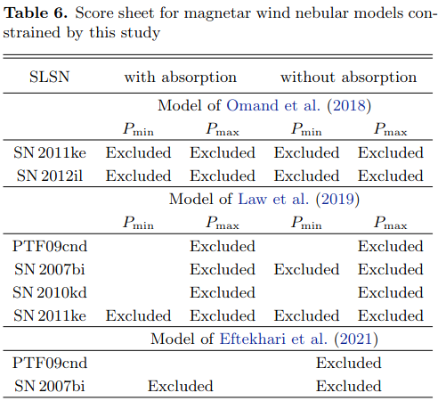

# arxiv文献泛读20210825-27

## 20210825

### [Simulating the outcome of binary neutron star merger in common envelope jets supernovae](./2108.10806.pdf)

> 模拟在公共包层喷流超新星中的双中子星并合的结果

https://arxiv.org/abs/2108.10806

details

We simulate the influence of the energy that the merger process of two neutron stars (NSs) releases inside a red supergiant (RSG) star on the RSG envelope inner to the merger location. In the triple star common envelope evolution (CEE) that we consider a tight binary system of two NSs spirals-in inside an RSG envelope and because of mass accretion and dynamical friction the two NS merge. We deposit merger-explosion energies of 3e50 and 1e51 erg at distances of 25Ro and 50Ro from the center of the RSG, and with the three-dimensional hydrodynamical code FLASH we follow the evolution of the RSG envelope in inner regions. For the parameters we explore we find that more than 90 per cent of the RSG envelope mass inner to the merger site stays bound to the RSG. NSs that experience a CEE are likely to accrete RSG envelope mass through an accretion disk that launches jets. These jets power a luminous transient event, a common envelope jets supernova (CEJSN). The merger process adds to the CEJSN energy. Our finding implies that the interaction of the merger product, a massive NS or a BH, with the envelope can continue to release more energy, both by further in-spiral and by mass accretion by the merger product. Massive RSG envelopes can force the merger product to spiral-in into the core of the RSG, leading to an even more energetic CEJSN. 

- 模拟了在一个红超巨星(RSG)里面的双中子星并合过程释放的能量对并合位置以内的RGS包层的影响.
- 发现并合位置以内的90%的包层质量会继续保留在RSG中. 而在这样一个tripple star common envelope evolution中, 双中子星会吸积RSG的包层物质开启喷流. 这些喷流则会引发明亮的暂现源事件: 共包层喷流超新星(common envelope jets supernova, CEJSN).
- 研究表明并合产物(NS或BH)与包层物质的相互作用可以通过进一步的旋进或这吸积来释放更多的能量. 大质量的RSG能够使并合产物往核心旋进从而导致能量更大的CEJSN

### [A theoretical model of an off-axis GRB jet](./2108.10797.pdf)

> 偏轴GRB喷流的理论模型

https://arxiv.org/abs/2108.10797

details

In light of the most recent observations of late afterglows produced by the merger of compact objects or by the core-collapse of massive dying stars, we research the evolution of the afterglow produced by an off-axis top-hat jet and its interaction with a surrounding medium. The medium is parametrized by a power law distribution of the form n(r)∝r−k is the stratification parameter and contains the development when the surrounding density is constant (k=0) or wind-like (k=2). We develop an analytical synchrotron forward-shock model when the outflow is viewed off-axis, and it is decelerated by a stratified medium. Using the X-ray data points collected by a large campaign of orbiting satellites and ground telescopes, we have managed to apply our model and fit the X-ray spectrum of the GRB afterglow associated to SN 2020bvc with conventional parameters. Our model predicts that its circumburst medium is parametrized by a power law with stratification parameter k=1.5. 

- 作者研究了偏轴高帽喷流产生的余辉的演化及其与周围介质的相互作用

- 介质由幂律的密度分布来描述$n(r)\propto r^{-k}$. 讨论了k=0(constant)和k=2(wind-like)的情形

- 作者提出了一个解析的同步辐射前向激波模型, 描述偏轴外流被分层介质减速产生的余辉辐射.

- 使用该模型拟合了SN2020bvc成协的GRB余辉, 给出爆周介质的密度分布指数k=1.5

  

### [A VLA Survey of Late-time Radio Emission from Superluminous Supernovae and the Host Galaxies](./2108.10445.pdf)

> 使用VLA对一些SLSNe和其宿主星系进行射电搜寻

https://arxiv.org/abs/2108.10445

details

We present the results of 3 GHz radio continuum observations of 23 superluminous supernovae (SLSNe) and their host galaxies by using the Karl G. Jansky Very Large Array conducted 5-21 years after the explosions. The sample consists of 15 Type I and 8 Type II SLSNe at z < 0.3, providing one of the largest sample of SLSNe with late-time radio data. We detected radio emission from one SLSN (PTF10hgi) and 5 hosts with a significance of >5σ. No time variability is found in late-time radio light curves of the radio-detected sources in a timescale of years except for PTF10hgi, whose variability is reported in a separate study. Comparison of star-formation rates (SFRs) derived from the 3 GHz flux densities with those derived from SED modeling based on UV-NIR data shows that four hosts have an excess of radio SFRs, suggesting obscured star formation. Upper limits for undetected hosts and stacked results show that the majority of the SLSN hosts do not have a significant obscured star formation. By using the 3 GHz upper limits, we constrain the parameters for afterglows arising from interaction between initially off-axis jets and circumstellar medium (CSM). We found that the models with higher energies (Eiso≳ several ×1053 erg) and CSM densities (n≳0.01 cm−3) are excluded, but lower energies or CSM densities are not excluded with the current data. We also constrained the models of pulsar wind nebulae powered by a newly born magnetar for a subsample of SLSNe with model predictions in the literature. 

- 作者在3GHz上对23个SLSN以及宿主星系做了射电搜寻, 结果只在一个SLSN和5个宿主星系中探测到了射电辐射.
- 作者根据射电辐射计算了宿主星系的SFR, 将结果与从SED(UV-NIR)模型得到的SFR比较, 发现有4个宿主星系存在射电恒星形成率的超出, 即存在obscured star formation.
  
- 考虑到晚期射电辐射可能从偏轴喷流和介质的相互作用中产生, 使用其它未探测到的目标的上限值 进行了余辉参数的限制, 排除了较高能量(Eiso≳ several ×10^53 erg) and 和较高密度(n≳0.01 cm^−3)的情形.(把不同的星系的光度拿到一起?转换成了光度, 消除了距离的因素)
  

- 射电辐射也可能产生于新生磁星驱动的脉冲星星风星云, 作者对此模型也做了一些限制.
  

## 20210826

### [Chromatic periodic activity down to 120 megahertz in a fast radio burst](./s41586-021-03724-8.pdf)

> 一个FRB的频率低至120MHz的色差周期性活动

https://www.nature.com/articles/s41586-021-03724-8

details

Fast radio bursts (FRBs) are extragalactic astrophysical transients1 whose brightness requires emitters that are highly energetic yet compact enough to produce the short, millisecond-duration bursts. FRBs have thus far been detected at frequencies from 8 gigahertz (ref. 2) down to 300 megahertz (ref. 3), but lower-frequency emission has remained elusive. Some FRBs repeat4,5,6, and one of the most frequently detected, FRB 20180916B7, has a periodicity cycle of 16.35 days (ref. 8). Using simultaneous radio data spanning a wide range of wavelengths (a factor of more than 10), here we show that FRB 20180916B emits down to 120 megahertz, and that its activity window is frequency dependent (that is, chromatic). The window is both narrower and earlier at higher frequencies. Binary wind interaction models predict a wider window at higher frequencies, the opposite of our observations. Our full-cycle coverage shows that the 16.3-day periodicity is not aliased. We establish that low-frequency FRB emission can escape the local medium. For bursts of the same fluence, FRB 20180916B is more active below 200 megahertz than at 1.4 gigahertz. Combining our results with previous upper limits on the all-sky FRB rate at 150 megahertz, we find there are 3–450 FRBs in the sky per day above 50 Jy ms. Our chromatic results strongly disfavour scenarios in which absorption from strong stellar winds causes FRB periodicity. We demonstrate that some FRBs are found in ‘clean’ environments that do not absorb or scatter low-frequency radiation.

- 目前FRB在300MHz以下的辐射情况仍不是很清楚.
- 作者使用波长跨度很大的同时的射数据, 展示了周期为16.35天的重复爆FRB20180916B的辐射频段低至120MHz, 并且它的活动窗口是由频率决定的, 频率越高, 活动窗口就越窄和越早.
- 文章证实低频FRB辐射也可以自本地介质中逃逸出来.
- 在相同通量的爆发中, FRB20180926B在200MHz以下要比在1.4GHz更活跃.
- 结合以前的150MHz全天FRB发生率的上限和这次的结果, 作者发现每天有3-450个 50 Jy ms以上的FRB.
- 具有色差的行为不支持FRB的周期性是由强烈星风的吸收造成的这种情形.
- 作者展示了一些FRB的环境是"干净的", 不吸收或散射低频率辐射.

---
- 观测: 使用Apertif(1220MHz-1520MHz, 388.4h, covering 7cycles)和LOFAR(110-190MHz, 48.3h, during 3cycles peaks). 前者探测到54个爆(in 6 cycles), 后者探测到9个(in 1 cycle).
  
- 后者的9个都没有同时在Apertif上探测到. 而在前者的54个爆的时间内, 作者用LOFAR同时观测了10个,也没有探测到. 
  
  
- LOFAR观测到的脉冲由一个陡峰加散射尾组成,150MHz的散射时标$\tau_{sc}=46\pm 10 ms$, 与频率的关系: $\tau_{sc} \propto \nu^{-4.2\pm1.1}$.
- 对这个源, 鉴于有低频率的探测数据(L01, L07), 可知free-free吸收和康普顿散射在这里都没有影响到FRB的低频的辐射, 证明有一些FRB的环境是"干净的".
- Apertif探测的爆中有很多都显示出了频率漂移的subcomponents, 1370MHz上测得的漂移率是-39(7)MHz/ms, 相比其它文章测得的-4.2(0.4) @ 400MHz, -21(0.3) @ 600MHz要高出许多.`The average drift rate values evolve linearly with frequency, as in FRB 20121102A`
- 对Apertif, CHIME/FRB,和 LOFAR的观测进行分析发现, 1.4GHz的活跃窗口比600MHz的要更窄且来的更早. Apertif的峰值大约比CHIME/FRB的峰值早0.7天,而窗口则只有一半. LOFAR峰值比CHIME/FRB要晚2天, 但由于LOFAR观测数据不全面, 这个估计不准确.
  
- 一些模型认为FRB20180916B来自于一个双星系统, 来自其中的星风对辐射产生了自由自由吸收, 预言了具色差的活跃窗口, 变化的DM值(dynamical absorption column), 以及低频阶段. 但观测到的事实: 120MHz低频段的辐射, 不变的DM值 不辐射该类模型预言.
- 

https://www.nature.com/articles/s41586-021-03724-8

