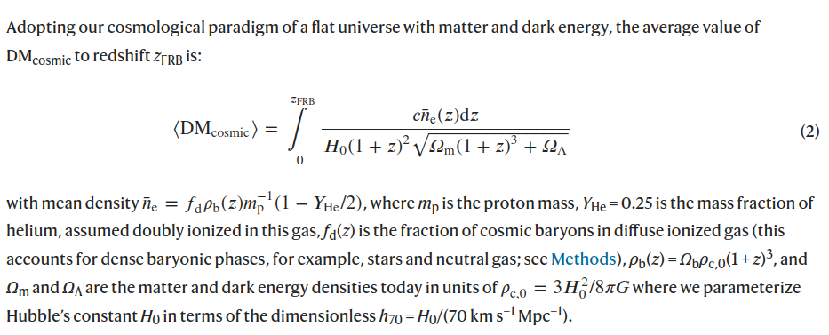

# arxiv文献泛读20210830-31

## 20210830

### [A Local Universe Host for the Repeating Fast Radio Burst FRB 20181030A](./2108.12122.pdf)

> 重复FRB 20181030A的一个本地宇宙宿主星系

https://arxiv.org/abs/2108.12122

details

We report on the host association of FRB 20181030A, a repeating fast radio burst (FRB) with a low dispersion measure (DM, 103.5 pc cm−3) discovered by CHIME/FRB Collaboration et al. (2019a). Using baseband voltage data saved for its repeat bursts, we localize the FRB to a sky area of 5.3 sq. arcmin (90% confidence). Within the FRB localization region, we identify NGC 3252 as the most promising host, with an estimated chance coincidence probability < 2.5×10^−3. Moreover, we do not find any other galaxy with $M_r \lt$ −15 AB mag within the localization region to the maximum estimated FRB redshift of 0.05. This rules out a dwarf host 5 times less luminous than any FRB host discovered to date. NGC 3252 is a star-forming spiral galaxy, and at a distance of ≈ 20 Mpc, it is one of the closest FRB hosts discovered thus far. From our archival radio data search, we estimate a 3σ upper limit on the luminosity of a persistent compact radio source (source size < 0.3 kpc at 20 Mpc) at 3 GHz to be  $2×10^{26} erg s^{-1} Hz^{−1}$, at least 1500 times smaller than that of the FRB 20121102A persistent radio source. We also argue that a population of young millisecond magnetars alone cannot explain the observed volumetric rate of repeating FRBs. Finally, FRB 20181030A is a promising source for constraining FRB emission models due to its proximity, and we strongly encourage its multi-wavelength follow-up.

- 文章寻找了FRB 20181030A(CHIME/FRB发现)的宿主星系, 使用其重复爆发的baseband voltage data, 将FRB的位置定在了5.3平方角分的范围内.
- 在这片区域内, 作者认为NGC 3252是最可靠的宿主星系.
-  另外, 作者没有在此区域找到红移在0.05以内且亮度$M_r$小于-15等的其它星系, 这排除了比目前的FRB宿主星系亮度低5倍的矮星系是宿主星系的情况
-  NGC 3252是一个恒星形成的螺旋星系, 距离在20Mpc左右, 是目前位置距离最近的FRB宿主星系之一.
-  作者根据数据估计了一个持续的致密射电源的3sigma上限光度为$2×10^{26} erg s^{-1} Hz^{−1}$(20Mpc, 源尺寸< 0.3 kpc, 3GHz), 至少比FRB20121102A这个持续爆小1500倍.
-  作者还认为单纯用年轻的毫秒磁星不足以解释观测到的重复FRB的volumetric rate(单位: $Gpc^{-3} yr^{-1}$).
-  最后, 由于距离近, FRB20181030A是一个有希望较好限制FRB辐射模型的源, 作者鼓励多波段的后随观测.

---

Q&A:
- baseband voltage data? 基带电压数据?, 如何定位?
- 作者主要是根据什么来判断可能的宿主星系? 拍摄矮星系的原因是亮度低还是红移大于0.05? 为什么以红移0.05为标准?
  - 在去除银河系对DM值的影响后, 这个FRB的DM-excess是30-40之间. 根据Macquart的等人2020年nature文章的公式(如下), 估计了红移大概在0.03-0.04(忽略宿主星系的DM贡献).
    
    
  - 0.05是作者通过MCMC模拟估计的这个FRB的最大红移
  - 如果把迄今发现的最暗的FRB宿主星系($M_r=-17$ AB mag 放在z=0.05的位置, 再假设它是一个表面亮度达到DESI Legacy Imaging Survey极限(~ 26 mag arcsec^-2)的low surface brightness galaxy, 这在DESI数据中的星等大概小于等于22等(应该大概相当于$M_r = -15$), 这相当于能够探测到比目前的FRB宿主星系($M_r =-15$ AB mag)亮度低5倍的矮星系. 作者据此挑了7个$m_r < 22$ AB mag, 且位置符合的7个星系.
  
  - 根据测谱得到的红移, 只有NGC3252满足红移限制.
  
- 现在才发这个源宿主星系的文章是因为之前数据不够而达不到精度?

  - 2019年CHIME/FRB Collaboration报告了这个源之后, 又探测了该源的7次重复爆发. 根据其中几次的raw voltage data, 可以将定位范围限制在几个角秒. 在这个基础上作者找到了NGC 3252.

    
    58870为2020年1月22日, 但作者应该是在2021年1月7日才知道的, 所以写的比较晚.

背景知识:
- 所有得到了定位的FRB(15个)中, 除了FRB20200120E, 其它的红移均位于0.03-0.66之间.
- 目前只在射电波段能观测FRB, 没有报道有类似余辉这种可在其它波段看见的辐射.
- CHIME/FRG网站:https://www.chime-frb.ca

