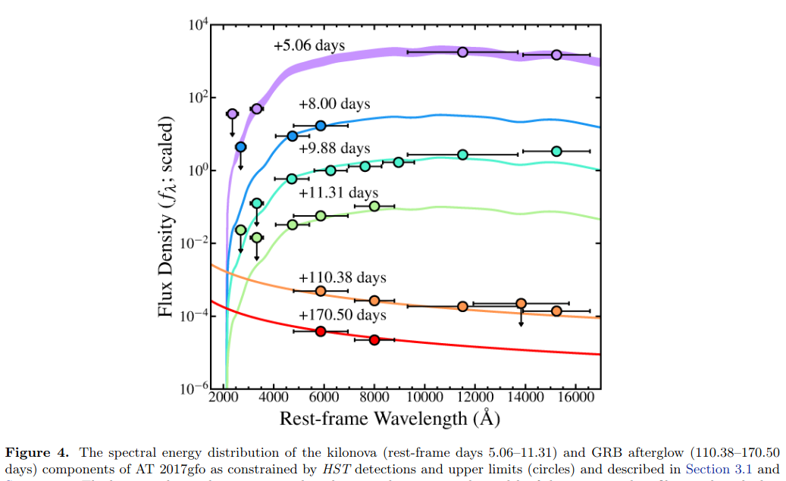
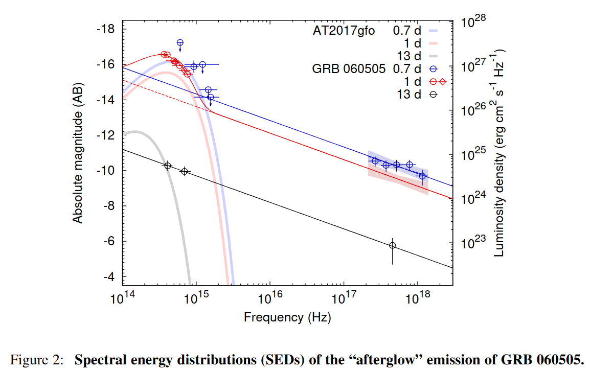

# arxiv文献泛读20210915-17

## 20210915

### [The ZTF-BTS Type Ia supernovae luminosity function suggests a single progenitor channel for the explosions](./2109.06219.pdf)

> ZTF-BTS Ia型超新星光度函数表明该类爆发事件前身系统的单一性

type:statistic-IaSN
comment:使用ZTF-BTS的源表, 结合Carnegie SN项目构建了Ia型SN的内秉光度函数, 结果表明改类型SN的爆炸途径是单一的, 且明亮的超新星似乎其源于年轻恒星.

https://arxiv.org/abs/2109.06219

details

>  We construct the Type Ia supernovae (SNe Ia) luminosity function (LF) using the ZTF Bright Transient Survey (BTS) catalogue. While this magnitude-limited survey has an unprecedented number of objects, it suffers from large distance uncertainties and lacks an estimation of host extinction. We bypass these issues by calculating the intrinsic luminosities from the shape parameters of the light curve's g and r bands, with the luminosities calibrated from the well observed SNe Ia sample of the Carnegie Supernova Project, allowing us to construct, for the first time, the intrinsic LF of SNe Ia. We then use a novel tight relation between the color stretch and the synthesized 56Ni mass, MNi56, to determine the MNi56 distribution of SNe Ia. We find that the LFs are unimodal, with their peaks in line with previous results, but have a much lower rate of dim events and luminous events. We show that the features on top of the unimodal LF-derived distributions are all consistent with statistical noise, suggesting a single progenitor channel for the explosions. We further derive, for the first time, the SNe Ia distribution of host galaxy extinction, and find a mean selective extinction of E(B−V)≈0.1 and a non-negligible fraction with large, >1mag, extinction in the optical bands. The high extinction is typical for luminous SNe, supporting their young population origin. 

- 文章使用ZTF的Bright Transient Survey catalogue构建了Ia型超新星的光度函数. 
- 作者通过g, r波段光变曲线的形状参数计算了intrinsic光度(color stretch $s_{gr}$ 与 内秉光度的关系, 此关系经过了 Carnegie Supernova Project样本的修正)
- 还通过color stretch和56Ni合成质量的关系, 计算了Ia SN 56Ni质量的分布.
- 发现光度函数是单峰的, 峰值与以前的研究吻合, 但暗事件($M_{Ni56} <\sim 0.4 M_{\odot}$)率和亮事件($M_{Ni56} >\sim 0.8 M_{\odot}$)率都相对最普遍的事件($M_{Ni56} \approx 0.6 M_{\odot}$)低很多.
- 作者认为这个单峰光度函数的特征反映了Ia SN爆发的前身通道的单一性.
- 作者还构建了Ia SN宿主星系消光的分布, 发现平均的 selective extinction E(B-V)=0.1, 以及大部分IaSN(特别是在恒星形成星系)在光学波段存在大于1星等的消光. 高消光在明亮SN中比较典型, 显示了其起源于年轻恒星/星系.

---

Q.
- color stretch?
  - 和内秉光度的关系?
    
  - 和56Ni质量的关系? 见上面的图, 下图为二次式拟合参数
    
  
- 哪些特点反映出single progenitor channel?

  - 浏览文章相关章节(第7节)后发现, 作者仅通过使用MC模拟的方法, 验证了$s_{gr}$这个量的分布符合一个具有如下形式的单峰分布, 结合观测数据限制了相关参数.  

    
    
    
  - 作者没有说明为什么单峰分布就能代表前身系统的单一性.

- 宿主星系消光是怎么计算的?

  - 首先使用CSP的样本建立$s_{gr}$和绝对峰值星等的关系 (样本的绝对峰值星等的计算考虑了宿主星系消光的影响, 但作者未具体说明如何考虑, 可能是用的已知宿主消光的超新星样本)

  - 再使用下式估计宿主星系消光

    

---

1.color stretch

B,V波段的color stretch$s_{BV}$定义(Burns,2014)为B波段峰值开始到(B-V)峰值之间的时间差除以30天. 这个参数可以代替常用的$\Delta m_{15}$.

g,r波段的color stretch定义类似, 其与$s_{BV}$的关系由Ashall, 2020给出: 

2.通过color stretch计算内秉光度过程似乎比较复杂

3.color stretch与$M_{Ni56}$的关系: 使用CSP的样本拟合两者的关系, 运用到ztf样本

### [A maximum likelihood estimate of the parameters of the FRB population](./2109.06785.pdf)

> FRB事件的一些参数的极大似然估计

type:statistic-FRB-non_repeating
comment:分析了82个非重复的FRB, 结果支持comoving FRB发生率不随红移变化, 且FRB的脉冲散射增宽不随红移迅速增加.

https://arxiv.org/abs/2109.06785

details

> We consider a sample of 82 non-repeating FRBs detected at Parkes, ASKAP, CHIME and UTMOST each of which operates over a different frequency range and has a different detection criteria. Using simulations, we perform a maximum likelihood analysis to determine the FRB population model which best fits this data. Our analysis shows that models where the pulse scatter broadening increases moderately with redshift (z) are preferred over those where this increases very sharply or where scattering is absent. Further, models where the comoving event rate density is constant over z are preferred over those where it follows the cosmological star formation rate. Two models for the host dispersion measure (DMhost) distribution (a fixed and a random DMhost) are found to predict comparable results. We obtain the best fit parameter values α=−1.53+0.29−0.19, $\bar{E}_{33}$=1.55+0.26−0.22 and γ=0.77±0.24. Here α is the spectral index, γ is the exponent of the Schechter luminosity function and $\bar{E}_{33}$ is the mean FRB energy in units of 1033J across 2128−2848MHz in the FRB rest frame. 

- 文章分析了来自Parkes, ASKAP, CHIME和UTMOST的82个非重复FRB.
- 通过极大似然分析, 结果发现
  - 脉冲增宽随红移适度增加的模型要优于随红移迅速增加的模型或者没有散射的模型.
  - comoving FRB event rate(rate per unit comoving volume)不随红移变化的模型优于随红移演化, 与恒星形成率相关的模型.

### [Deep Hubble Space Telescope Observations of GW170817: Complete Light Curves and the Properties of the Galaxy Merger of NGC 4993](./2109.06211.pdf)

> 使用哈勃望远镜对GW170817的深度观测: 完备的光变曲线和NGC4993星系并合的性质

type:observation-GW-170817
comment:HST对GW170817位置的长期跟踪观测

https://arxiv.org/abs/2109.06211

details

> We present the complete set of {\it Hubble Space Telescope} imaging of the binary neutron star merger GW170817 and its optical counterpart AT 2017gfo. Including deep template imaging in F814W, F110W, F140W, and F160W at 3.4 years post-merger, we re-analyze the full light curve of AT 2017gfo across 12 bands from 5--1273 rest-frame days after merger. We obtain four new detections of the short γ-ray burst (GRB) 170817A afterglow from 109--170 rest-frame days post-merger. These detections are consistent with the previously observed β=−0.6 spectral index in the afterglow light curve with no evidence for spectral evolution. We also analyze our limits in the case of novel late-time optical and IR emission signatures, such as a kilonova afterglow or infrared dust echo, but find our limits are not constraining in these contexts. We use the new data to construct deep optical and infrared stacks, reaching limits of M=−6.3 to −4.6 mag, to analyze the local environment around AT 2017gfo and low surface brightness features in its host galaxy NGC 4993. We rule out the presence of any globular cluster at the position of AT 2017gfo to 2.3×104L⊙, including those with the reddest V−H colors. Finally, we analyze the substructure of NGC 4993 in deep residual imaging, and find shell features which extend up to 71.8\arcsec\ (14.2 kpc) from the center of the galaxy. We find that the shells have a cumulative stellar mass of 6.3×108M⊙, roughly 2% the total stellar mass of NGC 4993, and mass-weighted ages of >3 Gyr. We conclude that it was unlikely the GW170817 progenitor system formed in the galaxy merger, which based on dynamical signatures and the stellar population in the shells mostly likely occurred 220--685 Myr ago. 

- 发表了对双中子星并合事件GW170817及其光学对应体AT 2017 gfo的进行的完备的观测.
- 利用并合前3.4年拍摄的多波段(F814W, F110W, F140W, and F160W)深度模板, 作者重新分析了AT 2017gfo从并合后5天到1273天(rest frame)的跨越12个波段(从极紫外到红外)的光变曲线.
- 作者在并合后109-170天内新探测到了4次GRB170817A的余辉. 这些探测与 previously observed光变曲线谱指数$\beta = -0.6$吻合, 没有光谱演化的迹象.
- 作者尝试使用晚期光学和红外观测的上限来对一些模型, 诸如kilonova, infrared dust echo等进行限制, 但没有好的限制效果.. 
- 作者使用这些新的数据做了深度的光学和红外的叠加, 达到极限星等M=-6.3 到 -4.6, 以分析AT 2017gfo的当地环境以及其宿主星系NGC4993的低面亮度特征.
- 作者排除了在AT 2017gfo的位置有光度大于$2.3\times10^4 L_{\odot}$的球状星团.
- 最后, 作者通过deep residual imaging分析了NGC4993的亚结构(substructure), 发现了一个壳层结构, 这个结构一直延伸到距离星系中心71.8''(14.2kpc)处. 这个壳层的总stellar mass为$6.3\times 10^8 M_{\odot}$, 大约是NGC 4993星系stellar mass的2%, 且其mass-weighted 年龄大于3Gyr.
- 作者认为它(这个壳, 形成于星系并合)不是GW170817的前身系统(Given the lack of evidence for a very young stellar component in the shells)

---

作者的观测: 2021年1.4-2.22, 主要目的是拍模板, 每次观测总曝光时间7.8-10.4ks

使用这些模板做图像相减, 作者在109-170天的观测中发现了4次观测存在余辉: (只看文中table的话似乎不止4次)

> 2017-12-06.15: 26.298(0.150) 2017-12-07.42: 25.612(0.288) 2017-12-08.93: 25.908(0.244) 2018-02-05.67: 26.495(0.194)

图像相减使用hotpants, 不同的图像相减使用的参数不完全一样, 但一般默认参数bgo=0.1, ko=0.05, nsx=nsy=5

光变曲线:

能谱:

NGC 4993的shell结构

### [Gamma-Ray Burst detection prospects for next generation ground-based VHE facilities](./2109.06676.pdf)

> 下一代地基甚高能仪器的GRB探测前景

type:instrument-GRB
comment:根据LAT GRB表的数据, 分析了将要安装在南半球的SWGO的GRB探测前景.

https://arxiv.org/abs/2109.06676

details

> Gamma-ray Bursts (GRB) were discovered by satellite-based detectors as powerful sources of transient γ-ray emission. The Fermi satellite detected an increasing number of these events with its dedicated Gamma-ray Burst Monitor (GBM), some of which were associated with high energy photons (E>10GeV), by the Large Area Telescope (LAT). More recently, follow-up observations by Cherenkov telescopes detected very high energy emission (E>100GeV) from GRBs, opening up a new observational window with implications on the interpretation of their central engines and on the propagation of very energetic photons across the Universe. Here, we use the data published in the 2nd Fermi-LAT Gamma Ray Burst Catalogue to characterise the duration, luminosity, redshift and light curve of the high energy GRB emission. We extrapolate these properties to the very high energy domain, comparing the results with available observations and with the potential of future instruments. We use observed and simulated GRB populations to estimate the chances of detection with wide-field ground-based γ-ray instruments. Our analysis aims to evaluate the opportunities of the Southern Wide-field-of-view Gamma-ray Observatory (SWGO), to be installed in the Southern Hemisphere, to complement CTA. We show that a low-energy observing threshold (Elow<200GeV), with good point source sensitivity ($F_{lim} \approx 10^{−11} erg cm^{−2} s^{−1}$ in 1yr), are optimal requirements to work as a GRB trigger facility and to probe the burst spectral properties down to time scales as short as 10s, accessing a time domain that will not be available to IACT instruments. 

- 使用2nd Fermi-LAT Gamma Ray Burst Catalogue统计了GRB高能辐射的持续时间,光度,红移和光变曲线, 将这些性质外推到甚高能波段, 比较将来的仪器与现有仪器的(探测?)结果.
- 使用观测到的和模拟的GRB事件估计地基大视场伽马射线仪器(SWGO)的探测概率
- 提出要做到比较好的GRB触发设备, 最后有较低的能量观测阈值($E_{lim} < 200 GeV$)以及较好的电源灵敏度($F_{lim} \approx 10^{−11} erg cm^{−2} s^{−1}$).

## 20210916

### [Optical Observations and Modeling of the Superluminous Supernova 2018lfe](./2109.06970.pdf)

> 对超亮超新星2018lfe的光学观测和模型拟合

type:observation-SLSN
comment:对超亮超新星2018lfe的光学观测和磁星模型拟合

https://arxiv.org/abs/2109.06970

details

> We present optical imaging and spectroscopy of SN\,2018lfe, which we classify as a Type I superluminous supernova (SLSN-I) at a redshift of z=0.3501 with a peak absolute magnitude of Mr≈−22.1 mag, one of the brightest SLSNe discovered. SN\,2018lfe was identified for follow-up using our FLEET machine learning pipeline. Both the light curve and the spectra of SN\,2018lfe are consistent with the broad population of SLSNe. We fit the light curve with a magnetar central engine model and find an ejecta mass of Mej≈3.8 M⊙, a magnetar spin period of P≈2.9 ms and a magnetic field strength of B⊥≈2.8×1014 G. The magnetic field strength is near the top of the distribution for SLSNe, while the spin period and ejecta mass are near the median values of the distribution for SLSNe. From late-time imaging and spectroscopy we find that the host galaxy of SN\,2018lfe has an absolute magnitude of Mr≈−17.85, (LB≈0.029 L∗), and an inferred metallicity of Z≈0.3 Z⊙, and star formation rate of ≈0.8 M⊙ yr−1. 

- 作者对SN 2018lfe进行了测光和测谱观测, 将其分类为I型超亮超新星, 红移为0.3501, 峰值星等$M_r \approx$ -22.1mag, 是发现的最亮的SLSNe之一.
- 这个源是经由作者的FLEET机器学习的pipeline证认进行跟踪观测的.
- 该源的光变曲线和光谱都与超亮超新星一致.
- 作者用磁星作为中心引擎的模型拟合光变曲线, 给出$M_{ej} \approx 3.8 M_{\odot}$, 磁星自旋周期2.9ms, 磁场$B_⊥ \approx 2.8^{14} G$. 这个磁场强度接近SLSNe磁场分布的最高值, 而自旋周期和抛射物质量则属于中等水平.
- 从晚期的图像和光谱, 作者测得其宿主星系星等$M_r\approx$-17.85, 推断金属丰度$Z \approx 0.3 Z_{\odot}$, 恒星形成率约为$0.8 M_{\odot} yr^{-1}.$

---

Type I SLSNe: 无氢光谱, 早期强烈地O II吸收先, 蓝端连续谱.

SN 2018lfe由ZTF在18年12月31日首次发现, 由Pan-STARRS在此日首次报道. 

作者从2019年1月11日开始观测(测光FLWO, 测谱包括Magellan 6.5-m telescopes, MMT 6.5-m telescope) (MULTIPLE MIRROR TELESCOPE)[https://en.wikipedia.org/wiki/MMT_Observatory] , part of FLWO, Arizona.

### [Exploring the sky localization and early warning capabilities of third generation gravitational wave detectors in three-detector network configurations](./2109.07389.pdf)

> 探讨由三个探测器组成的第三代引力波探测网络的定位和早期警报能力

type:theory-GW_detector
comment:探讨由三个Einstein Telescope或Cosmic Explorer组成的引力波探测网络的定位和早期警报能力.

https://arxiv.org/abs/2109.07389

details

> This work characterises the sky localization and early warning performance of networks of third generation gravitational wave detectors, consisting of different combinations of detectors with either the Einstein Telescope or Cosmic Explorer configuration in sites in North America, Europe and Australia. Using a Fisher matrix method which includes the effect of earth rotation, we estimate the sky localization uncertainty for 1.4M⊙-1.4M⊙ binary neutron star mergers at distances 40Mpc, 200Mpc, 400Mpc, 800Mpc, 1600Mpc, and an assumed astrophysical population up to redshift of 2 to characterize its performance for binary neutron star observations. We find that, for binary neutron star mergers at 200Mpc and a network consisting of the Einstein Telescope, Cosmic Explorer and an extra Einstein Telescope-like detector in Australia(2ET1CE), the upper limit of the size of the 90% credible region for the best localized 90% signals is 0.51deg2. For the simulated astrophysical distribution, this upper limit is 183.58deg2. If the Einstein Telescope-like detector in Australia is replaced with a Cosmic Explorer-like detector(1ET2CE), for 200Mpc case, the upper limit is 0.36deg2, while for astrophysical distribution, it is 113.55deg2. We note that the 1ET2CE network can detect 7.2% more of the simulated astrophysical population than the 2ET1CE network. In terms of early warning performance, we find that a network of 2ET1CE and 1ET2CE networks can both provide early warnings of the order of 1 hour prior to merger with sky localization uncertainties of 30 square degrees or less. Our study concludes that the 1ET2CE network is a good compromise between binary neutron stars detection rate, sky localization and early warning capabilities. 

- 三个探测器反别放在北美, 欧洲和澳大利亚
  - 2ET1CE: best localized upper limit: 0.51 deg2; for the simulated astrophysical distribution: 183.58 deg2
  - 1ET2CE: best localized upper limit: 0.36 deg2; for the simulated astrophysical distribution: 113.55 deg2
  - 两种配置均能在并合前1小时的时间量级上提供误差约30平方度的早期警报

### [Local Environments of Low-Redshift Supernovae](./2109.07453.pdf)

> 低红移超新星的周边环境

type:statistic-SN
comment:研究了各类型超新星的周边环境,如不同超新星在宿主星系中的位置与星系中恒星形成率或恒星质量分布的关系.

https://arxiv.org/abs/2109.07453

details

> We characterize the local (2-kpc sized) environments of Type Ia, II, and Ib/c supernovae (SNe) that have recently occurred in nearby (d≲50 Mpc) galaxies. Using ultraviolet (UV, from GALEX) and infrared (IR, from WISE) maps of 359 galaxies and a sample of 472 SNe, we measure the star formation rate surface density (ΣSFR) and stellar mass surface density (Σ⋆) in a 2-kpc beam centered on each SN site. We show that core-collapse SNe are preferentially located along the resolved galactic star-forming main sequence, whereas Type Ia SNe are extended to lower values of ΣSFR at fixed Σ⋆, indicative of locations inside quiescent galaxies or quiescent regions of galaxies. We also test how well the radial distribution of each SN type matches the radial distributions of UV and IR light in each host galaxy. We find that, to first order, the distributions of all types of SNe mirror that of both near-IR light (3.4 and 4.5 microns, tracing the stellar mass distribution) and mid-IR light (12 and 22 microns, tracing emission from hot, small grains), and also resemble our best-estimate ΣSFR. All types of SNe appear more radially concentrated than the UV emission of their host galaxies. In more detail, the distributions of Type II SNe show small statistical differences from that of near-IR light. We attribute this overall structural uniformity to the fact that within any individual galaxy, ΣSFR and Σ⋆ track one another well, with variations in ΣSFR/Σ⋆ most visible when comparing between galaxies. 

- 作者研究了最近发生在50Mpc内的 Type Ia, II, 和 Ib/c 型超新星的周边(2 kpc)环境.
- 测量了这些SN附近的恒星形成面密度和恒星质量面密度.
- 文章表明核塌缩型超新星一般位于主序恒星形成星系, 而Ia型超新星环境的恒星形成相对较低, 表明它们的宿主星系是比较沉寂的或者它们位于星系的沉寂地区.
- 作者还研究了SN在各宿主星系中的j径向距离分布(radial distribution)是否匹配宿主星系的UV和IR辐射区域分布. 发现各类的SN都符合星系中近红外(反映stellar mass分布)和中红外(反映来自热的,小的grains的辐射)的分布.
- 各类超新星的分布要比宿主星系的极紫外辐射分布更集中.

## 20210917

### [Investigating the Nature of the Luminous Ambiguous Nuclear Transient ASASSN-17jz ](./2109.07480.pdf)

> 研究明亮的未定核区暂现源ASASSN-17jz的起源

type:observation-transient
comment:讨论了暂现源ASASSN-17jz的起源: AGN吸积盘附近的IIn型SN

https://arxiv.org/abs/2109.07480

details

> We present observations of the extremely luminous but ambiguous nuclear transient (ANT) ASASSN-17jz, spanning roughly 1200 days of the object's evolution. ASASSN-17jz was discovered by the All-Sky Automated Survey for Supernovae (ASAS-SN) in the galaxy SDSS J171955.84+414049.4 on UT 2017 July 27. The transient peaked at an absolute B-band magnitude of MB,peak=−22.81, corresponding to a bolometric luminosity of Lbol,peak=8.3×1044 ergs s−1, and exhibited late-time ultraviolet emission with a total emitted energy of Etot=(1.36±0.08)×1052 ergs. This late-time light is accompanied by increasing X-ray emission that becomes softer as it brightens. ASASSN-17jz exhibited a large number of spectral emission lines most commonly seen in active galactic nuclei (AGNs) with little evidence of evolution, except for the Balmer lines, which became fainter and broader over time. We consider various physical scenarios for the origin of the transient, including those involving supernovae (SNe), tidal disruption event (TDEs), AGN outbursts, and ANTs. We find that the most likely explanation is that ASASSN-17jz was an SN IIn occurring in or near the disk of an existing AGN, and that the late-time emission is caused by the AGN transitioning to a more active state. 

- 作者对由ASAS-SN项目发现的暂现源ASASSN-17jz进行了1200天的观测. 红移z=0.1641 from O I 8446.
- 该源B波段峰值星等为-22.81, 对应$L_{bol, peak}=8.3\times 10^{44} erg/s$, 且该源在展现了晚期的紫外辐射. 总辐射能量为$E_{tot}=(1.36\pm 0.08)\times 10^{52} ergs$.
- 晚期还伴有增强同时变软的X射线辐射.
- 该源光谱有很多常见于AGN的发射线, 且这些线没有呈现出演化的迹象, 除了Balmer线系会逐渐变弱以及变宽.
- 考虑了多种可能的起源后(SN, TDE, AGN outursts, ANT)作者认为这个源最有可能是发生在AGN吸积盘附近的一个II n型超新星, 其晚期辐射则来源于开始变活跃的AGN.

### [The CHIME FRB population do not track the star formation history of the universe](./2109.07558.pdf)

> CHIME FRB不追踪宇宙恒星形成的历史

type:statistic-FRB
comment:结合CHIME/FRB的目录, 指出FRB的起源并非仅与恒星形成成协, 还来自于延迟于恒星形成的现象

https://arxiv.org/abs/2109.07558

details

> The redshift distribution of fast radio bursts (FRBs) is not well constrained. The association of the Galactic FRB 200428 with the young magnetar SGR 1935+2154 raises the working hypothesis that FRB sources track the star formation history of the universe. The discovery of FRB 20200120E in association with a globular cluster in the nearby galaxy M81, on the other hand, casts doubts on such an assumption. We apply the Monte Carlo method developed in a previous work to test different FRB redshift distribution models against the recently released first CHIME FRB catalog in terms of their distributions in specific fluence, inferred isotropic energy, and external dispersion measure ($DM_E$). Our results clearly show that the hypothesis that all FRBs track the star formation history of the universe is ruled out. The hypothesis that all FRBs track the accumulated stars throughout history describes the data better but still cannot pass both the energy and DME criteria. The data seem to be better modeled with either a redshift distribution model invoking a significant delay with respect to star formation or a hybrid model invoking both a dominant delayed population and an insignificant star formation population. We discuss the implications of this finding for FRB source models. 

- FRB的红移分布目前没有得到很好的限制, 而不同的起源模型可能服从不同的红移分布.
-  系内FRB200428与SGR 1935+2154成协这一事件提出了FRB源追踪宇宙恒星形成历史这一假设(磁星来自大质量恒星), 但FRB20200120E与M81内一球状星团成协的事件又使我们对此假设提出了疑问(表明有部分FRB来自较老的恒星族群, 相对star formation的delayed population)
- 作者使用Monte Carlo方法, 结合最近发布的第一个CHIME FRB目录(536个FRB,包含62个是来自18个重复爆), **检验(K-S)了不同的FRB模型红移分布**是否能匹配这些FRB的通量分布, 各向同性能量分布, external dispersion measure($DM_E$)分布.(不同的模型能够模拟出不同的这些观测量的分布)
- 结果清楚地显示所有FRB均追踪宇宙恒星形成历史这一假设可以被排除.
- 所有FRB追踪宇宙的累积恒星(accumulated stars)这一假设能相对更好地描述数据, 但仍不能通过能量和$DM_E$的检验, 也可以被排除
- 下面两种模型似乎能更好地描述数据:
  - a redshift distribution model invoking a significant delay with respect to star formation(比如来自双中子星并合)
  - a hybrid model invoking both a dominant delayed population and an insignificant star formation population(既有来自delayed popolation的, 也有小部分来自恒心形成的population)
- 讨论了这样的发现对于FRB起源模型的意义.

---
讨论的模型:

不同模型的FRB红移分布:

### [The Low-Energy Spectral Index of Gamma-Ray Burst Prompt Emission from Internal Shocks](./2109.07681.pdf)

> 来自内激波的GRB瞬时辐射的低能光谱指数

type:theory-GRB
comment:如果考虑内激波中磁场的演化, 可以得到与观测相符的低能光子指数(~-1)

https://arxiv.org/abs/2109.07681

details

authors: Kai Wang and Zi-Gao Dai 

> The prompt emission of most gamma-ray bursts (GRBs) typically exhibits a non-thermal Band component. The synchrotron radiation in the popular internal shock model is generally put forward to explain such a non-thermal component. However, the low-energy photon index α∼−1.5 predicted by the synchrotron radiation is inconsistent with the observed value α∼−1. Here, we investigate the evolution of a magnetic field during propagation of internal shocks within an ultrarelativistic outflow, and revisit the fast cooling of shock-accelerated electrons via synchrotron radiation for this evolutional magnetic field. We find that the magnetic field is first nearly constant and then decays as B′∝t−1, which leads to a reasonable range of the low-energy photon index, −3/2<α<−2/3. In addition, if a rising electron injection rate during a GRB is introduced, we find that α reaches −2/3 more easily. We thus fit the prompt emission spectra of GRB 080916c and GRB~080825c. 

- GRB瞬时辐射的非热band成分一般用内激波的同步辐射来解释,但同步辐射预言低能( < $E_p$ ~ 250 kev )光子指数约为-1.5, 而观测一般为-1.
- 本文研究了内激波传播过程种的磁场演化, 并重新讨论了响应环境下激波加速电子的快冷却过程.
- 磁场首先近乎保持不变, 接着随时间$B' \propto t^{-1}$ 衰减, 这将导致低能光子指数$\alpha$为 -3/2(不变磁场) ~ -2/3(衰减磁场).
- 另外, 如果在GRB持续期间有增强的电子注入, 则这个$\alpha$将能更容易得达到-2/3.
- 拟合了GRB 080916c 和 GRB080825c的瞬时辐射光谱.

### [A semi-analytic afterglow with thermal electrons and synchrotron self-Compton emission](./2109.07687.pdf)

> 一个热电子的同步自康普敦辐射的半解析余辉模型

type:theory-GRB
comment:文章考虑了包含热电子成分的电子分布的GRB余辉辐射

https://arxiv.org/abs/2109.07687

details

authors: Donald C. Warren, Maria Dainotti, Maxim V. Barkov,... Shigehiro Nagataki

> We extend previous work on gamma-ray burst (GRB) afterglows involving hot thermal electrons at the base of a shock-accelerated tail. Using a physically-motivated electron distribution based on first-principles simulations, we compute broadband emission from radio to TeV gamma-rays. For the first time, we present the effects of a thermal distribution of electrons on synchrotron self-Compton (SSC) emission. The presence of thermal electrons causes temporal and spectral structure across the entire observable afterglow, which is substantively different from models that assume a pure power-law distribution for the electrons. We show that early-time TeV emission is enhanced by more than an order of magnitude for our fiducial parameters, with a time-varying spectral index that does not occur for a pure power law of electrons. We further show that the X-ray "closure relations" take a very different, also time-dependent, form when thermal electrons are present; the shape traced out by the X-ray afterglows is a qualitative match to observations of the traditional decay phase. 

- 作者研究了来自热电子的从射电到TeV波段的余辉辐射, 其中首次计算了热电子的SSC辐射.
- 热电子的存在对余辉的光变和光谱行为产生影响, 使其显著异于power law电子.
- 早期的TeV辐射会被增强不止一个量级, 且其光谱指数会随时间变化, 这是不同于幂律电子的.
- X射线的closure relations的形式也会不一样,会依赖于时间.

### [A kilonova from an ultra-quick merger of a neutron star binary](./2109.07694.pdf)

> 一个从极快的双中子星并合中产生的kilonova

type:observation-GRB&kilonova
comment:文章根据发现的热成分,温度下降,以及光学余辉的快速衰减认为GRB060505是双中子星并合来源, 并产生了kilonova

https://arxiv.org/abs/2109.07694

details

authors:Zhi-Ping Jin, Hao Zhou, Stefano Covino, ..., Da-Ming Wei

> GRB 060505 was the first well-known nearby (at redshift 0.089) "hybrid" gamma-ray burst that has a duration longer than 2 seconds but without the association of a supernova down to very stringent limits. The prompt γ−ray flash lasting ∼4 sec could consist of an intrinsic short burst and its tail emission, but the sizable temporal lag (∼0.35 sec) as well as the environment properties led to the widely-accepted classification of a long duration gamma-ray burst originated from the collapse of a massive star. Here for the first time we report the convincing evidence for a thermal-like optical radiation component in the spectral energy distribution of the early afterglow emission. In comparison to AT2017gfo, the thermal radiation is ∼2 times brighter and the temperature is comparable at similar epochs. The optical decline is much quicker than that in X-rays, which is also at odds with the fireball afterglow model but quite natural for the presence of a blue kilonova. Our finding reveals a neutron star merger origin of the hybrid GRB 060505 and strongly supports the theoretical speculation that some binary neutron stars can merge ultra-quickly (within ∼1 Myr) after their formation when the surrounding region is still highly star-forming and the metallicity remains low. Gravitational wave and electromagnetic jointed observations are expected to confirm such scenarios in the near future. 

- GRB 060505是第一个了解得比较详细的邻近(z=0.089)的"混合型"GRB, 其持续时间大于2s,但没有显示出与超新星的关联.
- 瞬时辐射阶段的伽马射线flash持续了4s, 可能由一个intrinsic短爆加上一个尾巴辐射组成, 但比较大的时间延迟(0.35s)和环境性质(very young stellar population)导致认为这是一个长爆.
- 文章首次报道了该源早期能谱分布中存在一个类热光学辐射的成分的可信证据
- 这个热辐射两倍亮于AT 2017gfo, 而温度在相似的阶段是差不多的.
- 光学的衰减比X射线的衰减快得多, 这也不符合火球余辉模型, 但比较符合存在一个blue kilova的情景.
- 作者认为这些迹象表明GRB060505起源于中子星并合, 并且支撑了一些认为双中子星能够以极快速度完成并合(双中子星形成后的1Myr内, 此时它们周围的区域恒星形成依然较活跃,同时金属水平较低)的理论猜想.

0.7天: Swift/UVOT UVM2/UVW2 upper limits + XRT ,  >-0.6

13天: X-ray data , HST, -0.58

1.1天:VLT, Gemini, -1.52  --> thermal-like component. 

1.1天的光学加X射线数据拟合: thermal-like(T=5750) + power-law(-0.6), 但似乎没有这个时候的X射线数据?

另外, 在t=0.71天, UVOT其它波段的数据表明存在一个非常软的幂律谱$\propto \nu^{-2.8}$, 表明此时可能存在一个温度更高的热成分, $6300K<T_{int}<9800K$, 比1.1天的热成分温度高. 这样一个温度下减在kilonova中是比较自然的.

再者,作者认为光学波段的衰减(-2.26)比X射线的衰减(-1.39)要陡, 这也符合一个blue kilonova的存在.

此前一些对宿主星系的研究表明该GRB发生的区域还非常年轻, <= 10Myr, 如果该GRB是双中子星并合起源, 则此年龄大概对应30$M_{\odot}$的寿命, 且并合过程就应该在几个Myr内完成, 属于非常快的并合过程.

### [SN 2018bsz: significant dust formation in a nearby superluminous supernova](./2109.07942.pdf)

> SN 2018bsz: 一个邻近超亮超新星中存在显著的尘埃形成

type:observation-SN-SLSN
comment:文章发现在爆发200天后, 超亮超新星SN 2018bsz的抛射物内形成了大量尘埃, 超亮超新星可能是宇宙早期尘埃的重要来源.

https://arxiv.org/abs/2109.07942

details

authors: T.-W. Chen, S. J. Brennan, R. Wesson, ..., D. R. Young

>  We investigate the thermal emission and extinction from dust associated with the nearby superluminous supernova (SLSN) 2018bsz. Our dataset has daily cadence and simultaneous optical and near-infrared coverage up to ~ 100 days, together with late time (+ 1.7 yr) MIR observations. At 230 days after light curve peak the SN is not detected in the optical, but shows a surprisingly strong near-infrared excess, with r - J > 3 mag and r - Ks > 5 mag. The time evolution of the infrared light curve enables us to investigate if the mid-infrared emission is from newly formed dust inside the SN ejecta, from a pre-existing circumstellar envelope, or interstellar material heated by the radiation from the SN. We find the latter two scenarios can be ruled out, and a scenario where new dust is forming in the SN ejecta at epochs > 200 days can self-consistently reproduce the evolution of the SN flux. We can fit the spectral energy distribution well at +230 d with 5 x 10^-4 solar mass of carbon dust, increasing over the following several hundred days to 10^-2 solar mass by +535 d. SN 2018bsz is the first SLSN showing evidence for dust formation within the SN ejecta, and appears to form ten times more dust than normal core-collapse SNe at similar epochs. Together with their preference for low mass, low metallicity host galaxies, we suggest that SLSNe may be a significant contributor to dust formation in the early Universe. 

- 作者研究了邻近的超亮超新星2018bsz 处尘埃的情况. 这是目前最近的I型SLSN, 红移z=0.0267.
- 作者每天都进行了观测(daily cadence), 有前100天内光学和近红外的同时数据, 也有晚期(1.7年)的中红外观测数据.
- 在光变曲线峰值过后230天, 超新星已经不能在光学波段被探测到, 但存在一个非常强的近红外超出, r-j > 3 mag, r - Ks > 5 mag.
- 因为有红外光变曲线, 作者可以分析中红外辐射是在SN抛射物中新形成的, 还是来自原本就存在的星周包层(circumstellar envelope), 抑或是来自被SN辐射加热的星际介质.
- 作者发现后两种可能可以排除, 而如果尘埃是在200天后形成于抛射物内的, 则可以自洽得重现SN流量的演化.
- 230天的能谱分布可以比较好地用$5\times 10^{-4} M_{\odot}$的炭尘埃质量来拟合, 而在535天, 尘埃质量则增加到了$10^{-2} M_{\odot}$.
- SN 2018 bsz是第一个展现出能够在抛射物中形成尘埃的超亮超新星, 且尘埃的形成量在相似阶段的普通核塌缩超新星的10倍以上.
- 结合其宿主星系的低质量和低丰都, 作者认为超亮超新星可能是在早期宇宙中尘埃形成的重要贡献者.

---

背景知识:

- 邻近的CCSNe形成的尘埃一般在-5到-3这个量级($M_{\odot}$单位). 
- SNR中的尘埃一般会更多, 在-2到-1量级. 2020年对SN 1987A的远红外观测显示存在0.4-0.7$M_{\odot}$质量的尘埃.
- 对高红移z>6的类星体的观测显示早期宇宙中, 星系内存在大亮尘埃.
- I型SLSN的前身星质量一般也很大, 且通常金属丰度较低(SLSN可能与第一代恒星有关)所以在爆炸前质量损失也较低,因此该类恒星可能也贡献了大量尘埃.

