# arxiv文献泛读20210930-1001

## 20210930

### [On the maximum luminosities of normal stripped-envelope supernovae -- brighter than explosion models allow ](./2109.14339.pdf)

> 关于普通包层剥离超新星的最大光度: 比爆炸模型允许的更亮

type:statistic-SN-Ibc
comment:从ZTF-BTS中选取的Ibc型SN样本来看, 实际观测到的最大亮度比理论给出的包层剥离超新星的最大亮度更亮.

https://arxiv.org/abs/2109.14339

details

authors: J. Sollerman, S. Yang, D. Perley, S. Schulze, C. Fremling, M. Kasliwal, K. Shin, B. Racine

> Context. Stripped-envelope supernovae (SE SNe) of Type Ib and Type Ic are thought to result from explosions of massive stars having lost their outer envelopes. The favoured explosion mechanism is by core-collapse, with the shock later revived by neutrino heating. However, there is an upper limit to the amount of radioactive Nickel-56 that such models can accomplish. Recent literature point to a tension between the maximum lumi
>
> Aims. We use a well characterized sample of SE SNe from the Zwicky Transient Facility (ZTF) Bright Transient Survey (BTS). We scrutinize the observational caveats regarding estimating the maximum luminosity (and thus the amount of ejected radioactive nickel) for the members of this sample.
>
> Methods.  We employ the strict selection criteria for the BTS to collect a sample of spectroscopically classified normal Type Ibc SNe for which we use the ZTF light curves to determine the maximum luminosity.  We cull the sample further based on data quality, lightcurve shape, distance and colors, and examine uncertainties that may affect the numbers. The methodology of the sample construction from this BTS sample can be used for many other future investigations.
>
> Results. We analyze observational data, consisting of optical light curves and spectra, for the selected sub-samples. In total we use 129 Type Ib or Type Ic BTS SNe with an initial rough luminosity distribution peaked at Mr = −17.61 ±0.72, and where 36% are apparently brighter than the theoretically predicted maximum brightness of Mr = −17.8. When we further cull this sample to ensure that the SNe are normal Type Ibc with good LC data within the Hubble flow, the sample of 94 objects has Mr = −17.64 ±0.54. A main uncertainty in absolute magnitude determinations for SNe is the host galaxy extinction correction, but the reddened objects only get more luminous after corrections. If we simply exclude objects with red, unusual or uncertain colors, we are left with 14 objects at Mr = −17.90 ±0.73, whereof a handful are most certainly brighter than the suggested theoretical limit. The main result of this study is thus that normal SNe Ibc do indeed reach luminosities above $10^{42.6} erg s−1$, apparently in conflict with existing explosion models.

- Ib 和 Ic 型的包层剥离超新星被认为起源于失去外部包层的大质量恒星的核塌缩.
- 受支持的爆炸机制是核塌缩+随后因中微子加热而导致的(revivied)激波.
- 然而, 在该模型下, 爆炸中生成的放射性Ni56的质量存在一个上限.
- 最近的文章指出由该模型模拟出的最大光度和实际观测存在出入.
- 作者从ZTF BTS(Bright Survey)中挑选了一批通过光谱证认为Ibc型的包层剥离超新星, 并利用其光变曲线计算了峰值光度.
- 作者使用了129个超新星作为样本, 峰值光度分布显示, 光度函数峰值处$M_r =-17.61 \pm 0.73$, 有36%的源比理论的最大亮度$M_r=-17.8$更亮.
- 若进一步筛选样本, 留下有高质量光变曲线, 且距离不要太近(within Hubble flow, z>0.015)的源, 则样本数减为94个, $M_r = -17.64 \pm 0.54$.
  - in the local universe the peculiar motions of nearby galaxies make the relative distance uncertainties larger.
- 再进一步筛选, 去掉objects with red, unusual or uncertain colors, 样本数减为14个, $M_r = -17.90 \pm 0.73$, 其中不少都比理论极限亮.
  - remove objects with different colors than the main population of SNe Ibc. The main rationale here being that we want to avoid large corrections for host-galaxy extinction.
- 因此, 本文主要结果就是Ibc型超新星能达到$10^{46.2} erg/s$以上的光度, 明显与现存的爆炸模型冲突.

The absolute peak luminosity function for these supernovae is also presented in Fig. 1:

### [A Comptonized Fireball Bubble: Physical Origin of Magnetar Giant Flares](./2109.14252.pdf)

> 一个具有康普顿化的火球泡: 磁星巨耀发的物理起源

type: theory-MGF-sGRB
comment: 提出了一个康普顿化的磁星巨耀发模型, 可能产生一部分短伽马爆.

https://arxiv.org/abs/2109.14252

details

authors: Zhao Joseph Zhang, Bin-Bin Zhang, Yan-Zhi Meng

> Magnetar Giant Flares (MGFs) have been long proposed to contribute at least a sub-sample of the observed short Gamma-ray Bursts (GRBs). The recent discovery of the short GRB 200415A in the nearby galaxy NGC 253 established a textbook-version connection between these two phenomena. Unlike previous observations of the Galactic MGFs, the unsaturated instrument spectra of GRB 200415A provide for the first time an opportunity to test the theoretical models with the observed γ-ray photons. This paper proposed a new readily fit-able model for the MGFs, which invokes an expanding fireball Comptonized by the relativistic magnetar wind at photosphere radius. In this model, a large amount of energy is released from the magnetar crust due to the magnetic reconnection or the starquakes of the star surface and is injected into confined field lines, forming a trapped fireball bubble. After breaking through the shackles and expanding to the photospheric radius, the thermal photons of the fireball are eventually Comptonized by the relativistic e± pairs in the magnetar wind region, which produces additional higher-energy gamma-ray emission. The model predicts a modified thermal-like spectrum characterized by a low-energy component in the Rayleigh-Jeans regime, a smooth component affected by coherent Compton scattering in the intermediate energy range, and a high-energy tail due to the inverse Compton process. By performing a Monte-Carlo fit to the observational spectra of GRB 200415A, we found that the observation of the burst is entirely consistent with our model predictions. 

- 一部分观测到的短伽马爆被认为可能是由磁星巨耀发(MGF)产生的, GRB200415A将这两种现象联系起来.
- 这篇文章提出了一个新的MGF模型, 在该模型中, 光球层处的相对论性磁星星风会使膨胀的火球康普顿化. 
- 由于磁星表面的磁重联和星震, 大量能量从磁星壳层中释放出来, 注入到被束缚的磁力线中, 形成一个火球泡. 当其冲破束缚到达光球半径后, 火球的热光子被磁星星风区的相对论电子康普顿化, 产生额外的伽马射线辐射.
- 模型预测了一个类热的光谱, 其低能成分为Rayleigh-Jeans, 中间能段则是一个受康普顿散射影响的光滑成分, 高能段是一个逆康普顿的尾巴.
- 文章用此模型拟合了GRB 200415的光谱, 发现观测和理论预测符合的很好.

### [Radio Loud vs. Radio Quiet Gamma-ray Bursts: the Role of Binary Progenitors](./2109.14122.pdf)

> 射电强 vs. 射电弱的伽马爆: 双星前身星在其中的角色

type: theory-GRB
comment: 作者提出, 射电强的GRB可能起源于双星系统中的大质量恒星塌缩, 而射电弱的GRB则起源于单个的大质量恒星塌缩.

https://arxiv.org/abs/2109.14122

details

Authors: Nicole M. Lloyd-Ronning

> We explore the possibility that radio loud gamma-ray bursts (GRBs) result from the collapse of a massive star in an interacting binary system, while radio quiet GRBs are produced by the collapse of a single massive star. A binary collapsar system can have the necessary angular momentum and energy budget to explain the longer prompt gamma-ray durations and higher isotropic energies seen in the the radio loud sub-sample of long GRBs. Additionally, tidal interactions between the stars in binary systems can lead to rich and extended circumstellar environments that allow for the presence of the long-lived radio afterglows seen in the radio loud systems. Finally, the relative fraction of stars in binary systems versus single star systems appears consistent with the fraction of radio loud versus radio quiet GRBs.

- 作者讨论了射电强的GRB起源于相互作用的双星系统中的大质量恒星塌缩, 而射电弱的GRB则起源于单个的大质量恒星塌缩的可能性.
  - 相互作用指伴星在质量和角动量转移上对主星有显著影响.
- 一个双星系统中的恒星塌缩可以提供足够的角动量和能量来解释**在射电强的GRB所表现出的较长的瞬时辐射阶段和较高的各向同性能量**. 
- 而且双星之间的潮汐相互作用能导致密度和尺度都更大(extended)的星周环境. 这也能解释射电强GRB中持续时间较长的射电余辉.
- 最后, 处于双星系统中的恒星的数量与单个恒星的数量之比看起来也符合射电强和射电弱的GRB的比例.

---

- 怎么判断一个GRB是radio-loud的还是radio-quiet的?

  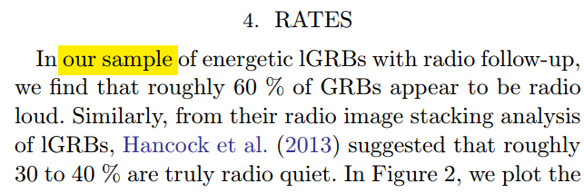

  - 文章没有描述他们的样本, 也没有提到他们如何判断GRB是radio-loud还是radio-quiet的.

  - [Hancock et al.(2013)](https://iopscience.iop.org/article/10.1088/0004-637X/776/2/106/pdf): radio-bright: detected; radio-faint: non-detected.

    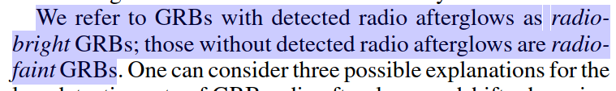

    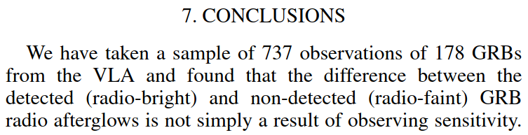

  - [Lloyd-Ronning, N. M., & Fryer, C. L. 2017](https://iopscience.iop.org/article/10.3847/1538-4357/aaf6ac)

    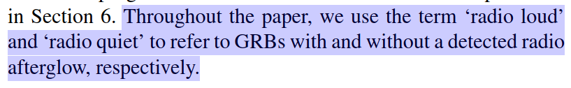

## 211001

### [A Tale of Two Type Ia Supernovae: The fast-declining siblings SNe 2015bo and 1997cn](./2109.14644.pdf)

> 两个Ia型超新星的故事: 孪生的快速衰减超新星SN 2015bo 和 SN 1997cn

type: observation-SN2015bo
comment: 作者展示了对快速衰减的Ia型超新星SN2015bo的光学近红外测光测谱观测, 提到了有共同宿主星系的SN1997cn, 认为快速衰减的超新星可以作为比较精确的距离探针.

https://arxiv.org/abs/2109.14644

details

authors: W. B. Hoogendam, C. Ashall, L. Galbany

> We present optical and near-infrared photometric and spectroscopic observations of the fast-declining Type Ia Supernova (SN) 2015bo. SN 2015bo is under-luminous ($M_B$ = -17.50 ± 0.13 mag) and has a fast-evolving light curve (Δm15(B) = 1.91 ± 0.01 mag and sBV = 0.48 ± 0.01). It has a unique morphology in the V−r color curve, where it is bluer than all other SNe in the comparison sample. A 56Ni mass of 0.17 ± 0.03 M⊙ was derived from the peak bolometric luminosity, which is consistent with its location on the luminosity-width relation. Spectroscopically, SN 2015bo is a Cool SN in the Branch classification scheme. The velocity evolution measured from spectral features is consistent with 1991bg-like SNe. SN 2015bo has a SN twin (similar spectra) and sibling (same host galaxy), SN 1997cn. Distance modulii of μ = 34.36 ± 0.01 (stat) ±0.13 (sys) mag and μ = 34.37 ± 0.04 (stat) ± 0.12 (sys) mag were derived for SN 2015bo and SN 1997cn, respectively. These distances are consistent at the 0.06-σ level with each other, and are also consistent with distances derived using surface-brightness fluctuations and redshift-corrected cosmology. This suggests that fast-declining SNe could be accurate distance indicators which should not be excluded from future cosmological analyses. 

- 发表了对快速衰减的Ia型超新星SN2015bo的光学近红外测光测谱观测
- 这是一个不那么亮的超新星, $M_B=$ -17.50. 它的光变演化得很快, $\Delta m_{15}(B)$ = 1.91 $\pm$ 0.01, $s_{BV} = 0.48 \pm 0.01$
- 它有一个独特的V-r颜色变化曲线, 比样本中其它的超新星都要蓝(红?).
- 根据峰值bolometric光度得到56 Ni质量为0.17$\pm$0.03$M_{\odot}$, 与该SN在光度-宽度关系上的位置相符.
- 从光谱上看, 在Branch分类中, SN2015bo属于冷SN.
- 从光谱得到的速度演化类似于SN1991bg.
- 这个超新星有一个孪生兄弟(光谱相似, 同一个宿主星系), SN 1997cn. 分别从它们得到的距离模数为34.36$\pm$0.01$\pm$0.12和34.37$\pm$0.04$\pm$0.12. 这些距离同使用面亮度起伏(fluctuation)和红移修正的宇宙学得到的距离相吻合, 表明快速衰减的SN可以是一个比较精确的距离指示器.

---

- 光变特征:

  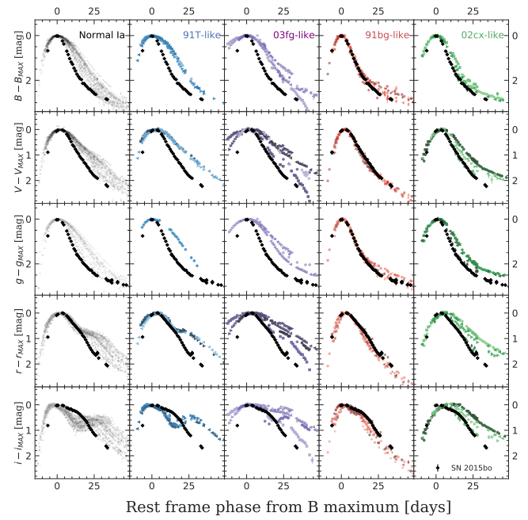

  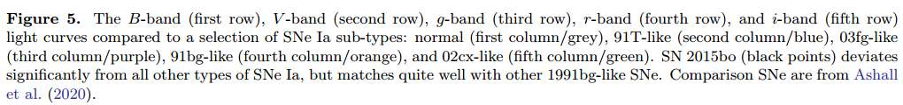

  - SN2015bo的光变曲线类似于1991bg-like超新星, 在所有波段都比其它超新星演化得快, 在r波段没有普通和91T-like超新星那样的平台阶段; 在i波段也没有普通和91T-like超新星呈现的第二极大的特征.

  - i波段的第二主极大一般认为来自铁族元素的再结合, 而1991bg-like超新星之所以没有这个特征, 可能因为铁族元素没有再结合, 也可能是再结合发生的比较早, 导致第二极大与第一极大在时间上发生重叠.

- Ashall et al (2020) 提出可以仅从$s_{BV}$和$t_{max}^{i-B}$(i波段最大时间-B波段最大时间)来给Ia SN分类.

  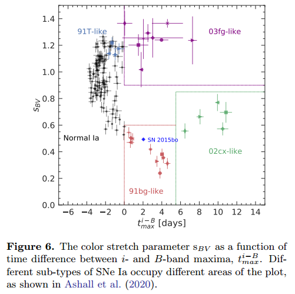

- 颜色特征:

  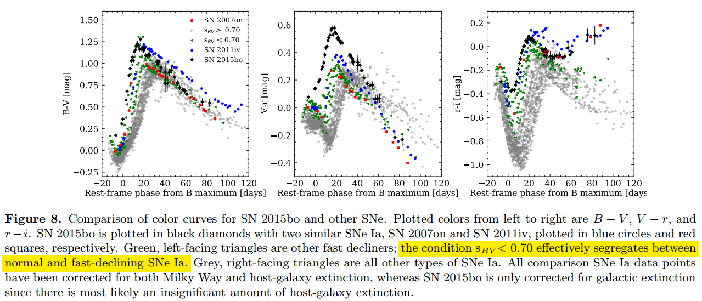

  - SN2015bo 的V-r曲线是独特的, 其峰值比其它所有SN样本都要红, 而在B-V和r-i的曲线里则没有出现类似情况.
  - r-i曲线中, B峰值40天后明显往红演化, 这可能是因为快速衰减SN有较强的Ca II (7291.5, 7323.9)发射线. 这一特征也可以用于区分快速衰减的和普通的Ia SN.

- 光谱特征:

  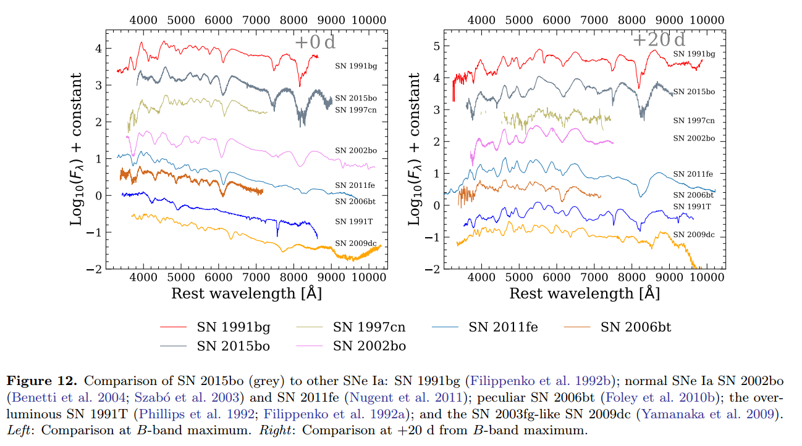

  - Ca ii H&K λλ 3968, 3933, Ti ii λ 4395, Fe ii λλ 4923, 5169, Fe iii λ 5156, S ii λλ 5449, 5623, Si ii λλ 5972, 6355, O i λ 7774, and Ca ii λλ 8498, 8542, 8662 NIR lines.
  -  2015bo与1991bg最为相似, 都有较强的Si ii λλ 5972, 而其它Ia有的则很弱或者没有这条吸收线. 另外,15bo还有Ti ii λ 4395, 虽然强度不如1991bg. 

- 同类型的SN(1991bg-like和过渡型SN Ia)的光谱比较

  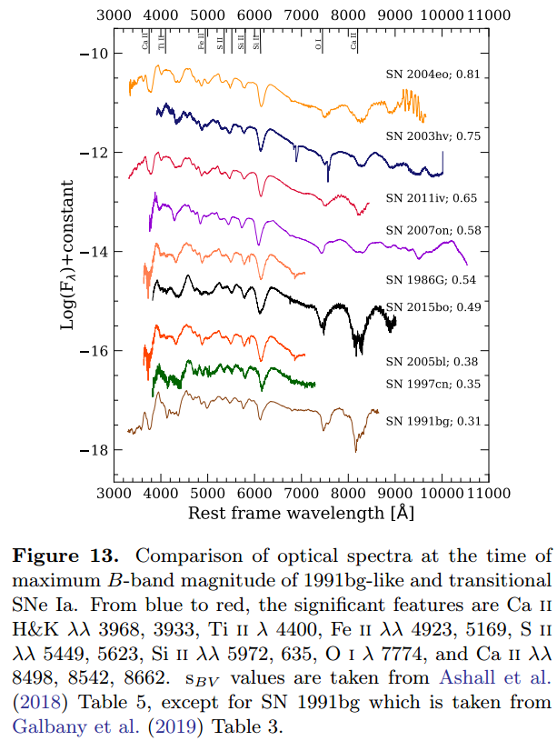

  - $s_{BV}$越小,  Si II 5972 和 Ti II 4400 线越强. ?

- 亮度-宽度关系

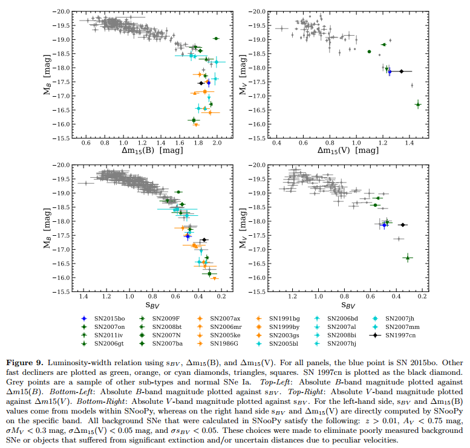

---

背景:

- Ia型SN现在也存在各种亚类, 比如
  - over-luminous 1991T-like SNe Ia;
  - 2003fg-like SNe Ia which are brighter in the NIR and have long rise times;
  - 2002cx-like SNe Ia show light curves that are both broad and faint;
  - 2002ic-like SNe Ia that exhibit Balmer emission lines found in Type IIn core-collapse SNe;
  - 1991bg-like SNe Ia are sub-luminous.
- 也有在这些类别之间的过渡型的SN, 连接了普通超新星和1991bg-like超新星. 它们衰减速度快, 展示处1991bg-like超新星的其它特点, 但不完全与其相似.
- 相比于普通超新星, 1991bg-like超新星除了峰值亮度低, 而且亮度升得快降得也快. 其它超新星的光变曲线则一般具有"肩膀"或者第二极大存在. 1991bg-like最大的区别在与光谱: 它们具有明显更加强烈的Ti II线和O I线, 还有5972埃处的强Si II 线.
- 对于Ia型超新星, 最终要的经验关系属光度-宽度关系. 有两种表示方法. 越亮的源, 其光变曲线就越宽.
  - B波段绝对峰值型等 $M_B$  vs $\Delta m_{15}(B)$
  - $M_B$ vs $s_{BV}$
- $s_{BV}$更适合用于快速衰减源的描述, $\Delta m_{15}(B)$在大于1.7等之后就不再可靠了.
- 物理上说, 越亮的超新星能合成越多的Ni56, 导致线不透明度较高, 抛射物中的耗散时标更长, 因而光变曲线越宽.
- 对于发生在邻近星系(z<0.1)的Ia型SN, 由于本动速度与宿主星系退行速度相当, 我们无法很准确地估计其距离, 而通过研究比对同一星系的其它SN, 则可以避免这个问题.
- SN 2015bo和SN 1997cn都发生于NGC 5490, 它们的光谱相似, 且都是快速衰减的SN. 它们的存在提供了一个机会去利用兄弟超新星来计算距离而部首到系统误差的影响.

