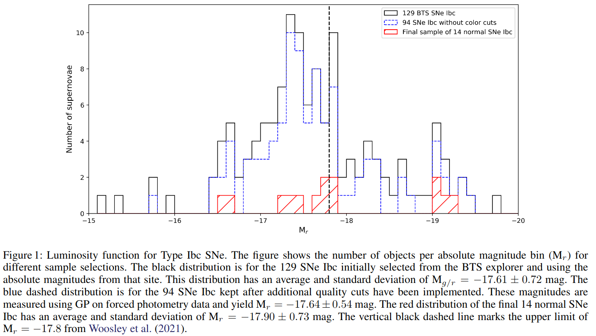
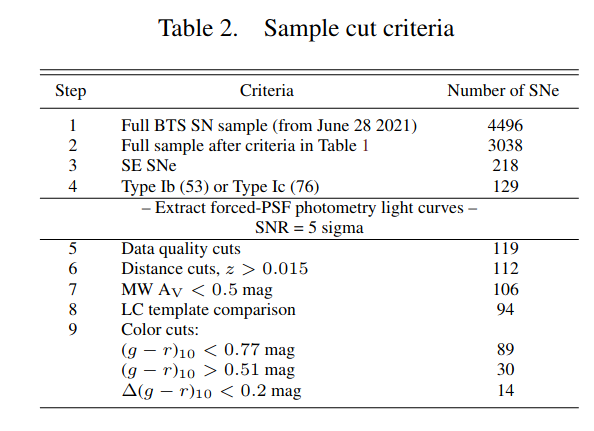
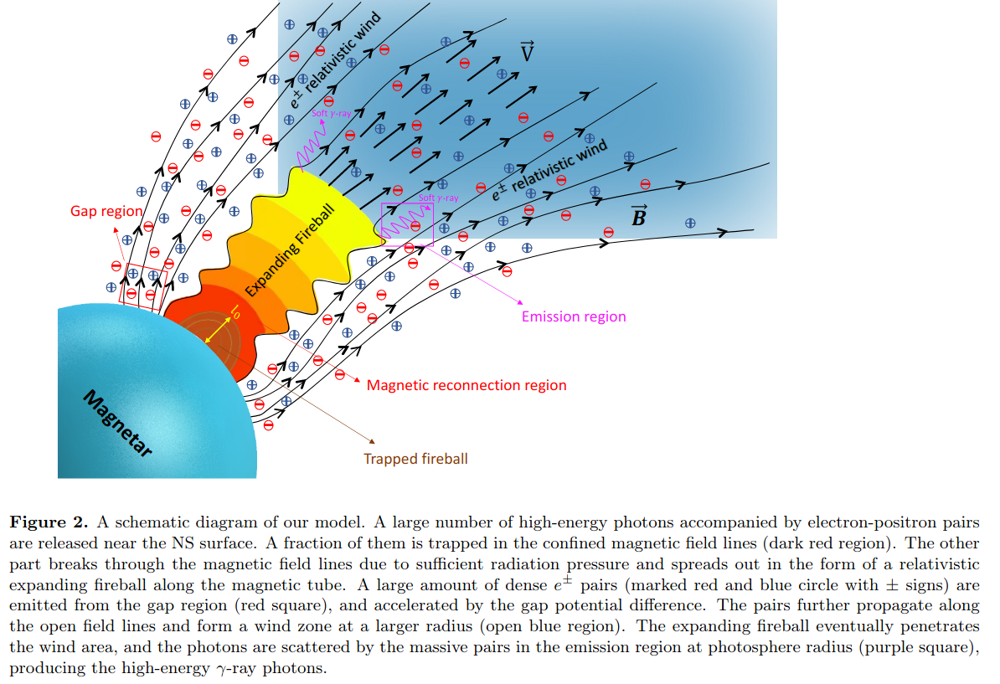
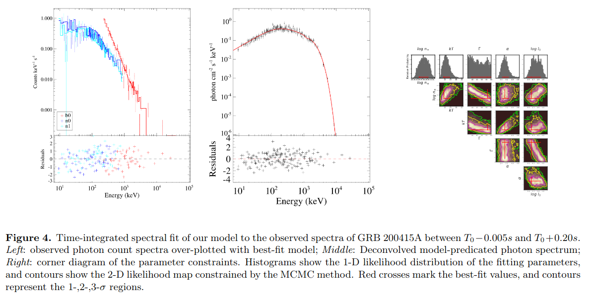
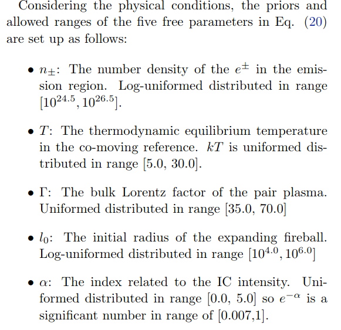
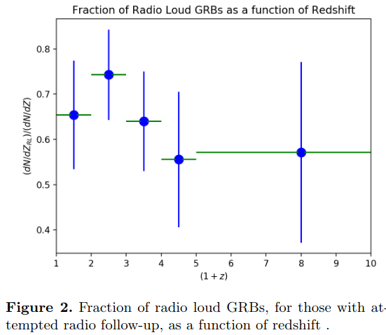

# arxiv文献泛读20210930-1001

## 20210930

### [On the maximum luminosities of normal stripped-envelope supernovae -- brighter than explosion models allow ](./2109.14339.pdf)

> 关于普通包层剥离超新星的最大光度: 比爆炸模型允许的更亮

type:statistic-SN-Ibc
comment:从ZTF-BTS中选取的Ibc型SN样本来看, 实际观测到的最大亮度比理论给出的包层剥离超新星的最大亮度更亮.

https://arxiv.org/abs/2109.14339

details

authors: J. Sollerman, S. Yang, D. Perley, S. Schulze, C. Fremling, M. Kasliwal, K. Shin, B. Racine

> Context. Stripped-envelope supernovae (SE SNe) of Type Ib and Type Ic are thought to result from explosions of massive stars having lost their outer envelopes. The favoured explosion mechanism is by core-collapse, with the shock later revived by neutrino heating. However, there is an upper limit to the amount of radioactive Nickel-56 that such models can accomplish. Recent literature point to a tension between the maximum luminosity from such simulations and observations. 
>
> Aims. We use a well characterized sample of SE SNe from the Zwicky Transient Facility (ZTF) Bright Transient Survey (BTS). We scrutinize the observational caveats regarding estimating the maximum luminosity (and thus the amount of ejected radioactive nickel) for the members of this sample.
>
> Methods.  We employ the strict selection criteria for the BTS to collect a sample of spectroscopically classified normal Type Ibc SNe for which we use the ZTF light curves to determine the maximum luminosity.  We cull the sample further based on data quality, lightcurve shape, distance and colors, and examine uncertainties that may affect the numbers. The methodology of the sample construction from this BTS sample can be used for many other future investigations.
>
> Results. We analyze observational data, consisting of optical light curves and spectra, for the selected sub-samples. In total we use 129 Type Ib or Type Ic BTS SNe with an initial rough luminosity distribution peaked at Mr = −17.61 ±0.72, and where 36% are
> apparently brighter than the theoretically predicted maximum brightness of Mr = −17.8. When we further cull this sample to ensure that the SNe are normal Type Ibc with good LC data within the Hubble flow, the sample of 94 objects has Mr = −17.64 ±0.54. A main uncertainty in absolute magnitude determinations for SNe is the host galaxy extinction correction, but the reddened objects only get more luminous after corrections. If we simply exclude objects with red, unusual or uncertain colors, we are left with 14 objects at Mr = −17.90 ±0.73, whereof a handful are most certainly brighter than the suggested theoretical limit. The main result of this study is thus that normal SNe Ibc do indeed reach luminosities above $10^{42.6} erg s−1$, apparently in conflict with existing explosion models.

- Ib 和 Ic 型的包层剥离超新星被认为起源于失去外部包层的大质量恒星的核塌缩.
- 受支持的爆炸机制是核塌缩+随后因中微子加热而导致的(revivied)激波.
- 然而, 在该模型下, 爆炸中生成的放射性Ni56的质量存在一个上限.
- 最近的文章指出由该模型模拟出的最大光度和实际观测存在出入.
- 作者从ZTF BTS(Bright Survey)中挑选了一批通过光谱证认为Ibc型的包层剥离超新星, 并利用其光变曲线计算了峰值光度.
- 作者使用了129个超新星作为样本, 峰值光度分布显示, 光度函数峰值处$M_r =-17.61 \pm 0.73$, 有36%的源比理论与测的最大亮度$M_r=-17.8$更亮.
- 若进一步筛选样本, 留下有高质量光变曲线, 且距离不要太近(within Hubble flow, z>0.015)的源, 则样本数减为94个, $M_r = -17.64 \pm 0.54$.
  - in the local universe the peculiar motions of nearby galaxies make the relative distance uncertainties larger.
- 再进一步筛选, 去掉objects with red, unusual or uncertain colors, 样本数减为14个, $M_r = -17.90 \pm 0.73$, 其中不少都比理论极限亮.
  - remove objects with different colors than the main population of SNe Ibc. The main rationale here being that we want to avoid large corrections for host-galaxy extinction.
- 因此, 本文主要结果就是Ibc型超新星能达到$10^{46.2} erg/s$以上的光度, 明显与现存的爆炸模型冲突.

The absolute peak luminosity function for these supernovae is also presented in Fig. 1:

### [A Comptonized Fireball Bubble: Physical Origin of Magnetar Giant Flares](./2109.14252.pdf)

> 一个具有康普顿化的火球泡: 磁星巨耀发的物理起源

type:
comment:

https://arxiv.org/abs/2109.14252

details

authors: Zhao Joseph Zhang, Bin-Bin Zhang, Yan-Zhi Meng

> Magnetar Giant Flares (MGFs) have been long proposed to contribute at least a sub-sample of the observed short Gamma-ray Bursts (GRBs). The recent discovery of the short GRB 200415A in the nearby galaxy NGC 253 established a textbook-version connection between these two phenomena. Unlike previous observations of the Galactic MGFs, the unsaturated instrument spectra of GRB 200415A provide for the first time an opportunity to test the theoretical models with the observed γ-ray photons. This paper proposed a new readily fit-able model for the MGFs, which invokes an expanding fireball Comptonized by the relativistic magnetar wind at photosphere radius. In this model, a large amount of energy is released from the magnetar crust due to the magnetic reconnection or the starquakes of the star surface and is injected into confined field lines, forming a trapped fireball bubble. After breaking through the shackles and expanding to the photospheric radius, the thermal photons of the fireball are eventually Comptonized by the relativistic e± pairs in the magnetar wind region, which produces additional higher-energy gamma-ray emission. The model predicts a modified thermal-like spectrum characterized by a low-energy component in the Rayleigh-Jeans regime, a smooth component affected by coherent Compton scattering in the intermediate energy range, and a high-energy tail due to the inverse Compton process. By performing a Monte-Carlo fit to the observational spectra of GRB 200415A, we found that the observation of the burst is entirely consistent with our model predictions. 

- 一部分观测到的短伽马爆被认为可能是由磁星巨耀发(MGF)产生的, GRB200415A将这两种现象联系起来.
- 这篇文章提出了一个新的MGF模型, 在该模型中, 光球层处的相对论性磁星星风会使膨胀的火球康普顿化. 
- 由于磁星表面的磁重联和星震, 大量能量从磁星壳层中释放出来, 注入到被束缚的磁力线中, 形成一个火球泡. 当其冲破束缚到达光球半径后, 火球的热光子被磁星星风区的相对论电子康普顿化, 产生额外的伽马射线辐射.
- 模型预测了一个类热的光谱, 其低能成分为Rayleigh-Jeans, 中间能段则是一个受康普顿散射影响的光滑成分, 高能段是一个逆康普顿的尾巴.
- 文章用此模型拟合了GRB 200415的光谱, 发现观测和理论预测符合的很好.

### [Radio Loud vs. Radio Quiet Gamma-ray Bursts: the Role of Binary Progenitors](./2109.14572.pdf)

> 射电强 vs. 射电弱的伽马爆: 双星前身星在其中的角色

type: theory-GRB
comment: 作者提出, 射电强的GRB可能起源于双星系统中的大质量恒星塌缩, 而射电弱的GRB则起源于单个的大质量恒星塌缩.

https://arxiv.org/abs/2109.14122

details

Authors: Nicole M. Lloyd-Ronning

> We explore the possibility that radio loud gamma-ray bursts (GRBs) result from the collapse of a massive star in an interacting binary system, while radio quiet GRBs are produced by the collapse of a single massive star. A binary collapsar system can have the necessary angular momentum and energy budget to explain the longer prompt gamma-ray durations and higher isotropic energies seen in the the radio loud sub-sample of long GRBs. Additionally, tidal interactions between the stars in binary systems can lead to rich and extended circumstellar environments that allow for the presence of the long-lived radio afterglows seen in the radio loud systems. Finally, the relative fraction of stars in binary systems versus single star systems appears consistent with the fraction of radio loud versus radio quiet GRBs.

- 作者讨论了射电强的GRB起源于相互作用的双星系统中的大质量恒星塌缩, 而射电弱的GRB则起源于单个的大质量恒星塌缩的可能性.
  - 相互作用指伴星在质量和角动量转移上对主星有显著影响.
- 一个双星系统中的恒星塌缩可以提供足够的角动量和能量来解释**在射电强的GRB所表现出的较长的瞬时辐射阶段和较高的各向同性能量**. 
- 而且双星之间的潮汐相互作用能导致密度和尺度都更大(extended)的星周环境. 这也能解释射电强GRB中持续时间较长的射电余辉.
- 最后, 处于双星系统中的恒星的数量于单个恒星的数量之比看起来也符合射电强和射电弱的GRB的比例.

## 211001

### [A Tale of Two Type Ia Supernovae: The fast-declining siblings SNe 2015bo and 1997cn](./2109.14644.pdf)

> 

type:
comment:

https://arxiv.org/abs/2109.14644

details

authors: W. B. Hoogendam, C. Ashall, L. Galbany

> 

