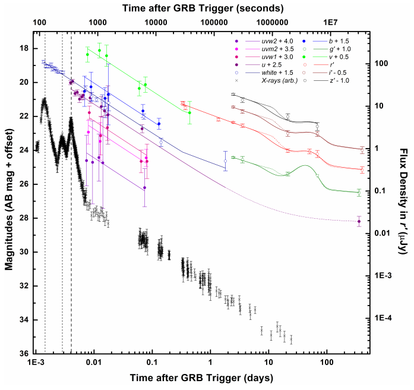

# arxiv文献泛读20211004-1005

## 20211004

### [Highly luminous supernovae associated with gamma-ray bursts II. The Luminous Blue Bump in the Afterglow of GRB 140506A](./2110.00110.pdf)

> 与GRB成协的高度明亮的超新星II: GRB140506A余辉当中明亮的蓝色鼓包

type:observation-GRB&SN
comment:GRB 140506A的余辉光变的一个平台可能反映了一个特殊的GRB成协超新星的存在: 更亮, 颜色更蓝.

https://arxiv.org/abs/2110.00110

details

authors: D. A. Kann, S. R. Oates, A. Rossi

> Context. The supernovae (SNe) associated with gamma-ray bursts (GRBs) are generally seen as a homogenous population, but at least one exception exists, both in terms of luminosity as well as Spectral Energy Distribution (SED). However, this event, SN 2011kl, was associated with an ultra-long GRB 111209A. Do such outliers also exist for more typical GRBs?
>
> Aim. Within the context of a systematic analysis of photometric signatures of GRB-associated SNe, we found an anomalous bump in the late-time transient following GRB 140506A. We hereby aim to show this bump is significantly more luminous and blue than usual SNe following GRBs.
>
> Methods: We compile all available data from the literature, and add a full analysis of the Swift UVOT data, which allows us to trace the light curve from the first minutes all the way to the host galaxy, as well as construct a broad SED of the afterglow that extends the previous SED analysis based on ground-based spectroscopy.
>
> Results. We find robust evidence for a late-time bump/plateau following the afterglow which shows evidence for a strong colour change, with the spectral slope becoming flatter in the blue region of the spectrum. This bump can be interpreted as a luminous SN bump which is spectrally dissimilar to typical GRB-SNe. Correcting it for the large line-of-sight extinction results in extreme values which make the SN associated with GRB 140506A the most luminous detected so far. Even so, it would be in agreement with a luminosity-duration relation of GRB-SNe.
>
> Conclusions.  While not supported by spectroscopic evidence, it is likely the blue bump following GRB 140506A is the signature of a SN which is spectrally dissimilar to classical GRB-SNe and more similar to SN 2011kl – while being associated with an average GRB, indicating the GRB-SN population is more diverse than thought so far, and can reach luminosities comparable to those of superluminous SNe.

背景
- GRB成协的超新星一般被认为是一个固定的类型, 但有一个例外, SN2011kl, 它与超长爆GRB111209A成协. 
- 无论是从光度还是从SED来看, 这个事件都是一个独特的事件.是否存在更多这样的例外?

目的
- 作者发现在GRB140506A的晚期跟踪观测中存在一个奇怪的bump, 作者试图证明这个bump比通常的GRB-SN更亮而且更蓝.
方法
- 从文献中搜集所有可用的数据, 完整地分析Swift/UVOT的数据, 以能够得到从分钟量级一直到宿主星系显露时的完整光变曲线, 同时将先前仅由地面望远镜得到的光谱扩展为更宽的SED.

结果

- 作者发现了一个明显的晚期bump/plateau跟随在余辉后, 这个bump具有明显的颜色变化, 且其在蓝色区域的光谱斜率开始变平. 
- 这个bump可以解释为一个明亮的SN bump,但光谱(SED)与典型的GRB-SN不一样. 当做了消光修正后, 这个SN成了目前位置探测到最亮的GRB成协超新星. 
- 尽管如此, 这个SN仍然符合GRB-SN的光度-持续时间的关系.

结论

- 尽管没有光谱方面的支持, GRB140506A光变中的bump仍可能是一个光谱区别于典型GRB-SN事件的超新星, 它的光谱更像SN2011kl, 而GRB 140506A本身则是一个普通的GRB事件. 
- 这表明GRB-SN的种类可能比想象的要丰富, 且光度能够达到超亮超新星的级别.

---

Q:

作者是如何论证这个bump是SN的? 为什么不能肯定它就是一个超新星? 与其它的超新星/GRB-SN相比有什么特别之处?

GRB-SN的'光度-持续时间关系'是怎样的?

---

- 这些数据均来自于其它文章以及Swift的观测, 虚线和实线代表两个不同的break时间拟合. 拟合模型为余辉+SN(以1998bw为模板)+host

- 作者认为约10到60天的平台显然不是宿主星系, 最自然的解释就是超新星.'as the following “plateau” is clearly not the host-galaxy level, the most natural explanation is a SN following GRB 140506A.'

- 而且这个bump成分存在明显的颜色演化, 一般在GRB余辉中这种情况很少见, 有也一般在较短的时标中呈现(some such examples being GRB 091127, GRB111209A, and GRB 130427A – all of these also showed colour evolution within **the first hours and not weeks** after the GRB. )

  

- 而晚期超新星则一般是热成分主导的光谱, 不同于同步辐射光谱, 热光谱自然存在颜色演化.

- 由于红移相对较大, 接近0.9, 只有很亮的或者宿主星系很暗的超新星能够被探测到. 对这个成分的超新星拟合也显示这是一个相当亮的超新星, 是当前GRB-SN中最亮的.

SED:

- 不过作者似乎只讨论了GRB余辉的SED, 没有SN成分的SED.

luminosity-duration relation of GRB-SNe:

- GRB140506A的SN看起来似乎是一个明显的离群个体, 但作者认为这个样本, 以及GRB111209A/SN 2011kl一起, 可以视作这个"GRB-SN Phillips Relation"的延伸.

---

背景:

一开始人们认为GRB普遍与Ic型超新星成协, 但超长爆GRB111209A是个例外, 与它成协的是一个更亮的,更蓝,且光谱与普通Ic型超新星不同的超新星SN 2011kl. 它的出现带来的两个问题:

- 超长爆成协的SN都是这样与众不同吗?
- 这样更明亮的SN都与超长爆成协吗?

本篇文章所讨论的对象: GRB140506A与其余辉光变中出现的神秘明亮成分似乎给了第二个问题一个否定的答案.

GRB 140506A 于当天21:07:36UT触发Swift, 其$T_{90}$约为111秒, 另根据其它文章的结果以及红移z=0.88911, 作者推断其各向同性能量的量级为52.15. 据此可以认为, GRB140506A是一个亮度平均, 持续时标普通的长伽马爆.

然而, 这个GRB也有不寻常的地方, 它呈现了一个不正常的,红的,高度弯曲的(highly-curved)余辉光谱. Fynbo(2014)的数据显示其晚期余辉开始显著变平, 疑似出现宿主星系, 而Heintz(2017)则表示在爆后两个月到一年的时间里, 这颗GRB又表现出明显的衰减. Heintz认为早前的平台也许是一个超新星的信号, 但没有在这个问题上深究.

## 20211005

### [Evidence of X-ray plateaus driven by the magnetar spindown winds in gamma-ray burst afterglows](./2109.00727.pdf)

> GRB余辉中磁星减慢星风驱动的X-ray平台的证据

type:theory-GRB
comment:从历史数据中找出了三个GRB, 它们的X射线光变曲线与磁星自旋减慢引擎模型相符合.

https://arxiv.org/abs/2110.00727

details

authors: Shu-Jin Hou, Shuang Du, Tong Liu, Hui-Jun Mu, Ren-Xin Xu

> The central engine of gamma-ray bursts (GRBs) remains an open and forefront topic in the era of multimessenger astrophysics. The X-ray plateaus appear in some GRB afterglows, which are widely considered to originate from the spindown of magnetars. According to the stable magnetar scenario of GRBs, an X-ray plateau and a decay phase as ∼ $t^{−2}$ should appear in X-ray afterglows. Meanwhile, the “normal” X-ray afterglow is produced by the external shock from GRB fireball. We analyze the Neil Gehrels Swift GRB data, then find three gold samples, which have an X-ray plateau and a decay phase as ∼ $t^{−2}$ superimposed on the jet-driven normal component. Based on these features of the lightcurves, we argue that the magnetars should be the central engines of these three GRBs. Future joint multimessenger observations might further test this possibility, then which can be beneficial to constrain GRB physics.

- 根据GRB的磁星自旋减慢引擎模型, X射线的光变曲线会出现平台期以及$t^{-2}$的衰减期. 同时还有外激波辐射出的"normal"X射线成分.
  
- 依照这些特征, 作者找到三个Swift GRB(060413, 061202, 191122A), 它们均有上述的三个成分(前两个成分叠加在第三个上), 并对它们的X射线光变做了拟合.
  
- 以上的这些特征一般属于稳定磁星, 如果是一个大质量磁星, 则随着其塌缩成黑洞, 平台后衰减的斜率会更大, 比如GRB 060607A的相应斜率是3.68.
  

